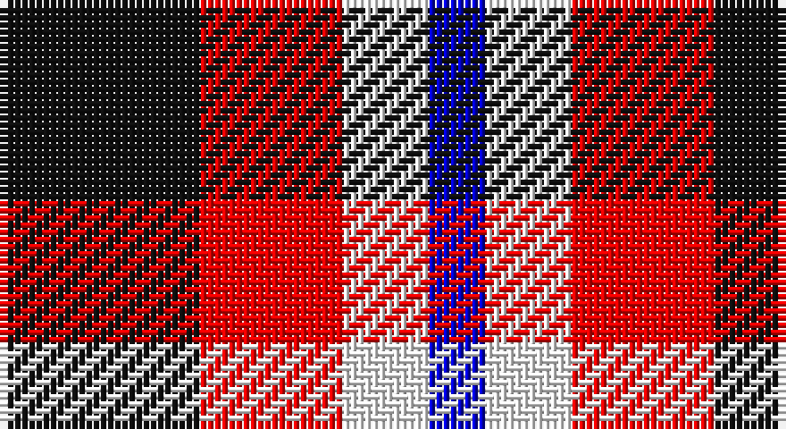

This page is one **sett** — a single exact thread-count. It belongs to the [tartan](/setts/k7r5w3db2/)
(the same proportion at any scale), whose colour order is pattern [BWRK](/stripes/bwrk/).

Sourced from register-of-tartans.  It is a [4 stripe tartan](/stripes/stripes4/).

Original link https://www.tartanregister.gov.uk/tartanDetails.aspx?ref=10849

2 attestations — the source records this cloth was collapsed from (oldest owns this page)

<ul>
<li>03/04/2013 — Thomas Newcomen's Combustion Engine (register-of-tartans, <a href="https://www.tartanregister.gov.uk/tartanDetails.aspx?ref=10849">record</a>)</li>
<li>2013 — Thomas Newcomen's Combustion Engine (tartans-authority, <a href="http://www.tartansauthority.com/tartan-ferret/display/10849/">record</a>)</li>
</ul>

## Register references

External register numbers recorded for this tartan.

- Scottish Register of Tartans: [10849](https://www.tartanregister.gov.uk/tartanDetails?ref=10849)
- Scottish Tartans Authority (ITI): 10849

## Thread count
K/28 R20 W12 B/8

One full sett is **100 threads**.

## Palette

Palette: <strong>Tartan Register</strong>
<table><thead><tr><th>Colour</th><th>Threads</th><th>Shade</th><th>Base</th><th>OKLCh</th></tr></thead><tbody><tr><td>K/</td><td style="text-align:right;font-variant-numeric:tabular-nums">28</td><td><code style="background-color:#101010;">#101010</code> <small style="color:#888">#101010</small></td><td>K <code style="background-color:#000000;">#000000</code></td><td><small style="color:#888">oklch(17.3% 0.000 89.9)</small></td></tr><tr><td>R</td><td style="text-align:right;font-variant-numeric:tabular-nums">20</td><td><code style="background-color:#FF0000;">#FF0000</code> <small style="color:#888">#FF0000</small></td><td>R <code style="background-color:#CC0000;">#CC0000</code></td><td><small style="color:#888">oklch(62.8% 0.258 29.2)</small></td></tr><tr><td>W</td><td style="text-align:right;font-variant-numeric:tabular-nums">12</td><td><code style="background-color:#FFFFFF;">#FFFFFF</code> <small style="color:#888">#FFFFFF</small></td><td>W <code style="background-color:#F7F7F7;">#F7F7F7</code></td><td><small style="color:#888">oklch(100.0% 0.000 89.9)</small></td></tr><tr><td>B/</td><td style="text-align:right;font-variant-numeric:tabular-nums">8</td><td><code style="background-color:#0000CD;">#0000CD</code> <small style="color:#888">#0000CD</small></td><td>B <code style="background-color:#2A418A;">#2A418A</code></td><td><small style="color:#888">oklch(38.3% 0.266 264.1)</small></td></tr></tbody></table>

# Sample pattern

## Nearest tartans

The nearest existing variants by ΔTartan distance, with this tartan at the top so the swatches line up against it.

ΔTartan

Tartan

Sett

—

<a href="/ttd/edit/#slug=k7r5w3db2~x4">Thomas Newcomen's Combustion Engine</a> <a class="nn-out" href="/variants/s4/k7r5w3db2~x4/" title="open its dictionary page">↗</a>

1.25

<a href="/ttd/edit/#slug=r3g1k3w1~x20&amp;base=k7r5w3db2~x4">SAL Glindrande Stiernan</a> <a class="nn-out" href="/variants/s4/r3g1k3w1~x20/" title="open its dictionary page">↗</a>

1.25

<a href="/ttd/edit/#slug=r3k1dg1k1lb3~x4&amp;base=k7r5w3db2~x4">Clark</a> <a class="nn-out" href="/variants/s5/r3k1dg1k1lb3~x4/" title="open its dictionary page">↗</a>

1.33

<a href="/ttd/edit/#slug=k6r33k18w20db6~x2&amp;base=k7r5w3db2~x4">Brodie Dress</a> <a class="nn-out" href="/variants/s5/k6r33k18w20db6~x2/" title="open its dictionary page">↗</a>

1.34

<a href="/ttd/edit/#slug=r1g3p3w1~x4&amp;base=k7r5w3db2~x4">Wilson's, No 113</a> <a class="nn-out" href="/variants/s4/r1g3p3w1~x4/" title="open its dictionary page">↗</a>

1.36

<a href="/ttd/edit/#slug=r10t5lb5dt4~x8&amp;base=k7r5w3db2~x4">Haggis Hostels</a> <a class="nn-out" href="/variants/s4/r10t5lb5dt4~x8/" title="open its dictionary page">↗</a>

1.44

<a href="/ttd/edit/#slug=p3k3p3g6r2~x2&amp;base=k7r5w3db2~x4">Austin / Wilson's No 137</a> <a class="nn-out" href="/variants/s5/p3k3p3g6r2~x2/" title="open its dictionary page">↗</a>

1.47

<a href="/ttd/edit/#slug=w14k30b9r8o9~x2&amp;base=k7r5w3db2~x4">Heidrick Family (Personal)</a> <a class="nn-out" href="/variants/s5/w14k30b9r8o9~x2/" title="open its dictionary page">↗</a>

1.53

<a href="/ttd/edit/#slug=r25k13w8db5~x2&amp;base=k7r5w3db2~x4">Hamby Sport (Personal)</a> <a class="nn-out" href="/variants/s4/r25k13w8db5~x2/" title="open its dictionary page">↗</a>

1.53

<a href="/ttd/edit/#slug=p3k3p3g6ly2~x2&amp;base=k7r5w3db2~x4">Austin / Wilson's No 173</a> <a class="nn-out" href="/variants/s5/p3k3p3g6ly2~x2/" title="open its dictionary page">↗</a>

1.63

<a href="/ttd/edit/#slug=db9r12dg9db5w2~x4&amp;base=k7r5w3db2~x4">Battle of Prestonpans (1745) Herit</a> <a class="nn-out" href="/variants/s5/db9r12dg9db5w2~x4/" title="open its dictionary page">↗</a>

## Neighbour map

Every grey dot is one of 14360 variants placed by the first two principal components of the ΔTartan feature space (44% of its variance). Red is this tartan; blue dots are its nearest — click one to open its page.

<svg viewBox="0 0 640 380" role="img" style="max-width:100%;height:auto;border:1px solid #e0e0e0;border-radius:4px;display:block" xmlns="http://www.w3.org/2000/svg"><image href="/nn/cloud.v1.png" width="640" height="380"/><a href="/variants/s4/r3g1k3w1~x20/"><circle cx="102.5" cy="271.1" r="4" fill="#3465a4"><title>SAL Glindrande Stiernan</title></circle></a><a href="/variants/s5/r3k1dg1k1lb3~x4/"><circle cx="73.7" cy="256.0" r="4" fill="#3465a4"><title>Clark</title></circle></a><a href="/variants/s5/k6r33k18w20db6~x2/"><circle cx="135.1" cy="225.3" r="4" fill="#3465a4"><title>Brodie Dress</title></circle></a><a href="/variants/s4/r1g3p3w1~x4/"><circle cx="119.1" cy="286.4" r="4" fill="#3465a4"><title>Wilson's, No 113</title></circle></a><a href="/variants/s4/r10t5lb5dt4~x8/"><circle cx="112.6" cy="306.3" r="4" fill="#3465a4"><title>Haggis Hostels</title></circle></a><a href="/variants/s5/p3k3p3g6r2~x2/"><circle cx="85.0" cy="295.3" r="4" fill="#3465a4"><title>Austin / Wilson's No 137</title></circle></a><a href="/variants/s5/w14k30b9r8o9~x2/"><circle cx="95.7" cy="235.2" r="4" fill="#3465a4"><title>Heidrick Family (Personal)</title></circle></a><a href="/variants/s4/r25k13w8db5~x2/"><circle cx="194.7" cy="246.4" r="4" fill="#3465a4"><title>Hamby Sport (Personal)</title></circle></a><a href="/variants/s5/p3k3p3g6ly2~x2/"><circle cx="71.1" cy="290.4" r="4" fill="#3465a4"><title>Austin / Wilson's No 173</title></circle></a><a href="/variants/s5/db9r12dg9db5w2~x4/"><circle cx="150.2" cy="264.3" r="4" fill="#3465a4"><title>Battle of Prestonpans (1745) Herit</title></circle></a><circle cx="104.2" cy="273.1" r="5" fill="#c00000"/></svg>

ID: /variants/s4/k7r5w3db2~x4/
