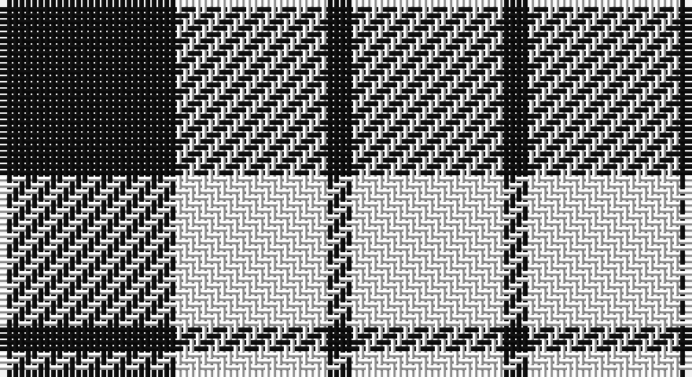

This page is one **sett** — a single exact thread-count. It belongs to the [tartan](/setts/k7w6k1/)
(the same proportion at any scale), whose colour order is pattern [KWKW](/stripes/kwkw/).

Part of the [Lendrum](/tartans/lendrum/) tartan — the named design grouping this sett with its other cloths.

Sourced from register-of-tartans.  It is a [4 stripe tartan](/stripes/stripes4/).

Original link https://www.tartanregister.gov.uk/tartanDetails.aspx?ref=5293

## Also known as

This cloth is also recorded under:

- Lendrum or MacFarlane
- MacFarlane B & W
- MacFarlane B/W or Lendrum
- MacFarlane, Lendrum Black and White
- Wallace Dress
- Wallace dress

6 attestations — the source records this cloth was collapsed from (oldest owns this page)

<ul>
<li>01/01/1842 — Lendrum (B&W) (register-of-tartans, <a href="https://www.tartanregister.gov.uk/tartanDetails.aspx?ref=5293">record</a>)</li>
<li>1842 — Wallace Dress (Clan) (tartans-authority, <a href="http://www.tartansauthority.com/tartan-ferret/display/1251/">record</a>)</li>
<li>1842 — MacFarlane B & W (Clan) (tartans-authority, <a href="http://www.tartansauthority.com/tartan-ferret/display/3051/">record</a>)</li>
<li>1842 — Lendrum (B&W) (Clan) (tartans-authority, <a href="http://www.tartansauthority.com/tartan-ferret/display/3086/">record</a>)</li>
<li>undated — MacFarlane, Lendrum Black and White (weddslist, <a href="http://www.weddslist.com/cgi-bin/tartans/pg.pl?source=sts">record</a>)</li>
<li>undated — Wallace dress (weddslist, <a href="http://www.weddslist.com/cgi-bin/tartans/pg.pl?source=sts">record</a>)</li>
</ul>

## Register references

External register numbers recorded for this tartan.

- Scottish Register of Tartans: [5293](https://www.tartanregister.gov.uk/tartanDetails.aspx?ref=5293)
- Scottish Tartans Authority (ITI): 3086

## Thread count
K/28 W24 K4 W/24

One full sett is **108 threads**.

## Palette

Palette: <strong>Logan (The Scottish Gael, 1831)</strong>
<table><thead><tr><th>Colour</th><th>Threads</th><th>Shade</th><th>Base</th><th>OKLCh</th></tr></thead><tbody><tr><td>K/</td><td style="text-align:right;font-variant-numeric:tabular-nums">28</td><td><code style="background-color:#101010;">#101010</code> <small style="color:#888">#101010</small></td><td>K <code style="background-color:#000000;">#000000</code></td><td><small style="color:#888">oklch(17.3% 0.000 89.9)</small></td></tr><tr><td>W</td><td style="text-align:right;font-variant-numeric:tabular-nums">24</td><td><code style="background-color:#FCFCFC;">#FCFCFC</code> <small style="color:#888">#FCFCFC</small></td><td>W <code style="background-color:#F7F7F7;">#F7F7F7</code></td><td><small style="color:#888">oklch(99.1% 0.000 89.9)</small></td></tr><tr><td>K</td><td style="text-align:right;font-variant-numeric:tabular-nums">4</td><td><code style="background-color:#101010;">#101010</code> <small style="color:#888">#101010</small></td><td>K <code style="background-color:#000000;">#000000</code></td><td><small style="color:#888">oklch(17.3% 0.000 89.9)</small></td></tr><tr><td>W/</td><td style="text-align:right;font-variant-numeric:tabular-nums">24</td><td><code style="background-color:#FCFCFC;">#FCFCFC</code> <small style="color:#888">#FCFCFC</small></td><td>W <code style="background-color:#F7F7F7;">#F7F7F7</code></td><td><small style="color:#888">oklch(99.1% 0.000 89.9)</small></td></tr></tbody></table>

# Sample pattern

## Nearest tartans

The nearest existing variants by ΔTartan distance, with this tartan at the top so the swatches line up against it.

ΔTartan

Tartan

Sett

—

<a href="/ttd/edit/#slug=k7w6k1~x4">Lendrum (B&amp;W)</a> <a class="nn-out" href="/variants/s4/k7w6k1~x4/" title="open its dictionary page">↗</a>

0.44

<a href="/variants/s4/k7w6k1~x2/">MacFarlane B/W or Lendrum Clan Tartan</a>

1.18

<a href="/ttd/edit/#slug=w14k2w14k19w2~x2&amp;base=k7w6k1~x4">MacLeod Black &amp; White</a> <a class="nn-out" href="/variants/s5/w14k2w14k19w2~x2/" title="open its dictionary page">↗</a>

1.21

<a href="/variants/s6/k7w6k1w6~x4/">Wallace Dress</a>

1.26

<a href="/variants/s4/k7lb6k1/">MacFarlane VS</a>

1.67

<a href="/ttd/edit/#slug=k22w3k3w22~x2&amp;base=k7w6k1~x4">MacPhee (Black and White)</a> <a class="nn-out" href="/variants/s4/k22w3k3w22~x2/" title="open its dictionary page">↗</a>

1.86

<a href="/ttd/edit/#slug=dt3w16dt4w3dt12w2~x3&amp;base=k7w6k1~x4">MacMugen</a> <a class="nn-out" href="/variants/s6/dt3w16dt4w3dt12w2~x3/" title="open its dictionary page">↗</a>

1.87

<a href="/variants/s4/k7lr6k1~x2/">MacFarlane VS</a>

1.87

<a href="/variants/s4/k7lr6k1/">MacFarlane VS</a>

1.89

<a href="/ttd/edit/#slug=w2k1w6k6w2k1w1~x2&amp;base=k7w6k1~x4">Scott (Abbreviated)</a> <a class="nn-out" href="/variants/s7/w2k1w6k6w2k1w1~x2/" title="open its dictionary page">↗</a>

1.95

<a href="/ttd/edit/#slug=ly20db10k3~x2&amp;base=k7w6k1~x4">Masai Shuka 04 (Artefact)</a> <a class="nn-out" href="/variants/s3/ly20db10k3~x2/" title="open its dictionary page">↗</a>

## Neighbour map

Every grey dot is one of 14360 variants placed by the first two principal components of the ΔTartan feature space (44% of its variance). Red is this tartan; blue dots are its nearest — click one to open its page.

<svg viewBox="0 0 640 380" role="img" style="max-width:100%;height:auto;border:1px solid #e0e0e0;border-radius:4px;display:block" xmlns="http://www.w3.org/2000/svg"><image href="/nn/cloud.v1.png" width="640" height="380"/><a href="/variants/s4/k7w6k1~x2/"><circle cx="292.0" cy="283.3" r="4" fill="#3465a4"><title>MacFarlane B/W or Lendrum Clan Tartan</title></circle></a><a href="/variants/s5/w14k2w14k19w2~x2/"><circle cx="311.9" cy="234.8" r="4" fill="#3465a4"><title>MacLeod Black &amp; White</title></circle></a><a href="/variants/s6/k7w6k1w6~x4/"><circle cx="322.1" cy="249.2" r="4" fill="#3465a4"><title>Wallace Dress</title></circle></a><a href="/variants/s4/k7lb6k1/"><circle cx="292.3" cy="288.0" r="4" fill="#3465a4"><title>MacFarlane VS</title></circle></a><a href="/variants/s4/k22w3k3w22~x2/"><circle cx="283.4" cy="249.7" r="4" fill="#3465a4"><title>MacPhee (Black and White)</title></circle></a><a href="/variants/s6/dt3w16dt4w3dt12w2~x3/"><circle cx="293.2" cy="227.3" r="4" fill="#3465a4"><title>MacMugen</title></circle></a><a href="/variants/s4/k7lr6k1~x2/"><circle cx="299.5" cy="294.4" r="4" fill="#3465a4"><title>MacFarlane VS</title></circle></a><a href="/variants/s4/k7lr6k1/"><circle cx="299.5" cy="294.4" r="4" fill="#3465a4"><title>MacFarlane VS</title></circle></a><a href="/variants/s7/w2k1w6k6w2k1w1~x2/"><circle cx="298.8" cy="232.3" r="4" fill="#3465a4"><title>Scott (Abbreviated)</title></circle></a><a href="/variants/s3/ly20db10k3~x2/"><circle cx="286.9" cy="261.2" r="4" fill="#3465a4"><title>Masai Shuka 04 (Artefact)</title></circle></a><circle cx="286.7" cy="278.7" r="5" fill="#c00000"/></svg>

ID: /variants/s4/k7w6k1~x4/
