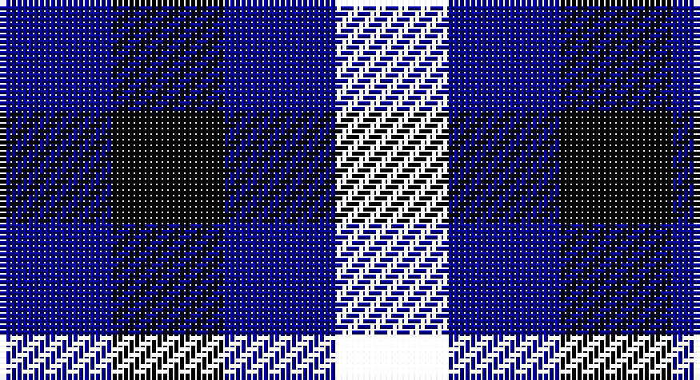

This page is one **sett** — a single exact thread-count. It belongs to the [tartan](/setts/ki1db1k1db1/)
(the same proportion at any scale), whose colour order is pattern [BKBK](/stripes/bkbk/).

Part of the [Algarve](/tartans/algarve/) tartan — the named design grouping this sett with its other cloths.

Sourced from tartans-authority.  It is a [4 stripe tartan](/stripes/stripes4/).

Original link http://www.tartansauthority.com/tartan-ferret/display/4202/

## Register references

External register numbers recorded for this tartan.

- Scottish Tartans Authority (ITI): 4202

## Thread count
DB/20 K20 DBa20 G/20

One full sett is **120 threads**.

## Palette

Palette: <strong>Tartan Register</strong>
<table><thead><tr><th>Colour</th><th>Threads</th><th>Shade</th><th>Base</th><th>OKLCh</th></tr></thead><tbody><tr><td>DB/</td><td style="text-align:right;font-variant-numeric:tabular-nums">20</td><td><code style="background-color:#00008C;">#00008C</code> <small style="color:#888">#00008C</small></td><td>B <code style="background-color:#2A418A;">#2A418A</code></td><td><small style="color:#888">oklch(28.9% 0.200 264.1)</small></td></tr><tr><td>K</td><td style="text-align:right;font-variant-numeric:tabular-nums">20</td><td><code style="background-color:#000000;">#000000</code> <small style="color:#888">#000000</small></td><td>K <code style="background-color:#000000;">#000000</code></td><td><small style="color:#888">oklch(0.0% 0.000 0.0)</small></td></tr><tr><td>DBa</td><td style="text-align:right;font-variant-numeric:tabular-nums">20</td><td><code style="background-color:#00008C;">#00008C</code> <small style="color:#888">#00008C</small></td><td>B <code style="background-color:#2A418A;">#2A418A</code></td><td><small style="color:#888">oklch(28.9% 0.200 264.1)</small></td></tr><tr><td>/</td><td style="text-align:right;font-variant-numeric:tabular-nums">20</td><td><code style="background-color:;"></code> <small style="color:#888"></small></td><td> <code style="background-color:;"></code></td><td><small style="color:#888"></small></td></tr></tbody></table>

# Sample pattern

## Compared to the master

This cloth is one sett of its design; the master sett (the exemplar the design is anchored on) is below for comparison.

<figure style="margin:0"><figcaption style="color:#888;font-size:smaller">this sett</figcaption></figure>
<figure style="margin:0"><figcaption style="color:#888;font-size:smaller"><a href="/setts/dg1r1w1db1/">master sett →</a></figcaption></figure>

## Nearest tartans

The nearest existing variants by ΔTartan distance, with this tartan at the top so the swatches line up against it.

ΔTartan

Tartan

Sett

—

<a href="/ttd/edit/#slug=ki1db1k1db1~x20">Algarve (Fashion)</a> <a class="nn-out" href="/variants/s4/ki1db1k1db1~x20/" title="open its dictionary page">↗</a>

2.97

<a href="/ttd/edit/#slug=k8dg7db8~x2&amp;base=ki1db1k1db1~x20">Glenlyon</a> <a class="nn-out" href="/variants/s3/k8dg7db8~x2/" title="open its dictionary page">↗</a>

3.17

<a href="/ttd/edit/#slug=k1t1r1db1g1db1~x24&amp;base=ki1db1k1db1~x20">Antonello (Personal)</a> <a class="nn-out" href="/variants/s6/k1t1r1db1g1db1~x24/" title="open its dictionary page">↗</a>

3.28

<a href="/ttd/edit/#slug=k1r1g1db1k1db1k1db1k1dp1~x10&amp;base=ki1db1k1db1~x20">Bell, Siobhan (Personal)</a> <a class="nn-out" href="/variants/s10/k1r1g1db1k1db1k1db1k1dp1~x10/" title="open its dictionary page">↗</a>

3.33

<a href="/ttd/edit/#slug=k11g9dp10~x2&amp;base=ki1db1k1db1~x20">Wilson's No.185</a> <a class="nn-out" href="/variants/s3/k11g9dp10~x2/" title="open its dictionary page">↗</a>

3.61

<a href="/ttd/edit/#slug=k8g7db8~x2&amp;base=ki1db1k1db1~x20">Glen Lyon</a> <a class="nn-out" href="/variants/s3/k8g7db8~x2/" title="open its dictionary page">↗</a>

3.85

<a href="/ttd/edit/#slug=k11p10g9~x2&amp;base=ki1db1k1db1~x20">Wilson's, No 185</a> <a class="nn-out" href="/variants/s3/k11p10g9~x2/" title="open its dictionary page">↗</a>

3.91

<a href="/ttd/edit/#slug=dp1k1dy1r1~x4&amp;base=ki1db1k1db1~x20">Bowater (Estate Check)</a> <a class="nn-out" href="/variants/s4/dp1k1dy1r1~x4/" title="open its dictionary page">↗</a>

3.94

<a href="/ttd/edit/#slug=db2k2g2db1k1~x20&amp;base=ki1db1k1db1~x20">Wandering Shepherd (Personal)</a> <a class="nn-out" href="/variants/s5/db2k2g2db1k1~x20/" title="open its dictionary page">↗</a>

4.00

<a href="/ttd/edit/#slug=k1lt1r1db1g1db1~x25&amp;base=ki1db1k1db1~x20">Antonelli (Oklahoma), John (Personal)</a> <a class="nn-out" href="/variants/s6/k1lt1r1db1g1db1~x25/" title="open its dictionary page">↗</a>

4.07

<a href="/variants/s8/db4dbi4dp4k4w1k4dp4dbi4~x10/">Weston Family Tartan</a>

## Neighbour map

Every grey dot is one of 14360 variants placed by the first two principal components of the ΔTartan feature space (44% of its variance). Red is this tartan; blue dots are its nearest — click one to open its page.

<svg viewBox="0 0 640 380" role="img" style="max-width:100%;height:auto;border:1px solid #e0e0e0;border-radius:4px;display:block" xmlns="http://www.w3.org/2000/svg"><image href="/nn/cloud.v1.png" width="640" height="380"/><a href="/variants/s3/k8dg7db8~x2/"><circle cx="110.9" cy="366.0" r="4" fill="#3465a4"><title>Glenlyon</title></circle></a><a href="/variants/s6/k1t1r1db1g1db1~x24/"><circle cx="14.0" cy="366.0" r="4" fill="#3465a4"><title>Antonello (Personal)</title></circle></a><a href="/variants/s10/k1r1g1db1k1db1k1db1k1dp1~x10/"><circle cx="14.0" cy="366.0" r="4" fill="#3465a4"><title>Bell, Siobhan (Personal)</title></circle></a><a href="/variants/s3/k11g9dp10~x2/"><circle cx="78.2" cy="366.0" r="4" fill="#3465a4"><title>Wilson's No.185</title></circle></a><a href="/variants/s3/k8g7db8~x2/"><circle cx="23.3" cy="366.0" r="4" fill="#3465a4"><title>Glen Lyon</title></circle></a><a href="/variants/s3/k11p10g9~x2/"><circle cx="36.2" cy="366.0" r="4" fill="#3465a4"><title>Wilson's, No 185</title></circle></a><a href="/variants/s4/dp1k1dy1r1~x4/"><circle cx="14.0" cy="366.0" r="4" fill="#3465a4"><title>Bowater (Estate Check)</title></circle></a><a href="/variants/s5/db2k2g2db1k1~x20/"><circle cx="155.3" cy="366.0" r="4" fill="#3465a4"><title>Wandering Shepherd (Personal)</title></circle></a><a href="/variants/s6/k1lt1r1db1g1db1~x25/"><circle cx="14.0" cy="366.0" r="4" fill="#3465a4"><title>Antonelli (Oklahoma), John (Personal)</title></circle></a><a href="/variants/s8/db4dbi4dp4k4w1k4dp4dbi4~x10/"><circle cx="64.4" cy="305.7" r="4" fill="#3465a4"><title>Weston Family Tartan</title></circle></a><circle cx="14.0" cy="366.0" r="5" fill="#c00000"/></svg>

ID: /variants/s4/ki1db1k1db1~x20/
