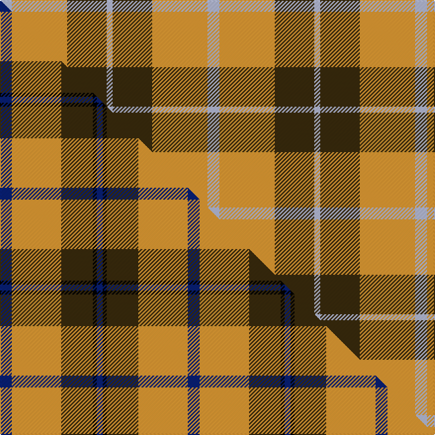

This page is one **sett** — a single exact thread-count. It belongs to the [tartan](/setts/lb6lo28dy20lb3/)
(the same proportion at any scale), whose colour order is pattern [WGYW](/stripes/wgyw/).

Part of the [Prince of Orange](/tartans/prince-of-orange/) tartan — the named design grouping this sett with its other cloths.

Sourced from house-of-tartan.  It is a [4 stripe tartan](/stripes/stripes4/).

Original link http://www.house-of-tartan.scotland.net/house/TartanViewjs.asp?colr=Def&tnam=389

## Provenance

Earliest known date: pre 2003 Sales help Princess Diana Memorial Trust

## Thread count
LB/12 LO56 DY40 LB/6

One full sett is **210 threads**.

## Palette
<table><thead><tr><th>Colour</th><th>Shade</th><th>OKLCh</th></tr></thead><tbody><tr><td>LB</td><td><code style="background-color:#B5BBDE;">#B5BBDE</code> <small style="color:#888">#B5BBDE</small></td><td><small style="color:#888">oklch(79.9% 0.050 277.6)</small></td></tr><tr><td>LO</td><td><code style="background-color:#FF9C34;">#FF9C34</code> <small style="color:#888">#FF9C34</small></td><td><small style="color:#888">oklch(77.9% 0.161 61.8)</small></td></tr><tr><td>DY</td><td><code style="background-color:#3A2B0D;">#3A2B0D</code> <small style="color:#888">#3A2B0D</small></td><td><small style="color:#888">oklch(30.0% 0.049 82.0)</small></td></tr></tbody></table>

# Sample pattern

## Compared to the master

This cloth is one sett of its design; the master sett (the exemplar the design is anchored on) is below for comparison.

Its **ΔTartan distance** from the master is **3.15** — the same measure the nearest-tartans table ranks by (0 is identical; a re-scale of the same cloth is near 0, a recolour or a different proportion further).

<figure class="master-compare" style="margin:0">

this sett
master sett ★

<figcaption style="color:#888;font-size:smaller">One weave of this sett against the <a href="/setts/db6lo25dy16k2db3/">master sett ★</a>, split on the diagonal: a shared proportion runs seamlessly across it with only the shades shifting; a different proportion breaks on it.</figcaption>
</figure>

## Nearest tartan variants

The nearest existing variants by ΔTartan distance, with this cloth at the top so the swatches line up against it.

ΔTartan

Threads

Variant

Sett

—

210

<a href="/variants/s4/lb6lo28dy20lb3~x2/">Prince of Orange Tartan</a>

<a href="/ttd/edit/#slug=lb6do28lo20lb3~x2&amp;base=lb6lo28dy20lb3~x2" title="compare in the TTD">1.40</a>

210

<a href="/variants/s4/lb6do28lo20lb3~x2/">Prince of Orange</a>

<a href="/ttd/edit/#slug=y20db10w3~x2&amp;base=lb6lo28dy20lb3~x2" title="compare in the TTD">2.55</a>

86

<a href="/variants/s3/y20db10w3~x2/">Masai Shuka 04 (Artefact)</a>

<a href="/ttd/edit/#slug=lb14n7dy6n2~x8&amp;base=lb6lo28dy20lb3~x2" title="compare in the TTD">2.94</a>

336

<a href="/variants/s4/lb14n7dy6n2~x8/">Outlander #3</a>

<a href="/ttd/edit/#slug=g30ly3db8r25~x2&amp;base=lb6lo28dy20lb3~x2" title="compare in the TTD">2.99</a>

154

<a href="/variants/s4/g30ly3db8r25~x2/">Dohmen (Personal)</a>

<a href="/ttd/edit/#slug=g30y3db8r25~x2&amp;base=lb6lo28dy20lb3~x2" title="compare in the TTD">2.99</a>

154

<a href="/variants/s4/g30y3db8r25~x2/">Dohmen Family (Zuid-Nederland)</a>

## Neighbour map

Every grey dot is one of 13620 variants placed by the first two principal components of the ΔTartan feature space (42% of its variance). Red is this tartan; blue dots are its nearest — click one to open its page.

<svg viewBox="0 0 640 380" role="img" style="max-width:100%;height:auto;border:1px solid #e0e0e0;border-radius:4px;display:block" xmlns="http://www.w3.org/2000/svg"><image href="/nn/cloud.v1.png" width="640" height="380"/><a href="/variants/s4/lb6do28lo20lb3~x2/"><circle cx="323.3" cy="278.6" r="4" fill="#3465a4"><title>Prince of Orange</title></circle></a><a href="/variants/s3/y20db10w3~x2/"><circle cx="361.6" cy="300.9" r="4" fill="#3465a4"><title>Masai Shuka 04 (Artefact)</title></circle></a><a href="/variants/s4/lb14n7dy6n2~x8/"><circle cx="297.7" cy="300.5" r="4" fill="#3465a4"><title>Outlander #3</title></circle></a><a href="/variants/s4/g30ly3db8r25~x2/"><circle cx="265.7" cy="247.2" r="4" fill="#3465a4"><title>Dohmen (Personal)</title></circle></a><a href="/variants/s4/g30y3db8r25~x2/"><circle cx="272.9" cy="249.2" r="4" fill="#3465a4"><title>Dohmen Family (Zuid-Nederland)</title></circle></a><circle cx="306.8" cy="267.2" r="5" fill="#c00000"/><text x="320" y="376" text-anchor="middle" font-size="11" fill="#999">ground</text><text x="11" y="190" text-anchor="middle" font-size="11" fill="#999" transform="rotate(-90 11 190)">complexity</text></svg>

ID: /variants/s4/lb6lo28dy20lb3~x2/
