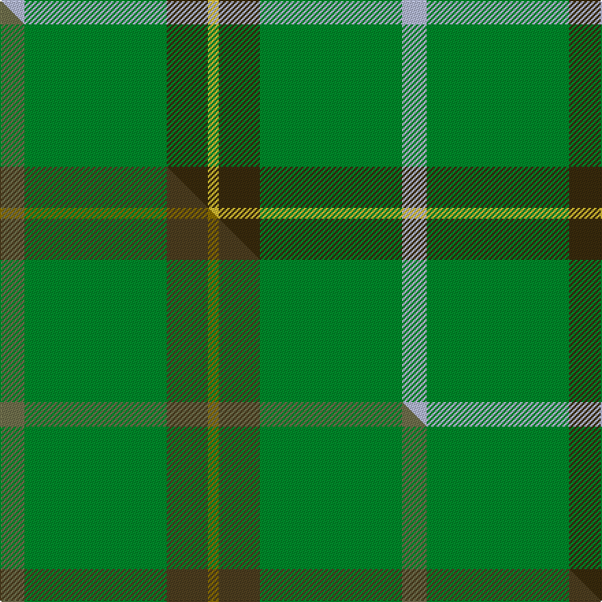

This page is one **sett** — a single exact thread-count. It belongs to the [tartan](/setts/lb9g52dy15ly4/)
(the same proportion at any scale), whose colour order is pattern [WGGY](/stripes/wggy/).

Part of the [McGuigan, Julia](/tartans/mcguigan-julia/) tartan — the named design grouping this sett with its other cloths.

Sourced from tartans-authority.  It is a [4 stripe tartan](/stripes/stripes4/).

Original link [https://www.tartanregister.gov.uk/tartanDetails.aspx?ref=10605](https://www.tartanregister.gov.uk/tartanDetails.aspx?ref=10605)

Dataset <small>— provenance for this record, inherited from the source manifest</small>

<dl class="dataset-prov">
<dt>source</dt><dd><a href="/sources/tartans-authority/">Scottish Tartans Authority</a></dd>
<dt>data captured from</dt><dd><a href="https://github.com/thetartan/tartan-database/blob/master/data/tartans-authority/data.csv">https://github.com/thetartan/tartan-database/blob/master/data/tartans-authority/data.csv</a></dd>
<dt>data date</dt><dd>16/01/2012 <small>(this record)</small></dd>
<dt>licence</dt><dd><a href="https://creativecommons.org/licenses/by-nc-nd/4.0/">CC BY-NC-ND 4.0</a></dd>
</dl>

Capture chain <small>— the hands this data passed through, oldest first; each capture carries its own licence</small>

<ol class="capture-chain">
<li><a href="https://www.tartansauthority.com/">Scottish Tartans Authority</a> <small>the heritage body's archive — its tartan-ferret record browser is retired (links repaired to the SRT, above)</small></li>
<li><a href="https://github.com/thetartan/tartan-database">thetartan/tartan-database</a> <small>2016-2017</small> · <a href="https://creativecommons.org/licenses/by-nc-nd/4.0/">CC BY-NC-ND 4.0</a> <small>Levko Kravets's frozen compilation — the capture we vendored, and where its CC licence text came from</small></li>
<li>this dictionary <small>captured 2026-06-10 · commit 5bf86c7566</small> <small>each re-capture is a git commit to data/sources</small></li>
</ol>

## Register references

External register numbers recorded for this tartan.

- Scottish Register of Tartans: [10605](https://www.tartanregister.gov.uk/tartanDetails?ref=10605)
- Scottish Tartans Authority (ITI): 10605

## Thread count
LB/18 G104 DY30 LY/8

One full sett is **294 threads**.

## Palette
<table><thead><tr><th>Colour</th><th>Shade</th><th>OKLCh</th></tr></thead><tbody><tr><td>G</td><td><code style="background-color:#008B2A;">#008B2A</code> <small style="color:#888">#008B2A</small></td><td><small style="color:#888">oklch(55.4% 0.170 145.9)</small></td></tr><tr><td>LB</td><td><code style="background-color:#B5BBDE;">#B5BBDE</code> <small style="color:#888">#B5BBDE</small></td><td><small style="color:#888">oklch(79.9% 0.050 277.6)</small></td></tr><tr><td>DY</td><td><code style="background-color:#3A2B0D;">#3A2B0D</code> <small style="color:#888">#3A2B0D</small></td><td><small style="color:#888">oklch(30.0% 0.049 82.0)</small></td></tr><tr><td>LY</td><td><code style="background-color:#DCBC32;">#DCBC32</code> <small style="color:#888">#DCBC32</small></td><td><small style="color:#888">oklch(80.0% 0.150 95.2)</small></td></tr></tbody></table>

# Sample pattern

## Compared to the master

This cloth is one sett of its design; the master sett (the exemplar the design is anchored on) is below for comparison.

Its **ΔTartan distance** from the master is **0.35** — the same measure the nearest-tartans table ranks by (0 is identical; a re-scale of the same cloth is near 0, a recolour or a different proportion further).

<figure class="master-compare" style="margin:0">

this sett
master sett ★

<figcaption style="color:#888;font-size:smaller">One weave of this sett against the <a href="/setts/yi9g52dy15y4/">master sett ★</a>, split on the diagonal: a shared proportion runs seamlessly across it with only the shades shifting; a different proportion breaks on it.</figcaption>
</figure>

## Nearest tartan variants

The nearest existing variants by ΔTartan distance, with this cloth at the top so the swatches line up against it.

ΔTartan

Threads

Variant

Sett

—

294

<a href="/variants/s4/lb9g52dy15ly4~x2/">McGuigan, Julia (Personal)</a>

<a href="/ttd/edit/#slug=db5ly5dy13g41r3~x2&amp;base=lb9g52dy15ly4~x2" title="compare in the TTD">0.55</a>

252

<a href="/variants/s5/db5ly5dy13g41r3~x2/">Clare, Richard (Personal)</a>

<a href="/ttd/edit/#slug=db5lo5dy13g41r3~x2~lo3006076-g2505139&amp;base=lb9g52dy15ly4~x2" title="compare in the TTD">0.81</a>

252

<a href="/variants/s5/db5lo5dy13y41r3~x2~lo3006076-y2505139/">Clare (Prince George) (Personal)</a>

<a href="/ttd/edit/#slug=g12db3y1~x4&amp;base=lb9g52dy15ly4~x2" title="compare in the TTD">0.91</a>

76

<a href="/variants/s3/g12db3y1~x4/">Unidentified pattern #2</a>

<a href="/ttd/edit/#slug=dg62y17ly12n8o8~x2&amp;base=lb9g52dy15ly4~x2" title="compare in the TTD">1.06</a>

288

<a href="/variants/s5/dg62y17ly12n8o8~x2/">Dundhuin Hunting (Personal)</a>

<a href="/ttd/edit/#slug=g50dy25ly2dp6~x2&amp;base=lb9g52dy15ly4~x2" title="compare in the TTD">1.09</a>

220

<a href="/variants/s4/g50dy25ly2dp6~x2/">Highland Greenford (Personal)</a>

<a href="/ttd/edit/#slug=g56dy13ly18~x2&amp;base=lb9g52dy15ly4~x2" title="compare in the TTD">1.11</a>

200

<a href="/variants/s3/g56dy13ly18~x2/">Colonial Marine (Corporate)</a>

<a href="/ttd/edit/#slug=y1g10db4lb1~x2&amp;base=lb9g52dy15ly4~x2" title="compare in the TTD">1.11</a>

60

<a href="/variants/s4/y1g10db4lb1~x2/">Wilson's No.174</a>

<a href="/ttd/edit/#slug=dg21y43dg86lb10&amp;base=lb9g52dy15ly4~x2" title="compare in the TTD">1.70</a>

289

<a href="/variants/s4/dg21y43dg86lb10/">Special Saffron Tartan</a>

<a href="/ttd/edit/#slug=dg60ly16dp8db2dy3~x2~dg1504144-ly3104101&amp;base=lb9g52dy15ly4~x2" title="compare in the TTD">1.85</a>

230

<a href="/variants/s5/dg60ly16dp8db2dy3~x2~dg1504144-ly3104101/">Isle of Raasay</a>

<a href="/ttd/edit/#slug=g55y4db15w3dr3w5~x2&amp;base=lb9g52dy15ly4~x2" title="compare in the TTD">1.94</a>

220

<a href="/variants/s6/g55y4db15w3dr3w5~x2/">Spencer (2013)</a>

## Neighbour map

Every grey dot is one of 13621 variants placed by the first two principal components of the ΔTartan feature space (42% of its variance). Red is this tartan; blue dots are its nearest — click one to open its page.

<svg viewBox="0 0 640 380" role="img" style="max-width:100%;height:auto;border:1px solid #e0e0e0;border-radius:4px;display:block" xmlns="http://www.w3.org/2000/svg"><image href="/nn/cloud.v1.png" width="640" height="380"/><a href="/variants/s5/db5ly5dy13g41r3~x2/"><circle cx="356.7" cy="192.4" r="4" fill="#3465a4"><title>Clare, Richard (Personal)</title></circle></a><a href="/variants/s5/db5lo5dy13y41r3~x2~lo3006076-y2505139/"><circle cx="359.1" cy="189.6" r="4" fill="#3465a4"><title>Clare (Prince George) (Personal)</title></circle></a><a href="/variants/s3/g12db3y1~x4/"><circle cx="534.1" cy="277.4" r="4" fill="#3465a4"><title>Unidentified pattern #2</title></circle></a><a href="/variants/s5/dg62y17ly12n8o8~x2/"><circle cx="317.7" cy="218.5" r="4" fill="#3465a4"><title>Dundhuin Hunting (Personal)</title></circle></a><a href="/variants/s4/g50dy25ly2dp6~x2/"><circle cx="434.0" cy="221.7" r="4" fill="#3465a4"><title>Highland Greenford (Personal)</title></circle></a><a href="/variants/s3/g56dy13ly18~x2/"><circle cx="399.5" cy="334.4" r="4" fill="#3465a4"><title>Colonial Marine (Corporate)</title></circle></a><a href="/variants/s4/y1g10db4lb1~x2/"><circle cx="392.5" cy="250.1" r="4" fill="#3465a4"><title>Wilson's No.174</title></circle></a><a href="/variants/s4/dg21y43dg86lb10/"><circle cx="451.1" cy="286.0" r="4" fill="#3465a4"><title>Special Saffron Tartan</title></circle></a><a href="/variants/s5/dg60ly16dp8db2dy3~x2~dg1504144-ly3104101/"><circle cx="450.7" cy="162.0" r="4" fill="#3465a4"><title>Isle of Raasay</title></circle></a><a href="/variants/s6/g55y4db15w3dr3w5~x2/"><circle cx="390.6" cy="164.7" r="4" fill="#3465a4"><title>Spencer (2013)</title></circle></a><circle cx="424.6" cy="241.7" r="5" fill="#c00000"/><text x="320" y="376" text-anchor="middle" font-size="11" fill="#999">ground</text><text x="11" y="190" text-anchor="middle" font-size="11" fill="#999" transform="rotate(-90 11 190)">complexity</text></svg>

ID: /variants/s4/lb9g52dy15ly4~x2/
