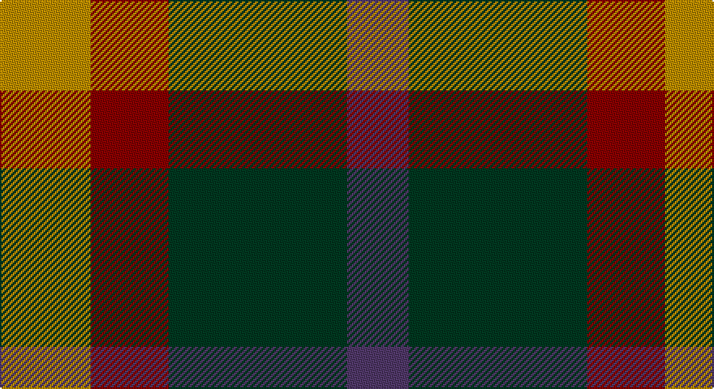

This page is one **sett** — a single exact thread-count. It belongs to the [tartan](/setts/lo28r24dg55dp19/)
(the same proportion at any scale), whose colour order is pattern [BGRY](/stripes/bgry/).

Sourced from tartans-authority.  It is a [4 stripe tartan](/stripes/stripes4/).

Original link http://www.tartansauthority.com/tartan-ferret/display/8099/

## Register references

External register numbers recorded for this tartan.

- Scottish Register of Tartans: [8099](https://www.tartanregister.gov.uk/tartanDetails?ref=8099)
- Scottish Tartans Authority (ITI): 8099

## Thread count
DY/56 DR48 DG110 N/38

One full sett is **410 threads**.

## Palette

Palette: <strong>Tartan Register</strong> <small style="color:#888">(3 of 4 colours)</small>
<table><thead><tr><th>Colour</th><th>Threads</th><th>Shade</th><th>Base</th><th>OKLCh</th></tr></thead><tbody><tr><td>DY/</td><td style="text-align:right;font-variant-numeric:tabular-nums">56</td><td><code style="background-color:#BC8C00;">#BC8C00</code> <small style="color:#888">#BC8C00</small></td><td>Y <code style="background-color:#F2BF00;">#F2BF00</code></td><td><small style="color:#888">oklch(66.8% 0.137 84.1)</small></td></tr><tr><td>DR</td><td style="text-align:right;font-variant-numeric:tabular-nums">48</td><td><code style="background-color:#880000;">#880000</code> <small style="color:#888">#880000</small></td><td>R <code style="background-color:#CC0000;">#CC0000</code></td><td><small style="color:#888">oklch(39.4% 0.162 29.2)</small></td></tr><tr><td>DG</td><td style="text-align:right;font-variant-numeric:tabular-nums">110</td><td><code style="background-color:#003820;">#003820</code> <small style="color:#888">#003820</small></td><td>G <code style="background-color:#006100;">#006100</code></td><td><small style="color:#888">oklch(30.0% 0.070 158.3)</small></td></tr><tr><td>N/</td><td style="text-align:right;font-variant-numeric:tabular-nums">38</td><td><code style="background-color:#503868;">#503868</code> <small style="color:#888">#503868</small></td><td>B <code style="background-color:#2A418A;">#2A418A</code></td><td><small style="color:#888">oklch(39.0% 0.083 305.9)</small></td></tr></tbody></table>

# Sample pattern

## Nearest tartans

The nearest existing variants by ΔTartan distance, with this tartan at the top so the swatches line up against it.

ΔTartan

Tartan

Sett

—

<a href="/ttd/edit/#slug=lo28r24dg55dp19~x2">Hirstwood (Name)</a> <a class="nn-out" href="/variants/s4/lo28r24dg55dp19~x2/" title="open its dictionary page">↗</a>

1.37

<a href="/ttd/edit/#slug=n2r1k1lr1~x10&amp;base=lo28r24dg55dp19~x2">Kucher, Gregory (Personal)</a> <a class="nn-out" href="/variants/s4/n2r1k1lr1~x10/" title="open its dictionary page">↗</a>

1.40

<a href="/ttd/edit/#slug=db2g4ly1db1r2~x12&amp;base=lo28r24dg55dp19~x2">Creek Indian Nation</a> <a class="nn-out" href="/variants/s5/db2g4ly1db1r2~x12/" title="open its dictionary page">↗</a>

1.45

<a href="/ttd/edit/#slug=dr5g6y2g6dr5db6dr2~x2&amp;base=lo28r24dg55dp19~x2">Gleneagles Group</a> <a class="nn-out" href="/variants/s7/dr5g6y2g6dr5db6dr2~x2/" title="open its dictionary page">↗</a>

1.49

<a href="/ttd/edit/#slug=r9g9k10t2~x2&amp;base=lo28r24dg55dp19~x2">Wilson's No.196</a> <a class="nn-out" href="/variants/s4/r9g9k10t2~x2/" title="open its dictionary page">↗</a>

1.52

<a href="/ttd/edit/#slug=t2r4g5ly1~x4&amp;base=lo28r24dg55dp19~x2">Wilson's No.203</a> <a class="nn-out" href="/variants/s4/t2r4g5ly1~x4/" title="open its dictionary page">↗</a>

1.54

<a href="/ttd/edit/#slug=r5g6ly2g6r5b6r2~x2&amp;base=lo28r24dg55dp19~x2">Gleneagles Group</a> <a class="nn-out" href="/variants/s7/r5g6ly2g6r5b6r2~x2/" title="open its dictionary page">↗</a>

1.55

<a href="/ttd/edit/#slug=k1g3k3db3r1~x4&amp;base=lo28r24dg55dp19~x2">Durham District Tartan</a> <a class="nn-out" href="/variants/s5/k1g3k3db3r1~x4/" title="open its dictionary page">↗</a>

1.55

<a href="/ttd/edit/#slug=dt6k6dt6r14ly3~x2&amp;base=lo28r24dg55dp19~x2">Chivas Regal</a> <a class="nn-out" href="/variants/s5/dt6k6dt6r14ly3~x2/" title="open its dictionary page">↗</a>

1.57

<a href="/ttd/edit/#slug=r20dg29db10dg16r6dg10k19~x2&amp;base=lo28r24dg55dp19~x2">MacDonagh (Name)</a> <a class="nn-out" href="/variants/s7/r20dg29db10dg16r6dg10k19~x2/" title="open its dictionary page">↗</a>

1.61

<a href="/ttd/edit/#slug=dp8k11g9r2~x2&amp;base=lo28r24dg55dp19~x2">Norwich Collection No. 60</a> <a class="nn-out" href="/variants/s4/dp8k11g9r2~x2/" title="open its dictionary page">↗</a>

## Neighbour map

Every grey dot is one of 14360 variants placed by the first two principal components of the ΔTartan feature space (44% of its variance). Red is this tartan; blue dots are its nearest — click one to open its page.

<svg viewBox="0 0 640 380" role="img" style="max-width:100%;height:auto;border:1px solid #e0e0e0;border-radius:4px;display:block" xmlns="http://www.w3.org/2000/svg"><image href="/nn/cloud.v1.png" width="640" height="380"/><a href="/variants/s4/n2r1k1lr1~x10/"><circle cx="104.6" cy="340.7" r="4" fill="#3465a4"><title>Kucher, Gregory (Personal)</title></circle></a><a href="/variants/s5/db2g4ly1db1r2~x12/"><circle cx="144.2" cy="274.7" r="4" fill="#3465a4"><title>Creek Indian Nation</title></circle></a><a href="/variants/s7/dr5g6y2g6dr5db6dr2~x2/"><circle cx="131.6" cy="313.6" r="4" fill="#3465a4"><title>Gleneagles Group</title></circle></a><a href="/variants/s4/r9g9k10t2~x2/"><circle cx="124.3" cy="292.4" r="4" fill="#3465a4"><title>Wilson's No.196</title></circle></a><a href="/variants/s4/t2r4g5ly1~x4/"><circle cx="176.9" cy="278.3" r="4" fill="#3465a4"><title>Wilson's No.203</title></circle></a><a href="/variants/s7/r5g6ly2g6r5b6r2~x2/"><circle cx="138.2" cy="311.5" r="4" fill="#3465a4"><title>Gleneagles Group</title></circle></a><a href="/variants/s5/k1g3k3db3r1~x4/"><circle cx="130.3" cy="319.2" r="4" fill="#3465a4"><title>Durham District Tartan</title></circle></a><a href="/variants/s5/dt6k6dt6r14ly3~x2/"><circle cx="160.5" cy="269.8" r="4" fill="#3465a4"><title>Chivas Regal</title></circle></a><a href="/variants/s7/r20dg29db10dg16r6dg10k19~x2/"><circle cx="209.2" cy="281.4" r="4" fill="#3465a4"><title>MacDonagh (Name)</title></circle></a><a href="/variants/s4/dp8k11g9r2~x2/"><circle cx="157.2" cy="297.7" r="4" fill="#3465a4"><title>Norwich Collection No. 60</title></circle></a><circle cx="162.8" cy="322.3" r="5" fill="#c00000"/></svg>

ID: /variants/s4/lo28r24dg55dp19~x2/
