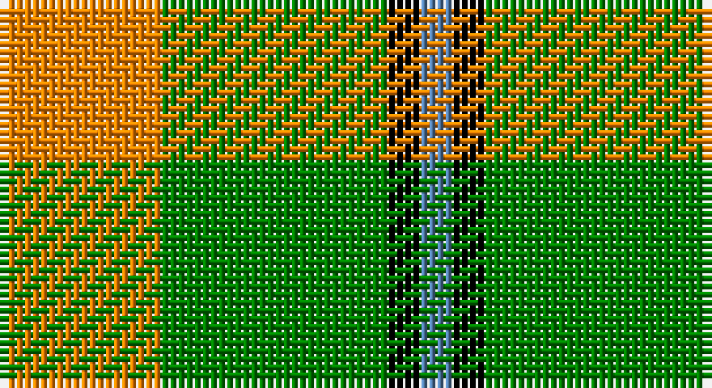

This page is one **sett** — a single exact thread-count. It belongs to the [tartan](/setts/lo5g7k1t1/)
(the same proportion at any scale), whose colour order is pattern [BKGY](/stripes/bkgy/).

Sourced from weddslist.  It is a [4 stripe tartan](/stripes/stripes4/).

Original link http://www.weddslist.com/cgi-bin/tartans/pg.pl?source=sts

## Thread count
O/20 G28 K4 B/4

One full sett is **88 threads**.

## Palette

Palette: <strong>Ingles Buchan</strong> <small style="color:#888">(1 of 4 colours)</small>
<table><thead><tr><th>Colour</th><th>Threads</th><th>Shade</th><th>Base</th><th>OKLCh</th></tr></thead><tbody><tr><td>O/</td><td style="text-align:right;font-variant-numeric:tabular-nums">20</td><td><code style="background-color:#FF8500;">#FF8500</code> <small style="color:#888">#FF8500</small></td><td>Y <code style="background-color:#F2BF00;">#F2BF00</code></td><td><small style="color:#888">oklch(74.0% 0.183 55.1)</small></td></tr><tr><td>G</td><td style="text-align:right;font-variant-numeric:tabular-nums">28</td><td><code style="background-color:#008000;">#008000</code> <small style="color:#888">#008000</small></td><td>G <code style="background-color:#006100;">#006100</code></td><td><small style="color:#888">oklch(52.0% 0.177 142.5)</small></td></tr><tr><td>K</td><td style="text-align:right;font-variant-numeric:tabular-nums">4</td><td><code style="background-color:#000000;">#000000</code> <small style="color:#888">#000000</small></td><td>K <code style="background-color:#000000;">#000000</code></td><td><small style="color:#888">oklch(0.0% 0.000 0.0)</small></td></tr><tr><td>B/</td><td style="text-align:right;font-variant-numeric:tabular-nums">4</td><td><code style="background-color:#5480B0;">#5480B0</code> <small style="color:#888">#5480B0</small></td><td>B <code style="background-color:#2A418A;">#2A418A</code></td><td><small style="color:#888">oklch(58.8% 0.089 251.5)</small></td></tr></tbody></table>

# Sample pattern

## Nearest tartans

The nearest existing variants by ΔTartan distance, with this tartan at the top so the swatches line up against it.

ΔTartan

Tartan

Sett

—

<a href="/ttd/edit/#slug=lo5g7k1t1~x4">Wilson's, No 195</a> <a class="nn-out" href="/variants/s4/lo5g7k1t1~x4/" title="open its dictionary page">↗</a>

1.10

<a href="/ttd/edit/#slug=dg27r9n2ly14~x4&amp;base=lo5g7k1t1~x4">Englehart, City of</a> <a class="nn-out" href="/variants/s4/dg27r9n2ly14~x4/" title="open its dictionary page">↗</a>

1.15

<a href="/ttd/edit/#slug=do4g25lo10g3lo18r4~x2&amp;base=lo5g7k1t1~x4">Unidentfied (Ligioner Highland Games</a> <a class="nn-out" href="/variants/s6/do4g25lo10g3lo18r4~x2/" title="open its dictionary page">↗</a>

1.24

<a href="/ttd/edit/#slug=g6k1r1t2r2~x4&amp;base=lo5g7k1t1~x4">Wilson's, No 193</a> <a class="nn-out" href="/variants/s5/g6k1r1t2r2~x4/" title="open its dictionary page">↗</a>

1.33

<a href="/ttd/edit/#slug=g6ly1r1t2r2~x4&amp;base=lo5g7k1t1~x4">Wilson's, No 179</a> <a class="nn-out" href="/variants/s5/g6ly1r1t2r2~x4/" title="open its dictionary page">↗</a>

1.40

<a href="/ttd/edit/#slug=g22w14r7ly2~x2&amp;base=lo5g7k1t1~x4">Loch Lomond #3</a> <a class="nn-out" href="/variants/s4/g22w14r7ly2~x2/" title="open its dictionary page">↗</a>

1.49

<a href="/ttd/edit/#slug=w5ly32dt32ly5~x2&amp;base=lo5g7k1t1~x4">Barclay Dress</a> <a class="nn-out" href="/variants/s4/w5ly32dt32ly5~x2/" title="open its dictionary page">↗</a>

1.52

<a href="/ttd/edit/#slug=w2o13g13w2~x6&amp;base=lo5g7k1t1~x4">Dunoon Irish (Corporate)</a> <a class="nn-out" href="/variants/s4/w2o13g13w2~x6/" title="open its dictionary page">↗</a>

1.55

<a href="/ttd/edit/#slug=r4k25ly25w4~x2&amp;base=lo5g7k1t1~x4">Bonhill Primary School</a> <a class="nn-out" href="/variants/s4/r4k25ly25w4~x2/" title="open its dictionary page">↗</a>

1.56

<a href="/ttd/edit/#slug=w2g13lo13w2~x6&amp;base=lo5g7k1t1~x4">Dunoon</a> <a class="nn-out" href="/variants/s4/w2g13lo13w2~x6/" title="open its dictionary page">↗</a>

1.56

<a href="/ttd/edit/#slug=w1ly8dg3ly1db3ly1~x4&amp;base=lo5g7k1t1~x4">Fraser Yellow #2</a> <a class="nn-out" href="/variants/s6/w1ly8dg3ly1db3ly1~x4/" title="open its dictionary page">↗</a>

## Neighbour map

Every grey dot is one of 14360 variants placed by the first two principal components of the ΔTartan feature space (44% of its variance). Red is this tartan; blue dots are its nearest — click one to open its page.

<svg viewBox="0 0 640 380" role="img" style="max-width:100%;height:auto;border:1px solid #e0e0e0;border-radius:4px;display:block" xmlns="http://www.w3.org/2000/svg"><image href="/nn/cloud.v1.png" width="640" height="380"/><a href="/variants/s4/dg27r9n2ly14~x4/"><circle cx="264.7" cy="219.0" r="4" fill="#3465a4"><title>Englehart, City of</title></circle></a><a href="/variants/s6/do4g25lo10g3lo18r4~x2/"><circle cx="221.4" cy="206.0" r="4" fill="#3465a4"><title>Unidentfied (Ligioner Highland Games</title></circle></a><a href="/variants/s5/g6k1r1t2r2~x4/"><circle cx="224.5" cy="237.6" r="4" fill="#3465a4"><title>Wilson's, No 193</title></circle></a><a href="/variants/s5/g6ly1r1t2r2~x4/"><circle cx="244.6" cy="244.0" r="4" fill="#3465a4"><title>Wilson's, No 179</title></circle></a><a href="/variants/s4/g22w14r7ly2~x2/"><circle cx="213.9" cy="214.1" r="4" fill="#3465a4"><title>Loch Lomond #3</title></circle></a><a href="/variants/s4/w5ly32dt32ly5~x2/"><circle cx="248.2" cy="242.4" r="4" fill="#3465a4"><title>Barclay Dress</title></circle></a><a href="/variants/s4/w2o13g13w2~x6/"><circle cx="248.3" cy="258.2" r="4" fill="#3465a4"><title>Dunoon Irish (Corporate)</title></circle></a><a href="/variants/s4/r4k25ly25w4~x2/"><circle cx="184.8" cy="225.6" r="4" fill="#3465a4"><title>Bonhill Primary School</title></circle></a><a href="/variants/s4/w2g13lo13w2~x6/"><circle cx="249.7" cy="255.6" r="4" fill="#3465a4"><title>Dunoon</title></circle></a><a href="/variants/s6/w1ly8dg3ly1db3ly1~x4/"><circle cx="271.1" cy="192.3" r="4" fill="#3465a4"><title>Fraser Yellow #2</title></circle></a><circle cx="236.1" cy="235.8" r="5" fill="#c00000"/></svg>

ID: /variants/s4/lo5g7k1t1~x4/
