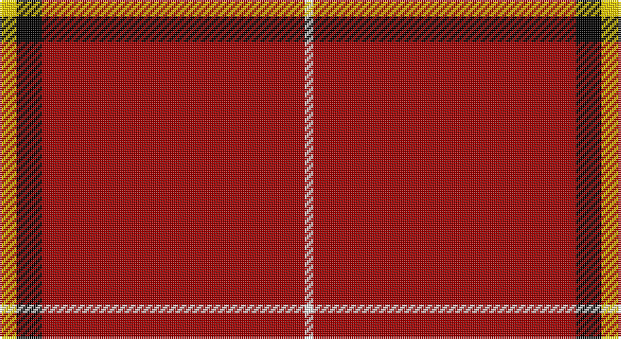

This page is one **sett** — a single exact thread-count. It belongs to the [tartan](/setts/ly2k3r31w1/)
(the same proportion at any scale), whose colour order is pattern [WRKY](/stripes/wrky/).

Sourced from register-of-tartans.  It is a [4 stripe tartan](/stripes/stripes4/).

Original link https://www.tartanregister.gov.uk/tartanDetails.aspx?ref=11548

## Register references

External register numbers recorded for this tartan.

- Scottish Register of Tartans: [11548](https://www.tartanregister.gov.uk/tartanDetails.aspx?ref=11548)

## Thread count
Y/8 K12 DR124 W/4

One full sett is **284 threads**.

## Palette

Palette: <strong>Tartan Register</strong>
<table><thead><tr><th>Colour</th><th>Threads</th><th>Shade</th><th>Base</th><th>OKLCh</th></tr></thead><tbody><tr><td>Y/</td><td style="text-align:right;font-variant-numeric:tabular-nums">8</td><td><code style="background-color:#FCCC00;">#FCCC00</code> <small style="color:#888">#FCCC00</small></td><td>Y <code style="background-color:#F2BF00;">#F2BF00</code></td><td><small style="color:#888">oklch(86.2% 0.176 91.5)</small></td></tr><tr><td>K</td><td style="text-align:right;font-variant-numeric:tabular-nums">12</td><td><code style="background-color:#000000;">#000000</code> <small style="color:#888">#000000</small></td><td>K <code style="background-color:#000000;">#000000</code></td><td><small style="color:#888">oklch(0.0% 0.000 0.0)</small></td></tr><tr><td>DR</td><td style="text-align:right;font-variant-numeric:tabular-nums">124</td><td><code style="background-color:#A00000;">#A00000</code> <small style="color:#888">#A00000</small></td><td>R <code style="background-color:#CC0000;">#CC0000</code></td><td><small style="color:#888">oklch(44.3% 0.182 29.2)</small></td></tr><tr><td>W/</td><td style="text-align:right;font-variant-numeric:tabular-nums">4</td><td><code style="background-color:#F8F8F8;">#F8F8F8</code> <small style="color:#888">#F8F8F8</small></td><td>W <code style="background-color:#F7F7F7;">#F7F7F7</code></td><td><small style="color:#888">oklch(97.9% 0.000 89.9)</small></td></tr></tbody></table>

# Sample pattern

## Nearest tartans

The nearest existing variants by ΔTartan distance, with this tartan at the top so the swatches line up against it.

ΔTartan

Tartan

Sett

—

<a href="/ttd/edit/#slug=ly2k3r31w1~x4">Riddick Furya</a> <a class="nn-out" href="/variants/s4/ly2k3r31w1~x4/" title="open its dictionary page">↗</a>

1.31

<a href="/ttd/edit/#slug=g4r16k5r50g4w1~x4&amp;base=ly2k3r31w1~x4">Chalet</a> <a class="nn-out" href="/variants/s6/g4r16k5r50g4w1~x4/" title="open its dictionary page">↗</a>

1.86

<a href="/ttd/edit/#slug=r39dg6r2dg3w1~x2&amp;base=ly2k3r31w1~x4">MacGregor #2</a> <a class="nn-out" href="/variants/s5/r39dg6r2dg3w1~x2/" title="open its dictionary page">↗</a>

1.90

<a href="/ttd/edit/#slug=r72k8r4g16r7o2~x2&amp;base=ly2k3r31w1~x4">MacAndrew Dress (Name)</a> <a class="nn-out" href="/variants/s6/r72k8r4g16r7o2~x2/" title="open its dictionary page">↗</a>

1.90

<a href="/ttd/edit/#slug=r42k4w1k6ly1db1ly1r12~x2&amp;base=ly2k3r31w1~x4">Princess Elizabeth</a> <a class="nn-out" href="/variants/s8/r42k4w1k6ly1db1ly1r12~x2/" title="open its dictionary page">↗</a>

1.95

<a href="/ttd/edit/#slug=r65w1r6k8g8r6k3r11~x2&amp;base=ly2k3r31w1~x4">Gudbrandsdalen, Rondastakken #2</a> <a class="nn-out" href="/variants/s8/r65w1r6k8g8r6k3r11~x2/" title="open its dictionary page">↗</a>

1.97

<a href="/ttd/edit/#slug=r56w2k12ly3r12ly3r12g3~x2&amp;base=ly2k3r31w1~x4">Hackston, or Halkerston</a> <a class="nn-out" href="/variants/s8/r56w2k12ly3r12ly3r12g3~x2/" title="open its dictionary page">↗</a>

2.00

<a href="/ttd/edit/#slug=r72k6lb2k11ly2db2ly2r18~x2&amp;base=ly2k3r31w1~x4">Princess Elizabeth (Royal)</a> <a class="nn-out" href="/variants/s8/r72k6lb2k11ly2db2ly2r18~x2/" title="open its dictionary page">↗</a>

2.03

<a href="/ttd/edit/#slug=r39g6r2g3w1~x2&amp;base=ly2k3r31w1~x4">MacGregor</a> <a class="nn-out" href="/variants/s5/r39g6r2g3w1~x2/" title="open its dictionary page">↗</a>

2.03

<a href="/ttd/edit/#slug=ly6k3r40w3~x2&amp;base=ly2k3r31w1~x4">Masai Shuka 18 (Artefact)</a> <a class="nn-out" href="/variants/s4/ly6k3r40w3~x2/" title="open its dictionary page">↗</a>

2.07

<a href="/variants/s4/r63ki8k8ly5~x2/">McPeek (Fictitious clan)</a>

## Neighbour map

Every grey dot is one of 14360 variants placed by the first two principal components of the ΔTartan feature space (44% of its variance). Red is this tartan; blue dots are its nearest — click one to open its page.

<svg viewBox="0 0 640 380" role="img" style="max-width:100%;height:auto;border:1px solid #e0e0e0;border-radius:4px;display:block" xmlns="http://www.w3.org/2000/svg"><image href="/nn/cloud.v1.png" width="640" height="380"/><a href="/variants/s6/g4r16k5r50g4w1~x4/"><circle cx="603.9" cy="114.5" r="4" fill="#3465a4"><title>Chalet</title></circle></a><a href="/variants/s5/r39dg6r2dg3w1~x2/"><circle cx="626.0" cy="145.8" r="4" fill="#3465a4"><title>MacGregor #2</title></circle></a><a href="/variants/s6/r72k8r4g16r7o2~x2/"><circle cx="561.8" cy="132.8" r="4" fill="#3465a4"><title>MacAndrew Dress (Name)</title></circle></a><a href="/variants/s8/r42k4w1k6ly1db1ly1r12~x2/"><circle cx="542.8" cy="72.1" r="4" fill="#3465a4"><title>Princess Elizabeth</title></circle></a><a href="/variants/s8/r65w1r6k8g8r6k3r11~x2/"><circle cx="614.9" cy="101.1" r="4" fill="#3465a4"><title>Gudbrandsdalen, Rondastakken #2</title></circle></a><a href="/variants/s8/r56w2k12ly3r12ly3r12g3~x2/"><circle cx="497.6" cy="95.8" r="4" fill="#3465a4"><title>Hackston, or Halkerston</title></circle></a><a href="/variants/s8/r72k6lb2k11ly2db2ly2r18~x2/"><circle cx="549.6" cy="84.6" r="4" fill="#3465a4"><title>Princess Elizabeth (Royal)</title></circle></a><a href="/variants/s5/r39g6r2g3w1~x2/"><circle cx="626.0" cy="154.6" r="4" fill="#3465a4"><title>MacGregor</title></circle></a><a href="/variants/s4/ly6k3r40w3~x2/"><circle cx="505.6" cy="173.9" r="4" fill="#3465a4"><title>Masai Shuka 18 (Artefact)</title></circle></a><a href="/variants/s4/r63ki8k8ly5~x2/"><circle cx="474.2" cy="186.3" r="4" fill="#3465a4"><title>McPeek (Fictitious clan)</title></circle></a><circle cx="598.1" cy="143.6" r="5" fill="#c00000"/></svg>

ID: /variants/s4/ly2k3r31w1~x4/
