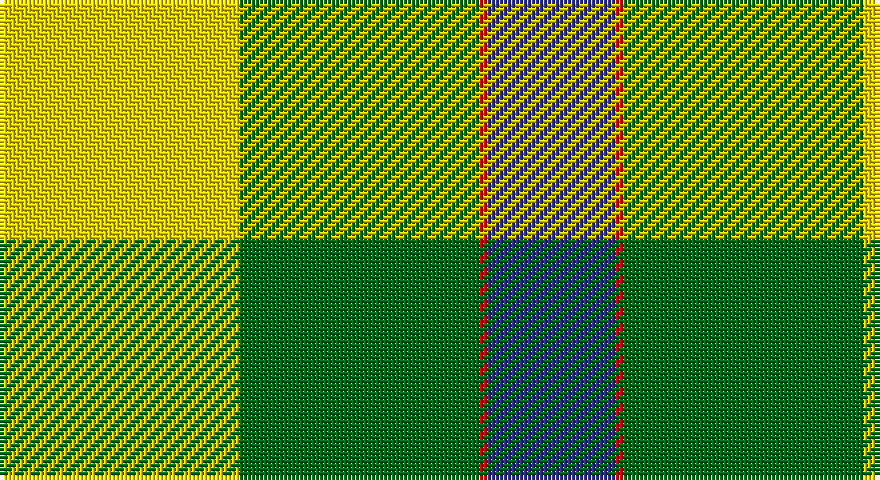

This page is one **sett** — a single exact thread-count. It belongs to the [tartan](/setts/ly30g30r1db16/)
(the same proportion at any scale), whose colour order is pattern [BRGY](/stripes/brgy/).

Sourced from tartans-authority.  It is a [4 stripe tartan](/stripes/stripes4/).

Original link http://www.tartansauthority.com/tartan-ferret/display/10535/

## Also known as

This cloth is also recorded under:

- Barber Family

## Register references

External register numbers recorded for this tartan.

- Scottish Register of Tartans: [10535](https://www.tartanregister.gov.uk/tartanDetails?ref=10535)
- Scottish Tartans Authority (ITI): 10535

## Thread count
Y/60 G60 R2 DB/32

One full sett is **216 threads**.

## Palette

Palette: <strong>Tartan Register</strong>
<table><thead><tr><th>Colour</th><th>Threads</th><th>Shade</th><th>Base</th><th>OKLCh</th></tr></thead><tbody><tr><td>Y/</td><td style="text-align:right;font-variant-numeric:tabular-nums">60</td><td><code style="background-color:#FCCC00;">#FCCC00</code> <small style="color:#888">#FCCC00</small></td><td>Y <code style="background-color:#F2BF00;">#F2BF00</code></td><td><small style="color:#888">oklch(86.2% 0.176 91.5)</small></td></tr><tr><td>G</td><td style="text-align:right;font-variant-numeric:tabular-nums">60</td><td><code style="background-color:#006818;">#006818</code> <small style="color:#888">#006818</small></td><td>G <code style="background-color:#006100;">#006100</code></td><td><small style="color:#888">oklch(45.0% 0.142 145.0)</small></td></tr><tr><td>R</td><td style="text-align:right;font-variant-numeric:tabular-nums">2</td><td><code style="background-color:#C80000;">#C80000</code> <small style="color:#888">#C80000</small></td><td>R <code style="background-color:#CC0000;">#CC0000</code></td><td><small style="color:#888">oklch(52.3% 0.215 29.2)</small></td></tr><tr><td>DB/</td><td style="text-align:right;font-variant-numeric:tabular-nums">32</td><td><code style="background-color:#2C2C80;">#2C2C80</code> <small style="color:#888">#2C2C80</small></td><td>B <code style="background-color:#2A418A;">#2A418A</code></td><td><small style="color:#888">oklch(35.0% 0.138 276.6)</small></td></tr></tbody></table>

# Sample pattern

## Nearest tartans

The nearest existing variants by ΔTartan distance, with this tartan at the top so the swatches line up against it.

ΔTartan

Tartan

Sett

—

<a href="/ttd/edit/#slug=ly30g30r1db16~x2">Barber Family (Personal)</a> <a class="nn-out" href="/variants/s4/ly30g30r1db16~x2/" title="open its dictionary page">↗</a>

1.26

<a href="/ttd/edit/#slug=g22w14r7ly1~x2&amp;base=ly30g30r1db16~x2">Loch Lomond</a> <a class="nn-out" href="/variants/s4/g22w14r7ly1~x2/" title="open its dictionary page">↗</a>

1.32

<a href="/ttd/edit/#slug=k5g25k10lg15ly1lg5~x2&amp;base=ly30g30r1db16~x2">Delaware Fine Spirits Guild (Corp)</a> <a class="nn-out" href="/variants/s6/k5g25k10lg15ly1lg5~x2/" title="open its dictionary page">↗</a>

1.57

<a href="/ttd/edit/#slug=k10g25k10lg15w1lg5~x2&amp;base=ly30g30r1db16~x2">Delaware Fine Spirits Guild</a> <a class="nn-out" href="/variants/s6/k10g25k10lg15w1lg5~x2/" title="open its dictionary page">↗</a>

1.81

<a href="/ttd/edit/#slug=g22w14r7ly2~x2&amp;base=ly30g30r1db16~x2">Loch Lomond #3</a> <a class="nn-out" href="/variants/s4/g22w14r7ly2~x2/" title="open its dictionary page">↗</a>

1.82

<a href="/ttd/edit/#slug=g18w55o19g20w2g20k5&amp;base=ly30g30r1db16~x2">Michigan State University</a> <a class="nn-out" href="/variants/s7/g18w55o19g20w2g20k5/" title="open its dictionary page">↗</a>

1.90

<a href="/ttd/edit/#slug=dg27r9n2ly14~x4&amp;base=ly30g30r1db16~x2">Englehart, City of</a> <a class="nn-out" href="/variants/s4/dg27r9n2ly14~x4/" title="open its dictionary page">↗</a>

1.99

<a href="/ttd/edit/#slug=g9o7w7r1~x4&amp;base=ly30g30r1db16~x2">MacKinnon, dress</a> <a class="nn-out" href="/variants/s4/g9o7w7r1~x4/" title="open its dictionary page">↗</a>

2.06

<a href="/ttd/edit/#slug=db8ly1dg5ly12r1dg2~x6&amp;base=ly30g30r1db16~x2">McCabe (2016)</a> <a class="nn-out" href="/variants/s6/db8ly1dg5ly12r1dg2~x6/" title="open its dictionary page">↗</a>

2.10

<a href="/ttd/edit/#slug=ly83k35w3g35k3ly10&amp;base=ly30g30r1db16~x2">Brandon Manitoba Trade Tartan</a> <a class="nn-out" href="/variants/s6/ly83k35w3g35k3ly10/" title="open its dictionary page">↗</a>

2.11

<a href="/ttd/edit/#slug=ly25r10g10db11w2~x2&amp;base=ly30g30r1db16~x2">Samye</a> <a class="nn-out" href="/variants/s5/ly25r10g10db11w2~x2/" title="open its dictionary page">↗</a>

## Neighbour map

Every grey dot is one of 14360 variants placed by the first two principal components of the ΔTartan feature space (44% of its variance). Red is this tartan; blue dots are its nearest — click one to open its page.

<svg viewBox="0 0 640 380" role="img" style="max-width:100%;height:auto;border:1px solid #e0e0e0;border-radius:4px;display:block" xmlns="http://www.w3.org/2000/svg"><image href="/nn/cloud.v1.png" width="640" height="380"/><a href="/variants/s4/g22w14r7ly1~x2/"><circle cx="267.0" cy="194.6" r="4" fill="#3465a4"><title>Loch Lomond</title></circle></a><a href="/variants/s6/k5g25k10lg15ly1lg5~x2/"><circle cx="224.5" cy="173.3" r="4" fill="#3465a4"><title>Delaware Fine Spirits Guild (Corp)</title></circle></a><a href="/variants/s6/k10g25k10lg15w1lg5~x2/"><circle cx="185.8" cy="179.4" r="4" fill="#3465a4"><title>Delaware Fine Spirits Guild</title></circle></a><a href="/variants/s4/g22w14r7ly2~x2/"><circle cx="213.9" cy="214.1" r="4" fill="#3465a4"><title>Loch Lomond #3</title></circle></a><a href="/variants/s7/g18w55o19g20w2g20k5/"><circle cx="218.0" cy="145.6" r="4" fill="#3465a4"><title>Michigan State University</title></circle></a><a href="/variants/s4/dg27r9n2ly14~x4/"><circle cx="264.7" cy="219.0" r="4" fill="#3465a4"><title>Englehart, City of</title></circle></a><a href="/variants/s4/g9o7w7r1~x4/"><circle cx="148.9" cy="247.9" r="4" fill="#3465a4"><title>MacKinnon, dress</title></circle></a><a href="/variants/s6/db8ly1dg5ly12r1dg2~x6/"><circle cx="187.4" cy="175.9" r="4" fill="#3465a4"><title>McCabe (2016)</title></circle></a><a href="/variants/s6/ly83k35w3g35k3ly10/"><circle cx="241.5" cy="121.5" r="4" fill="#3465a4"><title>Brandon Manitoba Trade Tartan</title></circle></a><a href="/variants/s5/ly25r10g10db11w2~x2/"><circle cx="158.9" cy="184.5" r="4" fill="#3465a4"><title>Samye</title></circle></a><circle cx="213.6" cy="190.0" r="5" fill="#c00000"/></svg>

ID: /variants/s4/ly30g30r1db16~x2/
