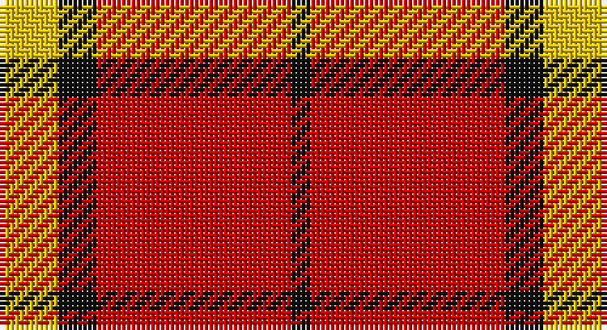

This page is one **sett** — a single exact thread-count. It belongs to the [tartan](/setts/ly3k2r10k1/)
(the same proportion at any scale), whose colour order is pattern [KRKY](/stripes/krky/).

Sourced from tartans-authority.  It is a [4 stripe tartan](/stripes/stripes4/).

Original link http://www.tartansauthority.com/tartan-ferret/display/7286/

## Register references

External register numbers recorded for this tartan.

- Scottish Tartans Authority (ITI): 7286

## Thread count
Y/12 K8 R40 K/4

One full sett is **112 threads**.

## Palette

Palette: <strong>Tartan Register</strong>
<table><thead><tr><th>Colour</th><th>Threads</th><th>Shade</th><th>Base</th><th>OKLCh</th></tr></thead><tbody><tr><td>Y/</td><td style="text-align:right;font-variant-numeric:tabular-nums">12</td><td><code style="background-color:#E8C000;">#E8C000</code> <small style="color:#888">#E8C000</small></td><td>Y <code style="background-color:#F2BF00;">#F2BF00</code></td><td><small style="color:#888">oklch(81.9% 0.168 93.7)</small></td></tr><tr><td>K</td><td style="text-align:right;font-variant-numeric:tabular-nums">8</td><td><code style="background-color:#101010;">#101010</code> <small style="color:#888">#101010</small></td><td>K <code style="background-color:#000000;">#000000</code></td><td><small style="color:#888">oklch(17.3% 0.000 89.9)</small></td></tr><tr><td>R</td><td style="text-align:right;font-variant-numeric:tabular-nums">40</td><td><code style="background-color:#C80000;">#C80000</code> <small style="color:#888">#C80000</small></td><td>R <code style="background-color:#CC0000;">#CC0000</code></td><td><small style="color:#888">oklch(52.3% 0.215 29.2)</small></td></tr><tr><td>K/</td><td style="text-align:right;font-variant-numeric:tabular-nums">4</td><td><code style="background-color:#101010;">#101010</code> <small style="color:#888">#101010</small></td><td>K <code style="background-color:#000000;">#000000</code></td><td><small style="color:#888">oklch(17.3% 0.000 89.9)</small></td></tr></tbody></table>

# Sample pattern

## Nearest tartans

The nearest existing variants by ΔTartan distance, with this tartan at the top so the swatches line up against it.

ΔTartan

Tartan

Sett

—

<a href="/ttd/edit/#slug=ly3k2r10k1~x4">Masai Shuka 26 (Artefact)</a> <a class="nn-out" href="/variants/s4/ly3k2r10k1~x4/" title="open its dictionary page">↗</a>

1.09

<a href="/ttd/edit/#slug=r38w9r3dr9w3~x2&amp;base=ly3k2r10k1~x4">Loch Morar</a> <a class="nn-out" href="/variants/s5/r38w9r3dr9w3~x2/" title="open its dictionary page">↗</a>

1.13

<a href="/ttd/edit/#slug=r38w9r3do9w3~x2&amp;base=ly3k2r10k1~x4">Loch Morar Trade Tartan</a> <a class="nn-out" href="/variants/s5/r38w9r3do9w3~x2/" title="open its dictionary page">↗</a>

1.17

<a href="/ttd/edit/#slug=r125k26lb20lo16&amp;base=ly3k2r10k1~x4">McPeek (Fashion)</a> <a class="nn-out" href="/variants/s4/r125k26lb20lo16/" title="open its dictionary page">↗</a>

1.22

<a href="/ttd/edit/#slug=r4k8r12k1ly1~x2&amp;base=ly3k2r10k1~x4">MacKeane</a> <a class="nn-out" href="/variants/s5/r4k8r12k1ly1~x2/" title="open its dictionary page">↗</a>

1.27

<a href="/ttd/edit/#slug=r3dg20r25w3~x4&amp;base=ly3k2r10k1~x4">MacKinnon #6</a> <a class="nn-out" href="/variants/s4/r3dg20r25w3~x4/" title="open its dictionary page">↗</a>

1.30

<a href="/ttd/edit/#slug=r41k19r7k9w3~x2&amp;base=ly3k2r10k1~x4">MacGregor, Black (Personal)</a> <a class="nn-out" href="/variants/s5/r41k19r7k9w3~x2/" title="open its dictionary page">↗</a>

1.34

<a href="/ttd/edit/#slug=g1r13k8ly1~x6&amp;base=ly3k2r10k1~x4">Billy Apple® Red</a> <a class="nn-out" href="/variants/s4/g1r13k8ly1~x6/" title="open its dictionary page">↗</a>

1.35

<a href="/ttd/edit/#slug=r30k10ly3~x4&amp;base=ly3k2r10k1~x4">Masai Shuka 20 (Artefact)</a> <a class="nn-out" href="/variants/s3/r30k10ly3~x4/" title="open its dictionary page">↗</a>

1.38

<a href="/ttd/edit/#slug=r13lb3r1dg3lb1~x6&amp;base=ly3k2r10k1~x4">Glen Shiel (Fashion)</a> <a class="nn-out" href="/variants/s5/r13lb3r1dg3lb1~x6/" title="open its dictionary page">↗</a>

1.39

<a href="/ttd/edit/#slug=r28k4w2k13~x2&amp;base=ly3k2r10k1~x4">Dunbar (District)</a> <a class="nn-out" href="/variants/s4/r28k4w2k13~x2/" title="open its dictionary page">↗</a>

## Neighbour map

Every grey dot is one of 14360 variants placed by the first two principal components of the ΔTartan feature space (44% of its variance). Red is this tartan; blue dots are its nearest — click one to open its page.

<svg viewBox="0 0 640 380" role="img" style="max-width:100%;height:auto;border:1px solid #e0e0e0;border-radius:4px;display:block" xmlns="http://www.w3.org/2000/svg"><image href="/nn/cloud.v1.png" width="640" height="380"/><a href="/variants/s5/r38w9r3dr9w3~x2/"><circle cx="411.1" cy="183.0" r="4" fill="#3465a4"><title>Loch Morar</title></circle></a><a href="/variants/s5/r38w9r3do9w3~x2/"><circle cx="412.9" cy="182.7" r="4" fill="#3465a4"><title>Loch Morar Trade Tartan</title></circle></a><a href="/variants/s4/r125k26lb20lo16/"><circle cx="375.1" cy="201.5" r="4" fill="#3465a4"><title>McPeek (Fashion)</title></circle></a><a href="/variants/s5/r4k8r12k1ly1~x2/"><circle cx="383.5" cy="213.8" r="4" fill="#3465a4"><title>MacKeane</title></circle></a><a href="/variants/s4/r3dg20r25w3~x4/"><circle cx="333.9" cy="240.8" r="4" fill="#3465a4"><title>MacKinnon #6</title></circle></a><a href="/variants/s5/r41k19r7k9w3~x2/"><circle cx="381.4" cy="202.6" r="4" fill="#3465a4"><title>MacGregor, Black (Personal)</title></circle></a><a href="/variants/s4/g1r13k8ly1~x6/"><circle cx="328.8" cy="192.0" r="4" fill="#3465a4"><title>Billy Apple® Red</title></circle></a><a href="/variants/s3/r30k10ly3~x4/"><circle cx="432.9" cy="241.2" r="4" fill="#3465a4"><title>Masai Shuka 20 (Artefact)</title></circle></a><a href="/variants/s5/r13lb3r1dg3lb1~x6/"><circle cx="417.0" cy="193.1" r="4" fill="#3465a4"><title>Glen Shiel (Fashion)</title></circle></a><a href="/variants/s4/r28k4w2k13~x2/"><circle cx="374.0" cy="210.7" r="4" fill="#3465a4"><title>Dunbar (District)</title></circle></a><circle cx="365.8" cy="212.9" r="5" fill="#c00000"/></svg>

ID: /variants/s4/ly3k2r10k1~x4/
