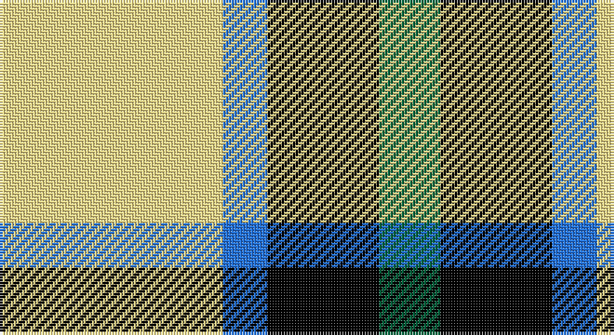

This page is one **sett** — a single exact thread-count. It belongs to the [tartan](/setts/ly40b8k20g11/)
(the same proportion at any scale), whose colour order is pattern [GKBY](/stripes/gkby/).

Sourced from register-of-tartans.  It is a [4 stripe tartan](/stripes/stripes4/).

Original link https://www.tartanregister.gov.uk/tartanDetails.aspx?ref=11528

## Register references

External register numbers recorded for this tartan.

- Scottish Register of Tartans: [11528](https://www.tartanregister.gov.uk/tartanDetails.aspx?ref=11528)

## Thread count
LY/80 B16 K40 G/22

One full sett is **214 threads**.

## Palette

Palette: <strong>Tartan Register</strong>
<table><thead><tr><th>Colour</th><th>Threads</th><th>Shade</th><th>Base</th><th>OKLCh</th></tr></thead><tbody><tr><td>LY/</td><td style="text-align:right;font-variant-numeric:tabular-nums">80</td><td><code style="background-color:#F8E38C;">#F8E38C</code> <small style="color:#888">#F8E38C</small></td><td>Y <code style="background-color:#F2BF00;">#F2BF00</code></td><td><small style="color:#888">oklch(91.4% 0.110 96.2)</small></td></tr><tr><td>B</td><td style="text-align:right;font-variant-numeric:tabular-nums">16</td><td><code style="background-color:#2474E8;">#2474E8</code> <small style="color:#888">#2474E8</small></td><td>B <code style="background-color:#2A418A;">#2A418A</code></td><td><small style="color:#888">oklch(57.8% 0.192 258.7)</small></td></tr><tr><td>K</td><td style="text-align:right;font-variant-numeric:tabular-nums">40</td><td><code style="background-color:#000000;">#000000</code> <small style="color:#888">#000000</small></td><td>K <code style="background-color:#000000;">#000000</code></td><td><small style="color:#888">oklch(0.0% 0.000 0.0)</small></td></tr><tr><td>G/</td><td style="text-align:right;font-variant-numeric:tabular-nums">22</td><td><code style="background-color:#00643C;">#00643C</code> <small style="color:#888">#00643C</small></td><td>G <code style="background-color:#006100;">#006100</code></td><td><small style="color:#888">oklch(44.3% 0.104 157.7)</small></td></tr></tbody></table>

# Sample pattern

## Nearest tartans

The nearest existing variants by ΔTartan distance, with this tartan at the top so the swatches line up against it.

ΔTartan

Tartan

Sett

—

<a href="/ttd/edit/#slug=ly40b8k20g11~x2">Brun, Pierre Emmanuel (Personal)</a> <a class="nn-out" href="/variants/s4/ly40b8k20g11~x2/" title="open its dictionary page">↗</a>

0.82

<a href="/ttd/edit/#slug=o22ly10w3k8~x2&amp;base=ly40b8k20g11~x2">Louisburg Canadian District Tartan</a> <a class="nn-out" href="/variants/s4/o22ly10w3k8~x2/" title="open its dictionary page">↗</a>

1.34

<a href="/variants/s4/k5w24n24ki5~x2/">City of London</a>

1.40

<a href="/ttd/edit/#slug=r4k25ly25w4~x2&amp;base=ly40b8k20g11~x2">Bonhill Primary School</a> <a class="nn-out" href="/variants/s4/r4k25ly25w4~x2/" title="open its dictionary page">↗</a>

1.47

<a href="/ttd/edit/#slug=db3dg6ly1r3~x10&amp;base=ly40b8k20g11~x2">Delroeux, John Michael (Personal)</a> <a class="nn-out" href="/variants/s4/db3dg6ly1r3~x10/" title="open its dictionary page">↗</a>

1.52

<a href="/ttd/edit/#slug=g22w14r7ly2~x2&amp;base=ly40b8k20g11~x2">Loch Lomond #3</a> <a class="nn-out" href="/variants/s4/g22w14r7ly2~x2/" title="open its dictionary page">↗</a>

1.53

<a href="/ttd/edit/#slug=p6lg15g15k2~x2&amp;base=ly40b8k20g11~x2">Thistle and Kudzu Scottish Socie Corporate Tartan</a> <a class="nn-out" href="/variants/s4/p6lg15g15k2~x2/" title="open its dictionary page">↗</a>

1.54

<a href="/ttd/edit/#slug=k3w3k3ly10r1~x6&amp;base=ly40b8k20g11~x2">Burberry (Genuine)</a> <a class="nn-out" href="/variants/s5/k3w3k3ly10r1~x6/" title="open its dictionary page">↗</a>

1.55

<a href="/ttd/edit/#slug=o22ly10w3db8~x2&amp;base=ly40b8k20g11~x2">Louisburg</a> <a class="nn-out" href="/variants/s4/o22ly10w3db8~x2/" title="open its dictionary page">↗</a>

1.55

<a href="/ttd/edit/#slug=k5n24w24r5~x2&amp;base=ly40b8k20g11~x2">City of London (Corporate)</a> <a class="nn-out" href="/variants/s4/k5n24w24r5~x2/" title="open its dictionary page">↗</a>

1.56

<a href="/ttd/edit/#slug=do1lo1do2w4n1w1~x8&amp;base=ly40b8k20g11~x2">Ardalansish Tweed (Fashion)</a> <a class="nn-out" href="/variants/s6/do1lo1do2w4n1w1~x8/" title="open its dictionary page">↗</a>

## Neighbour map

Every grey dot is one of 14360 variants placed by the first two principal components of the ΔTartan feature space (44% of its variance). Red is this tartan; blue dots are its nearest — click one to open its page.

<svg viewBox="0 0 640 380" role="img" style="max-width:100%;height:auto;border:1px solid #e0e0e0;border-radius:4px;display:block" xmlns="http://www.w3.org/2000/svg"><image href="/nn/cloud.v1.png" width="640" height="380"/><a href="/variants/s4/o22ly10w3k8~x2/"><circle cx="200.1" cy="228.9" r="4" fill="#3465a4"><title>Louisburg Canadian District Tartan</title></circle></a><a href="/variants/s4/k5w24n24ki5~x2/"><circle cx="146.1" cy="237.9" r="4" fill="#3465a4"><title>City of London</title></circle></a><a href="/variants/s4/r4k25ly25w4~x2/"><circle cx="184.8" cy="225.6" r="4" fill="#3465a4"><title>Bonhill Primary School</title></circle></a><a href="/variants/s4/db3dg6ly1r3~x10/"><circle cx="170.4" cy="258.1" r="4" fill="#3465a4"><title>Delroeux, John Michael (Personal)</title></circle></a><a href="/variants/s4/g22w14r7ly2~x2/"><circle cx="213.9" cy="214.1" r="4" fill="#3465a4"><title>Loch Lomond #3</title></circle></a><a href="/variants/s4/p6lg15g15k2~x2/"><circle cx="157.5" cy="246.5" r="4" fill="#3465a4"><title>Thistle and Kudzu Scottish Socie Corporate Tartan</title></circle></a><a href="/variants/s5/k3w3k3ly10r1~x6/"><circle cx="222.6" cy="195.8" r="4" fill="#3465a4"><title>Burberry (Genuine)</title></circle></a><a href="/variants/s4/o22ly10w3db8~x2/"><circle cx="218.7" cy="236.7" r="4" fill="#3465a4"><title>Louisburg</title></circle></a><a href="/variants/s4/k5n24w24r5~x2/"><circle cx="154.9" cy="237.3" r="4" fill="#3465a4"><title>City of London (Corporate)</title></circle></a><a href="/variants/s6/do1lo1do2w4n1w1~x8/"><circle cx="175.9" cy="227.1" r="4" fill="#3465a4"><title>Ardalansish Tweed (Fashion)</title></circle></a><circle cx="167.1" cy="240.9" r="5" fill="#c00000"/></svg>

ID: /variants/s4/ly40b8k20g11~x2/
