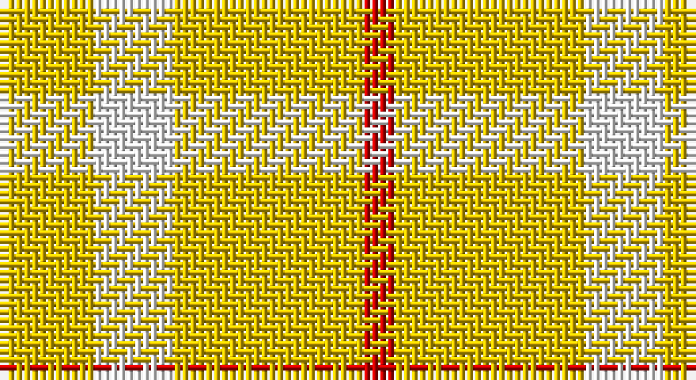

This page is one **sett** — a single exact thread-count. It belongs to the [tartan](/setts/ly6w5ly12r2/)
(the same proportion at any scale), whose colour order is pattern [RYWY](/stripes/rywy/).

Part of the [One Account](/tartans/one-account/) tartan — the named design grouping this sett with its other cloths.

Sourced from tartans-authority.  It is a [4 stripe tartan](/stripes/stripes4/).

Original link http://www.tartansauthority.com/tartan-ferret/display/3912/

## Register references

External register numbers recorded for this tartan.

- Scottish Tartans Authority (ITI): 3912

## Thread count
Y/12 W10 Y24 R/4

One full sett is **84 threads**.

## Palette

Palette: <strong>Tartan Register</strong>
<table><thead><tr><th>Colour</th><th>Threads</th><th>Shade</th><th>Base</th><th>OKLCh</th></tr></thead><tbody><tr><td>Y/</td><td style="text-align:right;font-variant-numeric:tabular-nums">12</td><td><code style="background-color:#E8C000;">#E8C000</code> <small style="color:#888">#E8C000</small></td><td>Y <code style="background-color:#F2BF00;">#F2BF00</code></td><td><small style="color:#888">oklch(81.9% 0.168 93.7)</small></td></tr><tr><td>W</td><td style="text-align:right;font-variant-numeric:tabular-nums">10</td><td><code style="background-color:#FCFCFC;">#FCFCFC</code> <small style="color:#888">#FCFCFC</small></td><td>W <code style="background-color:#F7F7F7;">#F7F7F7</code></td><td><small style="color:#888">oklch(99.1% 0.000 89.9)</small></td></tr><tr><td>Y</td><td style="text-align:right;font-variant-numeric:tabular-nums">24</td><td><code style="background-color:#E8C000;">#E8C000</code> <small style="color:#888">#E8C000</small></td><td>Y <code style="background-color:#F2BF00;">#F2BF00</code></td><td><small style="color:#888">oklch(81.9% 0.168 93.7)</small></td></tr><tr><td>R/</td><td style="text-align:right;font-variant-numeric:tabular-nums">4</td><td><code style="background-color:#C80000;">#C80000</code> <small style="color:#888">#C80000</small></td><td>R <code style="background-color:#CC0000;">#CC0000</code></td><td><small style="color:#888">oklch(52.3% 0.215 29.2)</small></td></tr></tbody></table>

# Sample pattern

## Compared to the master

This cloth is one sett of its design; the master sett (the exemplar the design is anchored on) is below for comparison.

<figure style="margin:0"><figcaption style="color:#888;font-size:smaller">this sett</figcaption></figure>
<figure style="margin:0"><figcaption style="color:#888;font-size:smaller"><a href="/setts/ly12w5ly6w5ly12r2/">master sett →</a></figcaption></figure>

## Nearest tartans

The nearest existing variants by ΔTartan distance, with this tartan at the top so the swatches line up against it.

ΔTartan

Tartan

Sett

—

<a href="/ttd/edit/#slug=ly6w5ly12r2~x2">One Account (Corporate)</a> <a class="nn-out" href="/variants/s4/ly6w5ly12r2~x2/" title="open its dictionary page">↗</a>

0.97

<a href="/ttd/edit/#slug=ly12w5ly6w5ly12r2~x2&amp;base=ly6w5ly12r2~x2">One Account</a> <a class="nn-out" href="/variants/s6/ly12w5ly6w5ly12r2~x2/" title="open its dictionary page">↗</a>

1.34

<a href="/ttd/edit/#slug=lo7w6lo11r2~x2&amp;base=ly6w5ly12r2~x2">Virgin One (Corporate)</a> <a class="nn-out" href="/variants/s4/lo7w6lo11r2~x2/" title="open its dictionary page">↗</a>

1.65

<a href="/ttd/edit/#slug=lo11r2lo11w6lo7w6~x2&amp;base=ly6w5ly12r2~x2">Virgin One</a> <a class="nn-out" href="/variants/s6/lo11r2lo11w6lo7w6~x2/" title="open its dictionary page">↗</a>

2.11

<a href="/ttd/edit/#slug=ly8r2ly8g1r6ly3g4ly2~x4&amp;base=ly6w5ly12r2~x2">Glufree</a> <a class="nn-out" href="/variants/s8/ly8r2ly8g1r6ly3g4ly2~x4/" title="open its dictionary page">↗</a>

2.45

<a href="/ttd/edit/#slug=lo40g13lo6db13lo22~x2&amp;base=ly6w5ly12r2~x2">Burt's Highlanders (Fashion)</a> <a class="nn-out" href="/variants/s5/lo40g13lo6db13lo22~x2/" title="open its dictionary page">↗</a>

2.58

<a href="/ttd/edit/#slug=o3w17o11w2o11w2~x4&amp;base=ly6w5ly12r2~x2">Fallow Deer, The</a> <a class="nn-out" href="/variants/s6/o3w17o11w2o11w2~x4/" title="open its dictionary page">↗</a>

2.96

<a href="/ttd/edit/#slug=g9lo20g40w5~x2&amp;base=ly6w5ly12r2~x2">O'Neill</a> <a class="nn-out" href="/variants/s4/g9lo20g40w5~x2/" title="open its dictionary page">↗</a>

2.99

<a href="/ttd/edit/#slug=ly6r1ly4r4db2~x5&amp;base=ly6w5ly12r2~x2">Sands-Pingot Family, Alabama (Personal)</a> <a class="nn-out" href="/variants/s5/ly6r1ly4r4db2~x5/" title="open its dictionary page">↗</a>

3.01

<a href="/ttd/edit/#slug=g10w7ly41k7~x2&amp;base=ly6w5ly12r2~x2">Hogan (2014)</a> <a class="nn-out" href="/variants/s4/g10w7ly41k7~x2/" title="open its dictionary page">↗</a>

3.01

<a href="/ttd/edit/#slug=ly49r16k11~x2&amp;base=ly6w5ly12r2~x2">Quenouille (2011)</a> <a class="nn-out" href="/variants/s3/ly49r16k11~x2/" title="open its dictionary page">↗</a>

## Neighbour map

Every grey dot is one of 14360 variants placed by the first two principal components of the ΔTartan feature space (44% of its variance). Red is this tartan; blue dots are its nearest — click one to open its page.

<svg viewBox="0 0 640 380" role="img" style="max-width:100%;height:auto;border:1px solid #e0e0e0;border-radius:4px;display:block" xmlns="http://www.w3.org/2000/svg"><image href="/nn/cloud.v1.png" width="640" height="380"/><a href="/variants/s6/ly12w5ly6w5ly12r2~x2/"><circle cx="413.4" cy="276.9" r="4" fill="#3465a4"><title>One Account</title></circle></a><a href="/variants/s4/lo7w6lo11r2~x2/"><circle cx="399.4" cy="305.9" r="4" fill="#3465a4"><title>Virgin One (Corporate)</title></circle></a><a href="/variants/s6/lo11r2lo11w6lo7w6~x2/"><circle cx="375.0" cy="295.9" r="4" fill="#3465a4"><title>Virgin One</title></circle></a><a href="/variants/s8/ly8r2ly8g1r6ly3g4ly2~x4/"><circle cx="346.7" cy="240.3" r="4" fill="#3465a4"><title>Glufree</title></circle></a><a href="/variants/s5/lo40g13lo6db13lo22~x2/"><circle cx="373.0" cy="245.5" r="4" fill="#3465a4"><title>Burt's Highlanders (Fashion)</title></circle></a><a href="/variants/s6/o3w17o11w2o11w2~x4/"><circle cx="342.7" cy="240.5" r="4" fill="#3465a4"><title>Fallow Deer, The</title></circle></a><a href="/variants/s4/g9lo20g40w5~x2/"><circle cx="404.7" cy="281.8" r="4" fill="#3465a4"><title>O'Neill</title></circle></a><a href="/variants/s5/ly6r1ly4r4db2~x5/"><circle cx="255.5" cy="243.3" r="4" fill="#3465a4"><title>Sands-Pingot Family, Alabama (Personal)</title></circle></a><a href="/variants/s4/g10w7ly41k7~x2/"><circle cx="291.3" cy="213.7" r="4" fill="#3465a4"><title>Hogan (2014)</title></circle></a><a href="/variants/s3/ly49r16k11~x2/"><circle cx="299.7" cy="262.4" r="4" fill="#3465a4"><title>Quenouille (2011)</title></circle></a><circle cx="416.9" cy="282.3" r="5" fill="#c00000"/></svg>

ID: /variants/s4/ly6w5ly12r2~x2/
