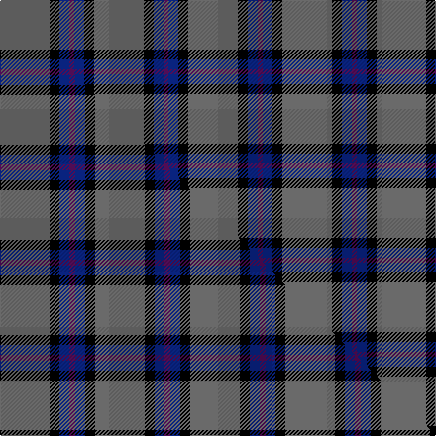

This is one **variant** — a specific cloth: this exact thread count and colourway, with its own
provenance below. It is one weaving of the [sett](/tartans/l/lo/lord-willy-s/) (the scale-free proportion — the
same cloth at any scale or shade), whose colour order is pattern [BBKB](/stripes/bbkb/).

Part of the [Lord Willy's](/tartans/l/lo/lord-willy-s/) tartan — the named design grouping this sett with its other cloths.

Sourced from tartans-authority.  It is a [4 stripe tartan](/stripes/stripes4/).

Original link <code>http://www.tartansauthority.com/tartan-ferret/display/10342/</code> — retired · [Internet Archive copy](https://web.archive.org/web/*/http://www.tartansauthority.com/tartan-ferret/display/10342/*)

Dataset <small>— provenance for this record, inherited from the source manifest</small>

<dl class="dataset-prov">
<dt>source</dt><dd><a href="/sources/tartans-authority/">Scottish Tartans Authority</a></dd>
<dt>data captured from</dt><dd><a href="https://github.com/thetartan/tartan-database/blob/master/data/tartans-authority/data.csv">https://github.com/thetartan/tartan-database/blob/master/data/tartans-authority/data.csv</a></dd>
<dt>data date</dt><dd>1st Sept. 2010 <small>(this record)</small></dd>
<dt>licence</dt><dd><a href="https://creativecommons.org/licenses/by-nc-nd/4.0/">CC BY-NC-ND 4.0</a></dd>
</dl>

Capture chain <small>— the hands this data passed through, oldest first; each capture carries its own licence</small>

<ol class="capture-chain">
<li><a href="https://www.tartansauthority.com/">Scottish Tartans Authority</a> <small>the heritage body’s archive — its tartan-ferret record browser is retired; dead record links are shown unlinked, with an Internet Archive copy (ITI numbers are not SRT references)</small></li>
<li><a href="https://github.com/thetartan/tartan-database">thetartan/tartan-database</a> <small>2016-2017</small> · <a href="https://creativecommons.org/licenses/by-nc-nd/4.0/">CC BY-NC-ND 4.0</a> <small>Levko Kravets's frozen compilation — the capture we vendored, and where its CC licence text came from</small></li>
<li>this dictionary <small>captured 2026-06-10 · commit 5bf86c7566</small> <small>each re-capture is a git commit to data/sources</small></li>
</ol>

## Register references

External register numbers recorded for this tartan.

- Scottish Register of Tartans: [10342](https://www.tartanregister.gov.uk/tartanDetails?ref=10342)
- Scottish Tartans Authority (ITI): 10342

## Thread count
N/50 K10 DB10 DP/5

One full sett is **95 threads**.

## Palette
<table><thead><tr><th>Colour</th><th>Shade</th><th>OKLCh</th></tr></thead><tbody><tr><td>DB</td><td><code style="background-color:#082077;">#082077</code> <small style="color:#888">#082077</small></td><td><small style="color:#888">oklch(30.0% 0.149 265.1)</small></td></tr><tr><td>K</td><td><code style="background-color:#000000;">#000000</code> <small style="color:#888">#000000</small></td><td><small style="color:#888">oklch(0.0% 0.000 0.0)</small></td></tr><tr><td>N</td><td><code style="background-color:#636363;">#636363</code> <small style="color:#888">#636363</small></td><td><small style="color:#888">oklch(50.0% 0.000 89.9)</small></td></tr><tr><td>DP</td><td><code style="background-color:#4B0B4F;">#4B0B4F</code> <small style="color:#888">#4B0B4F</small></td><td><small style="color:#888">oklch(30.1% 0.125 325.4)</small></td></tr></tbody></table>

# Sample pattern

## Compared to the master

This cloth is one sett of its design; the master sett (the exemplar the design is anchored on) is below for comparison.

Its **ΔTartan distance** from the master is **0.21** — the same measure the nearest-tartans table ranks by (0 is identical; a re-scale of the same cloth is near 0, a recolour or a different proportion further).

<figure class="master-compare" style="margin:0">

this sett
master sett ★

<figcaption style="color:#888;font-size:smaller">One weave of this sett against the <a href="/setts/n25k5db5dp3/">master sett ★</a>, split on the diagonal: a shared proportion runs seamlessly across it with only the shades shifting; a different proportion breaks on it.</figcaption>
</figure>

## Nearest tartan variants

The nearest existing variants by ΔTartan distance, with this cloth at the top so the swatches line up against it.

ΔTartan

Threads

Variant

Sett

—

95

<a href="/variants/s4/n10k2db2dp1~x5/">Lord Willy's (Corporate)</a>

<a href="/ttd/edit/#slug=n25k5db5dp3~x2&amp;base=n10k2db2dp1~x5" title="compare in the TTD">0.21</a>

96

<a href="/variants/s4/n25k5db5dp3~x2/">Lord Willy's (New York)</a>

<a href="/ttd/edit/#slug=r4db32k15w2~x2&amp;base=n10k2db2dp1~x5" title="compare in the TTD">1.10</a>

200

<a href="/variants/s4/r4db32k15w2~x2/">Scottish Nuclear</a>

<a href="/ttd/edit/#slug=r5db26k12w2~x4&amp;base=n10k2db2dp1~x5" title="compare in the TTD">1.10</a>

332

<a href="/variants/s4/r5db26k12w2~x4/">Mirror (Corporate)</a>

<a href="/ttd/edit/#slug=n62w11k4db17~x2&amp;base=n10k2db2dp1~x5" title="compare in the TTD">1.11</a>

218

<a href="/variants/s4/n62w11k4db17~x2/">Thunderlord (Celtic Group, USA)</a>

<a href="/ttd/edit/#slug=db19r2w2r2k2~x4&amp;base=n10k2db2dp1~x5" title="compare in the TTD">1.19</a>

132

<a href="/variants/s5/db19r2w2r2k2~x4/">Laing of Archiestown</a>

<a href="/ttd/edit/#slug=db14k3dr3w1~x2&amp;base=n10k2db2dp1~x5" title="compare in the TTD">1.19</a>

54

<a href="/variants/s4/db14k3dr3w1~x2/">Bacon, Blue</a>

<a href="/ttd/edit/#slug=db31k8dp4w2~x4&amp;base=n10k2db2dp1~x5" title="compare in the TTD">1.39</a>

228

<a href="/variants/s4/db31k8dp4w2~x4/">Osborne, Luke Alexander (Personal)</a>

<a href="/ttd/edit/#slug=n10k1db3g3ly1~x6&amp;base=n10k2db2dp1~x5" title="compare in the TTD">1.59</a>

150

<a href="/variants/s5/n10k1db3g3ly1~x6/">Celtic Norse Heritage Society</a>

<a href="/ttd/edit/#slug=n10k1db3g3y1~x6&amp;base=n10k2db2dp1~x5" title="compare in the TTD">1.59</a>

150

<a href="/variants/s5/n10k1db3g3y1~x6/">Celtic Norse Heritage Society</a>

<a href="/ttd/edit/#slug=n25k9n10w2~x4&amp;base=n10k2db2dp1~x5" title="compare in the TTD">1.71</a>

260

<a href="/variants/s4/n25k9n10w2~x4/">Graham Grey - 1820 (Fashion?)</a>

## Neighbour map

Every grey dot is one of 13657 variants placed by the first two principal components of the ΔTartan feature space (42% of its variance). Red is this tartan; blue dots are its nearest — click one to open its page. The map is a flat projection of a many-dimensional space — [how to read it](/posts/neighbourhood-maps/).

<svg viewBox="0 0 640 380" role="img" style="max-width:100%;height:auto;border:1px solid #e0e0e0;border-radius:4px;display:block" xmlns="http://www.w3.org/2000/svg"><image href="/nn/cloud.v1.png" width="640" height="380"/><a href="/variants/s4/n25k5db5dp3~x2/"><circle cx="375.6" cy="219.1" r="4" fill="#3465a4"><title>Lord Willy's (New York)</title></circle></a><a href="/variants/s4/r4db32k15w2~x2/"><circle cx="329.9" cy="185.9" r="4" fill="#3465a4"><title>Scottish Nuclear</title></circle></a><a href="/variants/s4/r5db26k12w2~x4/"><circle cx="293.7" cy="197.8" r="4" fill="#3465a4"><title>Mirror (Corporate)</title></circle></a><a href="/variants/s4/n62w11k4db17~x2/"><circle cx="370.2" cy="187.3" r="4" fill="#3465a4"><title>Thunderlord (Celtic Group, USA)</title></circle></a><a href="/variants/s5/db19r2w2r2k2~x4/"><circle cx="374.5" cy="164.2" r="4" fill="#3465a4"><title>Laing of Archiestown</title></circle></a><a href="/variants/s4/db14k3dr3w1~x2/"><circle cx="383.8" cy="192.5" r="4" fill="#3465a4"><title>Bacon, Blue</title></circle></a><a href="/variants/s4/db31k8dp4w2~x4/"><circle cx="409.4" cy="185.5" r="4" fill="#3465a4"><title>Osborne, Luke Alexander (Personal)</title></circle></a><a href="/variants/s5/n10k1db3g3ly1~x6/"><circle cx="293.1" cy="200.4" r="4" fill="#3465a4"><title>Celtic Norse Heritage Society</title></circle></a><a href="/variants/s5/n10k1db3g3y1~x6/"><circle cx="316.6" cy="208.6" r="4" fill="#3465a4"><title>Celtic Norse Heritage Society</title></circle></a><a href="/variants/s4/n25k9n10w2~x4/"><circle cx="431.7" cy="221.9" r="4" fill="#3465a4"><title>Graham Grey - 1820 (Fashion?)</title></circle></a><circle cx="387.7" cy="210.2" r="5" fill="#c00000"/><text x="320" y="376" text-anchor="middle" font-size="11" fill="#999">ground</text><text x="11" y="190" text-anchor="middle" font-size="11" fill="#999" transform="rotate(-90 11 190)">complexity</text></svg>

ID: /variants/s4/n10k2db2dp1~x5/
