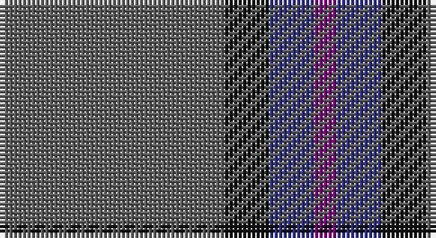

This page is one **sett** — a single exact thread-count. It belongs to the [tartan](/setts/n10k2db2dp1/)
(the same proportion at any scale), whose colour order is pattern [BBKB](/stripes/bbkb/).

Part of the [Lord Willy's](/tartans/lord-willy-s/) tartan — the named design grouping this sett with its other cloths.

Sourced from tartans-authority.  It is a [4 stripe tartan](/stripes/stripes4/).

Original link http://www.tartansauthority.com/tartan-ferret/display/10342/

## Register references

External register numbers recorded for this tartan.

- Scottish Register of Tartans: [10342](https://www.tartanregister.gov.uk/tartanDetails?ref=10342)
- Scottish Tartans Authority (ITI): 10342

## Thread count
N/50 K10 DB10 P/5

One full sett is **95 threads**.

## Palette

Palette: <strong>Tartan Register</strong> <small style="color:#888">(3 of 4 colours)</small>
<table><thead><tr><th>Colour</th><th>Threads</th><th>Shade</th><th>Base</th><th>OKLCh</th></tr></thead><tbody><tr><td>N/</td><td style="text-align:right;font-variant-numeric:tabular-nums">50</td><td><code style="background-color:#5C5C5C;">#5C5C5C</code> <small style="color:#888">#5C5C5C</small></td><td>B <code style="background-color:#2A418A;">#2A418A</code></td><td><small style="color:#888">oklch(47.5% 0.000 89.9)</small></td></tr><tr><td>K</td><td style="text-align:right;font-variant-numeric:tabular-nums">10</td><td><code style="background-color:#101010;">#101010</code> <small style="color:#888">#101010</small></td><td>K <code style="background-color:#000000;">#000000</code></td><td><small style="color:#888">oklch(17.3% 0.000 89.9)</small></td></tr><tr><td>DB</td><td style="text-align:right;font-variant-numeric:tabular-nums">10</td><td><code style="background-color:#2C2C80;">#2C2C80</code> <small style="color:#888">#2C2C80</small></td><td>B <code style="background-color:#2A418A;">#2A418A</code></td><td><small style="color:#888">oklch(35.0% 0.138 276.6)</small></td></tr><tr><td>P/</td><td style="text-align:right;font-variant-numeric:tabular-nums">5</td><td><code style="background-color:#780078;">#780078</code> <small style="color:#888">#780078</small></td><td>B <code style="background-color:#2A418A;">#2A418A</code></td><td><small style="color:#888">oklch(40.2% 0.185 328.4)</small></td></tr></tbody></table>

# Sample pattern

## Compared to the master

This cloth is one sett of its design; the master sett (the exemplar the design is anchored on) is below for comparison.

<figure style="margin:0"><figcaption style="color:#888;font-size:smaller">this sett</figcaption></figure>
<figure style="margin:0"><figcaption style="color:#888;font-size:smaller"><a href="/setts/n25k5b5p3/">master sett →</a></figcaption></figure>

## Nearest tartans

The nearest existing variants by ΔTartan distance, with this tartan at the top so the swatches line up against it.

ΔTartan

Tartan

Sett

—

<a href="/ttd/edit/#slug=n10k2db2dp1~x5">Lord Willy's (Corporate)</a> <a class="nn-out" href="/variants/s4/n10k2db2dp1~x5/" title="open its dictionary page">↗</a>

1.32

<a href="/ttd/edit/#slug=dt62r24lo5dg3~x2&amp;base=n10k2db2dp1~x5">Meaux (Personal)</a> <a class="nn-out" href="/variants/s4/dt62r24lo5dg3~x2/" title="open its dictionary page">↗</a>

1.53

<a href="/ttd/edit/#slug=db50do4db12do23ly4do4~x2&amp;base=n10k2db2dp1~x5">Sligo, County</a> <a class="nn-out" href="/variants/s6/db50do4db12do23ly4do4~x2/" title="open its dictionary page">↗</a>

1.54

<a href="/ttd/edit/#slug=n25k5b5p3~x2&amp;base=n10k2db2dp1~x5">Lord Willy's (New York)</a> <a class="nn-out" href="/variants/s4/n25k5b5p3~x2/" title="open its dictionary page">↗</a>

1.56

<a href="/ttd/edit/#slug=dg1db2dbi5db11ly1~x4&amp;base=n10k2db2dp1~x5">Open Championship, The</a> <a class="nn-out" href="/variants/s5/dg1db2dbi5db11ly1~x4/" title="open its dictionary page">↗</a>

1.58

<a href="/ttd/edit/#slug=dy11db1dy3dbi1db9r1~x4&amp;base=n10k2db2dp1~x5">Dege of Saville Row</a> <a class="nn-out" href="/variants/s6/dy11db1dy3dbi1db9r1~x4/" title="open its dictionary page">↗</a>

1.61

<a href="/ttd/edit/#slug=g8w3n6db11n30db5~x2&amp;base=n10k2db2dp1~x5">Devlin, Craig (Personal)</a> <a class="nn-out" href="/variants/s6/g8w3n6db11n30db5~x2/" title="open its dictionary page">↗</a>

1.61

<a href="/ttd/edit/#slug=o15r5o30db32o4ly3~x2&amp;base=n10k2db2dp1~x5">Cameron, hunting</a> <a class="nn-out" href="/variants/s6/o15r5o30db32o4ly3~x2/" title="open its dictionary page">↗</a>

1.68

<a href="/ttd/edit/#slug=db4r1db18n18lr1~x4&amp;base=n10k2db2dp1~x5">Ardee (Corporate)</a> <a class="nn-out" href="/variants/s5/db4r1db18n18lr1~x4/" title="open its dictionary page">↗</a>

1.74

<a href="/ttd/edit/#slug=do3db3do3db27do40ly3&amp;base=n10k2db2dp1~x5">Keeper of the Quaich Corporate Tartan</a> <a class="nn-out" href="/variants/s6/do3db3do3db27do40ly3/" title="open its dictionary page">↗</a>

1.74

<a href="/ttd/edit/#slug=dy3db3dy3db27dy40y3&amp;base=n10k2db2dp1~x5">Keeper of the Quaich</a> <a class="nn-out" href="/variants/s6/dy3db3dy3db27dy40y3/" title="open its dictionary page">↗</a>

## Neighbour map

Every grey dot is one of 14360 variants placed by the first two principal components of the ΔTartan feature space (44% of its variance). Red is this tartan; blue dots are its nearest — click one to open its page.

<svg viewBox="0 0 640 380" role="img" style="max-width:100%;height:auto;border:1px solid #e0e0e0;border-radius:4px;display:block" xmlns="http://www.w3.org/2000/svg"><image href="/nn/cloud.v1.png" width="640" height="380"/><a href="/variants/s4/dt62r24lo5dg3~x2/"><circle cx="471.0" cy="226.5" r="4" fill="#3465a4"><title>Meaux (Personal)</title></circle></a><a href="/variants/s6/db50do4db12do23ly4do4~x2/"><circle cx="472.0" cy="248.4" r="4" fill="#3465a4"><title>Sligo, County</title></circle></a><a href="/variants/s4/n25k5b5p3~x2/"><circle cx="393.4" cy="248.3" r="4" fill="#3465a4"><title>Lord Willy's (New York)</title></circle></a><a href="/variants/s5/dg1db2dbi5db11ly1~x4/"><circle cx="424.2" cy="249.5" r="4" fill="#3465a4"><title>Open Championship, The</title></circle></a><a href="/variants/s6/dy11db1dy3dbi1db9r1~x4/"><circle cx="399.4" cy="245.6" r="4" fill="#3465a4"><title>Dege of Saville Row</title></circle></a><a href="/variants/s6/g8w3n6db11n30db5~x2/"><circle cx="357.4" cy="242.8" r="4" fill="#3465a4"><title>Devlin, Craig (Personal)</title></circle></a><a href="/variants/s6/o15r5o30db32o4ly3~x2/"><circle cx="378.5" cy="245.6" r="4" fill="#3465a4"><title>Cameron, hunting</title></circle></a><a href="/variants/s5/db4r1db18n18lr1~x4/"><circle cx="399.7" cy="228.4" r="4" fill="#3465a4"><title>Ardee (Corporate)</title></circle></a><a href="/variants/s6/do3db3do3db27do40ly3/"><circle cx="457.4" cy="239.2" r="4" fill="#3465a4"><title>Keeper of the Quaich Corporate Tartan</title></circle></a><a href="/variants/s6/dy3db3dy3db27dy40y3/"><circle cx="471.9" cy="248.1" r="4" fill="#3465a4"><title>Keeper of the Quaich</title></circle></a><circle cx="451.4" cy="260.3" r="5" fill="#c00000"/></svg>

ID: /variants/s4/n10k2db2dp1~x5/
