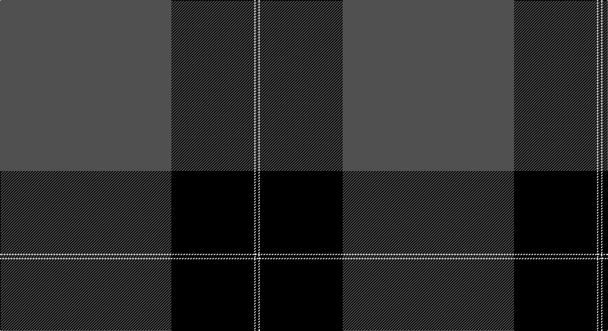

This page is one **sett** — a single exact thread-count. It belongs to the [tartan](/setts/n124k60w1k2/)
(the same proportion at any scale), whose colour order is pattern [BKWK](/stripes/bkwk/).

Sourced from weddslist.  It is a [4 stripe tartan](/stripes/stripes4/).

Original link http://www.weddslist.com/cgi-bin/tartans/pg.pl?source=sts

## Thread count
N/248 K120 LN2 K/4

One full sett is **496 threads**.

## Palette

Palette: <strong>Tartan Register</strong>
<table><thead><tr><th>Colour</th><th>Threads</th><th>Shade</th><th>Base</th><th>OKLCh</th></tr></thead><tbody><tr><td>N/</td><td style="text-align:right;font-variant-numeric:tabular-nums">248</td><td><code style="background-color:#505050;">#505050</code> <small style="color:#888">#505050</small></td><td>B <code style="background-color:#2A418A;">#2A418A</code></td><td><small style="color:#888">oklch(43.1% 0.000 89.9)</small></td></tr><tr><td>K</td><td style="text-align:right;font-variant-numeric:tabular-nums">120</td><td><code style="background-color:#000000;">#000000</code> <small style="color:#888">#000000</small></td><td>K <code style="background-color:#000000;">#000000</code></td><td><small style="color:#888">oklch(0.0% 0.000 0.0)</small></td></tr><tr><td>LN</td><td style="text-align:right;font-variant-numeric:tabular-nums">2</td><td><code style="background-color:#E0E0E0;">#E0E0E0</code> <small style="color:#888">#E0E0E0</small></td><td>W <code style="background-color:#F7F7F7;">#F7F7F7</code></td><td><small style="color:#888">oklch(90.7% 0.000 89.9)</small></td></tr><tr><td>K/</td><td style="text-align:right;font-variant-numeric:tabular-nums">4</td><td><code style="background-color:#000000;">#000000</code> <small style="color:#888">#000000</small></td><td>K <code style="background-color:#000000;">#000000</code></td><td><small style="color:#888">oklch(0.0% 0.000 0.0)</small></td></tr></tbody></table>

# Sample pattern

## Nearest tartans

The nearest existing variants by ΔTartan distance, with this tartan at the top so the swatches line up against it.

ΔTartan

Tartan

Sett

—

<a href="/ttd/edit/#slug=n124k60w1k2~x2">Pride of New Zealand, The</a> <a class="nn-out" href="/variants/s4/n124k60w1k2~x2/" title="open its dictionary page">↗</a>

1.25

<a href="/ttd/edit/#slug=k75y26y3k4ly6~x2&amp;base=n124k60w1k2~x2">Perry Ancient (Personal)</a> <a class="nn-out" href="/variants/s5/k75y26y3k4ly6~x2/" title="open its dictionary page">↗</a>

1.36

<a href="/ttd/edit/#slug=k62t33ly1~x2&amp;base=n124k60w1k2~x2">Westwater (Edinburgh, 2012)</a> <a class="nn-out" href="/variants/s3/k62t33ly1~x2/" title="open its dictionary page">↗</a>

1.46

<a href="/ttd/edit/#slug=k62b33ly1~x2&amp;base=n124k60w1k2~x2">Westwater (Personal)</a> <a class="nn-out" href="/variants/s3/k62b33ly1~x2/" title="open its dictionary page">↗</a>

1.47

<a href="/ttd/edit/#slug=n62k30w1k1~x2&amp;base=n124k60w1k2~x2">Pride of New Zealand</a> <a class="nn-out" href="/variants/s4/n62k30w1k1~x2/" title="open its dictionary page">↗</a>

1.55

<a href="/ttd/edit/#slug=k75g26lr2g4lo5~x2&amp;base=n124k60w1k2~x2">Perry Hunting (Green) (Personal)</a> <a class="nn-out" href="/variants/s5/k75g26lr2g4lo5~x2/" title="open its dictionary page">↗</a>

1.58

<a href="/ttd/edit/#slug=k53o22k10o10k2o4~x2&amp;base=n124k60w1k2~x2">Black Isle</a> <a class="nn-out" href="/variants/s6/k53o22k10o10k2o4~x2/" title="open its dictionary page">↗</a>

1.60

<a href="/ttd/edit/#slug=k65r27w2k4ly5~x2&amp;base=n124k60w1k2~x2">Perry Dress (Personal)</a> <a class="nn-out" href="/variants/s5/k65r27w2k4ly5~x2/" title="open its dictionary page">↗</a>

1.61

<a href="/ttd/edit/#slug=db39lo8r3w1~x4&amp;base=n124k60w1k2~x2">Norwich University</a> <a class="nn-out" href="/variants/s4/db39lo8r3w1~x4/" title="open its dictionary page">↗</a>

1.66

<a href="/ttd/edit/#slug=k75r26w2k4ly5~x2&amp;base=n124k60w1k2~x2">Perry / Pirrie (Personal)</a> <a class="nn-out" href="/variants/s5/k75r26w2k4ly5~x2/" title="open its dictionary page">↗</a>

1.68

<a href="/ttd/edit/#slug=r1k20lb5r1~x4&amp;base=n124k60w1k2~x2">Dobelman (Personal)</a> <a class="nn-out" href="/variants/s4/r1k20lb5r1~x4/" title="open its dictionary page">↗</a>

## Neighbour map

Every grey dot is one of 14360 variants placed by the first two principal components of the ΔTartan feature space (44% of its variance). Red is this tartan; blue dots are its nearest — click one to open its page.

<svg viewBox="0 0 640 380" role="img" style="max-width:100%;height:auto;border:1px solid #e0e0e0;border-radius:4px;display:block" xmlns="http://www.w3.org/2000/svg"><image href="/nn/cloud.v1.png" width="640" height="380"/><a href="/variants/s5/k75y26y3k4ly6~x2/"><circle cx="462.0" cy="183.0" r="4" fill="#3465a4"><title>Perry Ancient (Personal)</title></circle></a><a href="/variants/s3/k62t33ly1~x2/"><circle cx="469.9" cy="220.8" r="4" fill="#3465a4"><title>Westwater (Edinburgh, 2012)</title></circle></a><a href="/variants/s3/k62b33ly1~x2/"><circle cx="458.9" cy="221.5" r="4" fill="#3465a4"><title>Westwater (Personal)</title></circle></a><a href="/variants/s4/n62k30w1k1~x2/"><circle cx="511.9" cy="193.3" r="4" fill="#3465a4"><title>Pride of New Zealand</title></circle></a><a href="/variants/s5/k75g26lr2g4lo5~x2/"><circle cx="465.7" cy="167.0" r="4" fill="#3465a4"><title>Perry Hunting (Green) (Personal)</title></circle></a><a href="/variants/s6/k53o22k10o10k2o4~x2/"><circle cx="449.6" cy="199.0" r="4" fill="#3465a4"><title>Black Isle</title></circle></a><a href="/variants/s5/k65r27w2k4ly5~x2/"><circle cx="456.4" cy="164.7" r="4" fill="#3465a4"><title>Perry Dress (Personal)</title></circle></a><a href="/variants/s4/db39lo8r3w1~x4/"><circle cx="519.0" cy="164.6" r="4" fill="#3465a4"><title>Norwich University</title></circle></a><a href="/variants/s5/k75r26w2k4ly5~x2/"><circle cx="472.5" cy="145.6" r="4" fill="#3465a4"><title>Perry / Pirrie (Personal)</title></circle></a><a href="/variants/s4/r1k20lb5r1~x4/"><circle cx="478.4" cy="199.1" r="4" fill="#3465a4"><title>Dobelman (Personal)</title></circle></a><circle cx="483.1" cy="180.3" r="5" fill="#c00000"/></svg>

ID: /variants/s4/n124k60w1k2~x2/
