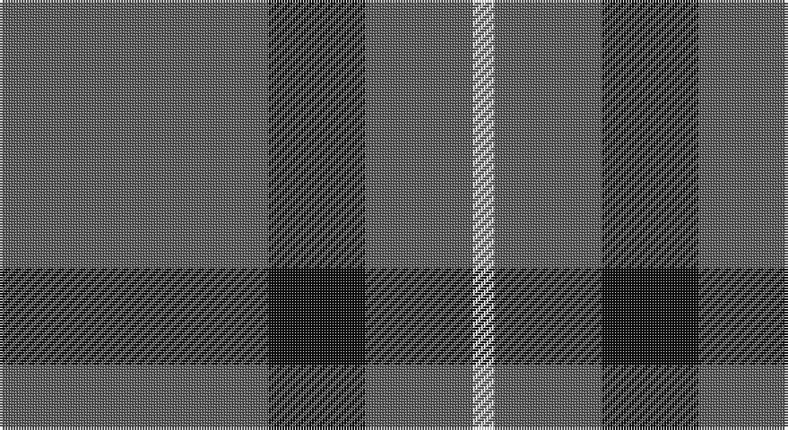

This page is one **sett** — a single exact thread-count. It belongs to the [tartan](/setts/n25k9n10w2/)
(the same proportion at any scale), whose colour order is pattern [BKBW](/stripes/bkbw/).

Part of the [Graham](/tartans/graham/) tartan — the named design grouping this sett with its other cloths.

Sourced from tartans-authority.  It is a [4 stripe tartan](/stripes/stripes4/).

Original link http://www.tartansauthority.com/tartan-ferret/display/8858/

## Also known as

This cloth is also recorded under:

- Graham Grey
- Graham Red

## Register references

External register numbers recorded for this tartan.

- Scottish Tartans Authority (ITI): 8858

## Thread count
N/100 K36 N40 W/8

One full sett is **260 threads**.

## Palette

Palette: <strong>Logan (The Scottish Gael, 1831)</strong> <small style="color:#888">(2 of 3 colours)</small>
<table><thead><tr><th>Colour</th><th>Threads</th><th>Shade</th><th>Base</th><th>OKLCh</th></tr></thead><tbody><tr><td>N/</td><td style="text-align:right;font-variant-numeric:tabular-nums">100</td><td><code style="background-color:#5C5C5C;">#5C5C5C</code> <small style="color:#888">#5C5C5C</small></td><td>B <code style="background-color:#2A418A;">#2A418A</code></td><td><small style="color:#888">oklch(47.5% 0.000 89.9)</small></td></tr><tr><td>K</td><td style="text-align:right;font-variant-numeric:tabular-nums">36</td><td><code style="background-color:#101010;">#101010</code> <small style="color:#888">#101010</small></td><td>K <code style="background-color:#000000;">#000000</code></td><td><small style="color:#888">oklch(17.3% 0.000 89.9)</small></td></tr><tr><td>N</td><td style="text-align:right;font-variant-numeric:tabular-nums">40</td><td><code style="background-color:#5C5C5C;">#5C5C5C</code> <small style="color:#888">#5C5C5C</small></td><td>B <code style="background-color:#2A418A;">#2A418A</code></td><td><small style="color:#888">oklch(47.5% 0.000 89.9)</small></td></tr><tr><td>W/</td><td style="text-align:right;font-variant-numeric:tabular-nums">8</td><td><code style="background-color:#FCFCFC;">#FCFCFC</code> <small style="color:#888">#FCFCFC</small></td><td>W <code style="background-color:#F7F7F7;">#F7F7F7</code></td><td><small style="color:#888">oklch(99.1% 0.000 89.9)</small></td></tr></tbody></table>

# Sample pattern

## Compared to the master

This cloth is one sett of its design; the master sett (the exemplar the design is anchored on) is below for comparison.

<figure style="margin:0"><figcaption style="color:#888;font-size:smaller">this sett</figcaption></figure>
<figure style="margin:0"><figcaption style="color:#888;font-size:smaller"><a href="/setts/dg12k4dg1/">master sett →</a></figcaption></figure>

## Nearest tartans

The nearest existing variants by ΔTartan distance, with this tartan at the top so the swatches line up against it.

ΔTartan

Tartan

Sett

—

<a href="/ttd/edit/#slug=n25k9n10w2~x4">Graham Grey - 1820 (Fashion?)</a> <a class="nn-out" href="/variants/s4/n25k9n10w2~x4/" title="open its dictionary page">↗</a>

1.66

<a href="/ttd/edit/#slug=g9n1g2k4g2~x4&amp;base=n25k9n10w2~x4">Peterhead (Personal)</a> <a class="nn-out" href="/variants/s5/g9n1g2k4g2~x4/" title="open its dictionary page">↗</a>

1.79

<a href="/ttd/edit/#slug=dt50k12dt21w5~x2&amp;base=n25k9n10w2~x4">Coinean Dubh</a> <a class="nn-out" href="/variants/s4/dt50k12dt21w5~x2/" title="open its dictionary page">↗</a>

1.81

<a href="/variants/s4/g28dp10g3~x2/">Elphinstone Clan Tartan</a>

1.87

<a href="/ttd/edit/#slug=m2g1m1g10w1~x4&amp;base=n25k9n10w2~x4">Welsh National District Tartan</a> <a class="nn-out" href="/variants/s5/m2g1m1g10w1~x4/" title="open its dictionary page">↗</a>

1.88

<a href="/variants/s4/g12p3g1~x2/">Elphinstone</a>

1.92

<a href="/ttd/edit/#slug=dg21lo44dg86t10&amp;base=n25k9n10w2~x4">Special Saffron (Fashion)</a> <a class="nn-out" href="/variants/s4/dg21lo44dg86t10/" title="open its dictionary page">↗</a>

1.98

<a href="/ttd/edit/#slug=dp7g23r3g7~x2&amp;base=n25k9n10w2~x4">Highland Spring (1997) (Corporate)</a> <a class="nn-out" href="/variants/s4/dp7g23r3g7~x2/" title="open its dictionary page">↗</a>

2.00

<a href="/ttd/edit/#slug=y14k80y14ly5~x2&amp;base=n25k9n10w2~x4">Westgate Fashion Tartan</a> <a class="nn-out" href="/variants/s4/y14k80y14ly5~x2/" title="open its dictionary page">↗</a>

2.01

<a href="/ttd/edit/#slug=t8dg1r2~x20&amp;base=n25k9n10w2~x4">Gyle (Corporate)</a> <a class="nn-out" href="/variants/s3/t8dg1r2~x20/" title="open its dictionary page">↗</a>

2.03

<a href="/ttd/edit/#slug=db1lo9db2lo9r1~x4&amp;base=n25k9n10w2~x4">Brooks Brothers Tattersall Camel</a> <a class="nn-out" href="/variants/s5/db1lo9db2lo9r1~x4/" title="open its dictionary page">↗</a>

## Neighbour map

Every grey dot is one of 14360 variants placed by the first two principal components of the ΔTartan feature space (44% of its variance). Red is this tartan; blue dots are its nearest — click one to open its page.

<svg viewBox="0 0 640 380" role="img" style="max-width:100%;height:auto;border:1px solid #e0e0e0;border-radius:4px;display:block" xmlns="http://www.w3.org/2000/svg"><image href="/nn/cloud.v1.png" width="640" height="380"/><a href="/variants/s5/g9n1g2k4g2~x4/"><circle cx="461.0" cy="275.1" r="4" fill="#3465a4"><title>Peterhead (Personal)</title></circle></a><a href="/variants/s4/dt50k12dt21w5~x2/"><circle cx="507.8" cy="277.4" r="4" fill="#3465a4"><title>Coinean Dubh</title></circle></a><a href="/variants/s4/g28dp10g3~x2/"><circle cx="407.7" cy="288.6" r="4" fill="#3465a4"><title>Elphinstone Clan Tartan</title></circle></a><a href="/variants/s5/m2g1m1g10w1~x4/"><circle cx="478.5" cy="228.8" r="4" fill="#3465a4"><title>Welsh National District Tartan</title></circle></a><a href="/variants/s4/g12p3g1~x2/"><circle cx="451.4" cy="258.3" r="4" fill="#3465a4"><title>Elphinstone</title></circle></a><a href="/variants/s4/dg21lo44dg86t10/"><circle cx="371.8" cy="263.0" r="4" fill="#3465a4"><title>Special Saffron (Fashion)</title></circle></a><a href="/variants/s4/dp7g23r3g7~x2/"><circle cx="471.0" cy="290.0" r="4" fill="#3465a4"><title>Highland Spring (1997) (Corporate)</title></circle></a><a href="/variants/s4/y14k80y14ly5~x2/"><circle cx="475.0" cy="230.3" r="4" fill="#3465a4"><title>Westgate Fashion Tartan</title></circle></a><a href="/variants/s3/t8dg1r2~x20/"><circle cx="452.4" cy="281.5" r="4" fill="#3465a4"><title>Gyle (Corporate)</title></circle></a><a href="/variants/s5/db1lo9db2lo9r1~x4/"><circle cx="533.4" cy="249.3" r="4" fill="#3465a4"><title>Brooks Brothers Tattersall Camel</title></circle></a><circle cx="480.1" cy="261.3" r="5" fill="#c00000"/></svg>

ID: /variants/s4/n25k9n10w2~x4/
