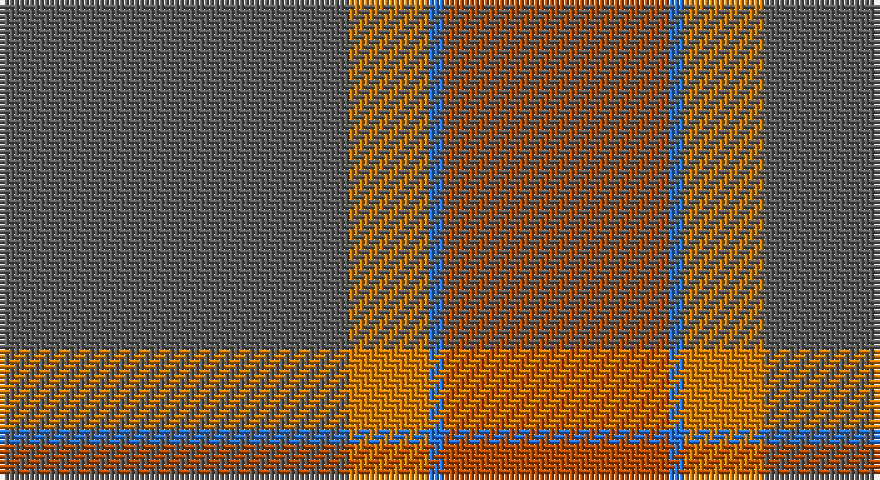

This page is one **sett** — a single exact thread-count. It belongs to the [tartan](/setts/n70lo16b3o45/)
(the same proportion at any scale), whose colour order is pattern [BYBR](/stripes/bybr/).

Part of the [Klymson](/tartans/klymson/) tartan — the named design grouping this sett with its other cloths.

Sourced from tartans-authority.  It is a [4 stripe tartan](/stripes/stripes4/).

Original link http://www.tartansauthority.com/tartan-ferret/display/10801/

## Register references

External register numbers recorded for this tartan.

- Scottish Tartans Authority (ITI): 10801

## Thread count
N/70 O16 B3 DO/45

One full sett is **153 threads**.

## Palette

Palette: <strong>Tartan Register</strong> <small style="color:#888">(2 of 4 colours)</small>
<table><thead><tr><th>Colour</th><th>Threads</th><th>Shade</th><th>Base</th><th>OKLCh</th></tr></thead><tbody><tr><td>N/</td><td style="text-align:right;font-variant-numeric:tabular-nums">70</td><td><code style="background-color:#5C5C5C;">#5C5C5C</code> <small style="color:#888">#5C5C5C</small></td><td>B <code style="background-color:#2A418A;">#2A418A</code></td><td><small style="color:#888">oklch(47.5% 0.000 89.9)</small></td></tr><tr><td>O</td><td style="text-align:right;font-variant-numeric:tabular-nums">16</td><td><code style="background-color:#D87C00;">#D87C00</code> <small style="color:#888">#D87C00</small></td><td>Y <code style="background-color:#F2BF00;">#F2BF00</code></td><td><small style="color:#888">oklch(67.3% 0.155 61.8)</small></td></tr><tr><td>B</td><td style="text-align:right;font-variant-numeric:tabular-nums">3</td><td><code style="background-color:#2474E8;">#2474E8</code> <small style="color:#888">#2474E8</small></td><td>B <code style="background-color:#2A418A;">#2A418A</code></td><td><small style="color:#888">oklch(57.8% 0.192 258.7)</small></td></tr><tr><td>DO/</td><td style="text-align:right;font-variant-numeric:tabular-nums">45</td><td><code style="background-color:#B84C00;">#B84C00</code> <small style="color:#888">#B84C00</small></td><td>R <code style="background-color:#CC0000;">#CC0000</code></td><td><small style="color:#888">oklch(55.1% 0.156 45.5)</small></td></tr></tbody></table>

# Sample pattern

## Compared to the master

This cloth is one sett of its design; the master sett (the exemplar the design is anchored on) is below for comparison.

<figure style="margin:0"><figcaption style="color:#888;font-size:smaller">this sett</figcaption></figure>
<figure style="margin:0"><figcaption style="color:#888;font-size:smaller"><a href="/setts/k70lo16lt3r45/">master sett →</a></figcaption></figure>

## Nearest tartans

The nearest existing variants by ΔTartan distance, with this tartan at the top so the swatches line up against it.

ΔTartan

Tartan

Sett

—

<a href="/ttd/edit/#slug=n70lo16b3o45">Klymson (Personal)</a> <a class="nn-out" href="/variants/s4/n70lo16b3o45/" title="open its dictionary page">↗</a>

1.41

<a href="/ttd/edit/#slug=o22m1y22dr4~x4&amp;base=n70lo16b3o45">McWilliams Hunting (2014)</a> <a class="nn-out" href="/variants/s4/o22m1y22dr4~x4/" title="open its dictionary page">↗</a>

1.89

<a href="/ttd/edit/#slug=db2o22dy11ly2dy11db2~x2&amp;base=n70lo16b3o45">Cetoloni Family Tartan</a> <a class="nn-out" href="/variants/s6/db2o22dy11ly2dy11db2~x2/" title="open its dictionary page">↗</a>

2.03

<a href="/ttd/edit/#slug=dy4lg11dy14o30r4~x2&amp;base=n70lo16b3o45">Trinity Bicycles</a> <a class="nn-out" href="/variants/s5/dy4lg11dy14o30r4~x2/" title="open its dictionary page">↗</a>

2.03

<a href="/ttd/edit/#slug=oi80o8oi4dy4lr4dy45n8&amp;base=n70lo16b3o45">Isaia (Fashion)</a> <a class="nn-out" href="/variants/s7/oi80o8oi4dy4lr4dy45n8/" title="open its dictionary page">↗</a>

2.08

<a href="/ttd/edit/#slug=y50dy25ly2dp6~x2&amp;base=n70lo16b3o45">Highland Greenford (Personal)</a> <a class="nn-out" href="/variants/s4/y50dy25ly2dp6~x2/" title="open its dictionary page">↗</a>

2.11

<a href="/ttd/edit/#slug=n10lr3o3r1g1~x10&amp;base=n70lo16b3o45">Bagpipe Shop, The (Corporate)</a> <a class="nn-out" href="/variants/s5/n10lr3o3r1g1~x10/" title="open its dictionary page">↗</a>

2.16

<a href="/ttd/edit/#slug=db2r22dy11y2dy11db2~x2&amp;base=n70lo16b3o45">Cetoloni</a> <a class="nn-out" href="/variants/s6/db2r22dy11y2dy11db2~x2/" title="open its dictionary page">↗</a>

2.21

<a href="/ttd/edit/#slug=dt2n21dt11r21dt1~x2&amp;base=n70lo16b3o45">Romanes Check (Fashion)</a> <a class="nn-out" href="/variants/s5/dt2n21dt11r21dt1~x2/" title="open its dictionary page">↗</a>

2.24

<a href="/ttd/edit/#slug=r8lr2o30dg12o3dg12o3~x2&amp;base=n70lo16b3o45">Wasko (Personal)</a> <a class="nn-out" href="/variants/s7/r8lr2o30dg12o3dg12o3~x2/" title="open its dictionary page">↗</a>

2.26

<a href="/ttd/edit/#slug=n16r2n10r14t5~x2&amp;base=n70lo16b3o45">Mowbray (Personal)</a> <a class="nn-out" href="/variants/s5/n16r2n10r14t5~x2/" title="open its dictionary page">↗</a>

## Neighbour map

Every grey dot is one of 14360 variants placed by the first two principal components of the ΔTartan feature space (44% of its variance). Red is this tartan; blue dots are its nearest — click one to open its page.

<svg viewBox="0 0 640 380" role="img" style="max-width:100%;height:auto;border:1px solid #e0e0e0;border-radius:4px;display:block" xmlns="http://www.w3.org/2000/svg"><image href="/nn/cloud.v1.png" width="640" height="380"/><a href="/variants/s4/o22m1y22dr4~x4/"><circle cx="408.8" cy="256.4" r="4" fill="#3465a4"><title>McWilliams Hunting (2014)</title></circle></a><a href="/variants/s6/db2o22dy11ly2dy11db2~x2/"><circle cx="357.3" cy="243.2" r="4" fill="#3465a4"><title>Cetoloni Family Tartan</title></circle></a><a href="/variants/s5/dy4lg11dy14o30r4~x2/"><circle cx="317.1" cy="270.9" r="4" fill="#3465a4"><title>Trinity Bicycles</title></circle></a><a href="/variants/s7/oi80o8oi4dy4lr4dy45n8/"><circle cx="441.7" cy="184.3" r="4" fill="#3465a4"><title>Isaia (Fashion)</title></circle></a><a href="/variants/s4/y50dy25ly2dp6~x2/"><circle cx="505.5" cy="261.9" r="4" fill="#3465a4"><title>Highland Greenford (Personal)</title></circle></a><a href="/variants/s5/n10lr3o3r1g1~x10/"><circle cx="363.7" cy="239.7" r="4" fill="#3465a4"><title>Bagpipe Shop, The (Corporate)</title></circle></a><a href="/variants/s6/db2r22dy11y2dy11db2~x2/"><circle cx="353.6" cy="233.6" r="4" fill="#3465a4"><title>Cetoloni</title></circle></a><a href="/variants/s5/dt2n21dt11r21dt1~x2/"><circle cx="374.4" cy="268.6" r="4" fill="#3465a4"><title>Romanes Check (Fashion)</title></circle></a><a href="/variants/s7/r8lr2o30dg12o3dg12o3~x2/"><circle cx="385.4" cy="226.6" r="4" fill="#3465a4"><title>Wasko (Personal)</title></circle></a><a href="/variants/s5/n16r2n10r14t5~x2/"><circle cx="397.5" cy="318.7" r="4" fill="#3465a4"><title>Mowbray (Personal)</title></circle></a><circle cx="420.0" cy="246.3" r="5" fill="#c00000"/></svg>

ID: /variants/s4/n70lo16b3o45/
