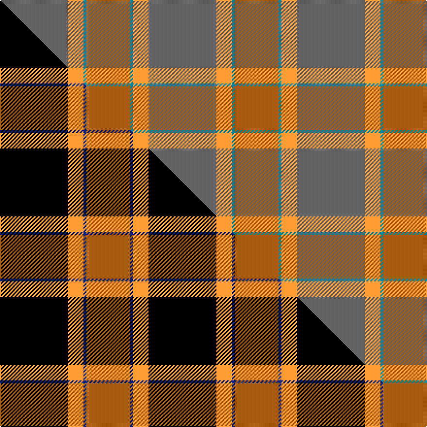

This is one **variant** — a specific cloth: this exact thread count and colourway, with its own
provenance below. It is one weaving of the [sett](/setts/n70lo16t3o45/) (the scale-free proportion — the
same cloth at any scale or shade), whose colour order is pattern [BYBR](/stripes/bybr/).

Part of the [Klymson](/tartans/k/kl/klymson/) tartan — the named design grouping this sett with its other cloths.

Sourced from tartans-authority.  It is a [4 stripe tartan](/stripes/stripes4/).

Original link [https://www.tartanregister.gov.uk/tartanDetails.aspx?ref=10801](https://www.tartanregister.gov.uk/tartanDetails.aspx?ref=10801)

Dataset <small>— provenance for this record, inherited from the source manifest</small>

<dl class="dataset-prov">
<dt>source</dt><dd><a href="/sources/tartans-authority/">Scottish Tartans Authority</a></dd>
<dt>data captured from</dt><dd><a href="https://github.com/thetartan/tartan-database/blob/master/data/tartans-authority/data.csv">https://github.com/thetartan/tartan-database/blob/master/data/tartans-authority/data.csv</a></dd>
<dt>data date</dt><dd>20/05/1980 <small>(this record)</small></dd>
<dt>licence</dt><dd><a href="https://creativecommons.org/licenses/by-nc-nd/4.0/">CC BY-NC-ND 4.0</a></dd>
</dl>

Capture chain <small>— the hands this data passed through, oldest first; each capture carries its own licence</small>

<ol class="capture-chain">
<li><a href="https://www.tartansauthority.com/">Scottish Tartans Authority</a> <small>the heritage body's archive — its tartan-ferret record browser is retired (links repaired to the SRT, above)</small></li>
<li><a href="https://github.com/thetartan/tartan-database">thetartan/tartan-database</a> <small>2016-2017</small> · <a href="https://creativecommons.org/licenses/by-nc-nd/4.0/">CC BY-NC-ND 4.0</a> <small>Levko Kravets's frozen compilation — the capture we vendored, and where its CC licence text came from</small></li>
<li>this dictionary <small>captured 2026-06-10 · commit 5bf86c7566</small> <small>each re-capture is a git commit to data/sources</small></li>
</ol>

## Register references

External register numbers recorded for this tartan.

- Scottish Tartans Authority (ITI): 10801

## Thread count
N/70 LO16 T3 O/45

One full sett is **153 threads**.

## Palette
<table><thead><tr><th>Colour</th><th>Shade</th><th>OKLCh</th></tr></thead><tbody><tr><td>T</td><td><code style="background-color:#00879F;">#00879F</code> <small style="color:#888">#00879F</small></td><td><small style="color:#888">oklch(57.4% 0.102 216.1)</small></td></tr><tr><td>O</td><td><code style="background-color:#A65C11;">#A65C11</code> <small style="color:#888">#A65C11</small></td><td><small style="color:#888">oklch(55.0% 0.125 58.3)</small></td></tr><tr><td>N</td><td><code style="background-color:#636363;">#636363</code> <small style="color:#888">#636363</small></td><td><small style="color:#888">oklch(50.0% 0.000 89.9)</small></td></tr><tr><td>LO</td><td><code style="background-color:#FF9C34;">#FF9C34</code> <small style="color:#888">#FF9C34</small></td><td><small style="color:#888">oklch(77.9% 0.161 61.8)</small></td></tr></tbody></table>

# Sample pattern

## Compared to the master

This cloth is one sett of its design; the master sett (the exemplar the design is anchored on) is below for comparison.

Its **ΔTartan distance** from the master is **0.23** — the same measure the nearest-tartans table ranks by (0 is identical; a re-scale of the same cloth is near 0, a recolour or a different proportion further).

<figure class="master-compare" style="margin:0">

this sett
master sett ★

<figcaption style="color:#888;font-size:smaller">One weave of this sett against the <a href="/setts/k70lo16db3o45/">master sett ★</a>, split on the diagonal: a shared proportion runs seamlessly across it with only the shades shifting; a different proportion breaks on it.</figcaption>
</figure>

## Nearest tartan variants

The nearest existing variants by ΔTartan distance, with this cloth at the top so the swatches line up against it.

ΔTartan

Threads

Variant

Sett

—

153

<a href="/variants/s4/n70lo16t3o45/">Klymson (Personal)</a>

<a href="/ttd/edit/#slug=do18o9n9r1lb1~x4&amp;base=n70lo16t3o45" title="compare in the TTD">1.63</a>

228

<a href="/variants/s5/do18o9n9r1lb1~x4/">Jardine</a>

<a href="/ttd/edit/#slug=o62n17ly12y8dg8~x2&amp;base=n70lo16t3o45" title="compare in the TTD">1.87</a>

288

<a href="/variants/s5/o62n17ly12y8dg8~x2/">Dundhuin Dress (Personal)</a>

<a href="/ttd/edit/#slug=o59n28ly5dg3w4ly5~x2&amp;base=n70lo16t3o45" title="compare in the TTD">2.06</a>

288

<a href="/variants/s6/o59n28ly5dg3w4ly5~x2/">Dundhuin Gold</a>

<a href="/ttd/edit/#slug=n44dg12db1r6~x2~r1406028&amp;base=n70lo16t3o45" title="compare in the TTD">2.25</a>

152

<a href="/variants/s4/n44dg12db1r6~x2~r1406028/">Heslop, William D Name Tartan</a>

<a href="/ttd/edit/#slug=n44dg12db1r6~x2&amp;base=n70lo16t3o45" title="compare in the TTD">2.25</a>

152

<a href="/variants/s4/n44dg12db1r6~x2/">Heslop Lurdenlaw by Kelso</a>

<a href="/ttd/edit/#slug=w4n28t48y3~x2~t2503227&amp;base=n70lo16t3o45" title="compare in the TTD">3.11</a>

318

<a href="/variants/s4/w4n28t48y3~x2~t2503227/">MacKerrell of Hillhouse Dress Personal Tartan</a>

<a href="/ttd/edit/#slug=yi9g52dy15y4~x2~yi2202111-dy1502083&amp;base=n70lo16t3o45" title="compare in the TTD">3.45</a>

294

<a href="/variants/s4/yi9g52dy15y4~x2~yi2202111-dy1502083/">McGuigan, Julia (St Monans, Fife) (Personal)</a>

<a href="/ttd/edit/#slug=g53r13db2y22~x2&amp;base=n70lo16t3o45" title="compare in the TTD">3.45</a>

210

<a href="/variants/s4/g53r13db2y22~x2/">Englehart Commemorative Tartan</a>

<a href="/ttd/edit/#slug=n60g13n9r8dy4~x2&amp;base=n70lo16t3o45" title="compare in the TTD">3.70</a>

248

<a href="/variants/s5/n60g13n9r8dy4~x2/">Ballantyne Personal Tartan</a>

<a href="/ttd/edit/#slug=n60g13n9dr8y4~x2&amp;base=n70lo16t3o45" title="compare in the TTD">3.85</a>

248

<a href="/variants/s5/n60g13n9dr8y4~x2/">Ballantyne (Personal)</a>

## Neighbour map

Every grey dot is one of 13621 variants placed by the first two principal components of the ΔTartan feature space (42% of its variance). Red is this tartan; blue dots are its nearest — click one to open its page. The map is a flat projection of a many-dimensional space — [how to read it](/posts/neighbourhood-maps/).

<svg viewBox="0 0 640 380" role="img" style="max-width:100%;height:auto;border:1px solid #e0e0e0;border-radius:4px;display:block" xmlns="http://www.w3.org/2000/svg"><image href="/nn/cloud.v1.png" width="640" height="380"/><a href="/variants/s5/do18o9n9r1lb1~x4/"><circle cx="357.4" cy="217.7" r="4" fill="#3465a4"><title>Jardine</title></circle></a><a href="/variants/s5/o62n17ly12y8dg8~x2/"><circle cx="411.8" cy="245.3" r="4" fill="#3465a4"><title>Dundhuin Dress (Personal)</title></circle></a><a href="/variants/s6/o59n28ly5dg3w4ly5~x2/"><circle cx="429.5" cy="182.2" r="4" fill="#3465a4"><title>Dundhuin Gold</title></circle></a><a href="/variants/s4/n44dg12db1r6~x2~r1406028/"><circle cx="607.1" cy="205.0" r="4" fill="#3465a4"><title>Heslop, William D Name Tartan</title></circle></a><a href="/variants/s4/n44dg12db1r6~x2/"><circle cx="580.7" cy="195.0" r="4" fill="#3465a4"><title>Heslop Lurdenlaw by Kelso</title></circle></a><a href="/variants/s4/w4n28t48y3~x2~t2503227/"><circle cx="531.7" cy="281.4" r="4" fill="#3465a4"><title>MacKerrell of Hillhouse Dress Personal Tartan</title></circle></a><a href="/variants/s4/yi9g52dy15y4~x2~yi2202111-dy1502083/"><circle cx="557.9" cy="288.5" r="4" fill="#3465a4"><title>McGuigan, Julia (St Monans, Fife) (Personal)</title></circle></a><a href="/variants/s4/g53r13db2y22~x2/"><circle cx="455.5" cy="232.1" r="4" fill="#3465a4"><title>Englehart Commemorative Tartan</title></circle></a><a href="/variants/s5/n60g13n9r8dy4~x2/"><circle cx="594.5" cy="232.4" r="4" fill="#3465a4"><title>Ballantyne Personal Tartan</title></circle></a><a href="/variants/s5/n60g13n9dr8y4~x2/"><circle cx="626.0" cy="257.8" r="4" fill="#3465a4"><title>Ballantyne (Personal)</title></circle></a><circle cx="476.4" cy="257.2" r="5" fill="#c00000"/><text x="320" y="376" text-anchor="middle" font-size="11" fill="#999">ground</text><text x="11" y="190" text-anchor="middle" font-size="11" fill="#999" transform="rotate(-90 11 190)">complexity</text></svg>

ID: /variants/s4/n70lo16t3o45/
