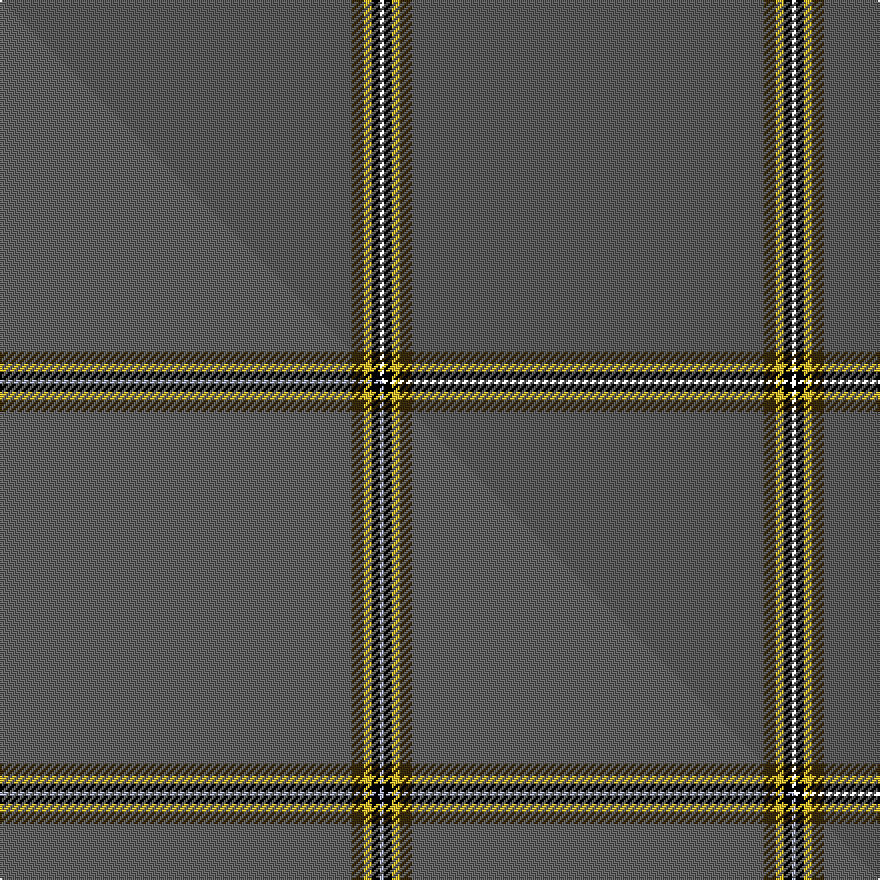

This page is one **sett** — a single exact thread-count. It belongs to the [tartan](/setts/n88dy3ly2k3/)
(the same proportion at any scale), whose colour order is pattern [BGYKK](/stripes/bgykk/).

Part of the [Eternity](/tartans/eternity/) tartan — the named design grouping this sett with its other cloths.

Sourced from house-of-tartan.  It is a [5 stripe tartan](/stripes/stripes5/).

Original link http://www.house-of-tartan.scotland.net/house/TartanViewjs.asp?colr=Def&tnam=10214

## Provenance

Earliest known date: 01/02/2010 This tartan was designed for day wear grey tweed jackets. It has been shown in the Dedicated to Wedding magazine (April 2010). Perfection leads to eternity is the goal for all eternal marriage.

## Thread count
N/176 DY6 LY4 K4 K/2

One full sett is **206 threads**.

## Palette
<table><thead><tr><th>Colour</th><th>Shade</th><th>OKLCh</th></tr></thead><tbody><tr><td>K</td><td><code style="background-color:#000000;">#000000</code> <small style="color:#888">#000000</small></td><td><small style="color:#888">oklch(0.0% 0.000 0.0)</small></td></tr><tr><td>LY</td><td><code style="background-color:#DCBC32;">#DCBC32</code> <small style="color:#888">#DCBC32</small></td><td><small style="color:#888">oklch(80.0% 0.150 95.2)</small></td></tr><tr><td>N</td><td><code style="background-color:#5C5C5C;">#5C5C5C</code> <small style="color:#888">#5C5C5C</small></td><td><small style="color:#888">oklch(47.5% 0.000 89.9)</small></td></tr><tr><td>O</td><td><code style="background-color:#888888;">#888888</code> <small style="color:#888">#888888</small></td><td><small style="color:#888">oklch(62.7% 0.000 89.9)</small></td></tr><tr><td>DY</td><td><code style="background-color:#3A2B0D;">#3A2B0D</code> <small style="color:#888">#3A2B0D</small></td><td><small style="color:#888">oklch(30.0% 0.049 82.0)</small></td></tr></tbody></table>

# Sample pattern

## Compared to the master

This cloth is one sett of its design; the master sett (the exemplar the design is anchored on) is below for comparison.

Its **ΔTartan distance** from the master is **0.82** — the same measure the nearest-tartans table ranks by (0 is identical; a re-scale of the same cloth is near 0, a recolour or a different proportion further).

<figure class="master-compare" style="margin:0">

this sett
master sett ★

<figcaption style="color:#888;font-size:smaller">One weave of this sett against the <a href="/setts/n88dy3ly2k2lb1/">master sett ★</a>, split on the diagonal: a shared proportion runs seamlessly across it with only the shades shifting; a different proportion breaks on it.</figcaption>
</figure>

## Nearest variants

The nearest existing variants by ΔTartan distance, with this cloth at the top so the swatches line up against it.

ΔTartan

Threads

Variant

Sett

—

206

<a href="/variants/s4/n88dy3ly2k3~x2~n1900000/">Eternity Fashion Tartan</a>

<a href="/ttd/edit/#slug=n88dy3ly2k2lb1~x2&amp;base=n88dy3ly2k3~x2~n1900000" title="compare in the TTD">1.30</a>

206

<a href="/variants/s5/n88dy3ly2k2lb1~x2/">Eternity, Dedicated 2 Weddings</a>

<a href="/ttd/edit/#slug=r1n19w1~x2&amp;base=n88dy3ly2k3~x2~n1900000" title="compare in the TTD">2.19</a>

80

<a href="/variants/s3/r1n19w1~x2/">Dunbar of Pitgaveny (Clan)</a>

<a href="/ttd/edit/#slug=n19w1n19r1~x2&amp;base=n88dy3ly2k3~x2~n1900000" title="compare in the TTD">2.19</a>

120

<a href="/variants/s4/n19w1n19r1~x2/">Dunbar of Pitgaveny</a>

<a href="/ttd/edit/#slug=o2r1dp30w1y2~x2&amp;base=n88dy3ly2k3~x2~n1900000" title="compare in the TTD">2.20</a>

136

<a href="/variants/s5/o2r1dp30w1y2~x2/">Wedding</a>

<a href="/ttd/edit/#slug=y2k3dr31w1~x4&amp;base=n88dy3ly2k3~x2~n1900000" title="compare in the TTD">2.28</a>

284

<a href="/variants/s4/y2k3dr31w1~x4/">Riddick Furya</a>

<a href="/ttd/edit/#slug=dy1k2dp27k2dg1~x2&amp;base=n88dy3ly2k3~x2~n1900000" title="compare in the TTD">2.38</a>

128

<a href="/variants/s5/dy1k2dp27k2dg1~x2/">Carolina University, Western</a>

<a href="/ttd/edit/#slug=dy10w1dy30y3~x4&amp;base=n88dy3ly2k3~x2~n1900000" title="compare in the TTD">2.49</a>

300

<a href="/variants/s4/dy10w1dy30y3~x4/">Pasteur</a>

<a href="/ttd/edit/#slug=n30r1n15db4~x2&amp;base=n88dy3ly2k3~x2~n1900000" title="compare in the TTD">2.50</a>

132

<a href="/variants/s4/n30r1n15db4~x2/">Kincardine Tweed</a>

<a href="/ttd/edit/#slug=k50r1db3dp1~x4&amp;base=n88dy3ly2k3~x2~n1900000" title="compare in the TTD">2.50</a>

236

<a href="/variants/s4/k50r1db3dp1~x4/">Alich (Personal)</a>

<a href="/ttd/edit/#slug=db45y3db10dg4k1w2~x2&amp;base=n88dy3ly2k3~x2~n1900000" title="compare in the TTD">2.65</a>

166

<a href="/variants/s6/db45y3db10dg4k1w2~x2/">Wylie</a>

## Neighbour map

Every grey dot is one of 13620 variants placed by the first two principal components of the ΔTartan feature space (42% of its variance). Red is this tartan; blue dots are its nearest — click one to open its page.

<svg viewBox="0 0 640 380" role="img" style="max-width:100%;height:auto;border:1px solid #e0e0e0;border-radius:4px;display:block" xmlns="http://www.w3.org/2000/svg"><image href="/nn/cloud.v1.png" width="640" height="380"/><a href="/variants/s5/n88dy3ly2k2lb1~x2/"><circle cx="626.0" cy="109.9" r="4" fill="#3465a4"><title>Eternity, Dedicated 2 Weddings</title></circle></a><a href="/variants/s3/r1n19w1~x2/"><circle cx="626.0" cy="223.5" r="4" fill="#3465a4"><title>Dunbar of Pitgaveny (Clan)</title></circle></a><a href="/variants/s4/n19w1n19r1~x2/"><circle cx="626.0" cy="246.7" r="4" fill="#3465a4"><title>Dunbar of Pitgaveny</title></circle></a><a href="/variants/s5/o2r1dp30w1y2~x2/"><circle cx="593.3" cy="114.8" r="4" fill="#3465a4"><title>Wedding</title></circle></a><a href="/variants/s4/y2k3dr31w1~x4/"><circle cx="590.4" cy="135.6" r="4" fill="#3465a4"><title>Riddick Furya</title></circle></a><a href="/variants/s5/dy1k2dp27k2dg1~x2/"><circle cx="626.0" cy="143.8" r="4" fill="#3465a4"><title>Carolina University, Western</title></circle></a><a href="/variants/s4/dy10w1dy30y3~x4/"><circle cx="626.0" cy="212.2" r="4" fill="#3465a4"><title>Pasteur</title></circle></a><a href="/variants/s4/n30r1n15db4~x2/"><circle cx="626.0" cy="245.7" r="4" fill="#3465a4"><title>Kincardine Tweed</title></circle></a><a href="/variants/s4/k50r1db3dp1~x4/"><circle cx="626.0" cy="121.7" r="4" fill="#3465a4"><title>Alich (Personal)</title></circle></a><a href="/variants/s6/db45y3db10dg4k1w2~x2/"><circle cx="582.9" cy="99.6" r="4" fill="#3465a4"><title>Wylie</title></circle></a><circle cx="626.0" cy="98.5" r="5" fill="#c00000"/><text x="320" y="376" text-anchor="middle" font-size="11" fill="#999">ground</text><text x="11" y="190" text-anchor="middle" font-size="11" fill="#999" transform="rotate(-90 11 190)">complexity</text></svg>

ID: /variants/s4/n88dy3ly2k3~x2~n1900000/
