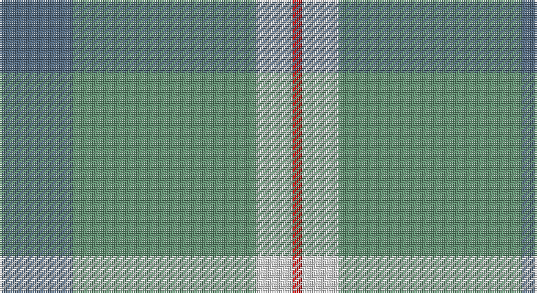

This page is one **sett** — a single exact thread-count. It belongs to the [tartan](/setts/n8g20w4r1/)
(the same proportion at any scale), whose colour order is pattern [BGWR](/stripes/bgwr/).

Sourced from tartans-authority.  It is a [4 stripe tartan](/stripes/stripes4/).

Original link http://www.tartansauthority.com/tartan-ferret/display/10258/

## Register references

External register numbers recorded for this tartan.

- Scottish Register of Tartans: [10258](https://www.tartanregister.gov.uk/tartanDetails?ref=10258)
- Scottish Tartans Authority (ITI): 10258

## Thread count
B/40 LG100 LN20 R/5

One full sett is **285 threads**.

## Palette

Palette: <strong>Tartan Register</strong> <small style="color:#888">(2 of 4 colours)</small>
<table><thead><tr><th>Colour</th><th>Threads</th><th>Shade</th><th>Base</th><th>OKLCh</th></tr></thead><tbody><tr><td>B/</td><td style="text-align:right;font-variant-numeric:tabular-nums">40</td><td><code style="background-color:#506880;">#506880</code> <small style="color:#888">#506880</small></td><td>B <code style="background-color:#2A418A;">#2A418A</code></td><td><small style="color:#888">oklch(50.8% 0.048 248.8)</small></td></tr><tr><td>LG</td><td style="text-align:right;font-variant-numeric:tabular-nums">100</td><td><code style="background-color:#609070;">#609070</code> <small style="color:#888">#609070</small></td><td>G <code style="background-color:#006100;">#006100</code></td><td><small style="color:#888">oklch(61.0% 0.071 154.6)</small></td></tr><tr><td>LN</td><td style="text-align:right;font-variant-numeric:tabular-nums">20</td><td><code style="background-color:#E0E0E0;">#E0E0E0</code> <small style="color:#888">#E0E0E0</small></td><td>W <code style="background-color:#F7F7F7;">#F7F7F7</code></td><td><small style="color:#888">oklch(90.7% 0.000 89.9)</small></td></tr><tr><td>R/</td><td style="text-align:right;font-variant-numeric:tabular-nums">5</td><td><code style="background-color:#C80000;">#C80000</code> <small style="color:#888">#C80000</small></td><td>R <code style="background-color:#CC0000;">#CC0000</code></td><td><small style="color:#888">oklch(52.3% 0.215 29.2)</small></td></tr></tbody></table>

# Sample pattern

## Nearest tartans

The nearest existing variants by ΔTartan distance, with this tartan at the top so the swatches line up against it.

ΔTartan

Tartan

Sett

—

<a href="/ttd/edit/#slug=n8g20w4r1~x5">Farooq (Personal)</a> <a class="nn-out" href="/variants/s4/n8g20w4r1~x5/" title="open its dictionary page">↗</a>

1.26

<a href="/ttd/edit/#slug=o57w5g20o5lo10~x2&amp;base=n8g20w4r1~x5">Johore (District)</a> <a class="nn-out" href="/variants/s5/o57w5g20o5lo10~x2/" title="open its dictionary page">↗</a>

1.38

<a href="/ttd/edit/#slug=g49t21k3t3w3~x2&amp;base=n8g20w4r1~x5">Irvine of Drum (Clan)</a> <a class="nn-out" href="/variants/s5/g49t21k3t3w3~x2/" title="open its dictionary page">↗</a>

1.38

<a href="/ttd/edit/#slug=y57w5g20y5ly10&amp;base=n8g20w4r1~x5">Jahore</a> <a class="nn-out" href="/variants/s5/y57w5g20y5ly10/" title="open its dictionary page">↗</a>

1.47

<a href="/ttd/edit/#slug=o57w5g20o5ly10&amp;base=n8g20w4r1~x5">Jahore District Tartan</a> <a class="nn-out" href="/variants/s5/o57w5g20o5ly10/" title="open its dictionary page">↗</a>

1.85

<a href="/ttd/edit/#slug=o40r2o20g19db2&amp;base=n8g20w4r1~x5">Lloyd of Wales</a> <a class="nn-out" href="/variants/s5/o40r2o20g19db2/" title="open its dictionary page">↗</a>

1.85

<a href="/ttd/edit/#slug=lb9y52dy15ly4~x2&amp;base=n8g20w4r1~x5">McGuigan, Julia (Personal)</a> <a class="nn-out" href="/variants/s4/lb9y52dy15ly4~x2/" title="open its dictionary page">↗</a>

1.92

<a href="/ttd/edit/#slug=lg50r4lg12ly23r4g4~x2&amp;base=n8g20w4r1~x5">Ingenico</a> <a class="nn-out" href="/variants/s6/lg50r4lg12ly23r4g4~x2/" title="open its dictionary page">↗</a>

2.00

<a href="/ttd/edit/#slug=ri4y2db4y35t27r3~x2&amp;base=n8g20w4r1~x5">Royal Deeside (District)</a> <a class="nn-out" href="/variants/s6/ri4y2db4y35t27r3~x2/" title="open its dictionary page">↗</a>

2.01

<a href="/ttd/edit/#slug=g40w2y5gi5y15~x2&amp;base=n8g20w4r1~x5">Castle Bay (Fashion)</a> <a class="nn-out" href="/variants/s5/g40w2y5gi5y15~x2/" title="open its dictionary page">↗</a>

2.04

<a href="/ttd/edit/#slug=lg25r1g1n9w4~x2&amp;base=n8g20w4r1~x5">Tailor Ishida, Kobe</a> <a class="nn-out" href="/variants/s5/lg25r1g1n9w4~x2/" title="open its dictionary page">↗</a>

## Neighbour map

Every grey dot is one of 14360 variants placed by the first two principal components of the ΔTartan feature space (44% of its variance). Red is this tartan; blue dots are its nearest — click one to open its page.

<svg viewBox="0 0 640 380" role="img" style="max-width:100%;height:auto;border:1px solid #e0e0e0;border-radius:4px;display:block" xmlns="http://www.w3.org/2000/svg"><image href="/nn/cloud.v1.png" width="640" height="380"/><a href="/variants/s5/o57w5g20o5lo10~x2/"><circle cx="420.7" cy="229.1" r="4" fill="#3465a4"><title>Johore (District)</title></circle></a><a href="/variants/s5/g49t21k3t3w3~x2/"><circle cx="451.6" cy="226.9" r="4" fill="#3465a4"><title>Irvine of Drum (Clan)</title></circle></a><a href="/variants/s5/y57w5g20y5ly10/"><circle cx="409.3" cy="223.5" r="4" fill="#3465a4"><title>Jahore</title></circle></a><a href="/variants/s5/o57w5g20o5ly10/"><circle cx="402.0" cy="218.9" r="4" fill="#3465a4"><title>Jahore District Tartan</title></circle></a><a href="/variants/s5/o40r2o20g19db2/"><circle cx="511.5" cy="233.3" r="4" fill="#3465a4"><title>Lloyd of Wales</title></circle></a><a href="/variants/s4/lb9y52dy15ly4~x2/"><circle cx="421.6" cy="235.8" r="4" fill="#3465a4"><title>McGuigan, Julia (Personal)</title></circle></a><a href="/variants/s6/lg50r4lg12ly23r4g4~x2/"><circle cx="387.1" cy="197.8" r="4" fill="#3465a4"><title>Ingenico</title></circle></a><a href="/variants/s6/ri4y2db4y35t27r3~x2/"><circle cx="341.4" cy="187.2" r="4" fill="#3465a4"><title>Royal Deeside (District)</title></circle></a><a href="/variants/s5/g40w2y5gi5y15~x2/"><circle cx="463.2" cy="238.1" r="4" fill="#3465a4"><title>Castle Bay (Fashion)</title></circle></a><a href="/variants/s5/lg25r1g1n9w4~x2/"><circle cx="391.7" cy="163.4" r="4" fill="#3465a4"><title>Tailor Ishida, Kobe</title></circle></a><circle cx="414.7" cy="231.7" r="5" fill="#c00000"/></svg>

ID: /variants/s4/n8g20w4r1~x5/
