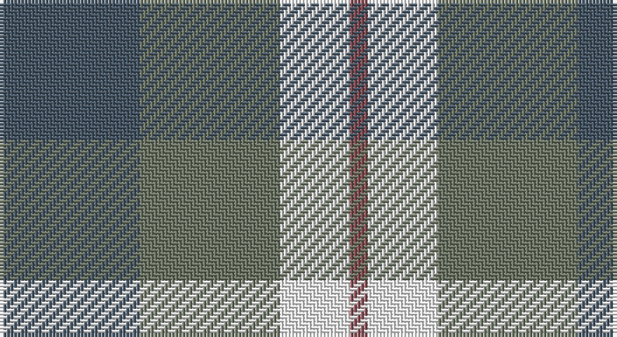

This page is one **sett** — a single exact thread-count. It belongs to the [tartan](/setts/n8y8w4o1/)
(the same proportion at any scale), whose colour order is pattern [BGWR](/stripes/bgwr/).

Sourced from register-of-tartans.  It is a [4 stripe tartan](/stripes/stripes4/).

Original link https://www.tartanregister.gov.uk/tartanDetails.aspx?ref=10258

## Register references

External register numbers recorded for this tartan.

- Scottish Register of Tartans: [10258](https://www.tartanregister.gov.uk/tartanDetails.aspx?ref=10258)

## Thread count
N/40 Na40 W20 LT/5

One full sett is **165 threads**.

## Palette

Palette: <strong>Tartan Register</strong> <small style="color:#888">(1 of 4 colours)</small>
<table><thead><tr><th>Colour</th><th>Threads</th><th>Shade</th><th>Base</th><th>OKLCh</th></tr></thead><tbody><tr><td>N/</td><td style="text-align:right;font-variant-numeric:tabular-nums">40</td><td><code style="background-color:#465665;">#465665</code> <small style="color:#888">#465665</small></td><td>B <code style="background-color:#2A418A;">#2A418A</code></td><td><small style="color:#888">oklch(44.5% 0.032 246.8)</small></td></tr><tr><td>Na</td><td style="text-align:right;font-variant-numeric:tabular-nums">40</td><td><code style="background-color:#6E7766;">#6E7766</code> <small style="color:#888">#6E7766</small></td><td>G <code style="background-color:#006100;">#006100</code></td><td><small style="color:#888">oklch(55.7% 0.028 130.1)</small></td></tr><tr><td>W</td><td style="text-align:right;font-variant-numeric:tabular-nums">20</td><td><code style="background-color:#FFFFFF;">#FFFFFF</code> <small style="color:#888">#FFFFFF</small></td><td>W <code style="background-color:#F7F7F7;">#F7F7F7</code></td><td><small style="color:#888">oklch(100.0% 0.000 89.9)</small></td></tr><tr><td>LT/</td><td style="text-align:right;font-variant-numeric:tabular-nums">5</td><td><code style="background-color:#874C52;">#874C52</code> <small style="color:#888">#874C52</small></td><td>R <code style="background-color:#CC0000;">#CC0000</code></td><td><small style="color:#888">oklch(48.8% 0.080 13.9)</small></td></tr></tbody></table>

# Sample pattern

## Nearest tartans

The nearest existing variants by ΔTartan distance, with this tartan at the top so the swatches line up against it.

ΔTartan

Tartan

Sett

—

<a href="/ttd/edit/#slug=n8y8w4o1~x5">Farooq in Livingston (Personal)</a> <a class="nn-out" href="/variants/s4/n8y8w4o1~x5/" title="open its dictionary page">↗</a>

1.42

<a href="/ttd/edit/#slug=o22ly10w3db8~x2&amp;base=n8y8w4o1~x5">Louisburg</a> <a class="nn-out" href="/variants/s4/o22ly10w3db8~x2/" title="open its dictionary page">↗</a>

1.46

<a href="/ttd/edit/#slug=db21g34r14w6~x2&amp;base=n8y8w4o1~x5">Harbison (2015)</a> <a class="nn-out" href="/variants/s4/db21g34r14w6~x2/" title="open its dictionary page">↗</a>

1.52

<a href="/ttd/edit/#slug=r1g7r3db7t1~x2&amp;base=n8y8w4o1~x5">Hebridean 4</a> <a class="nn-out" href="/variants/s5/r1g7r3db7t1~x2/" title="open its dictionary page">↗</a>

1.53

<a href="/ttd/edit/#slug=b6db6g6r1~x2&amp;base=n8y8w4o1~x5">Unnamed No 40</a> <a class="nn-out" href="/variants/s4/b6db6g6r1~x2/" title="open its dictionary page">↗</a>

1.54

<a href="/ttd/edit/#slug=p6lg15g15w2~x2&amp;base=n8y8w4o1~x5">Thistle and Kudzu Scottish Society</a> <a class="nn-out" href="/variants/s4/p6lg15g15w2~x2/" title="open its dictionary page">↗</a>

1.56

<a href="/ttd/edit/#slug=db3dg6ly1r3~x10&amp;base=n8y8w4o1~x5">Delroeux, John Michael (Personal)</a> <a class="nn-out" href="/variants/s4/db3dg6ly1r3~x10/" title="open its dictionary page">↗</a>

1.57

<a href="/ttd/edit/#slug=db9ly9db9t23r3~x2&amp;base=n8y8w4o1~x5">Tilburg (District)</a> <a class="nn-out" href="/variants/s5/db9ly9db9t23r3~x2/" title="open its dictionary page">↗</a>

1.59

<a href="/ttd/edit/#slug=g15r3p11t2~x2&amp;base=n8y8w4o1~x5">MacNab 7</a> <a class="nn-out" href="/variants/s4/g15r3p11t2~x2/" title="open its dictionary page">↗</a>

1.61

<a href="/ttd/edit/#slug=dg9dy7w7r1~x4&amp;base=n8y8w4o1~x5">MacKinnon Dress</a> <a class="nn-out" href="/variants/s4/dg9dy7w7r1~x4/" title="open its dictionary page">↗</a>

1.63

<a href="/ttd/edit/#slug=db3g6ly1r3~x10&amp;base=n8y8w4o1~x5">Delroeux (Personal)</a> <a class="nn-out" href="/variants/s4/db3g6ly1r3~x10/" title="open its dictionary page">↗</a>

## Neighbour map

Every grey dot is one of 14360 variants placed by the first two principal components of the ΔTartan feature space (44% of its variance). Red is this tartan; blue dots are its nearest — click one to open its page.

<svg viewBox="0 0 640 380" role="img" style="max-width:100%;height:auto;border:1px solid #e0e0e0;border-radius:4px;display:block" xmlns="http://www.w3.org/2000/svg"><image href="/nn/cloud.v1.png" width="640" height="380"/><a href="/variants/s4/o22ly10w3db8~x2/"><circle cx="218.7" cy="236.7" r="4" fill="#3465a4"><title>Louisburg</title></circle></a><a href="/variants/s4/db21g34r14w6~x2/"><circle cx="178.1" cy="269.4" r="4" fill="#3465a4"><title>Harbison (2015)</title></circle></a><a href="/variants/s5/r1g7r3db7t1~x2/"><circle cx="200.8" cy="251.5" r="4" fill="#3465a4"><title>Hebridean 4</title></circle></a><a href="/variants/s4/b6db6g6r1~x2/"><circle cx="147.5" cy="297.7" r="4" fill="#3465a4"><title>Unnamed No 40</title></circle></a><a href="/variants/s4/p6lg15g15w2~x2/"><circle cx="162.2" cy="246.5" r="4" fill="#3465a4"><title>Thistle and Kudzu Scottish Society</title></circle></a><a href="/variants/s4/db3dg6ly1r3~x10/"><circle cx="170.4" cy="258.1" r="4" fill="#3465a4"><title>Delroeux, John Michael (Personal)</title></circle></a><a href="/variants/s5/db9ly9db9t23r3~x2/"><circle cx="194.3" cy="246.6" r="4" fill="#3465a4"><title>Tilburg (District)</title></circle></a><a href="/variants/s4/g15r3p11t2~x2/"><circle cx="251.6" cy="249.7" r="4" fill="#3465a4"><title>MacNab 7</title></circle></a><a href="/variants/s4/dg9dy7w7r1~x4/"><circle cx="143.0" cy="248.2" r="4" fill="#3465a4"><title>MacKinnon Dress</title></circle></a><a href="/variants/s4/db3g6ly1r3~x10/"><circle cx="194.3" cy="270.5" r="4" fill="#3465a4"><title>Delroeux (Personal)</title></circle></a><circle cx="179.8" cy="257.0" r="5" fill="#c00000"/></svg>

ID: /variants/s4/n8y8w4o1~x5/
