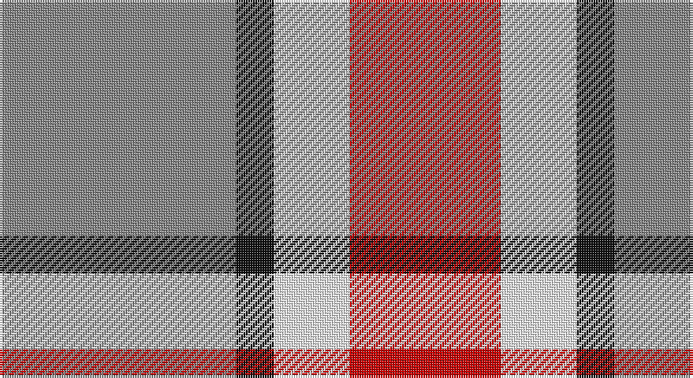

This page is one **sett** — a single exact thread-count. It belongs to the [tartan](/setts/o25k4w8r16/)
(the same proportion at any scale), whose colour order is pattern [RKWR](/stripes/rkwr/).

Sourced from tartans-authority.  It is a [4 stripe tartan](/stripes/stripes4/).

Original link http://www.tartansauthority.com/tartan-ferret/display/10702/

## Register references

External register numbers recorded for this tartan.

- Scottish Register of Tartans: [10702](https://www.tartanregister.gov.uk/tartanDetails?ref=10702)
- Scottish Tartans Authority (ITI): 10702

## Thread count
N/100 K16 W32 R/64

One full sett is **260 threads**.

## Palette

Palette: <strong>Tartan Register</strong>
<table><thead><tr><th>Colour</th><th>Threads</th><th>Shade</th><th>Base</th><th>OKLCh</th></tr></thead><tbody><tr><td>N/</td><td style="text-align:right;font-variant-numeric:tabular-nums">100</td><td><code style="background-color:#888888;">#888888</code> <small style="color:#888">#888888</small></td><td>R <code style="background-color:#CC0000;">#CC0000</code></td><td><small style="color:#888">oklch(62.7% 0.000 89.9)</small></td></tr><tr><td>K</td><td style="text-align:right;font-variant-numeric:tabular-nums">16</td><td><code style="background-color:#101010;">#101010</code> <small style="color:#888">#101010</small></td><td>K <code style="background-color:#000000;">#000000</code></td><td><small style="color:#888">oklch(17.3% 0.000 89.9)</small></td></tr><tr><td>W</td><td style="text-align:right;font-variant-numeric:tabular-nums">32</td><td><code style="background-color:#FCFCFC;">#FCFCFC</code> <small style="color:#888">#FCFCFC</small></td><td>W <code style="background-color:#F7F7F7;">#F7F7F7</code></td><td><small style="color:#888">oklch(99.1% 0.000 89.9)</small></td></tr><tr><td>R/</td><td style="text-align:right;font-variant-numeric:tabular-nums">64</td><td><code style="background-color:#C80000;">#C80000</code> <small style="color:#888">#C80000</small></td><td>R <code style="background-color:#CC0000;">#CC0000</code></td><td><small style="color:#888">oklch(52.3% 0.215 29.2)</small></td></tr></tbody></table>

# Sample pattern

## Nearest tartans

The nearest existing variants by ΔTartan distance, with this tartan at the top so the swatches line up against it.

ΔTartan

Tartan

Sett

—

<a href="/ttd/edit/#slug=o25k4w8r16~x4">Buckeye</a> <a class="nn-out" href="/variants/s4/o25k4w8r16~x4/" title="open its dictionary page">↗</a>

0.33

<a href="/ttd/edit/#slug=y25k4w8r16~x4&amp;base=o25k4w8r16~x4">Buckeye</a> <a class="nn-out" href="/variants/s4/y25k4w8r16~x4/" title="open its dictionary page">↗</a>

1.19

<a href="/ttd/edit/#slug=r8lg15b12r29w4~x2&amp;base=o25k4w8r16~x4">Snowbird (Corporate)</a> <a class="nn-out" href="/variants/s5/r8lg15b12r29w4~x2/" title="open its dictionary page">↗</a>

1.30

<a href="/ttd/edit/#slug=t2lo1r4t4w2~x10&amp;base=o25k4w8r16~x4">Doohan (New South Wales), Andrew</a> <a class="nn-out" href="/variants/s5/t2lo1r4t4w2~x10/" title="open its dictionary page">↗</a>

1.34

<a href="/ttd/edit/#slug=r12dt2ly2lb2dt4lb3~x2&amp;base=o25k4w8r16~x4">Winnipeg Embroiders' Guild (Corp.)</a> <a class="nn-out" href="/variants/s6/r12dt2ly2lb2dt4lb3~x2/" title="open its dictionary page">↗</a>

1.38

<a href="/ttd/edit/#slug=o22ly10w3db8~x2&amp;base=o25k4w8r16~x4">Louisburg</a> <a class="nn-out" href="/variants/s4/o22ly10w3db8~x2/" title="open its dictionary page">↗</a>

1.40

<a href="/ttd/edit/#slug=y26k10r10ly10y3~x2&amp;base=o25k4w8r16~x4">Ikelman No 2</a> <a class="nn-out" href="/variants/s5/y26k10r10ly10y3~x2/" title="open its dictionary page">↗</a>

1.46

<a href="/ttd/edit/#slug=b6o6w1o6b6ly1~x8&amp;base=o25k4w8r16~x4">Unidentified Lindley</a> <a class="nn-out" href="/variants/s6/b6o6w1o6b6ly1~x8/" title="open its dictionary page">↗</a>

1.48

<a href="/ttd/edit/#slug=r39t22k11ly22g5~x2&amp;base=o25k4w8r16~x4">Abbink, Ingmar (Personal)</a> <a class="nn-out" href="/variants/s5/r39t22k11ly22g5~x2/" title="open its dictionary page">↗</a>

1.48

<a href="/ttd/edit/#slug=db10w3db12ly14r4~x2&amp;base=o25k4w8r16~x4">MacLeod, of Argentina</a> <a class="nn-out" href="/variants/s5/db10w3db12ly14r4~x2/" title="open its dictionary page">↗</a>

1.48

<a href="/ttd/edit/#slug=k4t28r6w12r12w3~x2&amp;base=o25k4w8r16~x4">Thompson, D.C. (Personal)</a> <a class="nn-out" href="/variants/s6/k4t28r6w12r12w3~x2/" title="open its dictionary page">↗</a>

## Neighbour map

Every grey dot is one of 14360 variants placed by the first two principal components of the ΔTartan feature space (44% of its variance). Red is this tartan; blue dots are its nearest — click one to open its page.

<svg viewBox="0 0 640 380" role="img" style="max-width:100%;height:auto;border:1px solid #e0e0e0;border-radius:4px;display:block" xmlns="http://www.w3.org/2000/svg"><image href="/nn/cloud.v1.png" width="640" height="380"/><a href="/variants/s4/y25k4w8r16~x4/"><circle cx="208.4" cy="244.4" r="4" fill="#3465a4"><title>Buckeye</title></circle></a><a href="/variants/s5/r8lg15b12r29w4~x2/"><circle cx="267.6" cy="236.1" r="4" fill="#3465a4"><title>Snowbird (Corporate)</title></circle></a><a href="/variants/s5/t2lo1r4t4w2~x10/"><circle cx="175.3" cy="273.9" r="4" fill="#3465a4"><title>Doohan (New South Wales), Andrew</title></circle></a><a href="/variants/s6/r12dt2ly2lb2dt4lb3~x2/"><circle cx="220.6" cy="202.6" r="4" fill="#3465a4"><title>Winnipeg Embroiders' Guild (Corp.)</title></circle></a><a href="/variants/s4/o22ly10w3db8~x2/"><circle cx="218.7" cy="236.7" r="4" fill="#3465a4"><title>Louisburg</title></circle></a><a href="/variants/s5/y26k10r10ly10y3~x2/"><circle cx="199.2" cy="216.5" r="4" fill="#3465a4"><title>Ikelman No 2</title></circle></a><a href="/variants/s6/b6o6w1o6b6ly1~x8/"><circle cx="231.8" cy="248.3" r="4" fill="#3465a4"><title>Unidentified Lindley</title></circle></a><a href="/variants/s5/r39t22k11ly22g5~x2/"><circle cx="129.9" cy="204.6" r="4" fill="#3465a4"><title>Abbink, Ingmar (Personal)</title></circle></a><a href="/variants/s5/db10w3db12ly14r4~x2/"><circle cx="186.2" cy="256.5" r="4" fill="#3465a4"><title>MacLeod, of Argentina</title></circle></a><a href="/variants/s6/k4t28r6w12r12w3~x2/"><circle cx="203.0" cy="196.3" r="4" fill="#3465a4"><title>Thompson, D.C. (Personal)</title></circle></a><circle cx="204.4" cy="242.1" r="5" fill="#c00000"/></svg>

ID: /variants/s4/o25k4w8r16~x4/
