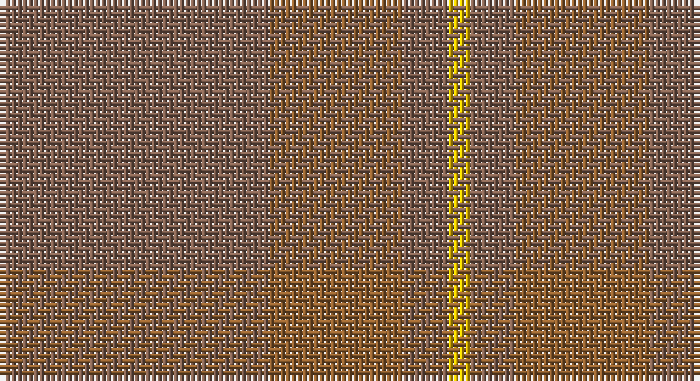

This page is one **sett** — a single exact thread-count. It belongs to the [tartan](/setts/oi12o6oi2ly1/)
(the same proportion at any scale), whose colour order is pattern [RRRY](/stripes/rrry/).

Sourced from weddslist.  It is a [4 stripe tartan](/stripes/stripes4/).

Original link http://www.weddslist.com/cgi-bin/tartans/pg.pl?source=sts

## Thread count
LTa/48 LT24 LTa8 Y/4

One full sett is **116 threads**.

## Palette

Palette: <strong>custom</strong>
<table><thead><tr><th>Colour</th><th>Threads</th><th>Shade</th><th>Base</th><th>OKLCh</th></tr></thead><tbody><tr><td>LTa/</td><td style="text-align:right;font-variant-numeric:tabular-nums">48</td><td><code style="background-color:#806050;">#806050</code> <small style="color:#888">#806050</small></td><td>R <code style="background-color:#CC0000;">#CC0000</code></td><td><small style="color:#888">oklch(51.7% 0.049 47.8)</small></td></tr><tr><td>LT</td><td style="text-align:right;font-variant-numeric:tabular-nums">24</td><td><code style="background-color:#906030;">#906030</code> <small style="color:#888">#906030</small></td><td>R <code style="background-color:#CC0000;">#CC0000</code></td><td><small style="color:#888">oklch(53.1% 0.089 63.7)</small></td></tr><tr><td>LTa</td><td style="text-align:right;font-variant-numeric:tabular-nums">8</td><td><code style="background-color:#806050;">#806050</code> <small style="color:#888">#806050</small></td><td>R <code style="background-color:#CC0000;">#CC0000</code></td><td><small style="color:#888">oklch(51.7% 0.049 47.8)</small></td></tr><tr><td>Y/</td><td style="text-align:right;font-variant-numeric:tabular-nums">4</td><td><code style="background-color:#F0C000;">#F0C000</code> <small style="color:#888">#F0C000</small></td><td>Y <code style="background-color:#F2BF00;">#F2BF00</code></td><td><small style="color:#888">oklch(82.7% 0.169 90.5)</small></td></tr></tbody></table>

# Sample pattern

## Nearest tartans

The nearest existing variants by ΔTartan distance, with this tartan at the top so the swatches line up against it.

ΔTartan

Tartan

Sett

—

<a href="/ttd/edit/#slug=oi12o6oi2ly1~x4">Loch Garth</a> <a class="nn-out" href="/variants/s4/oi12o6oi2ly1~x4/" title="open its dictionary page">↗</a>

2.67

<a href="/ttd/edit/#slug=y34n27r3n27y34w3~x2&amp;base=oi12o6oi2ly1~x4">London Regiment (Military)</a> <a class="nn-out" href="/variants/s6/y34n27r3n27y34w3~x2/" title="open its dictionary page">↗</a>

2.70

<a href="/ttd/edit/#slug=o6y2o29y29o2y6~x2&amp;base=oi12o6oi2ly1~x4">Harmony, 12</a> <a class="nn-out" href="/variants/s6/o6y2o29y29o2y6~x2/" title="open its dictionary page">↗</a>

2.70

<a href="/ttd/edit/#slug=o32w2o9ly2o12lo21r1~x2&amp;base=oi12o6oi2ly1~x4">Weathered Cyclist (Corporate)</a> <a class="nn-out" href="/variants/s7/o32w2o9ly2o12lo21r1~x2/" title="open its dictionary page">↗</a>

2.76

<a href="/ttd/edit/#slug=t48o28w4o28t48ly3~x2&amp;base=oi12o6oi2ly1~x4">McKerrell of Hillhouse Dress</a> <a class="nn-out" href="/variants/s6/t48o28w4o28t48ly3~x2/" title="open its dictionary page">↗</a>

2.87

<a href="/ttd/edit/#slug=lo5n2y8n1y8n4y4n6y18lr1lo5~x2&amp;base=oi12o6oi2ly1~x4">Bute Heather, Ancient Wth'd (Fashion</a> <a class="nn-out" href="/variants/s11/lo5n2y8n1y8n4y4n6y18lr1lo5~x2/" title="open its dictionary page">↗</a>

3.03

<a href="/ttd/edit/#slug=y14n7lo6n2~x8&amp;base=oi12o6oi2ly1~x4">Outlander #3</a> <a class="nn-out" href="/variants/s4/y14n7lo6n2~x8/" title="open its dictionary page">↗</a>

3.12

<a href="/ttd/edit/#slug=r5n35r46o5~x2&amp;base=oi12o6oi2ly1~x4">Bryce</a> <a class="nn-out" href="/variants/s4/r5n35r46o5~x2/" title="open its dictionary page">↗</a>

3.15

<a href="/ttd/edit/#slug=do11n1do4n8r1~x8&amp;base=oi12o6oi2ly1~x4">Cairns, David (Personal)</a> <a class="nn-out" href="/variants/s5/do11n1do4n8r1~x8/" title="open its dictionary page">↗</a>

3.17

<a href="/ttd/edit/#slug=y9yi52dy15ly4~x2&amp;base=oi12o6oi2ly1~x4">McGuigan, Julia (St Monans, Fife) (Personal)</a> <a class="nn-out" href="/variants/s4/y9yi52dy15ly4~x2/" title="open its dictionary page">↗</a>

3.21

<a href="/ttd/edit/#slug=dy6dg2dy29dg29dy2dg6~x2&amp;base=oi12o6oi2ly1~x4">Harmony 11 #2</a> <a class="nn-out" href="/variants/s6/dy6dg2dy29dg29dy2dg6~x2/" title="open its dictionary page">↗</a>

## Neighbour map

Every grey dot is one of 14360 variants placed by the first two principal components of the ΔTartan feature space (44% of its variance). Red is this tartan; blue dots are its nearest — click one to open its page.

<svg viewBox="0 0 640 380" role="img" style="max-width:100%;height:auto;border:1px solid #e0e0e0;border-radius:4px;display:block" xmlns="http://www.w3.org/2000/svg"><image href="/nn/cloud.v1.png" width="640" height="380"/><a href="/variants/s6/y34n27r3n27y34w3~x2/"><circle cx="468.5" cy="328.4" r="4" fill="#3465a4"><title>London Regiment (Military)</title></circle></a><a href="/variants/s6/o6y2o29y29o2y6~x2/"><circle cx="626.0" cy="359.7" r="4" fill="#3465a4"><title>Harmony, 12</title></circle></a><a href="/variants/s7/o32w2o9ly2o12lo21r1~x2/"><circle cx="609.4" cy="248.6" r="4" fill="#3465a4"><title>Weathered Cyclist (Corporate)</title></circle></a><a href="/variants/s6/t48o28w4o28t48ly3~x2/"><circle cx="550.9" cy="328.9" r="4" fill="#3465a4"><title>McKerrell of Hillhouse Dress</title></circle></a><a href="/variants/s11/lo5n2y8n1y8n4y4n6y18lr1lo5~x2/"><circle cx="560.0" cy="292.2" r="4" fill="#3465a4"><title>Bute Heather, Ancient Wth'd (Fashion</title></circle></a><a href="/variants/s4/y14n7lo6n2~x8/"><circle cx="437.4" cy="366.0" r="4" fill="#3465a4"><title>Outlander #3</title></circle></a><a href="/variants/s4/r5n35r46o5~x2/"><circle cx="529.2" cy="338.0" r="4" fill="#3465a4"><title>Bryce</title></circle></a><a href="/variants/s5/do11n1do4n8r1~x8/"><circle cx="545.4" cy="340.3" r="4" fill="#3465a4"><title>Cairns, David (Personal)</title></circle></a><a href="/variants/s4/y9yi52dy15ly4~x2/"><circle cx="537.9" cy="304.1" r="4" fill="#3465a4"><title>McGuigan, Julia (St Monans, Fife) (Personal)</title></circle></a><a href="/variants/s6/dy6dg2dy29dg29dy2dg6~x2/"><circle cx="622.7" cy="366.0" r="4" fill="#3465a4"><title>Harmony 11 #2</title></circle></a><circle cx="620.0" cy="354.7" r="5" fill="#c00000"/></svg>

ID: /variants/s4/oi12o6oi2ly1~x4/
