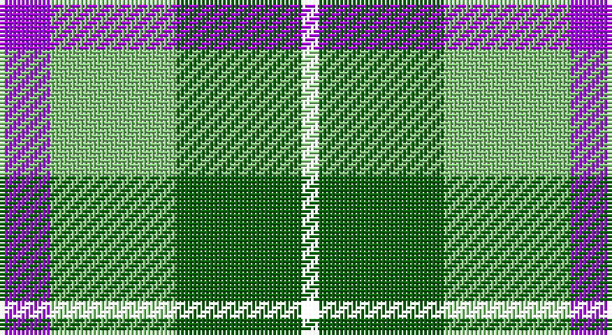

This page is one **sett** — a single exact thread-count. It belongs to the [tartan](/setts/p6lg15g15k2/)
(the same proportion at any scale), whose colour order is pattern [BYGK](/stripes/bygk/).

Sourced from house-of-tartan.  It is a [4 stripe tartan](/stripes/stripes4/).

Original link http://www.house-of-tartan.scotland.net/house/TartanViewjs.asp?colr=Def&tnam=10655

## Provenance

Earliest known date: 01/09/2010 The Thistle and Kudzu Scottish Society of Athens is an informal group that organizes and supports Scottish activities in Athens, Georgia, USA. Activities include Royal Scottish Country Dance lessons and demonstrations, annual Robert Burns Dinners, a Scottish Festival, and the Thistle & Kudzu Pipes and Drums band and piping lessons. In 2010 a tartan design contest was organized to create a unique tartan that represented the Thistle and Kudzu Scottish Society. Members used an online tartan design programme (http://www.houseoftartan.co.uk/interactive/weaver/index.html) to create and submit various tartan designs that were then voted on by the Scottish dance class. The design that received the most votes was selected as the official tartan of the group. The overall design was submitted by Stephanie Bohan and the thread count established for weaving by Dorothy Harnish. Colours: dark green represents the kudzu vine which grows abundantly throughout Georgia and is well known in that state; light green, purple and white represent the thistle plant and flower in bloom.

## Thread count
P/12 LG30 G30 W/4

One full sett is **136 threads**.

## Palette

Palette: <strong>Tartan Register</strong> <small style="color:#888">(2 of 3 colours)</small>
<table><thead><tr><th>Colour</th><th>Threads</th><th>Shade</th><th>Base</th><th>OKLCh</th></tr></thead><tbody><tr><td>P/</td><td style="text-align:right;font-variant-numeric:tabular-nums">12</td><td><code style="background-color:#AA00FF;">#AA00FF</code> <small style="color:#888">#AA00FF</small></td><td>B <code style="background-color:#2A418A;">#2A418A</code></td><td><small style="color:#888">oklch(58.1% 0.299 307.0)</small></td></tr><tr><td>LG</td><td style="text-align:right;font-variant-numeric:tabular-nums">30</td><td><code style="background-color:#86C87C;">#86C87C</code> <small style="color:#888">#86C87C</small></td><td>Y <code style="background-color:#F2BF00;">#F2BF00</code></td><td><small style="color:#888">oklch(77.0% 0.125 141.2)</small></td></tr><tr><td>G</td><td style="text-align:right;font-variant-numeric:tabular-nums">30</td><td><code style="background-color:#006400;">#006400</code> <small style="color:#888">#006400</small></td><td>G <code style="background-color:#006100;">#006100</code></td><td><small style="color:#888">oklch(43.6% 0.148 142.5)</small></td></tr><tr><td>/</td><td style="text-align:right;font-variant-numeric:tabular-nums">4</td><td><code style="background-color:;"></code> <small style="color:#888"></small></td><td> <code style="background-color:;"></code></td><td><small style="color:#888"></small></td></tr></tbody></table>

# Sample pattern

## Nearest tartans

The nearest existing variants by ΔTartan distance, with this tartan at the top so the swatches line up against it.

ΔTartan

Tartan

Sett

—

<a href="/ttd/edit/#slug=p6lg15g15k2~x2">Thistle and Kudzu Scottish Socie Corporate Tartan</a> <a class="nn-out" href="/variants/s4/p6lg15g15k2~x2/" title="open its dictionary page">↗</a>

0.50

<a href="/ttd/edit/#slug=p6lg15g15w2~x2&amp;base=p6lg15g15k2~x2">Thistle and Kudzu Scottish Society</a> <a class="nn-out" href="/variants/s4/p6lg15g15w2~x2/" title="open its dictionary page">↗</a>

1.17

<a href="/ttd/edit/#slug=dg9dy7w7r1~x4&amp;base=p6lg15g15k2~x2">MacKinnon Dress</a> <a class="nn-out" href="/variants/s4/dg9dy7w7r1~x4/" title="open its dictionary page">↗</a>

1.27

<a href="/ttd/edit/#slug=g9dr7w7r1~x4&amp;base=p6lg15g15k2~x2">MacKinnon Dress Trade Tartan</a> <a class="nn-out" href="/variants/s4/g9dr7w7r1~x4/" title="open its dictionary page">↗</a>

1.27

<a href="/ttd/edit/#slug=g9o7w7r1~x4&amp;base=p6lg15g15k2~x2">MacKinnon, dress</a> <a class="nn-out" href="/variants/s4/g9o7w7r1~x4/" title="open its dictionary page">↗</a>

1.34

<a href="/ttd/edit/#slug=k4g14k14g2w14b3~x2&amp;base=p6lg15g15k2~x2">MacKay, Dress (Corporate)</a> <a class="nn-out" href="/variants/s6/k4g14k14g2w14b3~x2/" title="open its dictionary page">↗</a>

1.35

<a href="/ttd/edit/#slug=k9w38k22g31k5g31ly5&amp;base=p6lg15g15k2~x2">Lawsons' Whisky</a> <a class="nn-out" href="/variants/s7/k9w38k22g31k5g31ly5/" title="open its dictionary page">↗</a>

1.43

<a href="/ttd/edit/#slug=r3w8db4g14r4db2~x2&amp;base=p6lg15g15k2~x2">MacIntosh, dress</a> <a class="nn-out" href="/variants/s6/r3w8db4g14r4db2~x2/" title="open its dictionary page">↗</a>

1.48

<a href="/ttd/edit/#slug=db21g34r14w6~x2&amp;base=p6lg15g15k2~x2">Harbison (2015)</a> <a class="nn-out" href="/variants/s4/db21g34r14w6~x2/" title="open its dictionary page">↗</a>

1.51

<a href="/ttd/edit/#slug=r2db10k5g12w2~x2&amp;base=p6lg15g15k2~x2">Davidson of Tulloch</a> <a class="nn-out" href="/variants/s5/r2db10k5g12w2~x2/" title="open its dictionary page">↗</a>

1.52

<a href="/ttd/edit/#slug=b2g13b11y4w9b2~x2&amp;base=p6lg15g15k2~x2">Loch Leven</a> <a class="nn-out" href="/variants/s6/b2g13b11y4w9b2~x2/" title="open its dictionary page">↗</a>

## Neighbour map

Every grey dot is one of 14360 variants placed by the first two principal components of the ΔTartan feature space (44% of its variance). Red is this tartan; blue dots are its nearest — click one to open its page.

<svg viewBox="0 0 640 380" role="img" style="max-width:100%;height:auto;border:1px solid #e0e0e0;border-radius:4px;display:block" xmlns="http://www.w3.org/2000/svg"><image href="/nn/cloud.v1.png" width="640" height="380"/><a href="/variants/s4/p6lg15g15w2~x2/"><circle cx="162.2" cy="246.5" r="4" fill="#3465a4"><title>Thistle and Kudzu Scottish Society</title></circle></a><a href="/variants/s4/dg9dy7w7r1~x4/"><circle cx="143.0" cy="248.2" r="4" fill="#3465a4"><title>MacKinnon Dress</title></circle></a><a href="/variants/s4/g9dr7w7r1~x4/"><circle cx="139.8" cy="244.6" r="4" fill="#3465a4"><title>MacKinnon Dress Trade Tartan</title></circle></a><a href="/variants/s4/g9o7w7r1~x4/"><circle cx="148.9" cy="247.9" r="4" fill="#3465a4"><title>MacKinnon, dress</title></circle></a><a href="/variants/s6/k4g14k14g2w14b3~x2/"><circle cx="120.0" cy="223.8" r="4" fill="#3465a4"><title>MacKay, Dress (Corporate)</title></circle></a><a href="/variants/s7/k9w38k22g31k5g31ly5/"><circle cx="151.0" cy="213.0" r="4" fill="#3465a4"><title>Lawsons' Whisky</title></circle></a><a href="/variants/s6/r3w8db4g14r4db2~x2/"><circle cx="150.5" cy="217.2" r="4" fill="#3465a4"><title>MacIntosh, dress</title></circle></a><a href="/variants/s4/db21g34r14w6~x2/"><circle cx="178.1" cy="269.4" r="4" fill="#3465a4"><title>Harbison (2015)</title></circle></a><a href="/variants/s5/r2db10k5g12w2~x2/"><circle cx="119.2" cy="226.1" r="4" fill="#3465a4"><title>Davidson of Tulloch</title></circle></a><a href="/variants/s6/b2g13b11y4w9b2~x2/"><circle cx="131.2" cy="234.4" r="4" fill="#3465a4"><title>Loch Leven</title></circle></a><circle cx="157.5" cy="246.5" r="5" fill="#c00000"/></svg>

ID: /variants/s4/p6lg15g15k2~x2/
