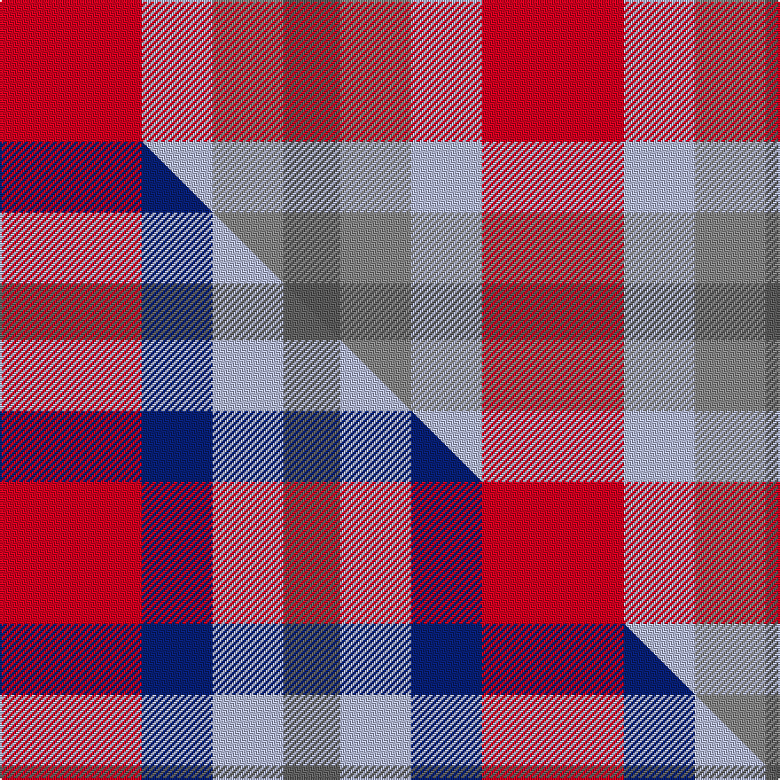

This is one **variant** — a specific cloth: this exact thread count and colourway, with its own
provenance below. It is one weaving of the [sett](/tartans/h/ha/haggis-hostels/) (the scale-free proportion — the
same cloth at any scale or shade), whose colour order is pattern [BRWR](/stripes/brwr/).

Part of the [Haggis Hostels](/tartans/h/ha/haggis-hostels/) tartan — the named design grouping this sett with its other cloths.

Sourced from tartans-authority.  It is a [4 stripe tartan](/stripes/stripes4/).

Original link <code>http://www.tartansauthority.com/tartan-ferret/display/11035/</code> — retired · [Internet Archive copy](https://web.archive.org/web/*/http://www.tartansauthority.com/tartan-ferret/display/11035/*)

Dataset <small>— provenance for this record, inherited from the source manifest</small>

<dl class="dataset-prov">
<dt>source</dt><dd><a href="/sources/tartans-authority/">Scottish Tartans Authority</a></dd>
<dt>data captured from</dt><dd><a href="https://github.com/thetartan/tartan-database/blob/master/data/tartans-authority/data.csv">https://github.com/thetartan/tartan-database/blob/master/data/tartans-authority/data.csv</a></dd>
<dt>data date</dt><dd>2014 <small>(this record)</small></dd>
<dt>licence</dt><dd><a href="https://creativecommons.org/licenses/by-nc-nd/4.0/">CC BY-NC-ND 4.0</a></dd>
</dl>

Capture chain <small>— the hands this data passed through, oldest first; each capture carries its own licence</small>

<ol class="capture-chain">
<li><a href="https://www.tartansauthority.com/">Scottish Tartans Authority</a> <small>the heritage body’s archive — its tartan-ferret record browser is retired; dead record links are shown unlinked, with an Internet Archive copy (ITI numbers are not SRT references)</small></li>
<li><a href="https://github.com/thetartan/tartan-database">thetartan/tartan-database</a> <small>2016-2017</small> · <a href="https://creativecommons.org/licenses/by-nc-nd/4.0/">CC BY-NC-ND 4.0</a> <small>Levko Kravets's frozen compilation — the capture we vendored, and where its CC licence text came from</small></li>
<li>this dictionary <small>captured 2026-06-10 · commit 5bf86c7566</small> <small>each re-capture is a git commit to data/sources</small></li>
</ol>

## Register references

External register numbers recorded for this tartan.

- Scottish Register of Tartans: [11035](https://www.tartanregister.gov.uk/tartanDetails?ref=11035)
- Scottish Tartans Authority (ITI): 11035

## Thread count
R/80 LB40 O40 N/32

One full sett is **272 threads**.

## Palette
<table><thead><tr><th>Colour</th><th>Shade</th><th>OKLCh</th></tr></thead><tbody><tr><td>LB</td><td><code style="background-color:#B5BBDE;">#B5BBDE</code> <small style="color:#888">#B5BBDE</small></td><td><small style="color:#888">oklch(79.9% 0.050 277.6)</small></td></tr><tr><td>R</td><td><code style="background-color:#D60020;">#D60020</code> <small style="color:#888">#D60020</small></td><td><small style="color:#888">oklch(55.2% 0.224 25.5)</small></td></tr><tr><td>N</td><td><code style="background-color:#5C5C5C;">#5C5C5C</code> <small style="color:#888">#5C5C5C</small></td><td><small style="color:#888">oklch(47.5% 0.000 89.9)</small></td></tr><tr><td>O</td><td><code style="background-color:#888888;">#888888</code> <small style="color:#888">#888888</small></td><td><small style="color:#888">oklch(62.7% 0.000 89.9)</small></td></tr></tbody></table>

# Sample pattern

## Compared to the master

This cloth is one sett of its design; the master sett (the exemplar the design is anchored on) is below for comparison.

Its **ΔTartan distance** from the master is **1.00** — the same measure the nearest-tartans table ranks by (0 is identical; a re-scale of the same cloth is near 0, a recolour or a different proportion further).

<figure class="master-compare" style="margin:0">

this sett
master sett ★

<figcaption style="color:#888;font-size:smaller">One weave of this sett against the <a href="/setts/r10db5lb5n4/">master sett ★</a>, split on the diagonal: a shared proportion runs seamlessly across it with only the shades shifting; a different proportion breaks on it.</figcaption>
</figure>

## Nearest tartan variants

The nearest existing variants by ΔTartan distance, with this cloth at the top so the swatches line up against it.

ΔTartan

Threads

Variant

Sett

—

272

<a href="/variants/s4/r10lb5o5n4~x8~o2500000-n1900000/">Haggis Hostels</a>

<a href="/ttd/edit/#slug=r10db5lb5n4~x8&amp;base=r10lb5o5n4~x8~o2500000-n1900000" title="compare in the TTD">1.00</a>

272

<a href="/variants/s4/r10db5lb5n4~x8/">Haggis Hostels</a>

<a href="/ttd/edit/#slug=lb24o9n23y3~x2~o2500000-n1900000&amp;base=r10lb5o5n4~x8~o2500000-n1900000" title="compare in the TTD">1.84</a>

182

<a href="/variants/s4/lb24o9n23y3~x2~o2500000-n1900000/">Porcelanosa</a>

<a href="/ttd/edit/#slug=r5db12g11n21y5~x2&amp;base=r10lb5o5n4~x8~o2500000-n1900000" title="compare in the TTD">2.40</a>

196

<a href="/variants/s5/r5db12g11n21y5~x2/">Inspiration</a>

<a href="/ttd/edit/#slug=dy5n21ly11db12r5~x2&amp;base=r10lb5o5n4~x8~o2500000-n1900000" title="compare in the TTD">2.41</a>

196

<a href="/variants/s5/dy5n21ly11db12r5~x2/">Inspiration</a>

<a href="/ttd/edit/#slug=r2g2lb1~x4&amp;base=r10lb5o5n4~x8~o2500000-n1900000" title="compare in the TTD">2.83</a>

28

<a href="/variants/s3/r2g2lb1~x4/">Wilson's, No 207</a>

<a href="/ttd/edit/#slug=w9r23g23w9~x2&amp;base=r10lb5o5n4~x8~o2500000-n1900000" title="compare in the TTD">2.89</a>

220

<a href="/variants/s4/w9r23g23w9~x2/">Quaboos Pipers Plaid Regimental Tartan</a>

<a href="/ttd/edit/#slug=g7lb2r4~x2~r2109032&amp;base=r10lb5o5n4~x8~o2500000-n1900000" title="compare in the TTD">2.97</a>

30

<a href="/variants/s3/g7lb2r4~x2~r2109032/">Wilson's No.208</a>

<a href="/ttd/edit/#slug=g7lb2r4~x2&amp;base=r10lb5o5n4~x8~o2500000-n1900000" title="compare in the TTD">3.03</a>

30

<a href="/variants/s3/g7lb2r4~x2/">Wilson's, No 208</a>

<a href="/ttd/edit/#slug=lb2r4g5y1~x4&amp;base=r10lb5o5n4~x8~o2500000-n1900000" title="compare in the TTD">3.19</a>

84

<a href="/variants/s4/lb2r4g5y1~x4/">Wilson's No.203</a>

<a href="/ttd/edit/#slug=r1b2o1~x10&amp;base=r10lb5o5n4~x8~o2500000-n1900000" title="compare in the TTD">3.48</a>

60

<a href="/variants/s3/r1b2o1~x10/">Glenmorangie, Check</a>

## Neighbour map

Every grey dot is one of 13656 variants placed by the first two principal components of the ΔTartan feature space (42% of its variance). Red is this tartan; blue dots are its nearest — click one to open its page. The map is a flat projection of a many-dimensional space — [how to read it](/posts/neighbourhood-maps/).

<svg viewBox="0 0 640 380" role="img" style="max-width:100%;height:auto;border:1px solid #e0e0e0;border-radius:4px;display:block" xmlns="http://www.w3.org/2000/svg"><image href="/nn/cloud.v1.png" width="640" height="380"/><a href="/variants/s4/r10db5lb5n4~x8/"><circle cx="163.0" cy="330.1" r="4" fill="#3465a4"><title>Haggis Hostels</title></circle></a><a href="/variants/s4/lb24o9n23y3~x2~o2500000-n1900000/"><circle cx="296.7" cy="291.1" r="4" fill="#3465a4"><title>Porcelanosa</title></circle></a><a href="/variants/s5/r5db12g11n21y5~x2/"><circle cx="201.6" cy="295.8" r="4" fill="#3465a4"><title>Inspiration</title></circle></a><a href="/variants/s5/dy5n21ly11db12r5~x2/"><circle cx="147.7" cy="273.5" r="4" fill="#3465a4"><title>Inspiration</title></circle></a><a href="/variants/s3/r2g2lb1~x4/"><circle cx="189.8" cy="366.0" r="4" fill="#3465a4"><title>Wilson's, No 207</title></circle></a><a href="/variants/s4/w9r23g23w9~x2/"><circle cx="155.8" cy="334.4" r="4" fill="#3465a4"><title>Quaboos Pipers Plaid Regimental Tartan</title></circle></a><a href="/variants/s3/g7lb2r4~x2~r2109032/"><circle cx="257.7" cy="326.7" r="4" fill="#3465a4"><title>Wilson's No.208</title></circle></a><a href="/variants/s3/g7lb2r4~x2/"><circle cx="289.5" cy="339.6" r="4" fill="#3465a4"><title>Wilson's, No 208</title></circle></a><a href="/variants/s4/lb2r4g5y1~x4/"><circle cx="223.6" cy="298.4" r="4" fill="#3465a4"><title>Wilson's No.203</title></circle></a><a href="/variants/s3/r1b2o1~x10/"><circle cx="280.2" cy="366.0" r="4" fill="#3465a4"><title>Glenmorangie, Check</title></circle></a><circle cx="218.9" cy="349.3" r="5" fill="#c00000"/><text x="320" y="376" text-anchor="middle" font-size="11" fill="#999">ground</text><text x="11" y="190" text-anchor="middle" font-size="11" fill="#999" transform="rotate(-90 11 190)">complexity</text></svg>

ID: /variants/s4/r10lb5o5n4~x8~o2500000-n1900000/
