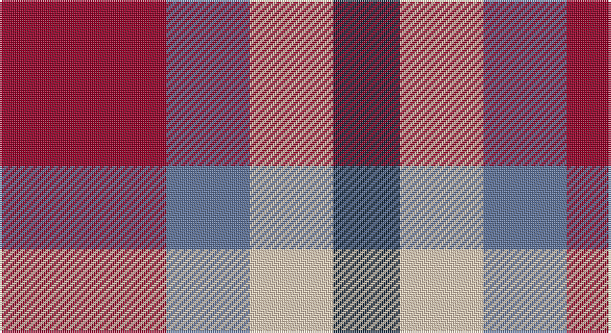

This page is one **sett** — a single exact thread-count. It belongs to the [tartan](/setts/r10t5lb5dt4/)
(the same proportion at any scale), whose colour order is pattern [BWBR](/stripes/bwbr/).

Part of the [Haggis Hostels](/tartans/haggis-hostels/) tartan — the named design grouping this sett with its other cloths.

Sourced from register-of-tartans.  It is a [4 stripe tartan](/stripes/stripes4/).

Original link https://www.tartanregister.gov.uk/tartanDetails.aspx?ref=11035

## Register references

External register numbers recorded for this tartan.

- Scottish Register of Tartans: [11035](https://www.tartanregister.gov.uk/tartanDetails.aspx?ref=11035)

## Thread count
DR/80 B40 LR40 DN/32

One full sett is **272 threads**.

## Palette

Palette: <strong>Tartan Register</strong>
<table><thead><tr><th>Colour</th><th>Threads</th><th>Shade</th><th>Base</th><th>OKLCh</th></tr></thead><tbody><tr><td>DR/</td><td style="text-align:right;font-variant-numeric:tabular-nums">80</td><td><code style="background-color:#960028;">#960028</code> <small style="color:#888">#960028</small></td><td>R <code style="background-color:#CC0000;">#CC0000</code></td><td><small style="color:#888">oklch(42.7% 0.171 18.3)</small></td></tr><tr><td>B</td><td style="text-align:right;font-variant-numeric:tabular-nums">40</td><td><code style="background-color:#5F749C;">#5F749C</code> <small style="color:#888">#5F749C</small></td><td>B <code style="background-color:#2A418A;">#2A418A</code></td><td><small style="color:#888">oklch(55.8% 0.067 262.9)</small></td></tr><tr><td>LR</td><td style="text-align:right;font-variant-numeric:tabular-nums">40</td><td><code style="background-color:#E8CCB8;">#E8CCB8</code> <small style="color:#888">#E8CCB8</small></td><td>W <code style="background-color:#F7F7F7;">#F7F7F7</code></td><td><small style="color:#888">oklch(86.3% 0.042 57.7)</small></td></tr><tr><td>DN/</td><td style="text-align:right;font-variant-numeric:tabular-nums">32</td><td><code style="background-color:#14283C;">#14283C</code> <small style="color:#888">#14283C</small></td><td>B <code style="background-color:#2A418A;">#2A418A</code></td><td><small style="color:#888">oklch(27.1% 0.046 249.9)</small></td></tr></tbody></table>

# Sample pattern

## Nearest tartans

The nearest existing variants by ΔTartan distance, with this tartan at the top so the swatches line up against it.

ΔTartan

Tartan

Sett

—

<a href="/ttd/edit/#slug=r10t5lb5dt4~x8">Haggis Hostels</a> <a class="nn-out" href="/variants/s4/r10t5lb5dt4~x8/" title="open its dictionary page">↗</a>

1.13

<a href="/ttd/edit/#slug=r1g3p3w1~x4&amp;base=r10t5lb5dt4~x8">Wilson's, No 113</a> <a class="nn-out" href="/variants/s4/r1g3p3w1~x4/" title="open its dictionary page">↗</a>

1.18

<a href="/ttd/edit/#slug=o16dr21r32w16~x2&amp;base=r10t5lb5dt4~x8">Bloomer-Alexander (Personal)</a> <a class="nn-out" href="/variants/s4/o16dr21r32w16~x2/" title="open its dictionary page">↗</a>

1.36

<a href="/ttd/edit/#slug=k7r5w3db2~x4&amp;base=r10t5lb5dt4~x8">Thomas Newcomen's Combustion Engine</a> <a class="nn-out" href="/variants/s4/k7r5w3db2~x4/" title="open its dictionary page">↗</a>

1.41

<a href="/ttd/edit/#slug=db18t18lo28dt13~x2&amp;base=r10t5lb5dt4~x8">Gold Country (California)</a> <a class="nn-out" href="/variants/s4/db18t18lo28dt13~x2/" title="open its dictionary page">↗</a>

1.42

<a href="/ttd/edit/#slug=n2r1k1lr1~x10&amp;base=r10t5lb5dt4~x8">Kucher, Gregory (Personal)</a> <a class="nn-out" href="/variants/s4/n2r1k1lr1~x10/" title="open its dictionary page">↗</a>

1.54

<a href="/ttd/edit/#slug=g12r11dp12ri3dp8g8dp8~x2&amp;base=r10t5lb5dt4~x8">Fiddes (Corrected)</a> <a class="nn-out" href="/variants/s7/g12r11dp12ri3dp8g8dp8~x2/" title="open its dictionary page">↗</a>

1.57

<a href="/ttd/edit/#slug=t2lo1r4t4w2~x10&amp;base=r10t5lb5dt4~x8">Doohan (New South Wales), Andrew</a> <a class="nn-out" href="/variants/s5/t2lo1r4t4w2~x10/" title="open its dictionary page">↗</a>

1.62

<a href="/ttd/edit/#slug=p3k3p3g6r2~x2&amp;base=r10t5lb5dt4~x8">Austin / Wilson's No 137</a> <a class="nn-out" href="/variants/s5/p3k3p3g6r2~x2/" title="open its dictionary page">↗</a>

1.68

<a href="/ttd/edit/#slug=db9r12dg9db5w2~x4&amp;base=r10t5lb5dt4~x8">Battle of Prestonpans (1745) Herit</a> <a class="nn-out" href="/variants/s5/db9r12dg9db5w2~x4/" title="open its dictionary page">↗</a>

1.69

<a href="/ttd/edit/#slug=r3g1k3w1~x20&amp;base=r10t5lb5dt4~x8">SAL Glindrande Stiernan</a> <a class="nn-out" href="/variants/s4/r3g1k3w1~x20/" title="open its dictionary page">↗</a>

## Neighbour map

Every grey dot is one of 14360 variants placed by the first two principal components of the ΔTartan feature space (44% of its variance). Red is this tartan; blue dots are its nearest — click one to open its page.

<svg viewBox="0 0 640 380" role="img" style="max-width:100%;height:auto;border:1px solid #e0e0e0;border-radius:4px;display:block" xmlns="http://www.w3.org/2000/svg"><image href="/nn/cloud.v1.png" width="640" height="380"/><a href="/variants/s4/r1g3p3w1~x4/"><circle cx="119.1" cy="286.4" r="4" fill="#3465a4"><title>Wilson's, No 113</title></circle></a><a href="/variants/s4/o16dr21r32w16~x2/"><circle cx="72.0" cy="322.1" r="4" fill="#3465a4"><title>Bloomer-Alexander (Personal)</title></circle></a><a href="/variants/s4/k7r5w3db2~x4/"><circle cx="104.2" cy="273.1" r="4" fill="#3465a4"><title>Thomas Newcomen's Combustion Engine</title></circle></a><a href="/variants/s4/db18t18lo28dt13~x2/"><circle cx="54.5" cy="331.7" r="4" fill="#3465a4"><title>Gold Country (California)</title></circle></a><a href="/variants/s4/n2r1k1lr1~x10/"><circle cx="104.6" cy="340.7" r="4" fill="#3465a4"><title>Kucher, Gregory (Personal)</title></circle></a><a href="/variants/s7/g12r11dp12ri3dp8g8dp8~x2/"><circle cx="149.6" cy="282.5" r="4" fill="#3465a4"><title>Fiddes (Corrected)</title></circle></a><a href="/variants/s5/t2lo1r4t4w2~x10/"><circle cx="175.3" cy="273.9" r="4" fill="#3465a4"><title>Doohan (New South Wales), Andrew</title></circle></a><a href="/variants/s5/p3k3p3g6r2~x2/"><circle cx="85.0" cy="295.3" r="4" fill="#3465a4"><title>Austin / Wilson's No 137</title></circle></a><a href="/variants/s5/db9r12dg9db5w2~x4/"><circle cx="150.2" cy="264.3" r="4" fill="#3465a4"><title>Battle of Prestonpans (1745) Herit</title></circle></a><a href="/variants/s4/r3g1k3w1~x20/"><circle cx="102.5" cy="271.1" r="4" fill="#3465a4"><title>SAL Glindrande Stiernan</title></circle></a><circle cx="112.6" cy="306.3" r="5" fill="#c00000"/></svg>

ID: /variants/s4/r10t5lb5dt4~x8/
