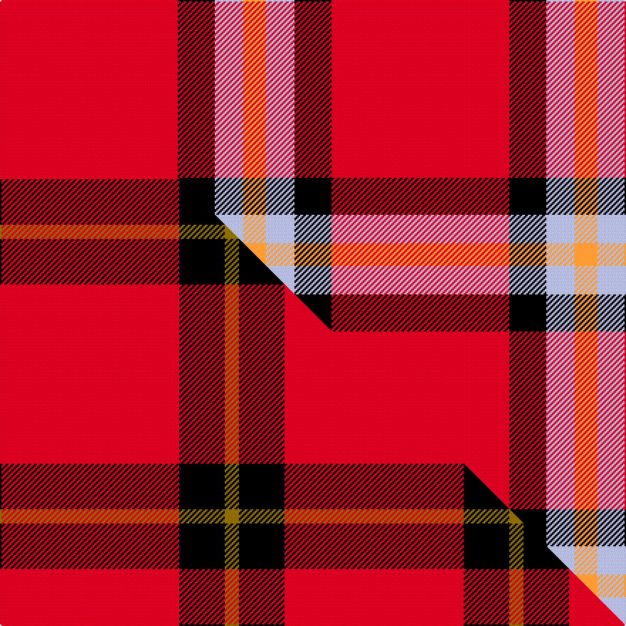

This is one **variant** — a specific cloth: this exact thread count and colourway, with its own
provenance below. It is one weaving of the [sett](/setts/r125k26lb20lo16/) (the scale-free proportion — the
same cloth at any scale or shade), whose colour order is pattern [RKWY](/stripes/rkwy/).

Part of the [McPeek](/tartans/m/mc/mcpeek/) tartan — the named design grouping this sett with its other cloths.

Sourced from tartans-authority.  It is a [4 stripe tartan](/stripes/stripes4/).

Original link [https://www.tartanregister.gov.uk/tartanDetails.aspx?ref=10188](https://www.tartanregister.gov.uk/tartanDetails.aspx?ref=10188)

Dataset <small>— provenance for this record, inherited from the source manifest</small>

<dl class="dataset-prov">
<dt>source</dt><dd><a href="/sources/tartans-authority/">Scottish Tartans Authority</a></dd>
<dt>data captured from</dt><dd><a href="https://github.com/thetartan/tartan-database/blob/master/data/tartans-authority/data.csv">https://github.com/thetartan/tartan-database/blob/master/data/tartans-authority/data.csv</a></dd>
<dt>data date</dt><dd>1st March 2010 <small>(this record)</small></dd>
<dt>licence</dt><dd><a href="https://creativecommons.org/licenses/by-nc-nd/4.0/">CC BY-NC-ND 4.0</a></dd>
</dl>

Capture chain <small>— the hands this data passed through, oldest first; each capture carries its own licence</small>

<ol class="capture-chain">
<li><a href="https://www.tartansauthority.com/">Scottish Tartans Authority</a> <small>the heritage body's archive — its tartan-ferret record browser is retired (links repaired to the SRT, above)</small></li>
<li><a href="https://github.com/thetartan/tartan-database">thetartan/tartan-database</a> <small>2016-2017</small> · <a href="https://creativecommons.org/licenses/by-nc-nd/4.0/">CC BY-NC-ND 4.0</a> <small>Levko Kravets's frozen compilation — the capture we vendored, and where its CC licence text came from</small></li>
<li>this dictionary <small>captured 2026-06-10 · commit 5bf86c7566</small> <small>each re-capture is a git commit to data/sources</small></li>
</ol>

## Register references

External register numbers recorded for this tartan.

- Scottish Register of Tartans: [10188](https://www.tartanregister.gov.uk/tartanDetails?ref=10188)
- Scottish Tartans Authority (ITI): 10188

## Thread count
R/125 K26 LB20 LO/16

One full sett is **233 threads**.

## Palette
<table><thead><tr><th>Colour</th><th>Shade</th><th>OKLCh</th></tr></thead><tbody><tr><td>K</td><td><code style="background-color:#000000;">#000000</code> <small style="color:#888">#000000</small></td><td><small style="color:#888">oklch(0.0% 0.000 0.0)</small></td></tr><tr><td>LB</td><td><code style="background-color:#B5BBDE;">#B5BBDE</code> <small style="color:#888">#B5BBDE</small></td><td><small style="color:#888">oklch(79.9% 0.050 277.6)</small></td></tr><tr><td>R</td><td><code style="background-color:#D60020;">#D60020</code> <small style="color:#888">#D60020</small></td><td><small style="color:#888">oklch(55.2% 0.224 25.5)</small></td></tr><tr><td>LO</td><td><code style="background-color:#FF9C34;">#FF9C34</code> <small style="color:#888">#FF9C34</small></td><td><small style="color:#888">oklch(77.9% 0.161 61.8)</small></td></tr></tbody></table>

# Sample pattern

## Compared to the master

This cloth is one sett of its design; the master sett (the exemplar the design is anchored on) is below for comparison.

Its **ΔTartan distance** from the master is **1.08** — the same measure the nearest-tartans table ranks by (0 is identical; a re-scale of the same cloth is near 0, a recolour or a different proportion further).

<figure class="master-compare" style="margin:0">

this sett
master sett ★

<figcaption style="color:#888;font-size:smaller">One weave of this sett against the <a href="/setts/r63k16y5/">master sett ★</a>, split on the diagonal: a shared proportion runs seamlessly across it with only the shades shifting; a different proportion breaks on it.</figcaption>
</figure>

## Nearest tartan variants

The nearest existing variants by ΔTartan distance, with this cloth at the top so the swatches line up against it.

ΔTartan

Threads

Variant

Sett

—

233

<a href="/variants/s4/r125k26lb20lo16/">McPeek (Fashion)</a>

<a href="/ttd/edit/#slug=dg4lb4k2r15ly4~x4&amp;base=r125k26lb20lo16" title="compare in the TTD">0.80</a>

200

<a href="/variants/s5/dg4lb4k2r15ly4~x4/">Benedict (Personal)</a>

<a href="/ttd/edit/#slug=w9r20db2~x2&amp;base=r125k26lb20lo16" title="compare in the TTD">0.92</a>

102

<a href="/variants/s3/w9r20db2~x2/">Masai Shuka 28 (Artefact)</a>

<a href="/ttd/edit/#slug=r63k16y5~x2&amp;base=r125k26lb20lo16" title="compare in the TTD">0.99</a>

200

<a href="/variants/s3/r63k16y5~x2/">McPeek (Fictitious clan)</a>

<a href="/ttd/edit/#slug=y6k3r40w3~x2&amp;base=r125k26lb20lo16" title="compare in the TTD">1.04</a>

190

<a href="/variants/s4/y6k3r40w3~x2/">Masai Shuka 18 (Artefact)</a>

<a href="/ttd/edit/#slug=r30k10y3~x4&amp;base=r125k26lb20lo16" title="compare in the TTD">1.07</a>

212

<a href="/variants/s3/r30k10y3~x4/">Masai Shuka 20 (Artefact)</a>

<a href="/ttd/edit/#slug=y1k8r13g1~x6&amp;base=r125k26lb20lo16" title="compare in the TTD">1.32</a>

264

<a href="/variants/s4/y1k8r13g1~x6/">Billy Apple® Red</a>

<a href="/ttd/edit/#slug=r80lb40k5lo6&amp;base=r125k26lb20lo16" title="compare in the TTD">1.34</a>

176

<a href="/variants/s4/r80lb40k5lo6/">Broberg (Scania) (Personal)</a>

<a href="/ttd/edit/#slug=dr80lb40k5dy6&amp;base=r125k26lb20lo16" title="compare in the TTD">1.34</a>

176

<a href="/variants/s4/dr80lb40k5dy6/">Broberg (Scania) (Personal)</a>

<a href="/ttd/edit/#slug=r30g12k5w8r30&amp;base=r125k26lb20lo16" title="compare in the TTD">1.92</a>

110

<a href="/variants/s5/r30g12k5w8r30/">Sinclair</a>

<a href="/ttd/edit/#slug=r12w1r2dg1b3~x4&amp;base=r125k26lb20lo16" title="compare in the TTD">1.93</a>

92

<a href="/variants/s5/r12w1r2dg1b3~x4/">Glenshee</a>

## Neighbour map

Every grey dot is one of 13621 variants placed by the first two principal components of the ΔTartan feature space (42% of its variance). Red is this tartan; blue dots are its nearest — click one to open its page.

<svg viewBox="0 0 640 380" role="img" style="max-width:100%;height:auto;border:1px solid #e0e0e0;border-radius:4px;display:block" xmlns="http://www.w3.org/2000/svg"><image href="/nn/cloud.v1.png" width="640" height="380"/><a href="/variants/s5/dg4lb4k2r15ly4~x4/"><circle cx="206.8" cy="191.1" r="4" fill="#3465a4"><title>Benedict (Personal)</title></circle></a><a href="/variants/s3/w9r20db2~x2/"><circle cx="383.0" cy="248.4" r="4" fill="#3465a4"><title>Masai Shuka 28 (Artefact)</title></circle></a><a href="/variants/s3/r63k16y5~x2/"><circle cx="425.4" cy="153.4" r="4" fill="#3465a4"><title>McPeek (Fictitious clan)</title></circle></a><a href="/variants/s4/y6k3r40w3~x2/"><circle cx="479.3" cy="161.6" r="4" fill="#3465a4"><title>Masai Shuka 18 (Artefact)</title></circle></a><a href="/variants/s3/r30k10y3~x4/"><circle cx="387.2" cy="215.6" r="4" fill="#3465a4"><title>Masai Shuka 20 (Artefact)</title></circle></a><a href="/variants/s4/y1k8r13g1~x6/"><circle cx="290.2" cy="176.6" r="4" fill="#3465a4"><title>Billy Apple® Red</title></circle></a><a href="/variants/s4/r80lb40k5lo6/"><circle cx="372.9" cy="183.4" r="4" fill="#3465a4"><title>Broberg (Scania) (Personal)</title></circle></a><a href="/variants/s4/dr80lb40k5dy6/"><circle cx="334.7" cy="176.3" r="4" fill="#3465a4"><title>Broberg (Scania) (Personal)</title></circle></a><a href="/variants/s5/r30g12k5w8r30/"><circle cx="339.7" cy="225.1" r="4" fill="#3465a4"><title>Sinclair</title></circle></a><a href="/variants/s5/r12w1r2dg1b3~x4/"><circle cx="476.4" cy="184.3" r="4" fill="#3465a4"><title>Glenshee</title></circle></a><circle cx="341.8" cy="189.4" r="5" fill="#c00000"/><text x="320" y="376" text-anchor="middle" font-size="11" fill="#999">ground</text><text x="11" y="190" text-anchor="middle" font-size="11" fill="#999" transform="rotate(-90 11 190)">complexity</text></svg>

ID: /variants/s4/r125k26lb20lo16/
