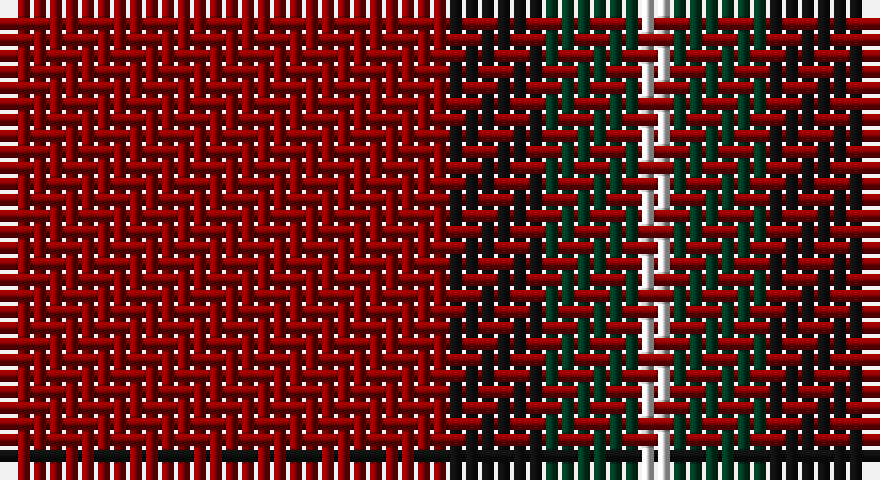

This page is one **sett** — a single exact thread-count. It belongs to the [tartan](/setts/r14k3dg3w1/)
(the same proportion at any scale), whose colour order is pattern [RKGW](/stripes/rkgw/).

Part of the [Bacon,](/tartans/bacon/) tartan — the named design grouping this sett with its other cloths.

Sourced from tartans-authority.  It is a [4 stripe tartan](/stripes/stripes4/).

Original link http://www.tartansauthority.com/tartan-ferret/display/3627/

## Also known as

This cloth is also recorded under:

- Bacon, Blue
- Bacon, Green
- Bacon, Red

2 attestations — the source records this cloth was collapsed from (oldest owns this page)

<ul>
<li>pre 2002 — Bacon, Red (Fashion) (tartans-authority, <a href="http://www.tartansauthority.com/tartan-ferret/display/3627/">record</a>)</li>
<li>undated — Bacon, Red (register-of-tartans, <a href="https://www.tartanregister.gov.uk/tartanDetails.aspx?ref=5148">record</a>)</li>
</ul>

## Register references

External register numbers recorded for this tartan.

- Scottish Register of Tartans: [5148](https://www.tartanregister.gov.uk/tartanDetails.aspx?ref=5148)
- Scottish Tartans Authority (ITI): 3627

## Thread count
DR/28 K6 DG6 LN/2

One full sett is **54 threads**.

## Palette

Palette: <strong>Tartan Register</strong>
<table><thead><tr><th>Colour</th><th>Threads</th><th>Shade</th><th>Base</th><th>OKLCh</th></tr></thead><tbody><tr><td>DR/</td><td style="text-align:right;font-variant-numeric:tabular-nums">28</td><td><code style="background-color:#880000;">#880000</code> <small style="color:#888">#880000</small></td><td>R <code style="background-color:#CC0000;">#CC0000</code></td><td><small style="color:#888">oklch(39.4% 0.162 29.2)</small></td></tr><tr><td>K</td><td style="text-align:right;font-variant-numeric:tabular-nums">6</td><td><code style="background-color:#101010;">#101010</code> <small style="color:#888">#101010</small></td><td>K <code style="background-color:#000000;">#000000</code></td><td><small style="color:#888">oklch(17.3% 0.000 89.9)</small></td></tr><tr><td>DG</td><td style="text-align:right;font-variant-numeric:tabular-nums">6</td><td><code style="background-color:#003820;">#003820</code> <small style="color:#888">#003820</small></td><td>G <code style="background-color:#006100;">#006100</code></td><td><small style="color:#888">oklch(30.0% 0.070 158.3)</small></td></tr><tr><td>LN/</td><td style="text-align:right;font-variant-numeric:tabular-nums">2</td><td><code style="background-color:#E0E0E0;">#E0E0E0</code> <small style="color:#888">#E0E0E0</small></td><td>W <code style="background-color:#F7F7F7;">#F7F7F7</code></td><td><small style="color:#888">oklch(90.7% 0.000 89.9)</small></td></tr></tbody></table>

# Sample pattern

## Compared to the master

This cloth is one sett of its design; the master sett (the exemplar the design is anchored on) is below for comparison.

<figure style="margin:0"><figcaption style="color:#888;font-size:smaller">this sett</figcaption></figure>
<figure style="margin:0"><figcaption style="color:#888;font-size:smaller"><a href="/setts/db14k3r3w1/">master sett →</a></figcaption></figure>

## Nearest tartans

The nearest existing variants by ΔTartan distance, with this tartan at the top so the swatches line up against it.

ΔTartan

Tartan

Sett

—

<a href="/ttd/edit/#slug=r14k3dg3w1~x2">Bacon, Red (Fashion)</a> <a class="nn-out" href="/variants/s4/r14k3dg3w1~x2/" title="open its dictionary page">↗</a>

1.22

<a href="/ttd/edit/#slug=r80t40k5lo6&amp;base=r14k3dg3w1~x2">Broberg (Scania) (Personal)</a> <a class="nn-out" href="/variants/s4/r80t40k5lo6/" title="open its dictionary page">↗</a>

1.47

<a href="/ttd/edit/#slug=r22db5r2dg11r3db1~x2&amp;base=r14k3dg3w1~x2">MacKintosh D</a> <a class="nn-out" href="/variants/s6/r22db5r2dg11r3db1~x2/" title="open its dictionary page">↗</a>

1.48

<a href="/ttd/edit/#slug=m18g9m2g3k1w1~x4&amp;base=r14k3dg3w1~x2">MacGregor of Cardney</a> <a class="nn-out" href="/variants/s6/m18g9m2g3k1w1~x4/" title="open its dictionary page">↗</a>

1.48

<a href="/ttd/edit/#slug=k8r49k8lb3k20lo3~x2&amp;base=r14k3dg3w1~x2">Dunbar (District)</a> <a class="nn-out" href="/variants/s6/k8r49k8lb3k20lo3~x2/" title="open its dictionary page">↗</a>

1.50

<a href="/ttd/edit/#slug=r35w3r8ly2g11~x2&amp;base=r14k3dg3w1~x2">Highlands at Wyomissing, The</a> <a class="nn-out" href="/variants/s5/r35w3r8ly2g11~x2/" title="open its dictionary page">↗</a>

1.52

<a href="/ttd/edit/#slug=m96g42m16g17k4lb6&amp;base=r14k3dg3w1~x2">MacGregor Hunting Glengyle Clan Tartan</a> <a class="nn-out" href="/variants/s6/m96g42m16g17k4lb6/" title="open its dictionary page">↗</a>

1.52

<a href="/ttd/edit/#slug=r24db6r3dg12r4db1~x2&amp;base=r14k3dg3w1~x2">MacKintosh</a> <a class="nn-out" href="/variants/s6/r24db6r3dg12r4db1~x2/" title="open its dictionary page">↗</a>

1.52

<a href="/ttd/edit/#slug=do12y6do2lo1~x4&amp;base=r14k3dg3w1~x2">Loch Garth</a> <a class="nn-out" href="/variants/s4/do12y6do2lo1~x4/" title="open its dictionary page">↗</a>

1.53

<a href="/ttd/edit/#slug=db4r3db3r22dg8r2~x2&amp;base=r14k3dg3w1~x2">Auld Reekie</a> <a class="nn-out" href="/variants/s6/db4r3db3r22dg8r2~x2/" title="open its dictionary page">↗</a>

1.56

<a href="/ttd/edit/#slug=r96g42r16g17k4y6&amp;base=r14k3dg3w1~x2">MacGregor, Glengyle</a> <a class="nn-out" href="/variants/s6/r96g42r16g17k4y6/" title="open its dictionary page">↗</a>

## Neighbour map

Every grey dot is one of 14360 variants placed by the first two principal components of the ΔTartan feature space (44% of its variance). Red is this tartan; blue dots are its nearest — click one to open its page.

<svg viewBox="0 0 640 380" role="img" style="max-width:100%;height:auto;border:1px solid #e0e0e0;border-radius:4px;display:block" xmlns="http://www.w3.org/2000/svg"><image href="/nn/cloud.v1.png" width="640" height="380"/><a href="/variants/s4/r80t40k5lo6/"><circle cx="405.3" cy="204.2" r="4" fill="#3465a4"><title>Broberg (Scania) (Personal)</title></circle></a><a href="/variants/s6/r22db5r2dg11r3db1~x2/"><circle cx="427.4" cy="192.1" r="4" fill="#3465a4"><title>MacKintosh D</title></circle></a><a href="/variants/s6/m18g9m2g3k1w1~x4/"><circle cx="395.4" cy="173.6" r="4" fill="#3465a4"><title>MacGregor of Cardney</title></circle></a><a href="/variants/s6/k8r49k8lb3k20lo3~x2/"><circle cx="370.9" cy="183.5" r="4" fill="#3465a4"><title>Dunbar (District)</title></circle></a><a href="/variants/s5/r35w3r8ly2g11~x2/"><circle cx="467.2" cy="181.0" r="4" fill="#3465a4"><title>Highlands at Wyomissing, The</title></circle></a><a href="/variants/s6/m96g42m16g17k4lb6/"><circle cx="428.6" cy="168.2" r="4" fill="#3465a4"><title>MacGregor Hunting Glengyle Clan Tartan</title></circle></a><a href="/variants/s6/r24db6r3dg12r4db1~x2/"><circle cx="429.5" cy="193.3" r="4" fill="#3465a4"><title>MacKintosh</title></circle></a><a href="/variants/s4/do12y6do2lo1~x4/"><circle cx="448.4" cy="256.3" r="4" fill="#3465a4"><title>Loch Garth</title></circle></a><a href="/variants/s6/db4r3db3r22dg8r2~x2/"><circle cx="398.9" cy="202.7" r="4" fill="#3465a4"><title>Auld Reekie</title></circle></a><a href="/variants/s6/r96g42r16g17k4y6/"><circle cx="421.5" cy="167.8" r="4" fill="#3465a4"><title>MacGregor, Glengyle</title></circle></a><circle cx="429.2" cy="213.2" r="5" fill="#c00000"/></svg>

ID: /variants/s4/r14k3dg3w1~x2/
