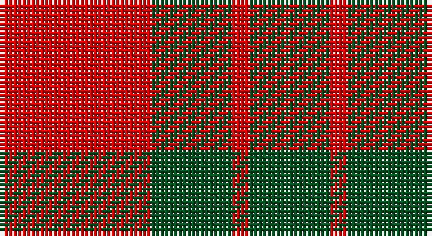

This page is one **sett** — a single exact thread-count. It belongs to the [tartan](/setts/r17dg9r2/)
(the same proportion at any scale), whose colour order is pattern [GRGR](/stripes/grgr/).

Part of the [MacGregor of Glenstrae](/tartans/macgregor-of-glenstrae/) tartan — the named design grouping this sett with its other cloths.

Sourced from register-of-tartans.  It is a [4 stripe tartan](/stripes/stripes4/).

Original link https://www.tartanregister.gov.uk/tartanDetails.aspx?ref=2460

## Also known as

This cloth is also recorded under:

- MacGregor of Glen Strae
- MacGregor of Glen Straye Htg
- MacGregor of Glenstrae #2

## Register references

External register numbers recorded for this tartan.

- Scottish Register of Tartans: [2460](https://www.tartanregister.gov.uk/tartanDetails.aspx?ref=2460)
- Scottish Tartans World Register: 962

## Thread count
R/34 G18 R4 G/18

One full sett is **96 threads**.

## Palette

Palette: <strong>Tartan Register</strong>
<table><thead><tr><th>Colour</th><th>Threads</th><th>Shade</th><th>Base</th><th>OKLCh</th></tr></thead><tbody><tr><td>R/</td><td style="text-align:right;font-variant-numeric:tabular-nums">34</td><td><code style="background-color:#DC0000;">#DC0000</code> <small style="color:#888">#DC0000</small></td><td>R <code style="background-color:#CC0000;">#CC0000</code></td><td><small style="color:#888">oklch(56.2% 0.230 29.2)</small></td></tr><tr><td>G</td><td style="text-align:right;font-variant-numeric:tabular-nums">18</td><td><code style="background-color:#005020;">#005020</code> <small style="color:#888">#005020</small></td><td>G <code style="background-color:#006100;">#006100</code></td><td><small style="color:#888">oklch(37.7% 0.105 149.6)</small></td></tr><tr><td>R</td><td style="text-align:right;font-variant-numeric:tabular-nums">4</td><td><code style="background-color:#DC0000;">#DC0000</code> <small style="color:#888">#DC0000</small></td><td>R <code style="background-color:#CC0000;">#CC0000</code></td><td><small style="color:#888">oklch(56.2% 0.230 29.2)</small></td></tr><tr><td>G/</td><td style="text-align:right;font-variant-numeric:tabular-nums">18</td><td><code style="background-color:#005020;">#005020</code> <small style="color:#888">#005020</small></td><td>G <code style="background-color:#006100;">#006100</code></td><td><small style="color:#888">oklch(37.7% 0.105 149.6)</small></td></tr></tbody></table>

# Sample pattern

## Compared to the master

This cloth is one sett of its design; the master sett (the exemplar the design is anchored on) is below for comparison.

<figure style="margin:0"><figcaption style="color:#888;font-size:smaller">this sett</figcaption></figure>
<figure style="margin:0"><figcaption style="color:#888;font-size:smaller"><a href="/setts/g8r2g9r16g1/">master sett →</a></figcaption></figure>

## Nearest tartans

The nearest existing variants by ΔTartan distance, with this tartan at the top so the swatches line up against it.

ΔTartan

Tartan

Sett

—

<a href="/ttd/edit/#slug=r17dg9r2~x2">MacGregor of Glenstrae #2</a> <a class="nn-out" href="/variants/s4/r17dg9r2~x2/" title="open its dictionary page">↗</a>

1.01

<a href="/variants/s4/r17g9r2~x2/">MacGregor of Glenstrae</a>

1.13

<a href="/ttd/edit/#slug=r18g7r2g18~x2&amp;base=r17dg9r2~x2">Applecross</a> <a class="nn-out" href="/variants/s4/r18g7r2g18~x2/" title="open its dictionary page">↗</a>

1.13

<a href="/ttd/edit/#slug=r18g7r2g18~x4&amp;base=r17dg9r2~x2">Applecross (District)</a> <a class="nn-out" href="/variants/s4/r18g7r2g18~x4/" title="open its dictionary page">↗</a>

1.20

<a href="/variants/s4/r10dg4ly1~x8/">Lugo (2013)</a>

1.28

<a href="/variants/s4/r10dg4lo1~x8/">Lugo (2013)</a>

1.30

<a href="/ttd/edit/#slug=dg8r2dg9r16dg1~x2&amp;base=r17dg9r2~x2">MacGregor of Glenstrae</a> <a class="nn-out" href="/variants/s5/dg8r2dg9r16dg1~x2/" title="open its dictionary page">↗</a>

1.43

<a href="/ttd/edit/#slug=r3dg20r25w3~x4&amp;base=r17dg9r2~x2">MacKinnon #6</a> <a class="nn-out" href="/variants/s4/r3dg20r25w3~x4/" title="open its dictionary page">↗</a>

1.43

<a href="/ttd/edit/#slug=dg16r5dg2r18k2~x2&amp;base=r17dg9r2~x2">MacDonald Lord of the Isles #2</a> <a class="nn-out" href="/variants/s5/dg16r5dg2r18k2~x2/" title="open its dictionary page">↗</a>

1.44

<a href="/ttd/edit/#slug=dg7r3dg1r9k1~x2&amp;base=r17dg9r2~x2">MacDonald of Sleat</a> <a class="nn-out" href="/variants/s5/dg7r3dg1r9k1~x2/" title="open its dictionary page">↗</a>

1.45

<a href="/ttd/edit/#slug=g16r5g2r18k2~x2&amp;base=r17dg9r2~x2">MacDonald, Lord of The Isles (Artef)</a> <a class="nn-out" href="/variants/s5/g16r5g2r18k2~x2/" title="open its dictionary page">↗</a>

## Neighbour map

Every grey dot is one of 14360 variants placed by the first two principal components of the ΔTartan feature space (44% of its variance). Red is this tartan; blue dots are its nearest — click one to open its page.

<svg viewBox="0 0 640 380" role="img" style="max-width:100%;height:auto;border:1px solid #e0e0e0;border-radius:4px;display:block" xmlns="http://www.w3.org/2000/svg"><image href="/nn/cloud.v1.png" width="640" height="380"/><a href="/variants/s4/r17g9r2~x2/"><circle cx="354.3" cy="294.5" r="4" fill="#3465a4"><title>MacGregor of Glenstrae</title></circle></a><a href="/variants/s4/r18g7r2g18~x2/"><circle cx="382.0" cy="293.3" r="4" fill="#3465a4"><title>Applecross</title></circle></a><a href="/variants/s4/r18g7r2g18~x4/"><circle cx="382.0" cy="293.3" r="4" fill="#3465a4"><title>Applecross (District)</title></circle></a><a href="/variants/s4/r10dg4ly1~x8/"><circle cx="330.2" cy="249.6" r="4" fill="#3465a4"><title>Lugo (2013)</title></circle></a><a href="/variants/s4/r10dg4lo1~x8/"><circle cx="348.8" cy="264.4" r="4" fill="#3465a4"><title>Lugo (2013)</title></circle></a><a href="/variants/s5/dg8r2dg9r16dg1~x2/"><circle cx="380.5" cy="239.0" r="4" fill="#3465a4"><title>MacGregor of Glenstrae</title></circle></a><a href="/variants/s4/r3dg20r25w3~x4/"><circle cx="333.9" cy="240.8" r="4" fill="#3465a4"><title>MacKinnon #6</title></circle></a><a href="/variants/s5/dg16r5dg2r18k2~x2/"><circle cx="342.1" cy="233.7" r="4" fill="#3465a4"><title>MacDonald Lord of the Isles #2</title></circle></a><a href="/variants/s5/dg7r3dg1r9k1~x2/"><circle cx="353.6" cy="237.9" r="4" fill="#3465a4"><title>MacDonald of Sleat</title></circle></a><a href="/variants/s5/g16r5g2r18k2~x2/"><circle cx="351.5" cy="241.0" r="4" fill="#3465a4"><title>MacDonald, Lord of The Isles (Artef)</title></circle></a><circle cx="348.8" cy="288.1" r="5" fill="#c00000"/></svg>

ID: /variants/s4/r17dg9r2~x2/
