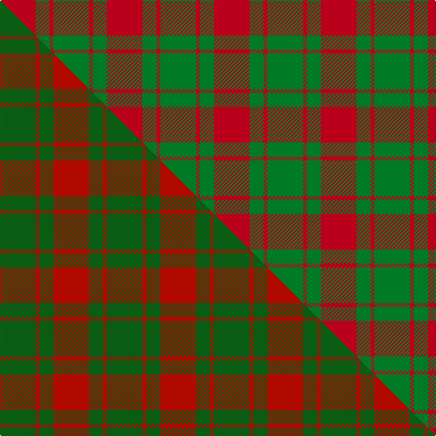

This is one **variant** — a specific cloth: this exact thread count and colourway, with its own
provenance below. It is one weaving of the [sett](/tartans/a/ap/applecross/) (the scale-free proportion — the
same cloth at any scale or shade), whose colour order is pattern [GRGR](/stripes/grgr/).

Part of the [Applecross](/tartans/a/ap/applecross/) tartan — the named design grouping this sett with its other cloths.

Sourced from house-of-tartan.  It is a [4 stripe tartan](/stripes/stripes4/).

Original link [http://www.house-of-tartan.scotland.net/house/TartanViewjs.asp?colr=Def&tnam=961](http://www.house-of-tartan.scotland.net/house/TartanViewjs.asp?colr=Def&tnam=961)

## Provenance

Earliest known date: pre 1947 Named after the district in which it was found.

2 attestations — the source records this cloth was collapsed from (oldest owns this page)

<ul>
<li>pre 1947 — Applecross (MacDonald) District Tartan (house-of-tartan, <a href="http://www.house-of-tartan.scotland.net/house/TartanViewjs.asp?colr=Def&tnam=961">record</a>) </li>
<li>undated — Applecross, (MacDonald) (weddslist, <a href="http://www.weddslist.com/cgi-bin/tartans/pg.pl?source=sts">record</a>) </li>
</ul>

Dataset <small>— provenance for this record, inherited from the source manifest</small>

<dl class="dataset-prov">
<dt>source</dt><dd><a href="/sources/house-of-tartan/">House of Tartan</a></dd>
<dt>data captured from</dt><dd><a href="https://github.com/thetartan/tartan-database/blob/master/data/house-of-tartan/data.csv">https://github.com/thetartan/tartan-database/blob/master/data/house-of-tartan/data.csv</a></dd>
<dt>data date</dt><dd>pre 1947 <small>(this record)</small></dd>
<dt>licence</dt><dd><a href="https://creativecommons.org/licenses/by-nc-nd/4.0/">CC BY-NC-ND 4.0</a></dd>
</dl>

Capture chain <small>— the hands this data passed through, oldest first; each capture carries its own licence</small>

<ol class="capture-chain">
<li><a href="http://www.house-of-tartan.scotland.net/">House of Tartan</a> <small>the weaver/retailer's database — the site is now offline; the URL is kept as the ultimate source's identity</small></li>
<li><a href="https://github.com/thetartan/tartan-database">thetartan/tartan-database</a> <small>2016-2017</small> · <a href="https://creativecommons.org/licenses/by-nc-nd/4.0/">CC BY-NC-ND 4.0</a> <small>Levko Kravets's frozen compilation — the capture we vendored, and where its CC licence text came from</small></li>
<li>this dictionary <small>captured 2026-06-10 · commit 5bf86c7566</small> <small>each re-capture is a git commit to data/sources</small></li>
</ol>

## Thread count
R/36 G14 R4 G/36

One full sett is **108 threads**.

## Palette
<table><thead><tr><th>Colour</th><th>Shade</th><th>OKLCh</th></tr></thead><tbody><tr><td>G</td><td><code style="background-color:#008B2A;">#008B2A</code> <small style="color:#888">#008B2A</small></td><td><small style="color:#888">oklch(55.4% 0.170 145.9)</small></td></tr><tr><td>R</td><td><code style="background-color:#D60020;">#D60020</code> <small style="color:#888">#D60020</small></td><td><small style="color:#888">oklch(55.2% 0.224 25.5)</small></td></tr></tbody></table>

# Sample pattern

## Compared to the master

This cloth is one sett of its design; the master sett (the exemplar the design is anchored on) is below for comparison.

Its **ΔTartan distance** from the master is **0.56** — the same measure the nearest-tartans table ranks by (0 is identical; a re-scale of the same cloth is near 0, a recolour or a different proportion further).

<figure class="master-compare" style="margin:0">

this sett
master sett ★

<figcaption style="color:#888;font-size:smaller">One weave of this sett against the <a href="/setts/dg18r2dg7r18/">master sett ★</a>, split on the diagonal: a shared proportion runs seamlessly across it with only the shades shifting; a different proportion breaks on it.</figcaption>
</figure>

## Nearest tartan variants

The nearest existing variants by ΔTartan distance, with this cloth at the top so the swatches line up against it.

ΔTartan

Threads

Variant

Sett

—

108

<a href="/variants/s4/r18g7r2g18~x2/">Applecross (MacDonald) District Tartan</a>

<a href="/ttd/edit/#slug=r18g7r2g18~x4&amp;base=r18g7r2g18~x2" title="compare in the TTD">0.00</a>

216

<a href="/variants/s4/r18g7r2g18~x4/">Applecross (District)</a>

<a href="/ttd/edit/#slug=dg18r2dg7r18~x2~dg4514144-r5221030&amp;base=r18g7r2g18~x2" title="compare in the TTD">0.56</a>

108

<a href="/variants/s4/dg18r2dg7r18~x2~dg4514144-r5221030/">Applecross</a>

<a href="/ttd/edit/#slug=g16r1g2r11~x8&amp;base=r18g7r2g18~x2" title="compare in the TTD">0.65</a>

264

<a href="/variants/s4/g16r1g2r11~x8/">Middleton</a>

<a href="/ttd/edit/#slug=r36g2r5g16~x2&amp;base=r18g7r2g18~x2" title="compare in the TTD">0.85</a>

132

<a href="/variants/s4/r36g2r5g16~x2/">MacDonald of Sleat Clan Tartan</a>

<a href="/ttd/edit/#slug=dg24r3dg16r33w4&amp;base=r18g7r2g18~x2" title="compare in the TTD">0.87</a>

132

<a href="/variants/s5/dg24r3dg16r33w4/">Unidentified Plaid #3</a>

<a href="/ttd/edit/#slug=g8r2g9r16w1~x2&amp;base=r18g7r2g18~x2" title="compare in the TTD">0.92</a>

126

<a href="/variants/s5/g8r2g9r16w1~x2/">MacGregor of Balquhidder</a>

<a href="/ttd/edit/#slug=k1r5g10r5g1~x4&amp;base=r18g7r2g18~x2" title="compare in the TTD">0.94</a>

168

<a href="/variants/s5/k1r5g10r5g1~x4/">Murray, Lord George (Hose)</a>

<a href="/ttd/edit/#slug=g16r5g2r18k2~x2&amp;base=r18g7r2g18~x2" title="compare in the TTD">1.02</a>

136

<a href="/variants/s5/g16r5g2r18k2~x2/">MacDonald, Lord of The Isles (Artef)</a>

<a href="/ttd/edit/#slug=g16r5g2r18k2&amp;base=r18g7r2g18~x2" title="compare in the TTD">1.02</a>

68

<a href="/variants/s5/g16r5g2r18k2/">MacDonald of Sleat</a>

<a href="/ttd/edit/#slug=g7r3g1r9k1~x2&amp;base=r18g7r2g18~x2" title="compare in the TTD">1.09</a>

68

<a href="/variants/s5/g7r3g1r9k1~x2/">MacDonald of Sleat</a>

## Neighbour map

Every grey dot is one of 13662 variants placed by the first two principal components of the ΔTartan feature space (42% of its variance). Red is this tartan; blue dots are its nearest — click one to open its page. The map is a flat projection of a many-dimensional space — [how to read it](/posts/neighbourhood-maps/).

<svg viewBox="0 0 640 380" role="img" style="max-width:100%;height:auto;border:1px solid #e0e0e0;border-radius:4px;display:block" xmlns="http://www.w3.org/2000/svg"><image href="/nn/cloud.v1.png" width="640" height="380"/><a href="/variants/s4/r18g7r2g18~x4/"><circle cx="390.4" cy="287.7" r="4" fill="#3465a4"><title>Applecross (District)</title></circle></a><a href="/variants/s4/dg18r2dg7r18~x2~dg4514144-r5221030/"><circle cx="408.9" cy="292.5" r="4" fill="#3465a4"><title>Applecross</title></circle></a><a href="/variants/s4/g16r1g2r11~x8/"><circle cx="443.0" cy="246.6" r="4" fill="#3465a4"><title>Middleton</title></circle></a><a href="/variants/s4/r36g2r5g16~x2/"><circle cx="516.4" cy="227.3" r="4" fill="#3465a4"><title>MacDonald of Sleat Clan Tartan</title></circle></a><a href="/variants/s5/dg24r3dg16r33w4/"><circle cx="316.8" cy="232.3" r="4" fill="#3465a4"><title>Unidentified Plaid #3</title></circle></a><a href="/variants/s5/g8r2g9r16w1~x2/"><circle cx="360.4" cy="227.1" r="4" fill="#3465a4"><title>MacGregor of Balquhidder</title></circle></a><a href="/variants/s5/k1r5g10r5g1~x4/"><circle cx="300.9" cy="224.4" r="4" fill="#3465a4"><title>Murray, Lord George (Hose)</title></circle></a><a href="/variants/s5/g16r5g2r18k2~x2/"><circle cx="316.0" cy="219.5" r="4" fill="#3465a4"><title>MacDonald, Lord of The Isles (Artef)</title></circle></a><a href="/variants/s5/g16r5g2r18k2/"><circle cx="316.0" cy="219.5" r="4" fill="#3465a4"><title>MacDonald of Sleat</title></circle></a><a href="/variants/s5/g7r3g1r9k1~x2/"><circle cx="329.2" cy="220.8" r="4" fill="#3465a4"><title>MacDonald of Sleat</title></circle></a><circle cx="390.4" cy="287.7" r="5" fill="#c00000"/><text x="320" y="376" text-anchor="middle" font-size="11" fill="#999">ground</text><text x="11" y="190" text-anchor="middle" font-size="11" fill="#999" transform="rotate(-90 11 190)">complexity</text></svg>

ID: /variants/s4/r18g7r2g18~x2/
