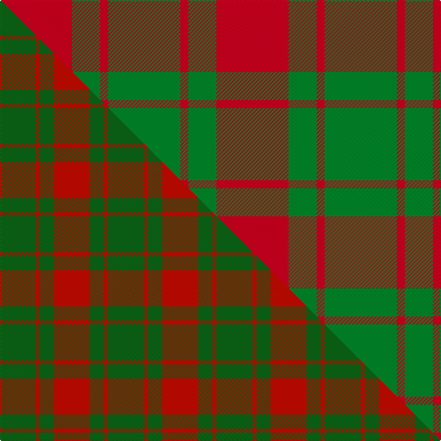

This page is one **sett** — a single exact thread-count. It belongs to the [tartan](/setts/r18g7r2g18/)
(the same proportion at any scale), whose colour order is pattern [GRGR](/stripes/grgr/).

Part of the [Applecross](/tartans/applecross/) tartan — the named design grouping this sett with its other cloths.

Sourced from tartans-authority.  It is a [4 stripe tartan](/stripes/stripes4/).

Original link http://www.tartansauthority.com/tartan-ferret/display/961/

## Register references

External register numbers recorded for this tartan.

- Scottish Tartans Authority (ITI): 961

## Thread count
R/72 G28 R8 G/72

One full sett is **216 threads**.

## Palette
<table><thead><tr><th>Colour</th><th>Shade</th><th>OKLCh</th></tr></thead><tbody><tr><td>G</td><td><code style="background-color:#008B2A;">#008B2A</code> <small style="color:#888">#008B2A</small></td><td><small style="color:#888">oklch(55.4% 0.170 145.9)</small></td></tr><tr><td>R</td><td><code style="background-color:#D60020;">#D60020</code> <small style="color:#888">#D60020</small></td><td><small style="color:#888">oklch(55.2% 0.224 25.5)</small></td></tr></tbody></table>

# Sample pattern

## Compared to the master

This cloth is one sett of its design; the master sett (the exemplar the design is anchored on) is below for comparison.

Its **ΔTartan distance** from the master is **0.65** — the same measure the nearest-tartans table ranks by (0 is identical; a re-scale of the same cloth is near 0, a recolour or a different proportion further).

<figure class="master-compare" style="margin:0">

this sett
master sett ★

<figcaption style="color:#888;font-size:smaller">One weave of this sett against the <a href="/setts/dg18r2dg7r18/">master sett ★</a>, split on the diagonal: a shared proportion runs seamlessly across it with only the shades shifting; a different proportion breaks on it.</figcaption>
</figure>

## Nearest tartan variants

The nearest existing variants by ΔTartan distance, with this cloth at the top so the swatches line up against it.

ΔTartan

Threads

Variant

Sett

—

216

<a href="/variants/s4/r18g7r2g18~x4/">Applecross (District)</a>

<a href="/ttd/edit/#slug=r18g7r2g18~x2&amp;base=r18g7r2g18~x4" title="compare in the TTD">0.00</a>

108

<a href="/variants/s4/r18g7r2g18~x2/">Applecross, (MacDonald)</a>

<a href="/ttd/edit/#slug=r17g9r2~x2&amp;base=r18g7r2g18~x4" title="compare in the TTD">0.48</a>

74

<a href="/variants/s3/r17g9r2~x2/">MacGregor of Glenstrae #2</a>

<a href="/ttd/edit/#slug=dg18r2dg7r18~x2~dg1806142-r2109032&amp;base=r18g7r2g18~x4" title="compare in the TTD">0.55</a>

108

<a href="/variants/s4/dg18r2dg7r18~x2~dg1806142-r2109032/">Applecross</a>

<a href="/ttd/edit/#slug=g16r1g2r11~x8&amp;base=r18g7r2g18~x4" title="compare in the TTD">0.67</a>

264

<a href="/variants/s4/g16r1g2r11~x8/">Middleton</a>

<a href="/ttd/edit/#slug=dg24r3dg16r33w4&amp;base=r18g7r2g18~x4" title="compare in the TTD">0.92</a>

132

<a href="/variants/s5/dg24r3dg16r33w4/">Unidentified Plaid #3</a>

<a href="/ttd/edit/#slug=k1r5g10r5g1~x4&amp;base=r18g7r2g18~x4" title="compare in the TTD">0.94</a>

168

<a href="/variants/s5/k1r5g10r5g1~x4/">Murray, Lord George (Hose)</a>

<a href="/ttd/edit/#slug=g8r2g9r16w1~x2&amp;base=r18g7r2g18~x4" title="compare in the TTD">0.98</a>

126

<a href="/variants/s5/g8r2g9r16w1~x2/">MacGregor of Balquhidder</a>

<a href="/ttd/edit/#slug=g16r5g2r18k2~x2&amp;base=r18g7r2g18~x4" title="compare in the TTD">1.06</a>

136

<a href="/variants/s5/g16r5g2r18k2~x2/">MacDonald, Lord of The Isles (Artef)</a>

<a href="/ttd/edit/#slug=g16r5g2r18k2&amp;base=r18g7r2g18~x4" title="compare in the TTD">1.06</a>

68

<a href="/variants/s5/g16r5g2r18k2/">MacDonald of Sleat</a>

<a href="/ttd/edit/#slug=g7r3g1r9k1~x2&amp;base=r18g7r2g18~x4" title="compare in the TTD">1.14</a>

68

<a href="/variants/s5/g7r3g1r9k1~x2/">MacDonald of Sleat</a>

## Neighbour map

Every grey dot is one of 13620 variants placed by the first two principal components of the ΔTartan feature space (42% of its variance). Red is this tartan; blue dots are its nearest — click one to open its page.

<svg viewBox="0 0 640 380" role="img" style="max-width:100%;height:auto;border:1px solid #e0e0e0;border-radius:4px;display:block" xmlns="http://www.w3.org/2000/svg"><image href="/nn/cloud.v1.png" width="640" height="380"/><a href="/variants/s4/r18g7r2g18~x2/"><circle cx="390.2" cy="288.5" r="4" fill="#3465a4"><title>Applecross, (MacDonald)</title></circle></a><a href="/variants/s3/r17g9r2~x2/"><circle cx="371.4" cy="294.6" r="4" fill="#3465a4"><title>MacGregor of Glenstrae #2</title></circle></a><a href="/variants/s4/dg18r2dg7r18~x2~dg1806142-r2109032/"><circle cx="408.8" cy="293.2" r="4" fill="#3465a4"><title>Applecross</title></circle></a><a href="/variants/s4/g16r1g2r11~x8/"><circle cx="442.8" cy="247.3" r="4" fill="#3465a4"><title>Middleton</title></circle></a><a href="/variants/s5/dg24r3dg16r33w4/"><circle cx="316.7" cy="233.1" r="4" fill="#3465a4"><title>Unidentified Plaid #3</title></circle></a><a href="/variants/s5/k1r5g10r5g1~x4/"><circle cx="300.7" cy="225.2" r="4" fill="#3465a4"><title>Murray, Lord George (Hose)</title></circle></a><a href="/variants/s5/g8r2g9r16w1~x2/"><circle cx="360.1" cy="227.8" r="4" fill="#3465a4"><title>MacGregor of Balquhidder</title></circle></a><a href="/variants/s5/g16r5g2r18k2~x2/"><circle cx="315.8" cy="220.4" r="4" fill="#3465a4"><title>MacDonald, Lord of The Isles (Artef)</title></circle></a><a href="/variants/s5/g16r5g2r18k2/"><circle cx="315.8" cy="220.4" r="4" fill="#3465a4"><title>MacDonald of Sleat</title></circle></a><a href="/variants/s5/g7r3g1r9k1~x2/"><circle cx="328.9" cy="221.7" r="4" fill="#3465a4"><title>MacDonald of Sleat</title></circle></a><circle cx="390.2" cy="288.5" r="5" fill="#c00000"/><text x="320" y="376" text-anchor="middle" font-size="11" fill="#999">ground</text><text x="11" y="190" text-anchor="middle" font-size="11" fill="#999" transform="rotate(-90 11 190)">complexity</text></svg>

ID: /variants/s4/r18g7r2g18~x4/
