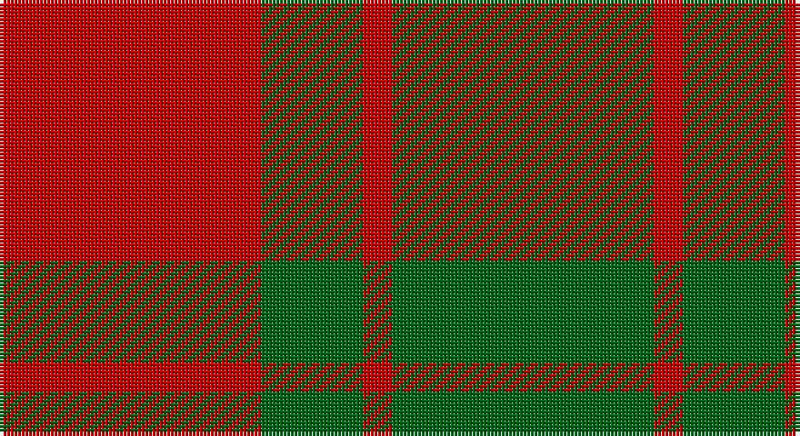

This page is one **sett** — a single exact thread-count. It belongs to the [tartan](/setts/r18g7r2g18/)
(the same proportion at any scale), whose colour order is pattern [GRGR](/stripes/grgr/).

Sourced from tartans-authority.  It is a [4 stripe tartan](/stripes/stripes4/).

Original link http://www.tartansauthority.com/tartan-ferret/display/961/

## Also known as

This cloth is also recorded under:

- Applecross,

## Register references

External register numbers recorded for this tartan.

- Scottish Tartans Authority (ITI): 961

## Thread count
R/72 G28 R8 G/72

One full sett is **216 threads**.

## Palette

Palette: <strong>Tartan Register</strong>
<table><thead><tr><th>Colour</th><th>Threads</th><th>Shade</th><th>Base</th><th>OKLCh</th></tr></thead><tbody><tr><td>R/</td><td style="text-align:right;font-variant-numeric:tabular-nums">72</td><td><code style="background-color:#C80000;">#C80000</code> <small style="color:#888">#C80000</small></td><td>R <code style="background-color:#CC0000;">#CC0000</code></td><td><small style="color:#888">oklch(52.3% 0.215 29.2)</small></td></tr><tr><td>G</td><td style="text-align:right;font-variant-numeric:tabular-nums">28</td><td><code style="background-color:#006818;">#006818</code> <small style="color:#888">#006818</small></td><td>G <code style="background-color:#006100;">#006100</code></td><td><small style="color:#888">oklch(45.0% 0.142 145.0)</small></td></tr><tr><td>R</td><td style="text-align:right;font-variant-numeric:tabular-nums">8</td><td><code style="background-color:#C80000;">#C80000</code> <small style="color:#888">#C80000</small></td><td>R <code style="background-color:#CC0000;">#CC0000</code></td><td><small style="color:#888">oklch(52.3% 0.215 29.2)</small></td></tr><tr><td>G/</td><td style="text-align:right;font-variant-numeric:tabular-nums">72</td><td><code style="background-color:#006818;">#006818</code> <small style="color:#888">#006818</small></td><td>G <code style="background-color:#006100;">#006100</code></td><td><small style="color:#888">oklch(45.0% 0.142 145.0)</small></td></tr></tbody></table>

# Sample pattern

## Nearest tartans

The nearest existing variants by ΔTartan distance, with this tartan at the top so the swatches line up against it.

ΔTartan

Tartan

Sett

—

<a href="/ttd/edit/#slug=r18g7r2g18~x4">Applecross (District)</a> <a class="nn-out" href="/variants/s4/r18g7r2g18~x4/" title="open its dictionary page">↗</a>

0.00

<a href="/ttd/edit/#slug=r18g7r2g18~x2&amp;base=r18g7r2g18~x4">Applecross</a> <a class="nn-out" href="/variants/s4/r18g7r2g18~x2/" title="open its dictionary page">↗</a>

0.59

<a href="/variants/s4/r17g9r2~x2/">MacGregor of Glenstrae</a>

1.13

<a href="/variants/s4/r17dg9r2~x2/">MacGregor of Glenstrae #2</a>

1.26

<a href="/ttd/edit/#slug=g8r2g9r16g1~x2&amp;base=r18g7r2g18~x4">MacGregor of Glen Strae</a> <a class="nn-out" href="/variants/s5/g8r2g9r16g1~x2/" title="open its dictionary page">↗</a>

1.29

<a href="/ttd/edit/#slug=g16r1g2r11~x8&amp;base=r18g7r2g18~x4">Middleton</a> <a class="nn-out" href="/variants/s4/g16r1g2r11~x8/" title="open its dictionary page">↗</a>

1.36

<a href="/variants/s4/r10dg4lo1~x8/">Lugo (2013)</a>

1.46

<a href="/ttd/edit/#slug=r1g7r9ly1~x4&amp;base=r18g7r2g18~x4">Bryce</a> <a class="nn-out" href="/variants/s4/r1g7r9ly1~x4/" title="open its dictionary page">↗</a>

1.47

<a href="/ttd/edit/#slug=k1r5g10r5g1~x4&amp;base=r18g7r2g18~x4">Murray, Lord George (Hose)</a> <a class="nn-out" href="/variants/s5/k1r5g10r5g1~x4/" title="open its dictionary page">↗</a>

1.50

<a href="/ttd/edit/#slug=g16r5g2r18k2~x2&amp;base=r18g7r2g18~x4">MacDonald, Lord of The Isles (Artef)</a> <a class="nn-out" href="/variants/s5/g16r5g2r18k2~x2/" title="open its dictionary page">↗</a>

1.51

<a href="/ttd/edit/#slug=r3g20r25w3~x4&amp;base=r18g7r2g18~x4">MacKinnon 11</a> <a class="nn-out" href="/variants/s4/r3g20r25w3~x4/" title="open its dictionary page">↗</a>

## Neighbour map

Every grey dot is one of 14360 variants placed by the first two principal components of the ΔTartan feature space (44% of its variance). Red is this tartan; blue dots are its nearest — click one to open its page.

<svg viewBox="0 0 640 380" role="img" style="max-width:100%;height:auto;border:1px solid #e0e0e0;border-radius:4px;display:block" xmlns="http://www.w3.org/2000/svg"><image href="/nn/cloud.v1.png" width="640" height="380"/><a href="/variants/s4/r18g7r2g18~x2/"><circle cx="382.0" cy="293.3" r="4" fill="#3465a4"><title>Applecross</title></circle></a><a href="/variants/s4/r17g9r2~x2/"><circle cx="354.3" cy="294.5" r="4" fill="#3465a4"><title>MacGregor of Glenstrae</title></circle></a><a href="/variants/s4/r17dg9r2~x2/"><circle cx="348.8" cy="288.1" r="4" fill="#3465a4"><title>MacGregor of Glenstrae #2</title></circle></a><a href="/variants/s5/g8r2g9r16g1~x2/"><circle cx="385.8" cy="245.2" r="4" fill="#3465a4"><title>MacGregor of Glen Strae</title></circle></a><a href="/variants/s4/g16r1g2r11~x8/"><circle cx="442.1" cy="255.6" r="4" fill="#3465a4"><title>Middleton</title></circle></a><a href="/variants/s4/r10dg4lo1~x8/"><circle cx="348.8" cy="264.4" r="4" fill="#3465a4"><title>Lugo (2013)</title></circle></a><a href="/variants/s4/r1g7r9ly1~x4/"><circle cx="354.9" cy="246.5" r="4" fill="#3465a4"><title>Bryce</title></circle></a><a href="/variants/s5/k1r5g10r5g1~x4/"><circle cx="323.1" cy="240.3" r="4" fill="#3465a4"><title>Murray, Lord George (Hose)</title></circle></a><a href="/variants/s5/g16r5g2r18k2~x2/"><circle cx="351.5" cy="241.0" r="4" fill="#3465a4"><title>MacDonald, Lord of The Isles (Artef)</title></circle></a><a href="/variants/s4/r3g20r25w3~x4/"><circle cx="338.6" cy="247.0" r="4" fill="#3465a4"><title>MacKinnon 11</title></circle></a><circle cx="382.0" cy="293.3" r="5" fill="#c00000"/></svg>

ID: /variants/s4/r18g7r2g18~x4/
