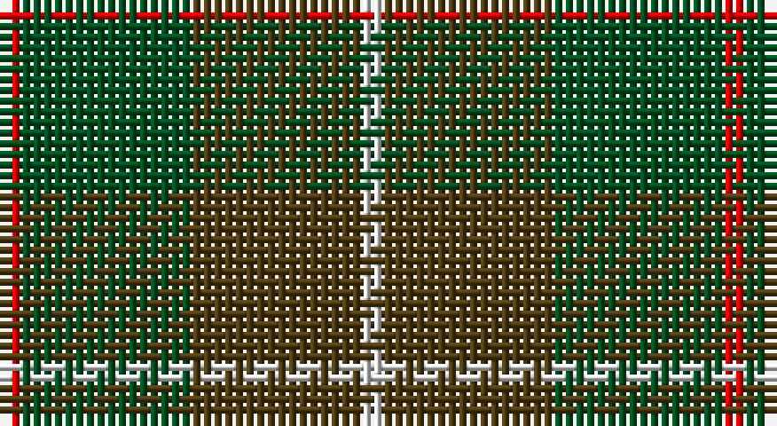

This page is one **sett** — a single exact thread-count. It belongs to the [tartan](/setts/r1dg8dy8w1/)
(the same proportion at any scale), whose colour order is pattern [RGGW](/stripes/rggw/).

Part of the [MacKinnon Hunting](/tartans/mackinnon-hunting/) tartan — the named design grouping this sett with its other cloths.

Sourced from register-of-tartans.  It is a [4 stripe tartan](/stripes/stripes4/).

Original link https://www.tartanregister.gov.uk/tartanDetails.aspx?ref=2556

## Also known as

This cloth is also recorded under:

- MacKinnon Htg
- MacKinnon Hunting #2
- MacKinnon Hunting #3
- MacKinnon, hunting

## Register references

External register numbers recorded for this tartan.

- Scottish Register of Tartans: [2556](https://www.tartanregister.gov.uk/tartanDetails.aspx?ref=2556)
- Scottish Tartans World Register: 1542

## Thread count
R/2 G16 T16 LN/2

One full sett is **68 threads**.

## Palette

Palette: <strong>Tartan Register</strong>
<table><thead><tr><th>Colour</th><th>Threads</th><th>Shade</th><th>Base</th><th>OKLCh</th></tr></thead><tbody><tr><td>R/</td><td style="text-align:right;font-variant-numeric:tabular-nums">2</td><td><code style="background-color:#DC0000;">#DC0000</code> <small style="color:#888">#DC0000</small></td><td>R <code style="background-color:#CC0000;">#CC0000</code></td><td><small style="color:#888">oklch(56.2% 0.230 29.2)</small></td></tr><tr><td>G</td><td style="text-align:right;font-variant-numeric:tabular-nums">16</td><td><code style="background-color:#005020;">#005020</code> <small style="color:#888">#005020</small></td><td>G <code style="background-color:#006100;">#006100</code></td><td><small style="color:#888">oklch(37.7% 0.105 149.6)</small></td></tr><tr><td>T</td><td style="text-align:right;font-variant-numeric:tabular-nums">16</td><td><code style="background-color:#503C14;">#503C14</code> <small style="color:#888">#503C14</small></td><td>G <code style="background-color:#006100;">#006100</code></td><td><small style="color:#888">oklch(37.0% 0.062 81.8)</small></td></tr><tr><td>LN/</td><td style="text-align:right;font-variant-numeric:tabular-nums">2</td><td><code style="background-color:#E0E0E0;">#E0E0E0</code> <small style="color:#888">#E0E0E0</small></td><td>W <code style="background-color:#F7F7F7;">#F7F7F7</code></td><td><small style="color:#888">oklch(90.7% 0.000 89.9)</small></td></tr></tbody></table>

# Sample pattern

## Compared to the master

This cloth is one sett of its design; the master sett (the exemplar the design is anchored on) is below for comparison.

<figure style="margin:0"><figcaption style="color:#888;font-size:smaller">this sett</figcaption></figure>
<figure style="margin:0"><figcaption style="color:#888;font-size:smaller"><a href="/setts/dg1dr8dg8r1dg8dr8lr1/">master sett →</a></figcaption></figure>

## Nearest tartans

The nearest existing variants by ΔTartan distance, with this tartan at the top so the swatches line up against it.

ΔTartan

Tartan

Sett

—

<a href="/ttd/edit/#slug=r1dg8dy8w1~x2">MacKinnon Hunting #2</a> <a class="nn-out" href="/variants/s4/r1dg8dy8w1~x2/" title="open its dictionary page">↗</a>

0.70

<a href="/ttd/edit/#slug=r1g8dy8w1~x2&amp;base=r1dg8dy8w1~x2">MacKinnon Hunting (Var) Clan Tartan</a> <a class="nn-out" href="/variants/s4/r1g8dy8w1~x2/" title="open its dictionary page">↗</a>

1.31

<a href="/ttd/edit/#slug=r1g8o8w1~x2&amp;base=r1dg8dy8w1~x2">MacKinnon, hunting</a> <a class="nn-out" href="/variants/s4/r1g8o8w1~x2/" title="open its dictionary page">↗</a>

1.38

<a href="/ttd/edit/#slug=dg15r3n11b2~x2&amp;base=r1dg8dy8w1~x2">MacNab WI 2</a> <a class="nn-out" href="/variants/s4/dg15r3n11b2~x2/" title="open its dictionary page">↗</a>

1.38

<a href="/ttd/edit/#slug=dg15r3n11b2&amp;base=r1dg8dy8w1~x2">MacNab WI2</a> <a class="nn-out" href="/variants/s4/dg15r3n11b2/" title="open its dictionary page">↗</a>

1.54

<a href="/ttd/edit/#slug=dy46g23b23r4ly4~x2&amp;base=r1dg8dy8w1~x2">McMoosie Htg (Fashion)</a> <a class="nn-out" href="/variants/s5/dy46g23b23r4ly4~x2/" title="open its dictionary page">↗</a>

1.65

<a href="/ttd/edit/#slug=dg14r3db9t2~x2&amp;base=r1dg8dy8w1~x2">Unidentified #4</a> <a class="nn-out" href="/variants/s4/dg14r3db9t2~x2/" title="open its dictionary page">↗</a>

1.67

<a href="/ttd/edit/#slug=dt1dy1dt7dy5y7lr1~x4&amp;base=r1dg8dy8w1~x2">Dewar (WCWM)</a> <a class="nn-out" href="/variants/s6/dt1dy1dt7dy5y7lr1~x4/" title="open its dictionary page">↗</a>

1.68

<a href="/ttd/edit/#slug=dg6ly3dg26k10n30lb3~x2&amp;base=r1dg8dy8w1~x2">Montrose (1983)</a> <a class="nn-out" href="/variants/s6/dg6ly3dg26k10n30lb3~x2/" title="open its dictionary page">↗</a>

1.71

<a href="/ttd/edit/#slug=dg15r3db11t2~x2&amp;base=r1dg8dy8w1~x2">MacNab</a> <a class="nn-out" href="/variants/s4/dg15r3db11t2~x2/" title="open its dictionary page">↗</a>

1.72

<a href="/ttd/edit/#slug=lo5y33dg33r6w2~x2&amp;base=r1dg8dy8w1~x2">Symington</a> <a class="nn-out" href="/variants/s5/lo5y33dg33r6w2~x2/" title="open its dictionary page">↗</a>

## Neighbour map

Every grey dot is one of 14360 variants placed by the first two principal components of the ΔTartan feature space (44% of its variance). Red is this tartan; blue dots are its nearest — click one to open its page.

<svg viewBox="0 0 640 380" role="img" style="max-width:100%;height:auto;border:1px solid #e0e0e0;border-radius:4px;display:block" xmlns="http://www.w3.org/2000/svg"><image href="/nn/cloud.v1.png" width="640" height="380"/><a href="/variants/s4/r1g8dy8w1~x2/"><circle cx="305.4" cy="273.7" r="4" fill="#3465a4"><title>MacKinnon Hunting (Var) Clan Tartan</title></circle></a><a href="/variants/s4/r1g8o8w1~x2/"><circle cx="301.4" cy="268.4" r="4" fill="#3465a4"><title>MacKinnon, hunting</title></circle></a><a href="/variants/s4/dg15r3n11b2~x2/"><circle cx="335.6" cy="300.6" r="4" fill="#3465a4"><title>MacNab WI 2</title></circle></a><a href="/variants/s4/dg15r3n11b2/"><circle cx="335.6" cy="300.6" r="4" fill="#3465a4"><title>MacNab WI2</title></circle></a><a href="/variants/s5/dy46g23b23r4ly4~x2/"><circle cx="283.4" cy="239.5" r="4" fill="#3465a4"><title>McMoosie Htg (Fashion)</title></circle></a><a href="/variants/s4/dg14r3db9t2~x2/"><circle cx="292.0" cy="285.5" r="4" fill="#3465a4"><title>Unidentified #4</title></circle></a><a href="/variants/s6/dt1dy1dt7dy5y7lr1~x4/"><circle cx="256.3" cy="273.3" r="4" fill="#3465a4"><title>Dewar (WCWM)</title></circle></a><a href="/variants/s6/dg6ly3dg26k10n30lb3~x2/"><circle cx="254.3" cy="228.9" r="4" fill="#3465a4"><title>Montrose (1983)</title></circle></a><a href="/variants/s4/dg15r3db11t2~x2/"><circle cx="282.6" cy="278.9" r="4" fill="#3465a4"><title>MacNab</title></circle></a><a href="/variants/s5/lo5y33dg33r6w2~x2/"><circle cx="305.7" cy="219.4" r="4" fill="#3465a4"><title>Symington</title></circle></a><circle cx="309.0" cy="278.6" r="5" fill="#c00000"/></svg>

ID: /variants/s4/r1dg8dy8w1~x2/
