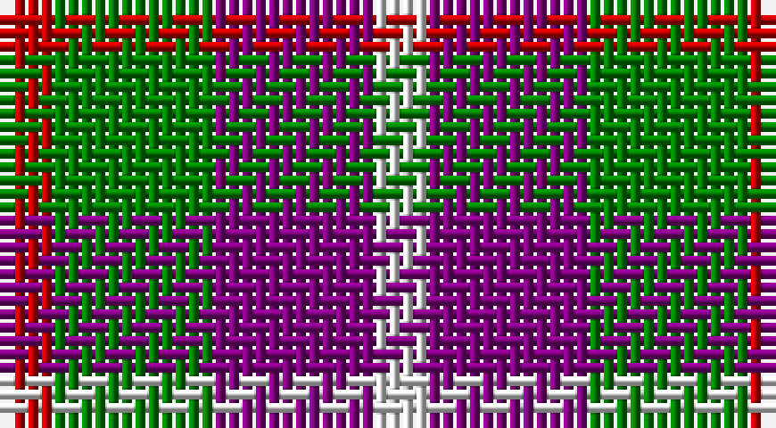

This page is one **sett** — a single exact thread-count. It belongs to the [tartan](/setts/r1g3p3w1/)
(the same proportion at any scale), whose colour order is pattern [RGBW](/stripes/rgbw/).

Sourced from weddslist.  It is a [4 stripe tartan](/stripes/stripes4/).

Original link http://www.weddslist.com/cgi-bin/tartans/pg.pl?source=sts

## Thread count
R/4 G12 P12 LN/4

One full sett is **56 threads**.

## Palette

Palette: <strong>Tartan Dictionary</strong> <small style="color:#888">(1 of 4 colours)</small>
<table><thead><tr><th>Colour</th><th>Threads</th><th>Shade</th><th>Base</th><th>OKLCh</th></tr></thead><tbody><tr><td>R/</td><td style="text-align:right;font-variant-numeric:tabular-nums">4</td><td><code style="background-color:#C00000;">#C00000</code> <small style="color:#888">#C00000</small></td><td>R <code style="background-color:#CC0000;">#CC0000</code></td><td><small style="color:#888">oklch(50.7% 0.208 29.2)</small></td></tr><tr><td>G</td><td style="text-align:right;font-variant-numeric:tabular-nums">12</td><td><code style="background-color:#008000;">#008000</code> <small style="color:#888">#008000</small></td><td>G <code style="background-color:#006100;">#006100</code></td><td><small style="color:#888">oklch(52.0% 0.177 142.5)</small></td></tr><tr><td>P</td><td style="text-align:right;font-variant-numeric:tabular-nums">12</td><td><code style="background-color:#800080;">#800080</code> <small style="color:#888">#800080</small></td><td>B <code style="background-color:#2A418A;">#2A418A</code></td><td><small style="color:#888">oklch(42.1% 0.193 328.4)</small></td></tr><tr><td>LN/</td><td style="text-align:right;font-variant-numeric:tabular-nums">4</td><td><code style="background-color:#E0E0E0;">#E0E0E0</code> <small style="color:#888">#E0E0E0</small></td><td>W <code style="background-color:#F7F7F7;">#F7F7F7</code></td><td><small style="color:#888">oklch(90.7% 0.000 89.9)</small></td></tr></tbody></table>

# Sample pattern

## Nearest tartans

The nearest existing variants by ΔTartan distance, with this tartan at the top so the swatches line up against it.

ΔTartan

Tartan

Sett

—

<a href="/ttd/edit/#slug=r1g3p3w1~x4">Wilson's, No 113</a> <a class="nn-out" href="/variants/s4/r1g3p3w1~x4/" title="open its dictionary page">↗</a>

1.13

<a href="/ttd/edit/#slug=r10t5lb5dt4~x8&amp;base=r1g3p3w1~x4">Haggis Hostels</a> <a class="nn-out" href="/variants/s4/r10t5lb5dt4~x8/" title="open its dictionary page">↗</a>

1.28

<a href="/ttd/edit/#slug=db2g4ly1db1r2~x12&amp;base=r1g3p3w1~x4">Creek Indian Nation</a> <a class="nn-out" href="/variants/s5/db2g4ly1db1r2~x12/" title="open its dictionary page">↗</a>

1.30

<a href="/ttd/edit/#slug=g4r3t1k1t3~x4&amp;base=r1g3p3w1~x4">Wilson's, No 214</a> <a class="nn-out" href="/variants/s5/g4r3t1k1t3~x4/" title="open its dictionary page">↗</a>

1.31

<a href="/ttd/edit/#slug=t1g3r1p3t1~x4&amp;base=r1g3p3w1~x4">Wilson's, No 95</a> <a class="nn-out" href="/variants/s5/t1g3r1p3t1~x4/" title="open its dictionary page">↗</a>

1.34

<a href="/ttd/edit/#slug=k7r5w3db2~x4&amp;base=r1g3p3w1~x4">Thomas Newcomen's Combustion Engine</a> <a class="nn-out" href="/variants/s4/k7r5w3db2~x4/" title="open its dictionary page">↗</a>

1.35

<a href="/ttd/edit/#slug=r5t12ly11dt21lo5~x2&amp;base=r1g3p3w1~x4">Inspiration</a> <a class="nn-out" href="/variants/s5/r5t12ly11dt21lo5~x2/" title="open its dictionary page">↗</a>

1.35

<a href="/ttd/edit/#slug=r5db12lyi11n21ly5~x2&amp;base=r1g3p3w1~x4">Inspiration</a> <a class="nn-out" href="/variants/s5/r5db12lyi11n21ly5~x2/" title="open its dictionary page">↗</a>

1.36

<a href="/ttd/edit/#slug=dt6k6dt6r14ly3~x2&amp;base=r1g3p3w1~x4">Chivas Regal</a> <a class="nn-out" href="/variants/s5/dt6k6dt6r14ly3~x2/" title="open its dictionary page">↗</a>

1.36

<a href="/ttd/edit/#slug=r3k1dg1k1lb3~x4&amp;base=r1g3p3w1~x4">Clark</a> <a class="nn-out" href="/variants/s5/r3k1dg1k1lb3~x4/" title="open its dictionary page">↗</a>

1.39

<a href="/ttd/edit/#slug=p3k3p3g6ly2~x2&amp;base=r1g3p3w1~x4">Austin / Wilson's No 173</a> <a class="nn-out" href="/variants/s5/p3k3p3g6ly2~x2/" title="open its dictionary page">↗</a>

## Neighbour map

Every grey dot is one of 14360 variants placed by the first two principal components of the ΔTartan feature space (44% of its variance). Red is this tartan; blue dots are its nearest — click one to open its page.

<svg viewBox="0 0 640 380" role="img" style="max-width:100%;height:auto;border:1px solid #e0e0e0;border-radius:4px;display:block" xmlns="http://www.w3.org/2000/svg"><image href="/nn/cloud.v1.png" width="640" height="380"/><a href="/variants/s4/r10t5lb5dt4~x8/"><circle cx="112.6" cy="306.3" r="4" fill="#3465a4"><title>Haggis Hostels</title></circle></a><a href="/variants/s5/db2g4ly1db1r2~x12/"><circle cx="144.2" cy="274.7" r="4" fill="#3465a4"><title>Creek Indian Nation</title></circle></a><a href="/variants/s5/g4r3t1k1t3~x4/"><circle cx="108.6" cy="277.5" r="4" fill="#3465a4"><title>Wilson's, No 214</title></circle></a><a href="/variants/s5/t1g3r1p3t1~x4/"><circle cx="123.8" cy="289.4" r="4" fill="#3465a4"><title>Wilson's, No 95</title></circle></a><a href="/variants/s4/k7r5w3db2~x4/"><circle cx="104.2" cy="273.1" r="4" fill="#3465a4"><title>Thomas Newcomen's Combustion Engine</title></circle></a><a href="/variants/s5/r5t12ly11dt21lo5~x2/"><circle cx="97.7" cy="247.8" r="4" fill="#3465a4"><title>Inspiration</title></circle></a><a href="/variants/s5/r5db12lyi11n21ly5~x2/"><circle cx="94.6" cy="241.3" r="4" fill="#3465a4"><title>Inspiration</title></circle></a><a href="/variants/s5/dt6k6dt6r14ly3~x2/"><circle cx="160.5" cy="269.8" r="4" fill="#3465a4"><title>Chivas Regal</title></circle></a><a href="/variants/s5/r3k1dg1k1lb3~x4/"><circle cx="73.7" cy="256.0" r="4" fill="#3465a4"><title>Clark</title></circle></a><a href="/variants/s5/p3k3p3g6ly2~x2/"><circle cx="71.1" cy="290.4" r="4" fill="#3465a4"><title>Austin / Wilson's No 173</title></circle></a><circle cx="119.1" cy="286.4" r="5" fill="#c00000"/></svg>

ID: /variants/s4/r1g3p3w1~x4/
