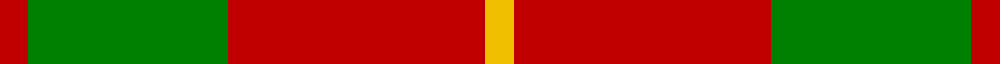
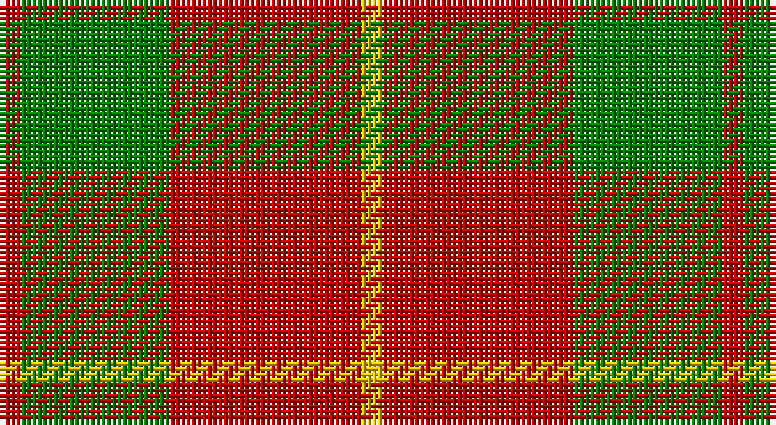

This page is one **sett** — a single exact thread-count. It belongs to the [tartan](/setts/r1g7r9ly1/)
(the same proportion at any scale), whose colour order is pattern [RGRY](/stripes/rgry/).

Part of the [Bryce](/tartans/bryce/) tartan — the named design grouping this sett with its other cloths.

Sourced from weddslist.  It is a [4 stripe tartan](/stripes/stripes4/).

Original link http://www.weddslist.com/cgi-bin/tartans/pg.pl?source=sts

## Provenance

Earliest known date: c.1953 The threadcount for the Bryce tartan was supplied by J. Dalgety Esq., of Forfar who in turn obtained it from the late James Cant of Dundee. There is a marked similarity with the Bruce tartan, but there is no historical link between the names. Bruce derives from Robert de Bruis (or Brus), whereas Bryce derives from St Bricius, a Gaulish saint from the 5th century. An old Lennox family of Bryce is known to have fought along side the MacFarlanes in 1619, and although the Lennoxes are acknowledged as a name within the clan, only descendants of this particular Bryce family could claim protection from Clan MacFarlane. However, no such distinction prevents all of the name Bryce from wearing the Bryce tartan.

2 attestations — the source records this cloth was collapsed from (oldest owns this page)

<ul>
<li>undated — Bryce (weddslist, <a href="http://www.weddslist.com/cgi-bin/tartans/pg.pl?source=sts">record</a>)</li>
<li>undated — Bryce Family Tartan (house-of-tartan, <a href="http://www.house-of-tartan.scotland.net/house/TartanViewjs.asp?colr=Def&tnam=1537">record</a>)</li>
</ul>

## Thread count
R/4 G28 R36 Y/4

One full sett is **136 threads**.

## Palette

Palette: <strong>custom</strong>
<table><thead><tr><th>Colour</th><th>Threads</th><th>Shade</th><th>Base</th><th>OKLCh</th></tr></thead><tbody><tr><td>R/</td><td style="text-align:right;font-variant-numeric:tabular-nums">4</td><td><code style="background-color:#C00000;">#C00000</code> <small style="color:#888">#C00000</small></td><td>R <code style="background-color:#CC0000;">#CC0000</code></td><td><small style="color:#888">oklch(50.7% 0.208 29.2)</small></td></tr><tr><td>G</td><td style="text-align:right;font-variant-numeric:tabular-nums">28</td><td><code style="background-color:#008000;">#008000</code> <small style="color:#888">#008000</small></td><td>G <code style="background-color:#006100;">#006100</code></td><td><small style="color:#888">oklch(52.0% 0.177 142.5)</small></td></tr><tr><td>R</td><td style="text-align:right;font-variant-numeric:tabular-nums">36</td><td><code style="background-color:#C00000;">#C00000</code> <small style="color:#888">#C00000</small></td><td>R <code style="background-color:#CC0000;">#CC0000</code></td><td><small style="color:#888">oklch(50.7% 0.208 29.2)</small></td></tr><tr><td>Y/</td><td style="text-align:right;font-variant-numeric:tabular-nums">4</td><td><code style="background-color:#F0C000;">#F0C000</code> <small style="color:#888">#F0C000</small></td><td>Y <code style="background-color:#F2BF00;">#F2BF00</code></td><td><small style="color:#888">oklch(82.7% 0.169 90.5)</small></td></tr></tbody></table>

# Sample pattern

## Compared to the master

This cloth is one sett of its design; the master sett (the exemplar the design is anchored on) is below for comparison.

<figure style="margin:0"><figcaption style="color:#888;font-size:smaller">this sett</figcaption></figure>
<figure style="margin:0"><figcaption style="color:#888;font-size:smaller"><a href="/setts/r5n35r46o5/">master sett →</a></figcaption></figure>

## Nearest tartans

The nearest existing variants by ΔTartan distance, with this tartan at the top so the swatches line up against it.

ΔTartan

Tartan

Sett

—

<a href="/ttd/edit/#slug=r1g7r9ly1~x4">Bryce</a> <a class="nn-out" href="/variants/s4/r1g7r9ly1~x4/" title="open its dictionary page">↗</a>

0.36

<a href="/ttd/edit/#slug=r3g20r25w3~x4&amp;base=r1g7r9ly1~x4">MacKinnon 11</a> <a class="nn-out" href="/variants/s4/r3g20r25w3~x4/" title="open its dictionary page">↗</a>

0.78

<a href="/ttd/edit/#slug=g16r5g2r18k2~x2&amp;base=r1g7r9ly1~x4">MacDonald, Lord of The Isles (Artef)</a> <a class="nn-out" href="/variants/s5/g16r5g2r18k2~x2/" title="open its dictionary page">↗</a>

1.02

<a href="/ttd/edit/#slug=r3dg20r25w3~x4&amp;base=r1g7r9ly1~x4">MacKinnon #6</a> <a class="nn-out" href="/variants/s4/r3dg20r25w3~x4/" title="open its dictionary page">↗</a>

1.07

<a href="/ttd/edit/#slug=r1g3r1g3r8ly1~x8&amp;base=r1g7r9ly1~x4">Cameron</a> <a class="nn-out" href="/variants/s6/r1g3r1g3r8ly1~x8/" title="open its dictionary page">↗</a>

1.07

<a href="/ttd/edit/#slug=dg16r5dg2r18k2~x2&amp;base=r1g7r9ly1~x4">MacDonald Lord of the Isles #2</a> <a class="nn-out" href="/variants/s5/dg16r5dg2r18k2~x2/" title="open its dictionary page">↗</a>

1.09

<a href="/ttd/edit/#slug=k1r5g10r5g1~x4&amp;base=r1g7r9ly1~x4">Murray, Lord George (Hose)</a> <a class="nn-out" href="/variants/s5/k1r5g10r5g1~x4/" title="open its dictionary page">↗</a>

1.19

<a href="/ttd/edit/#slug=dg7r3dg1r9k1~x2&amp;base=r1g7r9ly1~x4">MacDonald of Sleat</a> <a class="nn-out" href="/variants/s5/dg7r3dg1r9k1~x2/" title="open its dictionary page">↗</a>

1.24

<a href="/ttd/edit/#slug=w11r40g13r5g12r5~x2&amp;base=r1g7r9ly1~x4">Makhtoum</a> <a class="nn-out" href="/variants/s6/w11r40g13r5g12r5~x2/" title="open its dictionary page">↗</a>

1.25

<a href="/variants/s4/r10dg4lo1~x8/">Lugo (2013)</a>

1.31

<a href="/variants/s4/r10dg4ly1~x8/">Lugo (2013)</a>

## Neighbour map

Every grey dot is one of 14360 variants placed by the first two principal components of the ΔTartan feature space (44% of its variance). Red is this tartan; blue dots are its nearest — click one to open its page.

<svg viewBox="0 0 640 380" role="img" style="max-width:100%;height:auto;border:1px solid #e0e0e0;border-radius:4px;display:block" xmlns="http://www.w3.org/2000/svg"><image href="/nn/cloud.v1.png" width="640" height="380"/><a href="/variants/s4/r3g20r25w3~x4/"><circle cx="338.6" cy="247.0" r="4" fill="#3465a4"><title>MacKinnon 11</title></circle></a><a href="/variants/s5/g16r5g2r18k2~x2/"><circle cx="351.5" cy="241.0" r="4" fill="#3465a4"><title>MacDonald, Lord of The Isles (Artef)</title></circle></a><a href="/variants/s4/r3dg20r25w3~x4/"><circle cx="333.9" cy="240.8" r="4" fill="#3465a4"><title>MacKinnon #6</title></circle></a><a href="/variants/s6/r1g3r1g3r8ly1~x8/"><circle cx="369.6" cy="227.2" r="4" fill="#3465a4"><title>Cameron</title></circle></a><a href="/variants/s5/dg16r5dg2r18k2~x2/"><circle cx="342.1" cy="233.7" r="4" fill="#3465a4"><title>MacDonald Lord of the Isles #2</title></circle></a><a href="/variants/s5/k1r5g10r5g1~x4/"><circle cx="323.1" cy="240.3" r="4" fill="#3465a4"><title>Murray, Lord George (Hose)</title></circle></a><a href="/variants/s5/dg7r3dg1r9k1~x2/"><circle cx="353.6" cy="237.9" r="4" fill="#3465a4"><title>MacDonald of Sleat</title></circle></a><a href="/variants/s6/w11r40g13r5g12r5~x2/"><circle cx="327.5" cy="217.2" r="4" fill="#3465a4"><title>Makhtoum</title></circle></a><a href="/variants/s4/r10dg4lo1~x8/"><circle cx="348.8" cy="264.4" r="4" fill="#3465a4"><title>Lugo (2013)</title></circle></a><a href="/variants/s4/r10dg4ly1~x8/"><circle cx="330.2" cy="249.6" r="4" fill="#3465a4"><title>Lugo (2013)</title></circle></a><circle cx="354.9" cy="246.5" r="5" fill="#c00000"/></svg>

ID: /variants/s4/r1g7r9ly1~x4/
