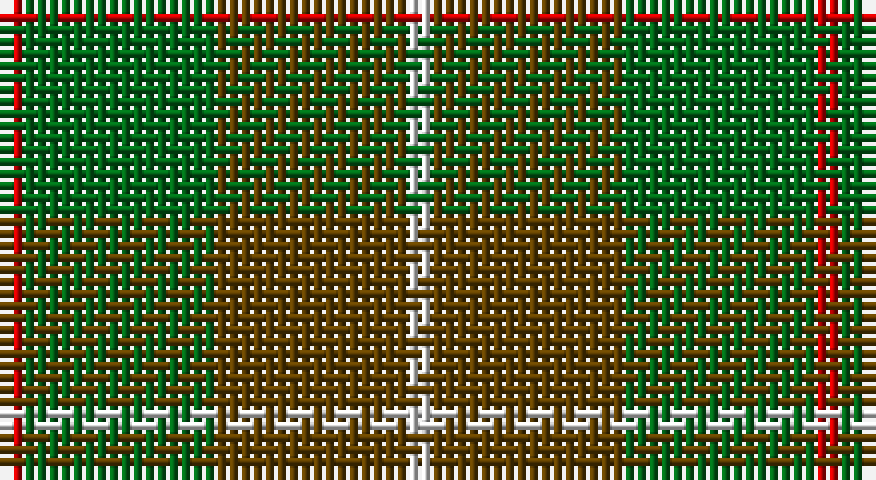

This page is one **sett** — a single exact thread-count. It belongs to the [tartan](/setts/r1g8dy8w1/)
(the same proportion at any scale), whose colour order is pattern [RGGW](/stripes/rggw/).

Sourced from house-of-tartan.  It is a [4 stripe tartan](/stripes/stripes4/).

Original link http://www.house-of-tartan.scotland.net/house/TartanViewjs.asp?colr=Def&tnam=1542

## Provenance

Earliest known date: pre 2003 Two times actual count given in letter from MacKinnon of MacKinnon 1908 as 'the Composition of the MacKinnon tartan...'

## Thread count
R/2 G16 T16 LN/2

One full sett is **68 threads**.

## Palette

Palette: <strong>Tartan Register</strong>
<table><thead><tr><th>Colour</th><th>Threads</th><th>Shade</th><th>Base</th><th>OKLCh</th></tr></thead><tbody><tr><td>R/</td><td style="text-align:right;font-variant-numeric:tabular-nums">2</td><td><code style="background-color:#C80000;">#C80000</code> <small style="color:#888">#C80000</small></td><td>R <code style="background-color:#CC0000;">#CC0000</code></td><td><small style="color:#888">oklch(52.3% 0.215 29.2)</small></td></tr><tr><td>G</td><td style="text-align:right;font-variant-numeric:tabular-nums">16</td><td><code style="background-color:#006818;">#006818</code> <small style="color:#888">#006818</small></td><td>G <code style="background-color:#006100;">#006100</code></td><td><small style="color:#888">oklch(45.0% 0.142 145.0)</small></td></tr><tr><td>T</td><td style="text-align:right;font-variant-numeric:tabular-nums">16</td><td><code style="background-color:#604000;">#604000</code> <small style="color:#888">#604000</small></td><td>G <code style="background-color:#006100;">#006100</code></td><td><small style="color:#888">oklch(39.8% 0.083 76.8)</small></td></tr><tr><td>LN/</td><td style="text-align:right;font-variant-numeric:tabular-nums">2</td><td><code style="background-color:#E0E0E0;">#E0E0E0</code> <small style="color:#888">#E0E0E0</small></td><td>W <code style="background-color:#F7F7F7;">#F7F7F7</code></td><td><small style="color:#888">oklch(90.7% 0.000 89.9)</small></td></tr></tbody></table>

# Sample pattern

## Nearest tartans

The nearest existing variants by ΔTartan distance, with this tartan at the top so the swatches line up against it.

ΔTartan

Tartan

Sett

—

<a href="/ttd/edit/#slug=r1g8dy8w1~x2">MacKinnon Hunting (Var) Clan Tartan</a> <a class="nn-out" href="/variants/s4/r1g8dy8w1~x2/" title="open its dictionary page">↗</a>

0.70

<a href="/ttd/edit/#slug=r1dg8dy8w1~x2&amp;base=r1g8dy8w1~x2">MacKinnon Hunting #2</a> <a class="nn-out" href="/variants/s4/r1dg8dy8w1~x2/" title="open its dictionary page">↗</a>

0.79

<a href="/ttd/edit/#slug=r1g8o8w1~x2&amp;base=r1g8dy8w1~x2">MacKinnon, hunting</a> <a class="nn-out" href="/variants/s4/r1g8o8w1~x2/" title="open its dictionary page">↗</a>

1.51

<a href="/ttd/edit/#slug=g30lo3t8o25~x2&amp;base=r1g8dy8w1~x2">Dohmen Family (Zuid-Nederland)</a> <a class="nn-out" href="/variants/s4/g30lo3t8o25~x2/" title="open its dictionary page">↗</a>

1.57

<a href="/ttd/edit/#slug=dy5r3dy31dg20dy3g22r5~x2&amp;base=r1g8dy8w1~x2">Ballantrae (Dalgety)</a> <a class="nn-out" href="/variants/s7/dy5r3dy31dg20dy3g22r5~x2/" title="open its dictionary page">↗</a>

1.58

<a href="/ttd/edit/#slug=g24r9g4dg19ly2dg6g7~x2&amp;base=r1g8dy8w1~x2">Doyle</a> <a class="nn-out" href="/variants/s7/g24r9g4dg19ly2dg6g7~x2/" title="open its dictionary page">↗</a>

1.63

<a href="/ttd/edit/#slug=lo5y33dg33r6w2~x2&amp;base=r1g8dy8w1~x2">Symington</a> <a class="nn-out" href="/variants/s5/lo5y33dg33r6w2~x2/" title="open its dictionary page">↗</a>

1.66

<a href="/ttd/edit/#slug=dy10r5dy62dg40dy5g44r10&amp;base=r1g8dy8w1~x2">Ballintrae Trade Tartan</a> <a class="nn-out" href="/variants/s7/dy10r5dy62dg40dy5g44r10/" title="open its dictionary page">↗</a>

1.69

<a href="/ttd/edit/#slug=g1o8g8r1g8o8w1~x4&amp;base=r1g8dy8w1~x2">MacKinnon, hunting</a> <a class="nn-out" href="/variants/s7/g1o8g8r1g8o8w1~x4/" title="open its dictionary page">↗</a>

1.70

<a href="/ttd/edit/#slug=dy46g23b23r4ly4~x2&amp;base=r1g8dy8w1~x2">McMoosie Htg (Fashion)</a> <a class="nn-out" href="/variants/s5/dy46g23b23r4ly4~x2/" title="open its dictionary page">↗</a>

1.70

<a href="/variants/s4/g13r2t13~x2/">Wilson's No.161</a>

## Neighbour map

Every grey dot is one of 14360 variants placed by the first two principal components of the ΔTartan feature space (44% of its variance). Red is this tartan; blue dots are its nearest — click one to open its page.

<svg viewBox="0 0 640 380" role="img" style="max-width:100%;height:auto;border:1px solid #e0e0e0;border-radius:4px;display:block" xmlns="http://www.w3.org/2000/svg"><image href="/nn/cloud.v1.png" width="640" height="380"/><a href="/variants/s4/r1dg8dy8w1~x2/"><circle cx="309.0" cy="278.6" r="4" fill="#3465a4"><title>MacKinnon Hunting #2</title></circle></a><a href="/variants/s4/r1g8o8w1~x2/"><circle cx="301.4" cy="268.4" r="4" fill="#3465a4"><title>MacKinnon, hunting</title></circle></a><a href="/variants/s4/g30lo3t8o25~x2/"><circle cx="294.3" cy="259.0" r="4" fill="#3465a4"><title>Dohmen Family (Zuid-Nederland)</title></circle></a><a href="/variants/s7/dy5r3dy31dg20dy3g22r5~x2/"><circle cx="261.4" cy="226.4" r="4" fill="#3465a4"><title>Ballantrae (Dalgety)</title></circle></a><a href="/variants/s7/g24r9g4dg19ly2dg6g7~x2/"><circle cx="303.3" cy="237.7" r="4" fill="#3465a4"><title>Doyle</title></circle></a><a href="/variants/s5/lo5y33dg33r6w2~x2/"><circle cx="305.7" cy="219.4" r="4" fill="#3465a4"><title>Symington</title></circle></a><a href="/variants/s7/dy10r5dy62dg40dy5g44r10/"><circle cx="270.0" cy="218.7" r="4" fill="#3465a4"><title>Ballintrae Trade Tartan</title></circle></a><a href="/variants/s7/g1o8g8r1g8o8w1~x4/"><circle cx="334.8" cy="268.5" r="4" fill="#3465a4"><title>MacKinnon, hunting</title></circle></a><a href="/variants/s5/dy46g23b23r4ly4~x2/"><circle cx="283.4" cy="239.5" r="4" fill="#3465a4"><title>McMoosie Htg (Fashion)</title></circle></a><a href="/variants/s4/g13r2t13~x2/"><circle cx="289.5" cy="291.6" r="4" fill="#3465a4"><title>Wilson's No.161</title></circle></a><circle cx="305.4" cy="273.7" r="5" fill="#c00000"/></svg>

ID: /variants/s4/r1g8dy8w1~x2/
