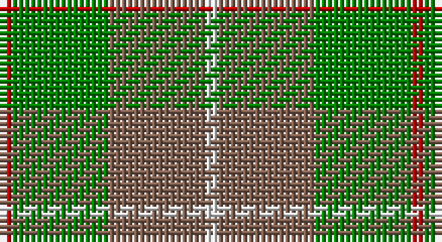

This page is one **sett** — a single exact thread-count. It belongs to the [tartan](/setts/r1g8o8w1/)
(the same proportion at any scale), whose colour order is pattern [RGRW](/stripes/rgrw/).

Sourced from weddslist.  It is a [4 stripe tartan](/stripes/stripes4/).

Original link http://www.weddslist.com/cgi-bin/tartans/pg.pl?source=sts

## Thread count
R/2 G16 LT16 LN/2

One full sett is **68 threads**.

## Palette

Palette: <strong>Tartan Dictionary</strong> <small style="color:#888">(1 of 4 colours)</small>
<table><thead><tr><th>Colour</th><th>Threads</th><th>Shade</th><th>Base</th><th>OKLCh</th></tr></thead><tbody><tr><td>R/</td><td style="text-align:right;font-variant-numeric:tabular-nums">2</td><td><code style="background-color:#C00000;">#C00000</code> <small style="color:#888">#C00000</small></td><td>R <code style="background-color:#CC0000;">#CC0000</code></td><td><small style="color:#888">oklch(50.7% 0.208 29.2)</small></td></tr><tr><td>G</td><td style="text-align:right;font-variant-numeric:tabular-nums">16</td><td><code style="background-color:#008000;">#008000</code> <small style="color:#888">#008000</small></td><td>G <code style="background-color:#006100;">#006100</code></td><td><small style="color:#888">oklch(52.0% 0.177 142.5)</small></td></tr><tr><td>LT</td><td style="text-align:right;font-variant-numeric:tabular-nums">16</td><td><code style="background-color:#806050;">#806050</code> <small style="color:#888">#806050</small></td><td>R <code style="background-color:#CC0000;">#CC0000</code></td><td><small style="color:#888">oklch(51.7% 0.049 47.8)</small></td></tr><tr><td>LN/</td><td style="text-align:right;font-variant-numeric:tabular-nums">2</td><td><code style="background-color:#E0E0E0;">#E0E0E0</code> <small style="color:#888">#E0E0E0</small></td><td>W <code style="background-color:#F7F7F7;">#F7F7F7</code></td><td><small style="color:#888">oklch(90.7% 0.000 89.9)</small></td></tr></tbody></table>

# Sample pattern

## Nearest tartans

The nearest existing variants by ΔTartan distance, with this tartan at the top so the swatches line up against it.

ΔTartan

Tartan

Sett

—

<a href="/ttd/edit/#slug=r1g8o8w1~x2">MacKinnon, hunting</a> <a class="nn-out" href="/variants/s4/r1g8o8w1~x2/" title="open its dictionary page">↗</a>

0.79

<a href="/ttd/edit/#slug=r1g8dy8w1~x2&amp;base=r1g8o8w1~x2">MacKinnon Hunting (Var) Clan Tartan</a> <a class="nn-out" href="/variants/s4/r1g8dy8w1~x2/" title="open its dictionary page">↗</a>

1.23

<a href="/ttd/edit/#slug=g30lo3t8o25~x2&amp;base=r1g8o8w1~x2">Dohmen Family (Zuid-Nederland)</a> <a class="nn-out" href="/variants/s4/g30lo3t8o25~x2/" title="open its dictionary page">↗</a>

1.31

<a href="/ttd/edit/#slug=r1dg8dy8w1~x2&amp;base=r1g8o8w1~x2">MacKinnon Hunting #2</a> <a class="nn-out" href="/variants/s4/r1dg8dy8w1~x2/" title="open its dictionary page">↗</a>

1.37

<a href="/variants/s4/g13r2t13~x2/">Wilson's No.161</a>

1.44

<a href="/ttd/edit/#slug=g25lo6dg5r3lo10~x4&amp;base=r1g8o8w1~x2">Pendlebury, Andrew (Personal)</a> <a class="nn-out" href="/variants/s5/g25lo6dg5r3lo10~x4/" title="open its dictionary page">↗</a>

1.54

<a href="/ttd/edit/#slug=g1o8g8r1g8o8w1~x4&amp;base=r1g8o8w1~x2">MacKinnon, hunting</a> <a class="nn-out" href="/variants/s7/g1o8g8r1g8o8w1~x4/" title="open its dictionary page">↗</a>

1.58

<a href="/ttd/edit/#slug=db3o10g9r1g3~x4&amp;base=r1g8o8w1~x2">Bethlehem, City of (District)</a> <a class="nn-out" href="/variants/s5/db3o10g9r1g3~x4/" title="open its dictionary page">↗</a>

1.62

<a href="/ttd/edit/#slug=g14r3db9t2~x2&amp;base=r1g8o8w1~x2">Unidentified 10</a> <a class="nn-out" href="/variants/s4/g14r3db9t2~x2/" title="open its dictionary page">↗</a>

1.70

<a href="/ttd/edit/#slug=g6ly1r1t2r2~x4&amp;base=r1g8o8w1~x2">Wilson's, No 179</a> <a class="nn-out" href="/variants/s5/g6ly1r1t2r2~x4/" title="open its dictionary page">↗</a>

1.73

<a href="/ttd/edit/#slug=lo11gi5lo10g4gi26lo4~x2&amp;base=r1g8o8w1~x2">North Dakota State University (Corp.</a> <a class="nn-out" href="/variants/s6/lo11gi5lo10g4gi26lo4~x2/" title="open its dictionary page">↗</a>

## Neighbour map

Every grey dot is one of 14360 variants placed by the first two principal components of the ΔTartan feature space (44% of its variance). Red is this tartan; blue dots are its nearest — click one to open its page.

<svg viewBox="0 0 640 380" role="img" style="max-width:100%;height:auto;border:1px solid #e0e0e0;border-radius:4px;display:block" xmlns="http://www.w3.org/2000/svg"><image href="/nn/cloud.v1.png" width="640" height="380"/><a href="/variants/s4/r1g8dy8w1~x2/"><circle cx="305.4" cy="273.7" r="4" fill="#3465a4"><title>MacKinnon Hunting (Var) Clan Tartan</title></circle></a><a href="/variants/s4/g30lo3t8o25~x2/"><circle cx="294.3" cy="259.0" r="4" fill="#3465a4"><title>Dohmen Family (Zuid-Nederland)</title></circle></a><a href="/variants/s4/r1dg8dy8w1~x2/"><circle cx="309.0" cy="278.6" r="4" fill="#3465a4"><title>MacKinnon Hunting #2</title></circle></a><a href="/variants/s4/g13r2t13~x2/"><circle cx="289.5" cy="291.6" r="4" fill="#3465a4"><title>Wilson's No.161</title></circle></a><a href="/variants/s5/g25lo6dg5r3lo10~x4/"><circle cx="298.4" cy="242.2" r="4" fill="#3465a4"><title>Pendlebury, Andrew (Personal)</title></circle></a><a href="/variants/s7/g1o8g8r1g8o8w1~x4/"><circle cx="334.8" cy="268.5" r="4" fill="#3465a4"><title>MacKinnon, hunting</title></circle></a><a href="/variants/s5/db3o10g9r1g3~x4/"><circle cx="279.3" cy="256.1" r="4" fill="#3465a4"><title>Bethlehem, City of (District)</title></circle></a><a href="/variants/s4/g14r3db9t2~x2/"><circle cx="267.3" cy="272.4" r="4" fill="#3465a4"><title>Unidentified 10</title></circle></a><a href="/variants/s5/g6ly1r1t2r2~x4/"><circle cx="244.6" cy="244.0" r="4" fill="#3465a4"><title>Wilson's, No 179</title></circle></a><a href="/variants/s6/lo11gi5lo10g4gi26lo4~x2/"><circle cx="345.3" cy="280.2" r="4" fill="#3465a4"><title>North Dakota State University (Corp.</title></circle></a><circle cx="301.4" cy="268.4" r="5" fill="#c00000"/></svg>

ID: /variants/s4/r1g8o8w1~x2/
