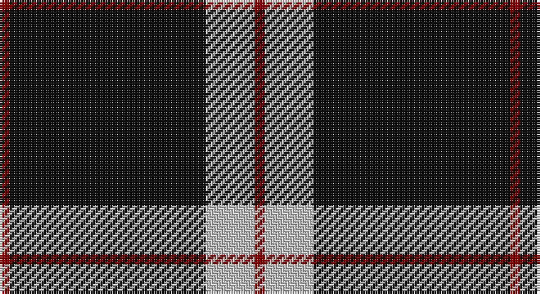

This page is one **sett** — a single exact thread-count. It belongs to the [tartan](/setts/r1k20lb5r1/)
(the same proportion at any scale), whose colour order is pattern [RKWR](/stripes/rkwr/).

Sourced from tartans-authority.  It is a [4 stripe tartan](/stripes/stripes4/).

Original link http://www.tartansauthority.com/tartan-ferret/display/3241/

2 attestations — the source records this cloth was collapsed from (oldest owns this page)

<ul>
<li>2002 — Dobelman (Personal) (tartans-authority, <a href="http://www.tartansauthority.com/tartan-ferret/display/3241/">record</a>)</li>
<li>undated — Dobelman (Personal) (register-of-tartans, <a href="https://www.tartanregister.gov.uk/tartanDetails.aspx?ref=5385">record</a>)</li>
</ul>

## Register references

External register numbers recorded for this tartan.

- Scottish Register of Tartans: [5385](https://www.tartanregister.gov.uk/tartanDetails.aspx?ref=5385)
- Scottish Tartans Authority (ITI): 3241

## Thread count
DR/4 K80 N20 DR/4

One full sett is **208 threads**.

## Palette

Palette: <strong>Tartan Register</strong>
<table><thead><tr><th>Colour</th><th>Threads</th><th>Shade</th><th>Base</th><th>OKLCh</th></tr></thead><tbody><tr><td>DR/</td><td style="text-align:right;font-variant-numeric:tabular-nums">4</td><td><code style="background-color:#880000;">#880000</code> <small style="color:#888">#880000</small></td><td>R <code style="background-color:#CC0000;">#CC0000</code></td><td><small style="color:#888">oklch(39.4% 0.162 29.2)</small></td></tr><tr><td>K</td><td style="text-align:right;font-variant-numeric:tabular-nums">80</td><td><code style="background-color:#101010;">#101010</code> <small style="color:#888">#101010</small></td><td>K <code style="background-color:#000000;">#000000</code></td><td><small style="color:#888">oklch(17.3% 0.000 89.9)</small></td></tr><tr><td>N</td><td style="text-align:right;font-variant-numeric:tabular-nums">20</td><td><code style="background-color:#C0C0C0;">#C0C0C0</code> <small style="color:#888">#C0C0C0</small></td><td>W <code style="background-color:#F7F7F7;">#F7F7F7</code></td><td><small style="color:#888">oklch(80.8% 0.000 89.9)</small></td></tr><tr><td>DR/</td><td style="text-align:right;font-variant-numeric:tabular-nums">4</td><td><code style="background-color:#880000;">#880000</code> <small style="color:#888">#880000</small></td><td>R <code style="background-color:#CC0000;">#CC0000</code></td><td><small style="color:#888">oklch(39.4% 0.162 29.2)</small></td></tr></tbody></table>

# Sample pattern

## Nearest tartans

The nearest existing variants by ΔTartan distance, with this tartan at the top so the swatches line up against it.

ΔTartan

Tartan

Sett

—

<a href="/ttd/edit/#slug=r1k20lb5r1~x4">Dobelman (Personal)</a> <a class="nn-out" href="/variants/s4/r1k20lb5r1~x4/" title="open its dictionary page">↗</a>

0.89

<a href="/ttd/edit/#slug=k75y26y3k4ly6~x2&amp;base=r1k20lb5r1~x4">Perry Ancient (Personal)</a> <a class="nn-out" href="/variants/s5/k75y26y3k4ly6~x2/" title="open its dictionary page">↗</a>

0.97

<a href="/ttd/edit/#slug=r3t12k50ly3~x2&amp;base=r1k20lb5r1~x4">Rogues, The (Corporate)</a> <a class="nn-out" href="/variants/s4/r3t12k50ly3~x2/" title="open its dictionary page">↗</a>

1.10

<a href="/ttd/edit/#slug=r3n12k50ly3~x2&amp;base=r1k20lb5r1~x4">Rogues (United States), The</a> <a class="nn-out" href="/variants/s4/r3n12k50ly3~x2/" title="open its dictionary page">↗</a>

1.20

<a href="/ttd/edit/#slug=k62db15w6ly4~x2&amp;base=r1k20lb5r1~x4">C-Tec N.I. Ltd</a> <a class="nn-out" href="/variants/s4/k62db15w6ly4~x2/" title="open its dictionary page">↗</a>

1.23

<a href="/ttd/edit/#slug=ly9k4ly4k45r4~x2&amp;base=r1k20lb5r1~x4">Gwynn (Name)</a> <a class="nn-out" href="/variants/s5/ly9k4ly4k45r4~x2/" title="open its dictionary page">↗</a>

1.35

<a href="/ttd/edit/#slug=y14k80y14ly5~x2&amp;base=r1k20lb5r1~x4">Westgate Fashion Tartan</a> <a class="nn-out" href="/variants/s4/y14k80y14ly5~x2/" title="open its dictionary page">↗</a>

1.39

<a href="/ttd/edit/#slug=ly7k4ly4k39r4~x2&amp;base=r1k20lb5r1~x4">Welsh National #3</a> <a class="nn-out" href="/variants/s5/ly7k4ly4k39r4~x2/" title="open its dictionary page">↗</a>

1.39

<a href="/ttd/edit/#slug=r1k9o5k3o5k21o1~x4&amp;base=r1k20lb5r1~x4">Sunderland of Scotland (Fashion)</a> <a class="nn-out" href="/variants/s7/r1k9o5k3o5k21o1~x4/" title="open its dictionary page">↗</a>

1.40

<a href="/ttd/edit/#slug=n3k31w6k7n3k12w2~x2&amp;base=r1k20lb5r1~x4">Believe - Colette</a> <a class="nn-out" href="/variants/s7/n3k31w6k7n3k12w2~x2/" title="open its dictionary page">↗</a>

1.42

<a href="/ttd/edit/#slug=k30r10ly1k8w3~x4&amp;base=r1k20lb5r1~x4">Union Fire Club Pipes and Drums</a> <a class="nn-out" href="/variants/s5/k30r10ly1k8w3~x4/" title="open its dictionary page">↗</a>

## Neighbour map

Every grey dot is one of 14360 variants placed by the first two principal components of the ΔTartan feature space (44% of its variance). Red is this tartan; blue dots are its nearest — click one to open its page.

<svg viewBox="0 0 640 380" role="img" style="max-width:100%;height:auto;border:1px solid #e0e0e0;border-radius:4px;display:block" xmlns="http://www.w3.org/2000/svg"><image href="/nn/cloud.v1.png" width="640" height="380"/><a href="/variants/s5/k75y26y3k4ly6~x2/"><circle cx="462.0" cy="183.0" r="4" fill="#3465a4"><title>Perry Ancient (Personal)</title></circle></a><a href="/variants/s4/r3t12k50ly3~x2/"><circle cx="455.3" cy="196.8" r="4" fill="#3465a4"><title>Rogues, The (Corporate)</title></circle></a><a href="/variants/s4/r3n12k50ly3~x2/"><circle cx="465.1" cy="201.0" r="4" fill="#3465a4"><title>Rogues (United States), The</title></circle></a><a href="/variants/s4/k62db15w6ly4~x2/"><circle cx="423.8" cy="200.2" r="4" fill="#3465a4"><title>C-Tec N.I. Ltd</title></circle></a><a href="/variants/s5/ly9k4ly4k45r4~x2/"><circle cx="452.2" cy="202.0" r="4" fill="#3465a4"><title>Gwynn (Name)</title></circle></a><a href="/variants/s4/y14k80y14ly5~x2/"><circle cx="475.0" cy="230.3" r="4" fill="#3465a4"><title>Westgate Fashion Tartan</title></circle></a><a href="/variants/s5/ly7k4ly4k39r4~x2/"><circle cx="444.0" cy="208.1" r="4" fill="#3465a4"><title>Welsh National #3</title></circle></a><a href="/variants/s7/r1k9o5k3o5k21o1~x4/"><circle cx="479.2" cy="194.8" r="4" fill="#3465a4"><title>Sunderland of Scotland (Fashion)</title></circle></a><a href="/variants/s7/n3k31w6k7n3k12w2~x2/"><circle cx="471.4" cy="192.5" r="4" fill="#3465a4"><title>Believe - Colette</title></circle></a><a href="/variants/s5/k30r10ly1k8w3~x4/"><circle cx="458.5" cy="167.4" r="4" fill="#3465a4"><title>Union Fire Club Pipes and Drums</title></circle></a><circle cx="478.4" cy="199.1" r="5" fill="#c00000"/></svg>

ID: /variants/s4/r1k20lb5r1~x4/
