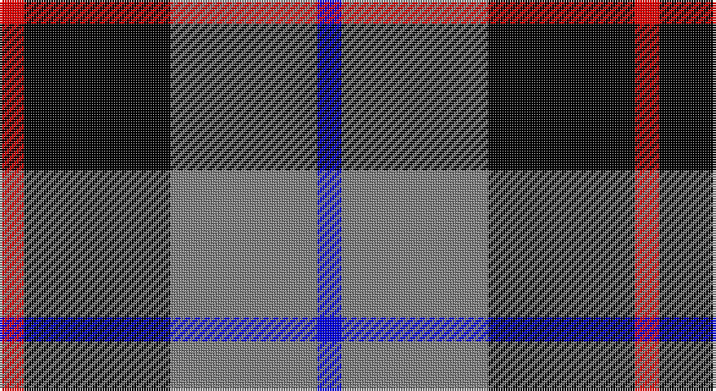

This page is one **sett** — a single exact thread-count. It belongs to the [tartan](/setts/r1k6y6b1/)
(the same proportion at any scale), whose colour order is pattern [BGKR](/stripes/bgkr/).

Part of the [Mayer, Chris](/tartans/mayer-chris/) tartan — the named design grouping this sett with its other cloths.

Sourced from register-of-tartans.  It is a [4 stripe tartan](/stripes/stripes4/).

Original link https://www.tartanregister.gov.uk/tartanDetails.aspx?ref=10244

## Register references

External register numbers recorded for this tartan.

- Scottish Register of Tartans: [10244](https://www.tartanregister.gov.uk/tartanDetails.aspx?ref=10244)

## Thread count
R/10 K60 N60 B/10

One full sett is **260 threads**.

## Palette

Palette: <strong>Tartan Register</strong>
<table><thead><tr><th>Colour</th><th>Threads</th><th>Shade</th><th>Base</th><th>OKLCh</th></tr></thead><tbody><tr><td>R/</td><td style="text-align:right;font-variant-numeric:tabular-nums">10</td><td><code style="background-color:#FF0000;">#FF0000</code> <small style="color:#888">#FF0000</small></td><td>R <code style="background-color:#CC0000;">#CC0000</code></td><td><small style="color:#888">oklch(62.8% 0.258 29.2)</small></td></tr><tr><td>K</td><td style="text-align:right;font-variant-numeric:tabular-nums">60</td><td><code style="background-color:#000000;">#000000</code> <small style="color:#888">#000000</small></td><td>K <code style="background-color:#000000;">#000000</code></td><td><small style="color:#888">oklch(0.0% 0.000 0.0)</small></td></tr><tr><td>N</td><td style="text-align:right;font-variant-numeric:tabular-nums">60</td><td><code style="background-color:#808080;">#808080</code> <small style="color:#888">#808080</small></td><td>G <code style="background-color:#006100;">#006100</code></td><td><small style="color:#888">oklch(60.0% 0.000 89.9)</small></td></tr><tr><td>B/</td><td style="text-align:right;font-variant-numeric:tabular-nums">10</td><td><code style="background-color:#0000FF;">#0000FF</code> <small style="color:#888">#0000FF</small></td><td>B <code style="background-color:#2A418A;">#2A418A</code></td><td><small style="color:#888">oklch(45.2% 0.313 264.1)</small></td></tr></tbody></table>

# Sample pattern

## Nearest tartans

The nearest existing variants by ΔTartan distance, with this tartan at the top so the swatches line up against it.

ΔTartan

Tartan

Sett

—

<a href="/ttd/edit/#slug=r1k6y6b1~x10">Mayer, Chris (Personal)</a> <a class="nn-out" href="/variants/s4/r1k6y6b1~x10/" title="open its dictionary page">↗</a>

0.49

<a href="/ttd/edit/#slug=r5y32k31w5~x2&amp;base=r1k6y6b1~x10">Loganair, Uniform Skirt</a> <a class="nn-out" href="/variants/s4/r5y32k31w5~x2/" title="open its dictionary page">↗</a>

1.09

<a href="/ttd/edit/#slug=r1dg6db6w1~x4&amp;base=r1k6y6b1~x10">Salt Spring Island</a> <a class="nn-out" href="/variants/s4/r1dg6db6w1~x4/" title="open its dictionary page">↗</a>

1.09

<a href="/ttd/edit/#slug=r5o32k31w5~x2&amp;base=r1k6y6b1~x10">Loganair</a> <a class="nn-out" href="/variants/s4/r5o32k31w5~x2/" title="open its dictionary page">↗</a>

1.14

<a href="/ttd/edit/#slug=r3o16k16lb3~x4&amp;base=r1k6y6b1~x10">Thompson, Dress (Clan)</a> <a class="nn-out" href="/variants/s4/r3o16k16lb3~x4/" title="open its dictionary page">↗</a>

1.15

<a href="/ttd/edit/#slug=r5o32k31w5&amp;base=r1k6y6b1~x10">Loganair Uniform Skirt Corporate Tartan</a> <a class="nn-out" href="/variants/s4/r5o32k31w5/" title="open its dictionary page">↗</a>

1.27

<a href="/ttd/edit/#slug=k3lb3k3n10r1~x6&amp;base=r1k6y6b1~x10">Greystone (Burberry Grey)</a> <a class="nn-out" href="/variants/s5/k3lb3k3n10r1~x6/" title="open its dictionary page">↗</a>

1.32

<a href="/ttd/edit/#slug=k19db18w9r3~x4&amp;base=r1k6y6b1~x10">Raven (Fashion)</a> <a class="nn-out" href="/variants/s4/k19db18w9r3~x4/" title="open its dictionary page">↗</a>

1.34

<a href="/ttd/edit/#slug=k3g9t2k11p9k3~x2&amp;base=r1k6y6b1~x10">Scott, Sir Walter</a> <a class="nn-out" href="/variants/s6/k3g9t2k11p9k3~x2/" title="open its dictionary page">↗</a>

1.36

<a href="/ttd/edit/#slug=r12db3g5db16ly2g2~x2&amp;base=r1k6y6b1~x10">Dunbog Primary (School)</a> <a class="nn-out" href="/variants/s6/r12db3g5db16ly2g2~x2/" title="open its dictionary page">↗</a>

1.38

<a href="/ttd/edit/#slug=db5k1g1k1r3k1~x4&amp;base=r1k6y6b1~x10">Clerk</a> <a class="nn-out" href="/variants/s6/db5k1g1k1r3k1~x4/" title="open its dictionary page">↗</a>

## Neighbour map

Every grey dot is one of 14360 variants placed by the first two principal components of the ΔTartan feature space (44% of its variance). Red is this tartan; blue dots are its nearest — click one to open its page.

<svg viewBox="0 0 640 380" role="img" style="max-width:100%;height:auto;border:1px solid #e0e0e0;border-radius:4px;display:block" xmlns="http://www.w3.org/2000/svg"><image href="/nn/cloud.v1.png" width="640" height="380"/><a href="/variants/s4/r5y32k31w5~x2/"><circle cx="196.8" cy="239.0" r="4" fill="#3465a4"><title>Loganair, Uniform Skirt</title></circle></a><a href="/variants/s4/r1dg6db6w1~x4/"><circle cx="199.5" cy="255.8" r="4" fill="#3465a4"><title>Salt Spring Island</title></circle></a><a href="/variants/s4/r5o32k31w5~x2/"><circle cx="209.7" cy="242.3" r="4" fill="#3465a4"><title>Loganair</title></circle></a><a href="/variants/s4/r3o16k16lb3~x4/"><circle cx="192.2" cy="254.4" r="4" fill="#3465a4"><title>Thompson, Dress (Clan)</title></circle></a><a href="/variants/s4/r5o32k31w5/"><circle cx="208.7" cy="240.7" r="4" fill="#3465a4"><title>Loganair Uniform Skirt Corporate Tartan</title></circle></a><a href="/variants/s5/k3lb3k3n10r1~x6/"><circle cx="230.4" cy="210.3" r="4" fill="#3465a4"><title>Greystone (Burberry Grey)</title></circle></a><a href="/variants/s4/k19db18w9r3~x4/"><circle cx="145.9" cy="262.6" r="4" fill="#3465a4"><title>Raven (Fashion)</title></circle></a><a href="/variants/s6/k3g9t2k11p9k3~x2/"><circle cx="168.2" cy="252.6" r="4" fill="#3465a4"><title>Scott, Sir Walter</title></circle></a><a href="/variants/s6/r12db3g5db16ly2g2~x2/"><circle cx="223.3" cy="210.7" r="4" fill="#3465a4"><title>Dunbog Primary (School)</title></circle></a><a href="/variants/s6/db5k1g1k1r3k1~x4/"><circle cx="172.1" cy="234.5" r="4" fill="#3465a4"><title>Clerk</title></circle></a><circle cx="191.3" cy="245.4" r="5" fill="#c00000"/></svg>

ID: /variants/s4/r1k6y6b1~x10/
