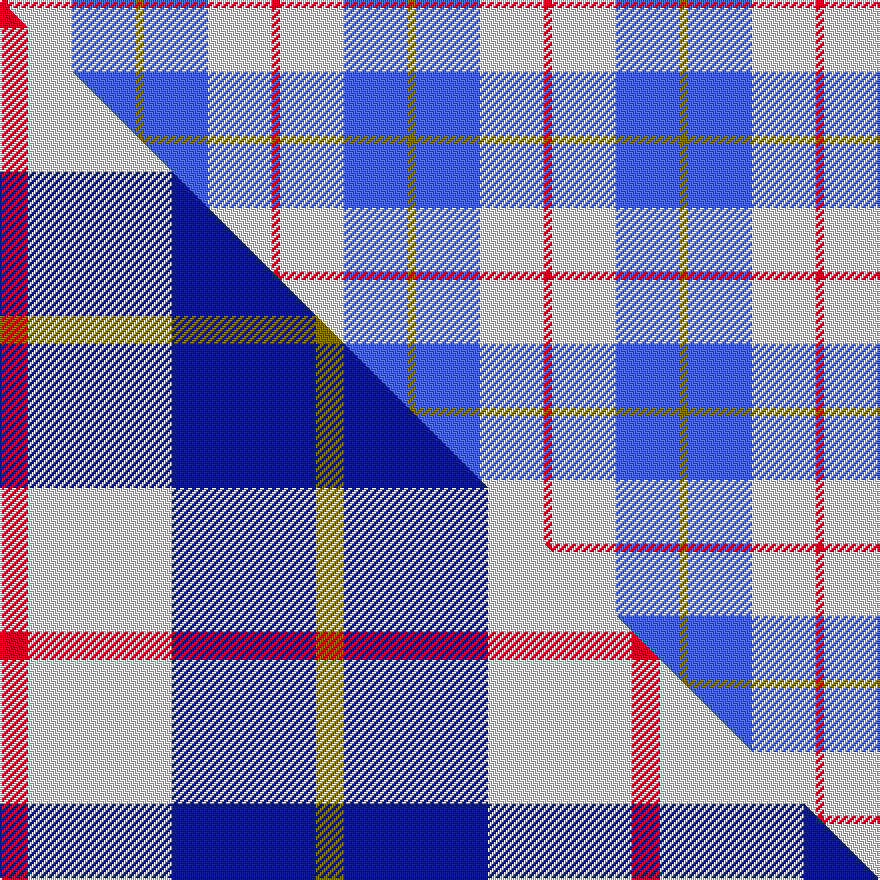

This page is one **sett** — a single exact thread-count. It belongs to the [tartan](/setts/r1w8b8y1/)
(the same proportion at any scale), whose colour order is pattern [GBWR](/stripes/gbwr/).

Part of the [MacRae of Conchra](/tartans/macrae-of-conchra/) tartan — the named design grouping this sett with its other cloths.

Sourced from weddslist.  It is a [4 stripe tartan](/stripes/stripes4/).

Original link http://www.weddslist.com/cgi-bin/tartans/pg.pl?source=sts

## Thread count
R/4 W32 B32 Y/4

One full sett is **136 threads**.

## Palette
<table><thead><tr><th>Colour</th><th>Shade</th><th>OKLCh</th></tr></thead><tbody><tr><td>B</td><td><code style="background-color:#466CC8;">#466CC8</code> <small style="color:#888">#466CC8</small></td><td><small style="color:#888">oklch(55.1% 0.149 265.0)</small></td></tr><tr><td>W</td><td><code style="background-color:#F7F7F7;">#F7F7F7</code> <small style="color:#888">#F7F7F7</small></td><td><small style="color:#888">oklch(97.6% 0.000 89.9)</small></td></tr><tr><td>R</td><td><code style="background-color:#D60020;">#D60020</code> <small style="color:#888">#D60020</small></td><td><small style="color:#888">oklch(55.2% 0.224 25.5)</small></td></tr><tr><td>Y</td><td><code style="background-color:#8B6E00;">#8B6E00</code> <small style="color:#888">#8B6E00</small></td><td><small style="color:#888">oklch(55.1% 0.113 90.4)</small></td></tr></tbody></table>

# Sample pattern

## Compared to the master

This cloth is one sett of its design; the master sett (the exemplar the design is anchored on) is below for comparison.

Its **ΔTartan distance** from the master is **1.50** — the same measure the nearest-tartans table ranks by (0 is identical; a re-scale of the same cloth is near 0, a recolour or a different proportion further).

<figure class="master-compare" style="margin:0">

this sett
master sett ★

<figcaption style="color:#888;font-size:smaller">One weave of this sett against the <a href="/setts/r7w36db36y7/">master sett ★</a>, split on the diagonal: a shared proportion runs seamlessly across it with only the shades shifting; a different proportion breaks on it.</figcaption>
</figure>

## Nearest variants

The nearest existing variants by ΔTartan distance, with this cloth at the top so the swatches line up against it.

ΔTartan

Threads

Variant

Sett

—

136

<a href="/variants/s4/r1w8b8y1~x4/">MacRae of Conchra</a>

<a href="/ttd/edit/#slug=r7w36db36y7~x2&amp;base=r1w8b8y1~x4" title="compare in the TTD">0.38</a>

316

<a href="/variants/s4/r7w36db36y7~x2/">MacRae of Conchra #3</a>

<a href="/ttd/edit/#slug=r21db61y8w21~x2&amp;base=r1w8b8y1~x4" title="compare in the TTD">1.47</a>

360

<a href="/variants/s4/r21db61y8w21~x2/">Kellogg College University of Oxford</a>

<a href="/ttd/edit/#slug=y15r9lb30w3db4~x2&amp;base=r1w8b8y1~x4" title="compare in the TTD">1.74</a>

206

<a href="/variants/s5/y15r9lb30w3db4~x2/">S.I.D.E. (Corporate)</a>

<a href="/ttd/edit/#slug=db10g4w27db40r4~x2&amp;base=r1w8b8y1~x4" title="compare in the TTD">2.14</a>

312

<a href="/variants/s5/db10g4w27db40r4~x2/">Turnbull Dress, Bruce (Personal)</a>

<a href="/ttd/edit/#slug=n10w3lb3g1r1~x10&amp;base=r1w8b8y1~x4" title="compare in the TTD">2.15</a>

250

<a href="/variants/s5/n10w3lb3g1r1~x10/">Bagpipe Shop (Switzerland)</a>

<a href="/ttd/edit/#slug=k1w8db8r1~x8&amp;base=r1w8b8y1~x4" title="compare in the TTD">2.25</a>

272

<a href="/variants/s4/k1w8db8r1~x8/">MacRae Dress Purple</a>

<a href="/ttd/edit/#slug=k7lb3o30b30w3~x2&amp;base=r1w8b8y1~x4" title="compare in the TTD">2.50</a>

272

<a href="/variants/s5/k7lb3o30b30w3~x2/">Douglas, brown</a>

<a href="/ttd/edit/#slug=k3w29o9lb19k3~x2&amp;base=r1w8b8y1~x4" title="compare in the TTD">2.57</a>

240

<a href="/variants/s5/k3w29o9lb19k3~x2/">Islander Dress</a>

<a href="/ttd/edit/#slug=db7y1db7lb11r2~x6&amp;base=r1w8b8y1~x4" title="compare in the TTD">2.61</a>

282

<a href="/variants/s5/db7y1db7lb11r2~x6/">Brazell (Personal)</a>

<a href="/ttd/edit/#slug=b8w13r3w2k5~x2&amp;base=r1w8b8y1~x4" title="compare in the TTD">2.77</a>

98

<a href="/variants/s5/b8w13r3w2k5~x2/">Boswell Dress (Personal)</a>

## Neighbour map

Every grey dot is one of 13620 variants placed by the first two principal components of the ΔTartan feature space (42% of its variance). Red is this tartan; blue dots are its nearest — click one to open its page.

<svg viewBox="0 0 640 380" role="img" style="max-width:100%;height:auto;border:1px solid #e0e0e0;border-radius:4px;display:block" xmlns="http://www.w3.org/2000/svg"><image href="/nn/cloud.v1.png" width="640" height="380"/><a href="/variants/s4/r7w36db36y7~x2/"><circle cx="182.2" cy="258.4" r="4" fill="#3465a4"><title>MacRae of Conchra #3</title></circle></a><a href="/variants/s4/r21db61y8w21~x2/"><circle cx="255.6" cy="238.0" r="4" fill="#3465a4"><title>Kellogg College University of Oxford</title></circle></a><a href="/variants/s5/y15r9lb30w3db4~x2/"><circle cx="260.4" cy="214.6" r="4" fill="#3465a4"><title>S.I.D.E. (Corporate)</title></circle></a><a href="/variants/s5/db10g4w27db40r4~x2/"><circle cx="292.8" cy="208.9" r="4" fill="#3465a4"><title>Turnbull Dress, Bruce (Personal)</title></circle></a><a href="/variants/s5/n10w3lb3g1r1~x10/"><circle cx="297.8" cy="205.9" r="4" fill="#3465a4"><title>Bagpipe Shop (Switzerland)</title></circle></a><a href="/variants/s4/k1w8db8r1~x8/"><circle cx="195.5" cy="214.9" r="4" fill="#3465a4"><title>MacRae Dress Purple</title></circle></a><a href="/variants/s5/k7lb3o30b30w3~x2/"><circle cx="213.6" cy="196.5" r="4" fill="#3465a4"><title>Douglas, brown</title></circle></a><a href="/variants/s5/k3w29o9lb19k3~x2/"><circle cx="192.1" cy="201.5" r="4" fill="#3465a4"><title>Islander Dress</title></circle></a><a href="/variants/s5/db7y1db7lb11r2~x6/"><circle cx="263.2" cy="229.8" r="4" fill="#3465a4"><title>Brazell (Personal)</title></circle></a><a href="/variants/s5/b8w13r3w2k5~x2/"><circle cx="169.9" cy="230.8" r="4" fill="#3465a4"><title>Boswell Dress (Personal)</title></circle></a><circle cx="253.4" cy="242.8" r="5" fill="#c00000"/><text x="320" y="376" text-anchor="middle" font-size="11" fill="#999">ground</text><text x="11" y="190" text-anchor="middle" font-size="11" fill="#999" transform="rotate(-90 11 190)">complexity</text></svg>

ID: /variants/s4/r1w8b8y1~x4/
