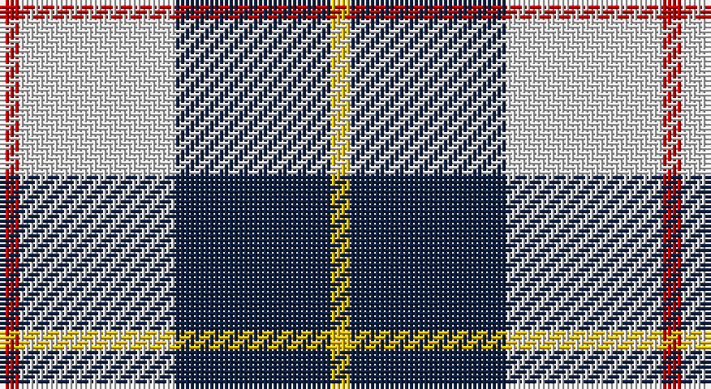

This page is one **sett** — a single exact thread-count. It belongs to the [tartan](/setts/r1w8dt8ly1/)
(the same proportion at any scale), whose colour order is pattern [RWBY](/stripes/rwby/).

Part of the [MacRae of Conchra](/tartans/macrae-of-conchra/) tartan — the named design grouping this sett with its other cloths.

Sourced from weddslist.  It is a [4 stripe tartan](/stripes/stripes4/).

Original link http://www.weddslist.com/cgi-bin/tartans/pg.pl?source=sts

## Also known as

This cloth is also recorded under:

- MacRae of Conchra #2
- MacRae of Conchra #3

## Thread count
R/4 LN32 DB32 Y/4

One full sett is **136 threads**.

## Palette

Palette: <strong>Tartan Dictionary</strong> <small style="color:#888">(1 of 4 colours)</small>
<table><thead><tr><th>Colour</th><th>Threads</th><th>Shade</th><th>Base</th><th>OKLCh</th></tr></thead><tbody><tr><td>R/</td><td style="text-align:right;font-variant-numeric:tabular-nums">4</td><td><code style="background-color:#C00000;">#C00000</code> <small style="color:#888">#C00000</small></td><td>R <code style="background-color:#CC0000;">#CC0000</code></td><td><small style="color:#888">oklch(50.7% 0.208 29.2)</small></td></tr><tr><td>LN</td><td style="text-align:right;font-variant-numeric:tabular-nums">32</td><td><code style="background-color:#E0E0E0;">#E0E0E0</code> <small style="color:#888">#E0E0E0</small></td><td>W <code style="background-color:#F7F7F7;">#F7F7F7</code></td><td><small style="color:#888">oklch(90.7% 0.000 89.9)</small></td></tr><tr><td>DB</td><td style="text-align:right;font-variant-numeric:tabular-nums">32</td><td><code style="background-color:#102040;">#102040</code> <small style="color:#888">#102040</small></td><td>B <code style="background-color:#2A418A;">#2A418A</code></td><td><small style="color:#888">oklch(24.9% 0.065 262.6)</small></td></tr><tr><td>Y/</td><td style="text-align:right;font-variant-numeric:tabular-nums">4</td><td><code style="background-color:#F0C000;">#F0C000</code> <small style="color:#888">#F0C000</small></td><td>Y <code style="background-color:#F2BF00;">#F2BF00</code></td><td><small style="color:#888">oklch(82.7% 0.169 90.5)</small></td></tr></tbody></table>

# Sample pattern

## Compared to the master

This cloth is one sett of its design; the master sett (the exemplar the design is anchored on) is below for comparison.

<figure style="margin:0"><figcaption style="color:#888;font-size:smaller">this sett</figcaption></figure>
<figure style="margin:0"><figcaption style="color:#888;font-size:smaller"><a href="/setts/k5w37r37w5/">master sett →</a></figcaption></figure>

## Nearest tartans

The nearest existing variants by ΔTartan distance, with this tartan at the top so the swatches line up against it.

ΔTartan

Tartan

Sett

—

<a href="/ttd/edit/#slug=r1w8dt8ly1~x4">MacRae of Conchra</a> <a class="nn-out" href="/variants/s4/r1w8dt8ly1~x4/" title="open its dictionary page">↗</a>

0.57

<a href="/ttd/edit/#slug=db3w25k25r3~x2&amp;base=r1w8dt8ly1~x4">Gleneckley</a> <a class="nn-out" href="/variants/s4/db3w25k25r3~x2/" title="open its dictionary page">↗</a>

1.08

<a href="/ttd/edit/#slug=r7w36db36ly7~x2&amp;base=r1w8dt8ly1~x4">MacRae of Conchra #3</a> <a class="nn-out" href="/variants/s4/r7w36db36ly7~x2/" title="open its dictionary page">↗</a>

1.16

<a href="/variants/s4/k5w24n24ki5~x2/">City of London</a>

1.33

<a href="/ttd/edit/#slug=k23ly3k23w36r4~x2&amp;base=r1w8dt8ly1~x4">Macleod, Winnifred Mary, Dress</a> <a class="nn-out" href="/variants/s5/k23ly3k23w36r4~x2/" title="open its dictionary page">↗</a>

1.34

<a href="/ttd/edit/#slug=k5n24w24r5~x2&amp;base=r1w8dt8ly1~x4">City of London (Corporate)</a> <a class="nn-out" href="/variants/s4/k5n24w24r5~x2/" title="open its dictionary page">↗</a>

1.34

<a href="/ttd/edit/#slug=o22ly10w3db8~x2&amp;base=r1w8dt8ly1~x4">Louisburg</a> <a class="nn-out" href="/variants/s4/o22ly10w3db8~x2/" title="open its dictionary page">↗</a>

1.35

<a href="/ttd/edit/#slug=k4w3k4o9r1~x4&amp;base=r1w8dt8ly1~x4">Oban Grey District Tartan</a> <a class="nn-out" href="/variants/s5/k4w3k4o9r1~x4/" title="open its dictionary page">↗</a>

1.35

<a href="/ttd/edit/#slug=k23b6k6r5w35r10~x2&amp;base=r1w8dt8ly1~x4">Merrilees Dress (Dance)</a> <a class="nn-out" href="/variants/s6/k23b6k6r5w35r10~x2/" title="open its dictionary page">↗</a>

1.40

<a href="/ttd/edit/#slug=k4lb4k4o15r2~x4&amp;base=r1w8dt8ly1~x4">Oban Grey (Fashion)</a> <a class="nn-out" href="/variants/s5/k4lb4k4o15r2~x4/" title="open its dictionary page">↗</a>

1.40

<a href="/ttd/edit/#slug=o22ly10w3k8~x2&amp;base=r1w8dt8ly1~x4">Louisburg Canadian District Tartan</a> <a class="nn-out" href="/variants/s4/o22ly10w3k8~x2/" title="open its dictionary page">↗</a>

## Neighbour map

Every grey dot is one of 14360 variants placed by the first two principal components of the ΔTartan feature space (44% of its variance). Red is this tartan; blue dots are its nearest — click one to open its page.

<svg viewBox="0 0 640 380" role="img" style="max-width:100%;height:auto;border:1px solid #e0e0e0;border-radius:4px;display:block" xmlns="http://www.w3.org/2000/svg"><image href="/nn/cloud.v1.png" width="640" height="380"/><a href="/variants/s4/db3w25k25r3~x2/"><circle cx="211.2" cy="212.6" r="4" fill="#3465a4"><title>Gleneckley</title></circle></a><a href="/variants/s4/r7w36db36ly7~x2/"><circle cx="160.8" cy="234.0" r="4" fill="#3465a4"><title>MacRae of Conchra #3</title></circle></a><a href="/variants/s4/k5w24n24ki5~x2/"><circle cx="146.1" cy="237.9" r="4" fill="#3465a4"><title>City of London</title></circle></a><a href="/variants/s5/k23ly3k23w36r4~x2/"><circle cx="247.0" cy="200.0" r="4" fill="#3465a4"><title>Macleod, Winnifred Mary, Dress</title></circle></a><a href="/variants/s4/k5n24w24r5~x2/"><circle cx="154.9" cy="237.3" r="4" fill="#3465a4"><title>City of London (Corporate)</title></circle></a><a href="/variants/s4/o22ly10w3db8~x2/"><circle cx="218.7" cy="236.7" r="4" fill="#3465a4"><title>Louisburg</title></circle></a><a href="/variants/s5/k4w3k4o9r1~x4/"><circle cx="185.2" cy="223.7" r="4" fill="#3465a4"><title>Oban Grey District Tartan</title></circle></a><a href="/variants/s6/k23b6k6r5w35r10~x2/"><circle cx="153.6" cy="191.5" r="4" fill="#3465a4"><title>Merrilees Dress (Dance)</title></circle></a><a href="/variants/s5/k4lb4k4o15r2~x4/"><circle cx="241.8" cy="218.9" r="4" fill="#3465a4"><title>Oban Grey (Fashion)</title></circle></a><a href="/variants/s4/o22ly10w3k8~x2/"><circle cx="200.1" cy="228.9" r="4" fill="#3465a4"><title>Louisburg Canadian District Tartan</title></circle></a><circle cx="207.3" cy="213.6" r="5" fill="#c00000"/></svg>

ID: /variants/s4/r1w8dt8ly1~x4/
