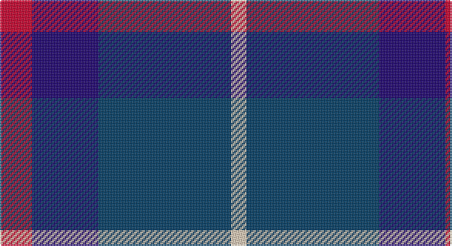

This page is one **sett** — a single exact thread-count. It belongs to the [tartan](/setts/r21db43dt86lb10/)
(the same proportion at any scale), whose colour order is pattern [RBBW](/stripes/rbbw/).

Sourced from tartans-authority.  It is a [4 stripe tartan](/stripes/stripes4/).

Original link http://www.tartansauthority.com/tartan-ferret/display/10828/

## Register references

External register numbers recorded for this tartan.

- Scottish Register of Tartans: [10828](https://www.tartanregister.gov.uk/tartanDetails?ref=10828)
- Scottish Tartans Authority (ITI): 10828

## Thread count
R/21 DBa43 DB86 LR/10

One full sett is **289 threads**.

## Palette

Palette: <strong>Tartan Register</strong>
<table><thead><tr><th>Colour</th><th>Threads</th><th>Shade</th><th>Base</th><th>OKLCh</th></tr></thead><tbody><tr><td>R/</td><td style="text-align:right;font-variant-numeric:tabular-nums">21</td><td><code style="background-color:#C8002C;">#C8002C</code> <small style="color:#888">#C8002C</small></td><td>R <code style="background-color:#CC0000;">#CC0000</code></td><td><small style="color:#888">oklch(52.6% 0.212 22.0)</small></td></tr><tr><td>DBa</td><td style="text-align:right;font-variant-numeric:tabular-nums">43</td><td><code style="background-color:#1C0070;">#1C0070</code> <small style="color:#888">#1C0070</small></td><td>B <code style="background-color:#2A418A;">#2A418A</code></td><td><small style="color:#888">oklch(26.3% 0.162 277.1)</small></td></tr><tr><td>DB</td><td style="text-align:right;font-variant-numeric:tabular-nums">86</td><td><code style="background-color:#003C64;">#003C64</code> <small style="color:#888">#003C64</small></td><td>B <code style="background-color:#2A418A;">#2A418A</code></td><td><small style="color:#888">oklch(34.5% 0.089 246.0)</small></td></tr><tr><td>LR/</td><td style="text-align:right;font-variant-numeric:tabular-nums">10</td><td><code style="background-color:#E8CCB8;">#E8CCB8</code> <small style="color:#888">#E8CCB8</small></td><td>W <code style="background-color:#F7F7F7;">#F7F7F7</code></td><td><small style="color:#888">oklch(86.3% 0.042 57.7)</small></td></tr></tbody></table>

# Sample pattern

## Nearest tartans

The nearest existing variants by ΔTartan distance, with this tartan at the top so the swatches line up against it.

ΔTartan

Tartan

Sett

—

<a href="/ttd/edit/#slug=r21db43dt86lb10">Fong (Personal)</a> <a class="nn-out" href="/variants/s4/r21db43dt86lb10/" title="open its dictionary page">↗</a>

1.03

<a href="/ttd/edit/#slug=r1db9k4lb1~x4&amp;base=r21db43dt86lb10">Scottish Nuclear (Corporate)</a> <a class="nn-out" href="/variants/s4/r1db9k4lb1~x4/" title="open its dictionary page">↗</a>

1.15

<a href="/ttd/edit/#slug=r5db26k12w2~x4&amp;base=r21db43dt86lb10">Mirror (Corporate)</a> <a class="nn-out" href="/variants/s4/r5db26k12w2~x4/" title="open its dictionary page">↗</a>

1.16

<a href="/ttd/edit/#slug=b11k1b3k5dp9lo1~x2&amp;base=r21db43dt86lb10">Joker Fancy Tartan</a> <a class="nn-out" href="/variants/s6/b11k1b3k5dp9lo1~x2/" title="open its dictionary page">↗</a>

1.26

<a href="/ttd/edit/#slug=db7ly1db7t11r2~x6&amp;base=r21db43dt86lb10">Brazell (Personal)</a> <a class="nn-out" href="/variants/s5/db7ly1db7t11r2~x6/" title="open its dictionary page">↗</a>

1.29

<a href="/ttd/edit/#slug=r6db35k36db36w6&amp;base=r21db43dt86lb10">Davidson of Tulloch Clan Tartan</a> <a class="nn-out" href="/variants/s5/r6db35k36db36w6/" title="open its dictionary page">↗</a>

1.32

<a href="/ttd/edit/#slug=r21dbi43db86w10&amp;base=r21db43dt86lb10">Fong Wedding (Personal)</a> <a class="nn-out" href="/variants/s4/r21dbi43db86w10/" title="open its dictionary page">↗</a>

1.33

<a href="/ttd/edit/#slug=k14r4k25db30w4~x2&amp;base=r21db43dt86lb10">Britannia</a> <a class="nn-out" href="/variants/s5/k14r4k25db30w4~x2/" title="open its dictionary page">↗</a>

1.36

<a href="/ttd/edit/#slug=k15lo2k10db18lb3~x2&amp;base=r21db43dt86lb10">College of Radiographers</a> <a class="nn-out" href="/variants/s5/k15lo2k10db18lb3~x2/" title="open its dictionary page">↗</a>

1.38

<a href="/ttd/edit/#slug=k1db7k4lb1k4p1~x4&amp;base=r21db43dt86lb10">Scottish Express International</a> <a class="nn-out" href="/variants/s6/k1db7k4lb1k4p1~x4/" title="open its dictionary page">↗</a>

1.40

<a href="/ttd/edit/#slug=dp9db6w1dg4dp2~x4&amp;base=r21db43dt86lb10">Cathro</a> <a class="nn-out" href="/variants/s5/dp9db6w1dg4dp2~x4/" title="open its dictionary page">↗</a>

## Neighbour map

Every grey dot is one of 14360 variants placed by the first two principal components of the ΔTartan feature space (44% of its variance). Red is this tartan; blue dots are its nearest — click one to open its page.

<svg viewBox="0 0 640 380" role="img" style="max-width:100%;height:auto;border:1px solid #e0e0e0;border-radius:4px;display:block" xmlns="http://www.w3.org/2000/svg"><image href="/nn/cloud.v1.png" width="640" height="380"/><a href="/variants/s4/r1db9k4lb1~x4/"><circle cx="346.3" cy="244.6" r="4" fill="#3465a4"><title>Scottish Nuclear (Corporate)</title></circle></a><a href="/variants/s4/r5db26k12w2~x4/"><circle cx="329.8" cy="227.5" r="4" fill="#3465a4"><title>Mirror (Corporate)</title></circle></a><a href="/variants/s6/b11k1b3k5dp9lo1~x2/"><circle cx="263.6" cy="229.4" r="4" fill="#3465a4"><title>Joker Fancy Tartan</title></circle></a><a href="/variants/s5/db7ly1db7t11r2~x6/"><circle cx="265.1" cy="236.9" r="4" fill="#3465a4"><title>Brazell (Personal)</title></circle></a><a href="/variants/s5/r6db35k36db36w6/"><circle cx="305.4" cy="275.2" r="4" fill="#3465a4"><title>Davidson of Tulloch Clan Tartan</title></circle></a><a href="/variants/s4/r21dbi43db86w10/"><circle cx="259.0" cy="238.0" r="4" fill="#3465a4"><title>Fong Wedding (Personal)</title></circle></a><a href="/variants/s5/k14r4k25db30w4~x2/"><circle cx="285.4" cy="263.8" r="4" fill="#3465a4"><title>Britannia</title></circle></a><a href="/variants/s5/k15lo2k10db18lb3~x2/"><circle cx="273.6" cy="254.0" r="4" fill="#3465a4"><title>College of Radiographers</title></circle></a><a href="/variants/s6/k1db7k4lb1k4p1~x4/"><circle cx="285.6" cy="258.2" r="4" fill="#3465a4"><title>Scottish Express International</title></circle></a><a href="/variants/s5/dp9db6w1dg4dp2~x4/"><circle cx="288.0" cy="264.7" r="4" fill="#3465a4"><title>Cathro</title></circle></a><circle cx="291.7" cy="258.7" r="5" fill="#c00000"/></svg>

ID: /variants/s4/r21db43dt86lb10/
