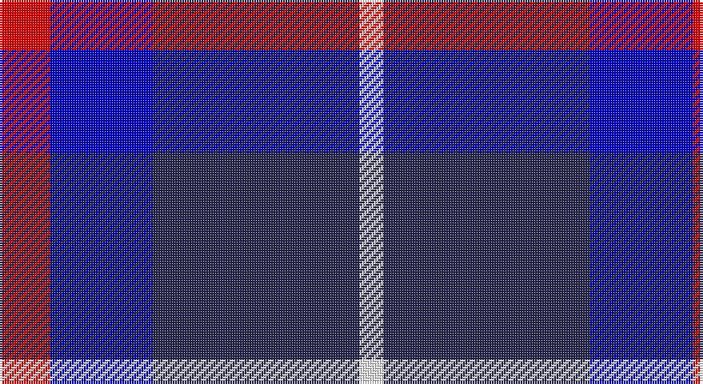

This page is one **sett** — a single exact thread-count. It belongs to the [tartan](/setts/r21dbi43db86w10/)
(the same proportion at any scale), whose colour order is pattern [RBBW](/stripes/rbbw/).

Sourced from register-of-tartans.  It is a [4 stripe tartan](/stripes/stripes4/).

Original link https://www.tartanregister.gov.uk/tartanDetails.aspx?ref=10828

## Register references

External register numbers recorded for this tartan.

- Scottish Register of Tartans: [10828](https://www.tartanregister.gov.uk/tartanDetails.aspx?ref=10828)

## Thread count
R/21 B43 DB86 W/10

One full sett is **289 threads**.

## Palette

Palette: <strong>Tartan Register</strong> <small style="color:#888">(3 of 4 colours)</small>
<table><thead><tr><th>Colour</th><th>Threads</th><th>Shade</th><th>Base</th><th>OKLCh</th></tr></thead><tbody><tr><td>R/</td><td style="text-align:right;font-variant-numeric:tabular-nums">21</td><td><code style="background-color:#FF0000;">#FF0000</code> <small style="color:#888">#FF0000</small></td><td>R <code style="background-color:#CC0000;">#CC0000</code></td><td><small style="color:#888">oklch(62.8% 0.258 29.2)</small></td></tr><tr><td>B</td><td style="text-align:right;font-variant-numeric:tabular-nums">43</td><td><code style="background-color:#0000CD;">#0000CD</code> <small style="color:#888">#0000CD</small></td><td>B <code style="background-color:#2A418A;">#2A418A</code></td><td><small style="color:#888">oklch(38.3% 0.266 264.1)</small></td></tr><tr><td>DB</td><td style="text-align:right;font-variant-numeric:tabular-nums">86</td><td><code style="background-color:#26264F;">#26264F</code> <small style="color:#888">#26264F</small></td><td>B <code style="background-color:#2A418A;">#2A418A</code></td><td><small style="color:#888">oklch(29.2% 0.073 280.9)</small></td></tr><tr><td>W/</td><td style="text-align:right;font-variant-numeric:tabular-nums">10</td><td><code style="background-color:#FFFFFF;">#FFFFFF</code> <small style="color:#888">#FFFFFF</small></td><td>W <code style="background-color:#F7F7F7;">#F7F7F7</code></td><td><small style="color:#888">oklch(100.0% 0.000 89.9)</small></td></tr></tbody></table>

# Sample pattern

## Nearest tartans

The nearest existing variants by ΔTartan distance, with this tartan at the top so the swatches line up against it.

ΔTartan

Tartan

Sett

—

<a href="/ttd/edit/#slug=r21dbi43db86w10">Fong Wedding (Personal)</a> <a class="nn-out" href="/variants/s4/r21dbi43db86w10/" title="open its dictionary page">↗</a>

1.25

<a href="/ttd/edit/#slug=r5db26k12w2~x4&amp;base=r21dbi43db86w10">Mirror (Corporate)</a> <a class="nn-out" href="/variants/s4/r5db26k12w2~x4/" title="open its dictionary page">↗</a>

1.25

<a href="/ttd/edit/#slug=db7ly1db7t11r2~x6&amp;base=r21dbi43db86w10">Brazell (Personal)</a> <a class="nn-out" href="/variants/s5/db7ly1db7t11r2~x6/" title="open its dictionary page">↗</a>

1.28

<a href="/ttd/edit/#slug=r21db61lo8w21~x2&amp;base=r21dbi43db86w10">Kellogg College University of Oxford</a> <a class="nn-out" href="/variants/s4/r21db61lo8w21~x2/" title="open its dictionary page">↗</a>

1.32

<a href="/ttd/edit/#slug=r21db43dt86lb10&amp;base=r21dbi43db86w10">Fong (Personal)</a> <a class="nn-out" href="/variants/s4/r21db43dt86lb10/" title="open its dictionary page">↗</a>

1.38

<a href="/ttd/edit/#slug=db2w2dr8db8w1~x2&amp;base=r21dbi43db86w10">Laval (Tartan de..)</a> <a class="nn-out" href="/variants/s5/db2w2dr8db8w1~x2/" title="open its dictionary page">↗</a>

1.49

<a href="/ttd/edit/#slug=r1db9k4lb1~x4&amp;base=r21dbi43db86w10">Scottish Nuclear (Corporate)</a> <a class="nn-out" href="/variants/s4/r1db9k4lb1~x4/" title="open its dictionary page">↗</a>

1.51

<a href="/ttd/edit/#slug=r15w10db48t32r6~x2&amp;base=r21dbi43db86w10">Lands of Liberty (Fashion)</a> <a class="nn-out" href="/variants/s5/r15w10db48t32r6~x2/" title="open its dictionary page">↗</a>

1.53

<a href="/ttd/edit/#slug=k15ly2k10db18w3~x2&amp;base=r21dbi43db86w10">College of Radiographers Corporate Tartan</a> <a class="nn-out" href="/variants/s5/k15ly2k10db18w3~x2/" title="open its dictionary page">↗</a>

1.56

<a href="/ttd/edit/#slug=db2ly1db7w1k7w2~x6&amp;base=r21dbi43db86w10">Hawick Rugby Club (Corporate)</a> <a class="nn-out" href="/variants/s6/db2ly1db7w1k7w2~x6/" title="open its dictionary page">↗</a>

1.56

<a href="/ttd/edit/#slug=b30k12dt12k2w3~x2&amp;base=r21dbi43db86w10">MacNeil - 1994 (Personal)</a> <a class="nn-out" href="/variants/s5/b30k12dt12k2w3~x2/" title="open its dictionary page">↗</a>

## Neighbour map

Every grey dot is one of 14360 variants placed by the first two principal components of the ΔTartan feature space (44% of its variance). Red is this tartan; blue dots are its nearest — click one to open its page.

<svg viewBox="0 0 640 380" role="img" style="max-width:100%;height:auto;border:1px solid #e0e0e0;border-radius:4px;display:block" xmlns="http://www.w3.org/2000/svg"><image href="/nn/cloud.v1.png" width="640" height="380"/><a href="/variants/s4/r5db26k12w2~x4/"><circle cx="329.8" cy="227.5" r="4" fill="#3465a4"><title>Mirror (Corporate)</title></circle></a><a href="/variants/s5/db7ly1db7t11r2~x6/"><circle cx="265.1" cy="236.9" r="4" fill="#3465a4"><title>Brazell (Personal)</title></circle></a><a href="/variants/s4/r21db61lo8w21~x2/"><circle cx="230.1" cy="223.1" r="4" fill="#3465a4"><title>Kellogg College University of Oxford</title></circle></a><a href="/variants/s4/r21db43dt86lb10/"><circle cx="291.7" cy="258.7" r="4" fill="#3465a4"><title>Fong (Personal)</title></circle></a><a href="/variants/s5/db2w2dr8db8w1~x2/"><circle cx="254.2" cy="244.1" r="4" fill="#3465a4"><title>Laval (Tartan de..)</title></circle></a><a href="/variants/s4/r1db9k4lb1~x4/"><circle cx="346.3" cy="244.6" r="4" fill="#3465a4"><title>Scottish Nuclear (Corporate)</title></circle></a><a href="/variants/s5/r15w10db48t32r6~x2/"><circle cx="185.6" cy="224.2" r="4" fill="#3465a4"><title>Lands of Liberty (Fashion)</title></circle></a><a href="/variants/s5/k15ly2k10db18w3~x2/"><circle cx="267.1" cy="245.9" r="4" fill="#3465a4"><title>College of Radiographers Corporate Tartan</title></circle></a><a href="/variants/s6/db2ly1db7w1k7w2~x6/"><circle cx="196.8" cy="218.7" r="4" fill="#3465a4"><title>Hawick Rugby Club (Corporate)</title></circle></a><a href="/variants/s5/b30k12dt12k2w3~x2/"><circle cx="280.1" cy="212.0" r="4" fill="#3465a4"><title>MacNeil - 1994 (Personal)</title></circle></a><circle cx="259.0" cy="238.0" r="5" fill="#c00000"/></svg>

ID: /variants/s4/r21dbi43db86w10/
