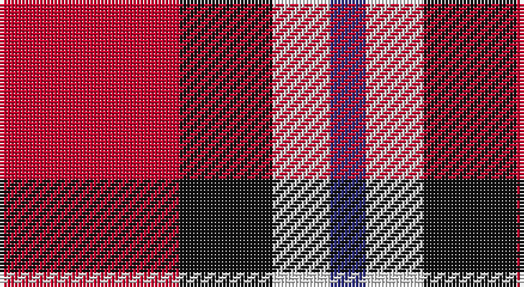

This page is one **sett** — a single exact thread-count. It belongs to the [tartan](/setts/r25k13w8db5/)
(the same proportion at any scale), whose colour order is pattern [BWKR](/stripes/bwkr/).

Sourced from tartans-authority.  It is a [4 stripe tartan](/stripes/stripes4/).

Original link http://www.tartansauthority.com/tartan-ferret/display/8513/

## Register references

External register numbers recorded for this tartan.

- Scottish Register of Tartans: [8513](https://www.tartanregister.gov.uk/tartanDetails?ref=8513)
- Scottish Tartans Authority (ITI): 8513

## Thread count
R/50 K26 LN16 DB/10

One full sett is **144 threads**.

## Palette

Palette: <strong>Tartan Register</strong>
<table><thead><tr><th>Colour</th><th>Threads</th><th>Shade</th><th>Base</th><th>OKLCh</th></tr></thead><tbody><tr><td>R/</td><td style="text-align:right;font-variant-numeric:tabular-nums">50</td><td><code style="background-color:#C8002C;">#C8002C</code> <small style="color:#888">#C8002C</small></td><td>R <code style="background-color:#CC0000;">#CC0000</code></td><td><small style="color:#888">oklch(52.6% 0.212 22.0)</small></td></tr><tr><td>K</td><td style="text-align:right;font-variant-numeric:tabular-nums">26</td><td><code style="background-color:#101010;">#101010</code> <small style="color:#888">#101010</small></td><td>K <code style="background-color:#000000;">#000000</code></td><td><small style="color:#888">oklch(17.3% 0.000 89.9)</small></td></tr><tr><td>LN</td><td style="text-align:right;font-variant-numeric:tabular-nums">16</td><td><code style="background-color:#E0E0E0;">#E0E0E0</code> <small style="color:#888">#E0E0E0</small></td><td>W <code style="background-color:#F7F7F7;">#F7F7F7</code></td><td><small style="color:#888">oklch(90.7% 0.000 89.9)</small></td></tr><tr><td>DB/</td><td style="text-align:right;font-variant-numeric:tabular-nums">10</td><td><code style="background-color:#2C2C80;">#2C2C80</code> <small style="color:#888">#2C2C80</small></td><td>B <code style="background-color:#2A418A;">#2A418A</code></td><td><small style="color:#888">oklch(35.0% 0.138 276.6)</small></td></tr></tbody></table>

# Sample pattern

## Nearest tartans

The nearest existing variants by ΔTartan distance, with this tartan at the top so the swatches line up against it.

ΔTartan

Tartan

Sett

—

<a href="/ttd/edit/#slug=r25k13w8db5~x2">Hamby Sport (Personal)</a> <a class="nn-out" href="/variants/s4/r25k13w8db5~x2/" title="open its dictionary page">↗</a>

1.02

<a href="/ttd/edit/#slug=ly4r27k12db15ly4~x2&amp;base=r25k13w8db5~x2">Aberdeen University (1992)</a> <a class="nn-out" href="/variants/s5/ly4r27k12db15ly4~x2/" title="open its dictionary page">↗</a>

1.19

<a href="/ttd/edit/#slug=k6r33k18w20db6~x2&amp;base=r25k13w8db5~x2">Brodie Dress</a> <a class="nn-out" href="/variants/s5/k6r33k18w20db6~x2/" title="open its dictionary page">↗</a>

1.25

<a href="/ttd/edit/#slug=ly2r15k7db8ly2~x4&amp;base=r25k13w8db5~x2">Aberdeen University</a> <a class="nn-out" href="/variants/s5/ly2r15k7db8ly2~x4/" title="open its dictionary page">↗</a>

1.37

<a href="/ttd/edit/#slug=r15o9w4k12r15k5~x2&amp;base=r25k13w8db5~x2">Eastern Kentucky University</a> <a class="nn-out" href="/variants/s6/r15o9w4k12r15k5~x2/" title="open its dictionary page">↗</a>

1.44

<a href="/ttd/edit/#slug=r4k25o25w4~x2&amp;base=r25k13w8db5~x2">Bonhill Primary School</a> <a class="nn-out" href="/variants/s4/r4k25o25w4~x2/" title="open its dictionary page">↗</a>

1.46

<a href="/ttd/edit/#slug=r15g3w2k10w5~x2&amp;base=r25k13w8db5~x2">SAL Cubiska Stenen</a> <a class="nn-out" href="/variants/s5/r15g3w2k10w5~x2/" title="open its dictionary page">↗</a>

1.48

<a href="/ttd/edit/#slug=w3r24db12dg8ly3~x2&amp;base=r25k13w8db5~x2">McGill University</a> <a class="nn-out" href="/variants/s5/w3r24db12dg8ly3~x2/" title="open its dictionary page">↗</a>

1.48

<a href="/ttd/edit/#slug=r6k9r12w2k2w4~x2&amp;base=r25k13w8db5~x2">Brice (Artefact)</a> <a class="nn-out" href="/variants/s6/r6k9r12w2k2w4~x2/" title="open its dictionary page">↗</a>

1.50

<a href="/ttd/edit/#slug=w3r24db12dg8lo3~x2&amp;base=r25k13w8db5~x2">McGill University (Corporate)</a> <a class="nn-out" href="/variants/s5/w3r24db12dg8lo3~x2/" title="open its dictionary page">↗</a>

1.52

<a href="/ttd/edit/#slug=w1r8k8ly1~x4&amp;base=r25k13w8db5~x2">Connel (Clan)</a> <a class="nn-out" href="/variants/s4/w1r8k8ly1~x4/" title="open its dictionary page">↗</a>

## Neighbour map

Every grey dot is one of 14360 variants placed by the first two principal components of the ΔTartan feature space (44% of its variance). Red is this tartan; blue dots are its nearest — click one to open its page.

<svg viewBox="0 0 640 380" role="img" style="max-width:100%;height:auto;border:1px solid #e0e0e0;border-radius:4px;display:block" xmlns="http://www.w3.org/2000/svg"><image href="/nn/cloud.v1.png" width="640" height="380"/><a href="/variants/s5/ly4r27k12db15ly4~x2/"><circle cx="187.3" cy="223.5" r="4" fill="#3465a4"><title>Aberdeen University (1992)</title></circle></a><a href="/variants/s5/k6r33k18w20db6~x2/"><circle cx="135.1" cy="225.3" r="4" fill="#3465a4"><title>Brodie Dress</title></circle></a><a href="/variants/s5/ly2r15k7db8ly2~x4/"><circle cx="185.1" cy="214.9" r="4" fill="#3465a4"><title>Aberdeen University</title></circle></a><a href="/variants/s6/r15o9w4k12r15k5~x2/"><circle cx="172.8" cy="262.5" r="4" fill="#3465a4"><title>Eastern Kentucky University</title></circle></a><a href="/variants/s4/r4k25o25w4~x2/"><circle cx="213.9" cy="236.2" r="4" fill="#3465a4"><title>Bonhill Primary School</title></circle></a><a href="/variants/s5/r15g3w2k10w5~x2/"><circle cx="165.2" cy="207.1" r="4" fill="#3465a4"><title>SAL Cubiska Stenen</title></circle></a><a href="/variants/s5/w3r24db12dg8ly3~x2/"><circle cx="196.1" cy="182.7" r="4" fill="#3465a4"><title>McGill University</title></circle></a><a href="/variants/s6/r6k9r12w2k2w4~x2/"><circle cx="232.9" cy="231.1" r="4" fill="#3465a4"><title>Brice (Artefact)</title></circle></a><a href="/variants/s5/w3r24db12dg8lo3~x2/"><circle cx="209.2" cy="196.0" r="4" fill="#3465a4"><title>McGill University (Corporate)</title></circle></a><a href="/variants/s4/w1r8k8ly1~x4/"><circle cx="238.7" cy="218.8" r="4" fill="#3465a4"><title>Connel (Clan)</title></circle></a><circle cx="194.7" cy="246.4" r="5" fill="#c00000"/></svg>

ID: /variants/s4/r25k13w8db5~x2/
