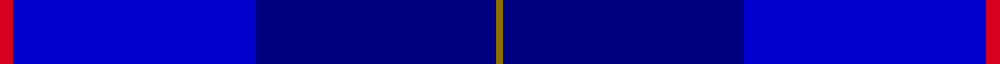

This page is one **sett** — a single exact thread-count. It belongs to the [tartan](/setts/r2b35db35y1/)
(the same proportion at any scale), whose colour order is pattern [GBBR](/stripes/gbbr/).

Part of the [Mackaw](/tartans/mackaw/) tartan — the named design grouping this sett with its other cloths.

Sourced from register-of-tartans.  It is a [4 stripe tartan](/stripes/stripes4/).

Original link https://www.tartanregister.gov.uk/tartanDetails.aspx?ref=10583

## Register references

External register numbers recorded for this tartan.

- Scottish Register of Tartans: [10583](https://www.tartanregister.gov.uk/tartanDetails.aspx?ref=10583)

## Thread count
R/4 B70 DB70 Y/2

One full sett is **286 threads**.

## Palette
<table><thead><tr><th>Colour</th><th>Shade</th><th>OKLCh</th></tr></thead><tbody><tr><td>B</td><td><code style="background-color:#0000CD;">#0000CD</code> <small style="color:#888">#0000CD</small></td><td><small style="color:#888">oklch(38.3% 0.266 264.1)</small></td></tr><tr><td>DB</td><td><code style="background-color:#000080;">#000080</code> <small style="color:#888">#000080</small></td><td><small style="color:#888">oklch(27.1% 0.188 264.1)</small></td></tr><tr><td>R</td><td><code style="background-color:#D60020;">#D60020</code> <small style="color:#888">#D60020</small></td><td><small style="color:#888">oklch(55.2% 0.224 25.5)</small></td></tr><tr><td>Y</td><td><code style="background-color:#8B6E00;">#8B6E00</code> <small style="color:#888">#8B6E00</small></td><td><small style="color:#888">oklch(55.1% 0.113 90.4)</small></td></tr></tbody></table>

# Sample pattern

## Nearest tartan variants

The nearest existing variants by ΔTartan distance, with this cloth at the top so the swatches line up against it.

ΔTartan

Threads

Variant

Sett

—

286

<a href="/variants/s4/r2b35db35y1~x2~b1511266-db1108266/">Mackaw</a>

<a href="/ttd/edit/#slug=b20dp3db7y1~x4&amp;base=r2b35db35y1~x2~b1511266-db1108266" title="compare in the TTD">1.56</a>

164

<a href="/variants/s4/b20dp3db7y1~x4/">Peacock</a>

<a href="/ttd/edit/#slug=dbi15db55w1dp5r2ly1~x2~dbi1406275-db1404245&amp;base=r2b35db35y1~x2~b1511266-db1108266" title="compare in the TTD">1.78</a>

284

<a href="/variants/s6/dbi15db55w1dp5r2ly1~x2~dbi1406275-db1404245/">Venters (Personal)</a>

<a href="/ttd/edit/#slug=o2db19t6b44w2~x2&amp;base=r2b35db35y1~x2~b1511266-db1108266" title="compare in the TTD">1.83</a>

284

<a href="/variants/s5/o2db19t6b44w2~x2/">World Fed. of Bldg Contractors (Corp</a>

<a href="/ttd/edit/#slug=db3b30db40r3~x2&amp;base=r2b35db35y1~x2~b1511266-db1108266" title="compare in the TTD">2.08</a>

292

<a href="/variants/s4/db3b30db40r3~x2/">Sanix Large Muted</a>

2.30

—

<a href="/variants/s5/y1db10dbi5db2g1~x8~db1204274-dbi1406275/">Open Championship (2000)</a>

<a href="/ttd/edit/#slug=y1db11dbi5db2g1~x4~db1003265-dbi1605267&amp;base=r2b35db35y1~x2~b1511266-db1108266" title="compare in the TTD">2.30</a>

152

<a href="/variants/s5/y1db11dbi5db2g1~x4~db1003265-dbi1605267/">Open Championship, The</a>

<a href="/ttd/edit/#slug=db38w3db8dbi36dg9r3~x2~db1106275-dbi1406275&amp;base=r2b35db35y1~x2~b1511266-db1108266" title="compare in the TTD">2.32</a>

306

<a href="/variants/s6/db38w3db8dbi36dg9r3~x2~db1106275-dbi1406275/">Waters of Georgian Bay (District)</a>

<a href="/ttd/edit/#slug=dt15db55w1dp5r2y1~x2&amp;base=r2b35db35y1~x2~b1511266-db1108266" title="compare in the TTD">2.69</a>

284

<a href="/variants/s6/dt15db55w1dp5r2y1~x2/">Venters (Edinburgh)</a>

<a href="/ttd/edit/#slug=n4db43k20n7o2~x2~n1900000-db0906265-k0700000-o2500000&amp;base=r2b35db35y1~x2~b1511266-db1108266" title="compare in the TTD">2.72</a>

292

<a href="/variants/s5/n4db43k20n7o2~x2~n1900000-db0906265-k0700000-o2500000/">Deighan (Burham Kent) (Name)</a>

2.87

—

<a href="/variants/s6/db104dbi16w8dbi66r3dbi16~db1204274-dbi1406275/">Edzell U.S. Navy Regimental Tartan</a>

## Neighbour map

Every grey dot is one of 13620 variants placed by the first two principal components of the ΔTartan feature space (42% of its variance). Red is this tartan; blue dots are its nearest — click one to open its page.

<svg viewBox="0 0 640 380" role="img" style="max-width:100%;height:auto;border:1px solid #e0e0e0;border-radius:4px;display:block" xmlns="http://www.w3.org/2000/svg"><image href="/nn/cloud.v1.png" width="640" height="380"/><a href="/variants/s4/b20dp3db7y1~x4/"><circle cx="506.0" cy="238.4" r="4" fill="#3465a4"><title>Peacock</title></circle></a><a href="/variants/s6/dbi15db55w1dp5r2ly1~x2~dbi1406275-db1404245/"><circle cx="599.2" cy="146.4" r="4" fill="#3465a4"><title>Venters (Personal)</title></circle></a><a href="/variants/s5/o2db19t6b44w2~x2/"><circle cx="429.5" cy="186.8" r="4" fill="#3465a4"><title>World Fed. of Bldg Contractors (Corp</title></circle></a><a href="/variants/s4/db3b30db40r3~x2/"><circle cx="447.3" cy="257.7" r="4" fill="#3465a4"><title>Sanix Large Muted</title></circle></a><a href="/variants/s5/y1db10dbi5db2g1~x8~db1204274-dbi1406275/"><circle cx="547.3" cy="286.9" r="4" fill="#3465a4"><title>Open Championship (2000)</title></circle></a><a href="/variants/s5/y1db11dbi5db2g1~x4~db1003265-dbi1605267/"><circle cx="516.3" cy="260.8" r="4" fill="#3465a4"><title>Open Championship, The</title></circle></a><a href="/variants/s6/db38w3db8dbi36dg9r3~x2~db1106275-dbi1406275/"><circle cx="359.2" cy="219.4" r="4" fill="#3465a4"><title>Waters of Georgian Bay (District)</title></circle></a><a href="/variants/s6/dt15db55w1dp5r2y1~x2/"><circle cx="560.6" cy="128.2" r="4" fill="#3465a4"><title>Venters (Edinburgh)</title></circle></a><a href="/variants/s5/n4db43k20n7o2~x2~n1900000-db0906265-k0700000-o2500000/"><circle cx="415.9" cy="196.8" r="4" fill="#3465a4"><title>Deighan (Burham Kent) (Name)</title></circle></a><a href="/variants/s6/db104dbi16w8dbi66r3dbi16~db1204274-dbi1406275/"><circle cx="500.5" cy="210.7" r="4" fill="#3465a4"><title>Edzell U.S. Navy Regimental Tartan</title></circle></a><circle cx="512.5" cy="237.6" r="5" fill="#c00000"/><text x="320" y="376" text-anchor="middle" font-size="11" fill="#999">ground</text><text x="11" y="190" text-anchor="middle" font-size="11" fill="#999" transform="rotate(-90 11 190)">complexity</text></svg>

ID: /variants/s4/r2b35db35y1~x2~b1511266-db1108266/
