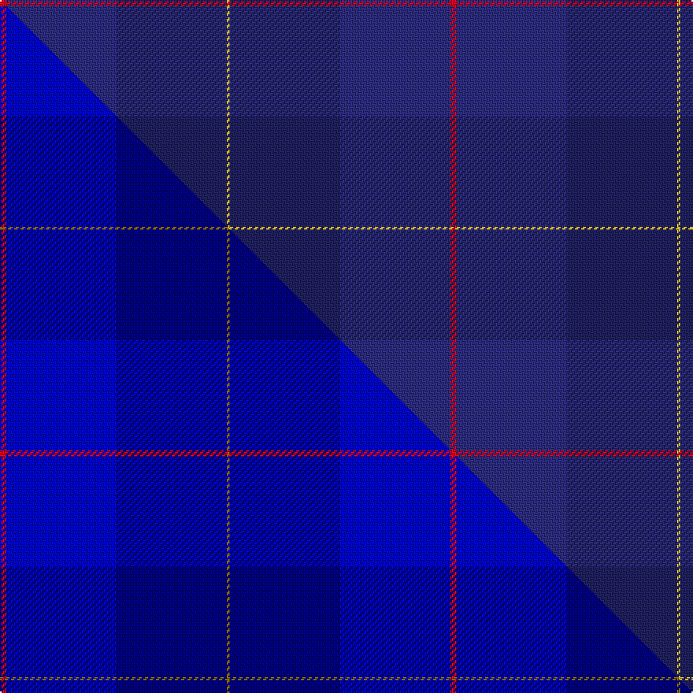

This is one **variant** — a specific cloth: this exact thread count and colourway, with its own
provenance below. It is one weaving of the [sett](/tartans/m/ma/mackaw/) (the scale-free proportion — the
same cloth at any scale or shade), whose colour order is pattern [RBBY](/stripes/rbby/).

Part of the [Mackaw](/tartans/m/ma/mackaw/) tartan — the named design grouping this sett with its other cloths.

Sourced from tartans-authority.  It is a [4 stripe tartan](/stripes/stripes4/).

Original link <code>http://www.tartansauthority.com/tartan-ferret/display/10583/</code> — retired · [Internet Archive copy](https://web.archive.org/web/*/http://www.tartansauthority.com/tartan-ferret/display/10583/*)

Dataset <small>— provenance for this record, inherited from the source manifest</small>

<dl class="dataset-prov">
<dt>source</dt><dd><a href="/sources/tartans-authority/">Scottish Tartans Authority</a></dd>
<dt>data captured from</dt><dd><a href="https://github.com/thetartan/tartan-database/blob/master/data/tartans-authority/data.csv">https://github.com/thetartan/tartan-database/blob/master/data/tartans-authority/data.csv</a></dd>
<dt>data date</dt><dd>08/03/2012 <small>(this record)</small></dd>
<dt>licence</dt><dd><a href="https://creativecommons.org/licenses/by-nc-nd/4.0/">CC BY-NC-ND 4.0</a></dd>
</dl>

Capture chain <small>— the hands this data passed through, oldest first; each capture carries its own licence</small>

<ol class="capture-chain">
<li><a href="https://www.tartansauthority.com/">Scottish Tartans Authority</a> <small>the heritage body’s archive — its tartan-ferret record browser is retired; dead record links are shown unlinked, with an Internet Archive copy (ITI numbers are not SRT references)</small></li>
<li><a href="https://github.com/thetartan/tartan-database">thetartan/tartan-database</a> <small>2016-2017</small> · <a href="https://creativecommons.org/licenses/by-nc-nd/4.0/">CC BY-NC-ND 4.0</a> <small>Levko Kravets's frozen compilation — the capture we vendored, and where its CC licence text came from</small></li>
<li>this dictionary <small>captured 2026-06-10 · commit 5bf86c7566</small> <small>each re-capture is a git commit to data/sources</small></li>
</ol>

## Register references

External register numbers recorded for this tartan.

- Scottish Register of Tartans: [10583](https://www.tartanregister.gov.uk/tartanDetails?ref=10583)
- Scottish Tartans Authority (ITI): 10583

## Thread count
R/4 DBi70 DB70 LY/2

One full sett is **286 threads**.

## Palette
<table><thead><tr><th>Colour</th><th>Shade</th><th>OKLCh</th></tr></thead><tbody><tr><td>DB</td><td><code style="background-color:#2C2C80;">#2C2C80</code> <small style="color:#888">#2C2C80</small></td><td><small style="color:#888">oklch(35.0% 0.138 276.6)</small></td></tr><tr><td>DB</td><td><code style="background-color:#202060;">#202060</code> <small style="color:#888">#202060</small></td><td><small style="color:#888">oklch(28.9% 0.111 276.9)</small></td></tr><tr><td>R</td><td><code style="background-color:#D60020;">#D60020</code> <small style="color:#888">#D60020</small></td><td><small style="color:#888">oklch(55.2% 0.224 25.5)</small></td></tr><tr><td>LY</td><td><code style="background-color:#DCBC32;">#DCBC32</code> <small style="color:#888">#DCBC32</small></td><td><small style="color:#888">oklch(80.0% 0.150 95.2)</small></td></tr></tbody></table>

# Sample pattern

## Compared to the master

This cloth is one sett of its design; the master sett (the exemplar the design is anchored on) is below for comparison.

Its **ΔTartan distance** from the master is **0.17** — the same measure the nearest-tartans table ranks by (0 is identical; a re-scale of the same cloth is near 0, a recolour or a different proportion further).

<figure class="master-compare" style="margin:0">

this sett
master sett ★

<figcaption style="color:#888;font-size:smaller">One weave of this sett against the <a href="/setts/r2b35db35y1/">master sett ★</a>, split on the diagonal: a shared proportion runs seamlessly across it with only the shades shifting; a different proportion breaks on it.</figcaption>
</figure>

## Nearest tartan variants

The nearest existing variants by ΔTartan distance, with this cloth at the top so the swatches line up against it.

ΔTartan

Threads

Variant

Sett

—

286

<a href="/variants/s4/r2dbi35db35ly1~x2~dbi3514276-db2911276/">Mackaw (Corporate)</a>

<a href="/ttd/edit/#slug=r2b35db35y1~x2~b3826264-db2719264&amp;base=r2dbi35db35ly1~x2~dbi3514276-db2911276" title="compare in the TTD">0.17</a>

286

<a href="/variants/s4/r2b35db35y1~x2~b3826264-db2719264/">Mackaw</a>

<a href="/ttd/edit/#slug=dbi15db55w1dp5r2ly1~x2~dbi3514276-db3409246&amp;base=r2dbi35db35ly1~x2~dbi3514276-db2911276" title="compare in the TTD">1.76</a>

284

<a href="/variants/s6/dbi15db55w1dp5r2ly1~x2~dbi3514276-db3409246/">Venters (Personal)</a>

<a href="/ttd/edit/#slug=dbi88db35w3db10~dbi3514276-db2911276&amp;base=r2dbi35db35ly1~x2~dbi3514276-db2911276" title="compare in the TTD">2.09</a>

174

<a href="/variants/s4/dbi88db35w3db10~dbi3514276-db2911276/">Scottish Tourist Board (1990) Corporate Tartan</a>

<a href="/ttd/edit/#slug=dbi88db35w3db10~dbi3514276-db3409246&amp;base=r2dbi35db35ly1~x2~dbi3514276-db2911276" title="compare in the TTD">2.09</a>

174

<a href="/variants/s4/dbi88db35w3db10~dbi3514276-db3409246/">Scottish Tourist Board (1990)</a>

<a href="/ttd/edit/#slug=w4n28t48y3~x2~t6107234&amp;base=r2dbi35db35ly1~x2~dbi3514276-db2911276" title="compare in the TTD">2.47</a>

318

<a href="/variants/s4/w4n28t48y3~x2~t6107234/">MacKerrell of Hillhouse Dress Personal Tartan</a>

<a href="/ttd/edit/#slug=dg1db2dbi5db10y1~x8~db2911276-dbi3514276&amp;base=r2dbi35db35ly1~x2~dbi3514276-db2911276" title="compare in the TTD">2.52</a>

288

<a href="/variants/s5/dg1db2dbi5db10y1~x8~db2911276-dbi3514276/">Open Championship (2000) (Corporate)</a>

<a href="/ttd/edit/#slug=y1db10dbi5db2g1~x8~db2911276-dbi3514276&amp;base=r2dbi35db35ly1~x2~dbi3514276-db2911276" title="compare in the TTD">2.68</a>

288

<a href="/variants/s5/y1db10dbi5db2g1~x8~db2911276-dbi3514276/">Open Championship (2000)</a>

## Neighbour map

Every grey dot is one of 13662 variants placed by the first two principal components of the ΔTartan feature space (42% of its variance). Red is this tartan; blue dots are its nearest — click one to open its page. The map is a flat projection of a many-dimensional space — [how to read it](/posts/neighbourhood-maps/).

<svg viewBox="0 0 640 380" role="img" style="max-width:100%;height:auto;border:1px solid #e0e0e0;border-radius:4px;display:block" xmlns="http://www.w3.org/2000/svg"><image href="/nn/cloud.v1.png" width="640" height="380"/><a href="/variants/s4/r2b35db35y1~x2~b3826264-db2719264/"><circle cx="511.9" cy="238.4" r="4" fill="#3465a4"><title>Mackaw</title></circle></a><a href="/variants/s6/dbi15db55w1dp5r2ly1~x2~dbi3514276-db3409246/"><circle cx="598.9" cy="147.1" r="4" fill="#3465a4"><title>Venters (Personal)</title></circle></a><a href="/variants/s4/dbi88db35w3db10~dbi3514276-db2911276/"><circle cx="626.0" cy="309.9" r="4" fill="#3465a4"><title>Scottish Tourist Board (1990) Corporate Tartan</title></circle></a><a href="/variants/s4/dbi88db35w3db10~dbi3514276-db3409246/"><circle cx="626.0" cy="307.8" r="4" fill="#3465a4"><title>Scottish Tourist Board (1990)</title></circle></a><a href="/variants/s4/w4n28t48y3~x2~t6107234/"><circle cx="531.4" cy="281.6" r="4" fill="#3465a4"><title>MacKerrell of Hillhouse Dress Personal Tartan</title></circle></a><a href="/variants/s5/dg1db2dbi5db10y1~x8~db2911276-dbi3514276/"><circle cx="617.3" cy="313.3" r="4" fill="#3465a4"><title>Open Championship (2000) (Corporate)</title></circle></a><a href="/variants/s5/y1db10dbi5db2g1~x8~db2911276-dbi3514276/"><circle cx="546.9" cy="287.5" r="4" fill="#3465a4"><title>Open Championship (2000)</title></circle></a><circle cx="610.7" cy="275.1" r="5" fill="#c00000"/><text x="320" y="376" text-anchor="middle" font-size="11" fill="#999">ground</text><text x="11" y="190" text-anchor="middle" font-size="11" fill="#999" transform="rotate(-90 11 190)">complexity</text></svg>

ID: /variants/s4/r2dbi35db35ly1~x2~dbi3514276-db2911276/
