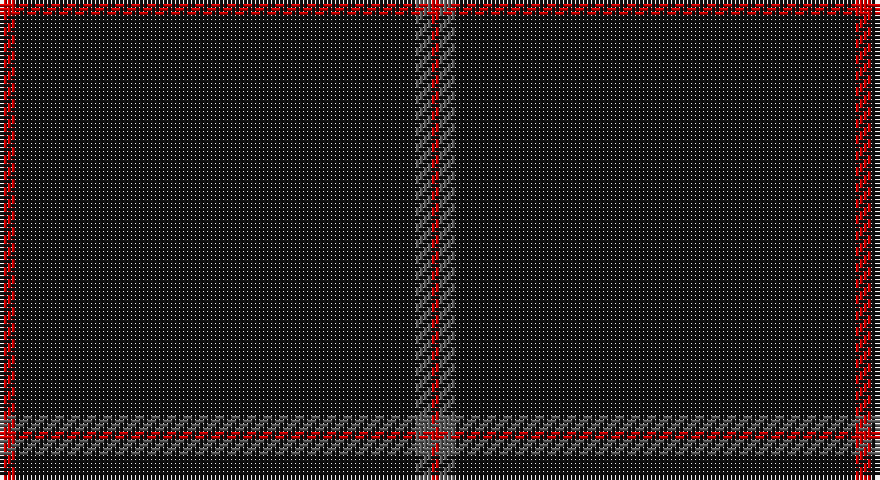

This page is one **sett** — a single exact thread-count. It belongs to the [tartan](/setts/r2k50n2r1/)
(the same proportion at any scale), whose colour order is pattern [RBKR](/stripes/rbkr/).

Part of the [Galloway](/tartans/galloway/) tartan — the named design grouping this sett with its other cloths.

Sourced from tartans-authority.  It is a [4 stripe tartan](/stripes/stripes4/).

Original link http://www.tartansauthority.com/tartan-ferret/display/10087/

## Also known as

This cloth is also recorded under:

- Galloway Family
- Galloway Green
- Galloway Red
- Galloway, Green
- Galloway, Red

## Register references

External register numbers recorded for this tartan.

- Scottish Register of Tartans: [10087](https://www.tartanregister.gov.uk/tartanDetails?ref=10087)
- Scottish Tartans Authority (ITI): 10087

## Thread count
R/4 K100 N4 R/2

One full sett is **214 threads**.

## Palette

Palette: <strong>Tartan Register</strong> <small style="color:#888">(2 of 3 colours)</small>
<table><thead><tr><th>Colour</th><th>Threads</th><th>Shade</th><th>Base</th><th>OKLCh</th></tr></thead><tbody><tr><td>R/</td><td style="text-align:right;font-variant-numeric:tabular-nums">4</td><td><code style="background-color:#C80000;">#C80000</code> <small style="color:#888">#C80000</small></td><td>R <code style="background-color:#CC0000;">#CC0000</code></td><td><small style="color:#888">oklch(52.3% 0.215 29.2)</small></td></tr><tr><td>K</td><td style="text-align:right;font-variant-numeric:tabular-nums">100</td><td><code style="background-color:#101010;">#101010</code> <small style="color:#888">#101010</small></td><td>K <code style="background-color:#000000;">#000000</code></td><td><small style="color:#888">oklch(17.3% 0.000 89.9)</small></td></tr><tr><td>N</td><td style="text-align:right;font-variant-numeric:tabular-nums">4</td><td><code style="background-color:#5C5C5C;">#5C5C5C</code> <small style="color:#888">#5C5C5C</small></td><td>B <code style="background-color:#2A418A;">#2A418A</code></td><td><small style="color:#888">oklch(47.5% 0.000 89.9)</small></td></tr><tr><td>R/</td><td style="text-align:right;font-variant-numeric:tabular-nums">2</td><td><code style="background-color:#C80000;">#C80000</code> <small style="color:#888">#C80000</small></td><td>R <code style="background-color:#CC0000;">#CC0000</code></td><td><small style="color:#888">oklch(52.3% 0.215 29.2)</small></td></tr></tbody></table>

# Sample pattern

## Compared to the master

This cloth is one sett of its design; the master sett (the exemplar the design is anchored on) is below for comparison.

<figure style="margin:0"><figcaption style="color:#888;font-size:smaller">this sett</figcaption></figure>
<figure style="margin:0"><figcaption style="color:#888;font-size:smaller"><a href="/setts/r3b2w35b35r2g3/">master sett →</a></figcaption></figure>

## Nearest tartans

The nearest existing variants by ΔTartan distance, with this tartan at the top so the swatches line up against it.

ΔTartan

Tartan

Sett

—

<a href="/ttd/edit/#slug=r2k50n2r1~x2">Galloway (Name)</a> <a class="nn-out" href="/variants/s4/r2k50n2r1~x2/" title="open its dictionary page">↗</a>

1.12

<a href="/ttd/edit/#slug=k200dy3lo3dy3lo3&amp;base=r2k50n2r1~x2">SmartWool</a> <a class="nn-out" href="/variants/s5/k200dy3lo3dy3lo3/" title="open its dictionary page">↗</a>

1.68

<a href="/ttd/edit/#slug=k99r5k4r3k2y1~x2&amp;base=r2k50n2r1~x2">Allt Dubh (Black Burn)</a> <a class="nn-out" href="/variants/s6/k99r5k4r3k2y1~x2/" title="open its dictionary page">↗</a>

1.74

<a href="/ttd/edit/#slug=k8ly3k120ly3k40t2k4~x2&amp;base=r2k50n2r1~x2">Lochaber (Hesketh)</a> <a class="nn-out" href="/variants/s7/k8ly3k120ly3k40t2k4~x2/" title="open its dictionary page">↗</a>

1.75

<a href="/ttd/edit/#slug=k50r1db3dp1~x4&amp;base=r2k50n2r1~x2">Alich (Personal)</a> <a class="nn-out" href="/variants/s4/k50r1db3dp1~x4/" title="open its dictionary page">↗</a>

1.81

<a href="/ttd/edit/#slug=do10ly1do30y3~x4&amp;base=r2k50n2r1~x2">Pasteur Fancy Tartan</a> <a class="nn-out" href="/variants/s4/do10ly1do30y3~x4/" title="open its dictionary page">↗</a>

1.94

<a href="/ttd/edit/#slug=k72w3k11db9&amp;base=r2k50n2r1~x2">Dunnotar (School)</a> <a class="nn-out" href="/variants/s4/k72w3k11db9/" title="open its dictionary page">↗</a>

1.97

<a href="/ttd/edit/#slug=k50r1dt3dp1~x4&amp;base=r2k50n2r1~x2">Alich (Personal)</a> <a class="nn-out" href="/variants/s4/k50r1dt3dp1~x4/" title="open its dictionary page">↗</a>

2.07

<a href="/ttd/edit/#slug=k72r3k11t9k11r3k37&amp;base=r2k50n2r1~x2">Chafyn House (School)</a> <a class="nn-out" href="/variants/s7/k72r3k11t9k11r3k37/" title="open its dictionary page">↗</a>

2.12

<a href="/ttd/edit/#slug=dy10ly1dy30y3~x4&amp;base=r2k50n2r1~x2">Pasteur</a> <a class="nn-out" href="/variants/s4/dy10ly1dy30y3~x4/" title="open its dictionary page">↗</a>

2.12

<a href="/ttd/edit/#slug=k31r2k10db1k1w1~x4&amp;base=r2k50n2r1~x2">NewGeneration Alchemy (NGA) Inc</a> <a class="nn-out" href="/variants/s6/k31r2k10db1k1w1~x4/" title="open its dictionary page">↗</a>

## Neighbour map

Every grey dot is one of 14360 variants placed by the first two principal components of the ΔTartan feature space (44% of its variance). Red is this tartan; blue dots are its nearest — click one to open its page.

<svg viewBox="0 0 640 380" role="img" style="max-width:100%;height:auto;border:1px solid #e0e0e0;border-radius:4px;display:block" xmlns="http://www.w3.org/2000/svg"><image href="/nn/cloud.v1.png" width="640" height="380"/><a href="/variants/s5/k200dy3lo3dy3lo3/"><circle cx="626.0" cy="190.9" r="4" fill="#3465a4"><title>SmartWool</title></circle></a><a href="/variants/s6/k99r5k4r3k2y1~x2/"><circle cx="626.0" cy="193.3" r="4" fill="#3465a4"><title>Allt Dubh (Black Burn)</title></circle></a><a href="/variants/s7/k8ly3k120ly3k40t2k4~x2/"><circle cx="626.0" cy="169.4" r="4" fill="#3465a4"><title>Lochaber (Hesketh)</title></circle></a><a href="/variants/s4/k50r1db3dp1~x4/"><circle cx="626.0" cy="213.2" r="4" fill="#3465a4"><title>Alich (Personal)</title></circle></a><a href="/variants/s4/do10ly1do30y3~x4/"><circle cx="626.0" cy="232.1" r="4" fill="#3465a4"><title>Pasteur Fancy Tartan</title></circle></a><a href="/variants/s4/k72w3k11db9/"><circle cx="626.0" cy="233.5" r="4" fill="#3465a4"><title>Dunnotar (School)</title></circle></a><a href="/variants/s4/k50r1dt3dp1~x4/"><circle cx="626.0" cy="216.9" r="4" fill="#3465a4"><title>Alich (Personal)</title></circle></a><a href="/variants/s7/k72r3k11t9k11r3k37/"><circle cx="626.0" cy="214.1" r="4" fill="#3465a4"><title>Chafyn House (School)</title></circle></a><a href="/variants/s4/dy10ly1dy30y3~x4/"><circle cx="626.0" cy="239.1" r="4" fill="#3465a4"><title>Pasteur</title></circle></a><a href="/variants/s6/k31r2k10db1k1w1~x4/"><circle cx="626.0" cy="172.5" r="4" fill="#3465a4"><title>NewGeneration Alchemy (NGA) Inc</title></circle></a><circle cx="626.0" cy="204.2" r="5" fill="#c00000"/></svg>

ID: /variants/s4/r2k50n2r1~x2/
