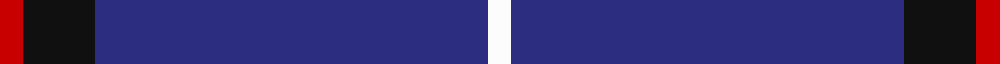

This is one **variant** — a specific cloth: this exact thread count and colourway, with its own
provenance below. It is one weaving of the [sett](/setts/r2k6db33w2/) (the scale-free proportion — the
same cloth at any scale or shade), whose colour order is pattern [RKBW](/stripes/rkbw/).

Part of the [McCallie](/tartans/m/mc/mccallie/) tartan — the named design grouping this sett with its other cloths.

Sourced from register-of-tartans.  It is a [4 stripe tartan](/stripes/stripes4/).

Original link [https://www.tartanregister.gov.uk/tartanDetails.aspx?ref=2871](https://www.tartanregister.gov.uk/tartanDetails.aspx?ref=2871)

2 attestations — the source records this cloth was collapsed from (oldest owns this page)

<ul>
<li>15/01/2004 — McCallie (register-of-tartans, <a href="https://www.tartanregister.gov.uk/tartanDetails.aspx?ref=2871">record</a>)  <em>From Viking technology of Glasgow for all of the name.</em></li>
<li>pre 2004 — McCallie (Name) (tartans-authority, <a href="https://www.tartanregister.gov.uk/tartanDetails.aspx?ref=6212">record</a>)  <em>From Viking technology of Glasgow for all of the name.</em></li>
</ul>

Dataset <small>— provenance for this record, inherited from the source manifest</small>

<dl class="dataset-prov">
<dt>source</dt><dd><a href="/sources/register-of-tartans/">Scottish Register of Tartans</a></dd>
<dt>data captured from</dt><dd><a href="https://github.com/thetartan/tartan-database/blob/master/data/register-of-tartans/data.csv">https://github.com/thetartan/tartan-database/blob/master/data/register-of-tartans/data.csv</a></dd>
<dt>data date</dt><dd>15/01/2004 <small>(this record)</small></dd>
<dt>licence</dt><dd><a href="https://www.tartanregister.gov.uk/copyright">Crown copyright</a></dd>
</dl>

Capture chain <small>— the hands this data passed through, oldest first; each capture carries its own licence</small>

<ol class="capture-chain">
<li><a href="https://www.tartanregister.gov.uk/">Scottish Register of Tartans</a> · <a href="https://www.tartanregister.gov.uk/copyright">Crown copyright</a> <small>the living register — still published by National Records of Scotland</small></li>
<li><a href="https://github.com/thetartan/tartan-database">thetartan/tartan-database</a> <small>2016-2017</small> · <a href="https://creativecommons.org/licenses/by-nc-nd/4.0/">CC BY-NC-ND 4.0</a> <small>Levko Kravets's frozen compilation — the capture we vendored, and where its CC licence text came from</small></li>
<li>this dictionary <small>captured 2026-06-10 · commit 5bf86c7566</small> <small>each re-capture is a git commit to data/sources</small></li>
</ol>

## Register references

External register numbers recorded for this tartan.

- Scottish Register of Tartans: [2871](https://www.tartanregister.gov.uk/tartanDetails.aspx?ref=2871)
- Scottish Tartans Authority (ITI): 6212
- Scottish Tartans World Register: 2994

## Thread count
R/8 K24 DB132 W/8

One full sett is **328 threads**.

## Palette
<table><thead><tr><th>Colour</th><th>Shade</th><th>OKLCh</th></tr></thead><tbody><tr><td>DB</td><td><code style="background-color:#082077;">#082077</code> <small style="color:#888">#082077</small></td><td><small style="color:#888">oklch(30.0% 0.149 265.1)</small></td></tr><tr><td>K</td><td><code style="background-color:#000000;">#000000</code> <small style="color:#888">#000000</small></td><td><small style="color:#888">oklch(0.0% 0.000 0.0)</small></td></tr><tr><td>R</td><td><code style="background-color:#D60020;">#D60020</code> <small style="color:#888">#D60020</small></td><td><small style="color:#888">oklch(55.2% 0.224 25.5)</small></td></tr><tr><td>W</td><td><code style="background-color:#F7F7F7;">#F7F7F7</code> <small style="color:#888">#F7F7F7</small></td><td><small style="color:#888">oklch(97.6% 0.000 89.9)</small></td></tr></tbody></table>

# Sample pattern

## Nearest tartan variants

The nearest existing variants by ΔTartan distance, with this cloth at the top so the swatches line up against it.

ΔTartan

Threads

Variant

Sett

—

328

<a href="/variants/s4/r2k6db33w2~x4/">McCallie</a>

<a href="/ttd/edit/#slug=db14k3dr3w1~x2&amp;base=r2k6db33w2~x4" title="compare in the TTD">0.29</a>

54

<a href="/variants/s4/db14k3dr3w1~x2/">Bacon, Blue</a>

<a href="/ttd/edit/#slug=db31k8dp4w2~x4&amp;base=r2k6db33w2~x4" title="compare in the TTD">0.52</a>

228

<a href="/variants/s4/db31k8dp4w2~x4/">Osborne, Luke Alexander (Personal)</a>

<a href="/ttd/edit/#slug=r5w4k4db80w4~x2&amp;base=r2k6db33w2~x4" title="compare in the TTD">0.59</a>

370

<a href="/variants/s5/r5w4k4db80w4~x2/">Volunteer Lifesaving Corps (Corp.)</a>

<a href="/ttd/edit/#slug=db19r2w2r2k2~x4&amp;base=r2k6db33w2~x4" title="compare in the TTD">0.74</a>

132

<a href="/variants/s5/db19r2w2r2k2~x4/">Laing of Archiestown</a>

<a href="/ttd/edit/#slug=ki61w4k11db5dr5~x2~ki0604259&amp;base=r2k6db33w2~x4" title="compare in the TTD">1.01</a>

212

<a href="/variants/s5/ki61w4k11db5dr5~x2~ki0604259/">Edinburgh Crystal</a>

<a href="/ttd/edit/#slug=r4db32k15w2~x2&amp;base=r2k6db33w2~x4" title="compare in the TTD">1.07</a>

200

<a href="/variants/s4/r4db32k15w2~x2/">Scottish Nuclear</a>

<a href="/ttd/edit/#slug=k62db15w6y4~x2&amp;base=r2k6db33w2~x4" title="compare in the TTD">1.09</a>

216

<a href="/variants/s4/k62db15w6y4~x2/">C-Tec N.I. Ltd</a>

<a href="/ttd/edit/#slug=g5w1r5k5db43r1~x2&amp;base=r2k6db33w2~x4" title="compare in the TTD">1.14</a>

228

<a href="/variants/s6/g5w1r5k5db43r1~x2/">Michael (John) (Personal)</a>

<a href="/ttd/edit/#slug=r1db9k4lb1~x4&amp;base=r2k6db33w2~x4" title="compare in the TTD">1.24</a>

112

<a href="/variants/s4/r1db9k4lb1~x4/">Scottish Nuclear (Corporate)</a>

<a href="/ttd/edit/#slug=r3db12k50y3~x2&amp;base=r2k6db33w2~x4" title="compare in the TTD">1.39</a>

260

<a href="/variants/s4/r3db12k50y3~x2/">Rogues (United States), The</a>

## Neighbour map

Every grey dot is one of 13621 variants placed by the first two principal components of the ΔTartan feature space (42% of its variance). Red is this tartan; blue dots are its nearest — click one to open its page.

<svg viewBox="0 0 640 380" role="img" style="max-width:100%;height:auto;border:1px solid #e0e0e0;border-radius:4px;display:block" xmlns="http://www.w3.org/2000/svg"><image href="/nn/cloud.v1.png" width="640" height="380"/><a href="/variants/s4/db14k3dr3w1~x2/"><circle cx="384.3" cy="193.1" r="4" fill="#3465a4"><title>Bacon, Blue</title></circle></a><a href="/variants/s4/db31k8dp4w2~x4/"><circle cx="409.9" cy="186.0" r="4" fill="#3465a4"><title>Osborne, Luke Alexander (Personal)</title></circle></a><a href="/variants/s5/r5w4k4db80w4~x2/"><circle cx="516.5" cy="128.8" r="4" fill="#3465a4"><title>Volunteer Lifesaving Corps (Corp.)</title></circle></a><a href="/variants/s5/db19r2w2r2k2~x4/"><circle cx="374.8" cy="164.9" r="4" fill="#3465a4"><title>Laing of Archiestown</title></circle></a><a href="/variants/s5/ki61w4k11db5dr5~x2~ki0604259/"><circle cx="417.4" cy="150.1" r="4" fill="#3465a4"><title>Edinburgh Crystal</title></circle></a><a href="/variants/s4/r4db32k15w2~x2/"><circle cx="330.3" cy="186.6" r="4" fill="#3465a4"><title>Scottish Nuclear</title></circle></a><a href="/variants/s4/k62db15w6y4~x2/"><circle cx="385.0" cy="164.4" r="4" fill="#3465a4"><title>C-Tec N.I. Ltd</title></circle></a><a href="/variants/s6/g5w1r5k5db43r1~x2/"><circle cx="437.7" cy="85.6" r="4" fill="#3465a4"><title>Michael (John) (Personal)</title></circle></a><a href="/variants/s4/r1db9k4lb1~x4/"><circle cx="308.5" cy="211.1" r="4" fill="#3465a4"><title>Scottish Nuclear (Corporate)</title></circle></a><a href="/variants/s4/r3db12k50y3~x2/"><circle cx="444.1" cy="166.4" r="4" fill="#3465a4"><title>Rogues (United States), The</title></circle></a><circle cx="458.3" cy="161.8" r="5" fill="#c00000"/><text x="320" y="376" text-anchor="middle" font-size="11" fill="#999">ground</text><text x="11" y="190" text-anchor="middle" font-size="11" fill="#999" transform="rotate(-90 11 190)">complexity</text></svg>

ID: /variants/s4/r2k6db33w2~x4/
