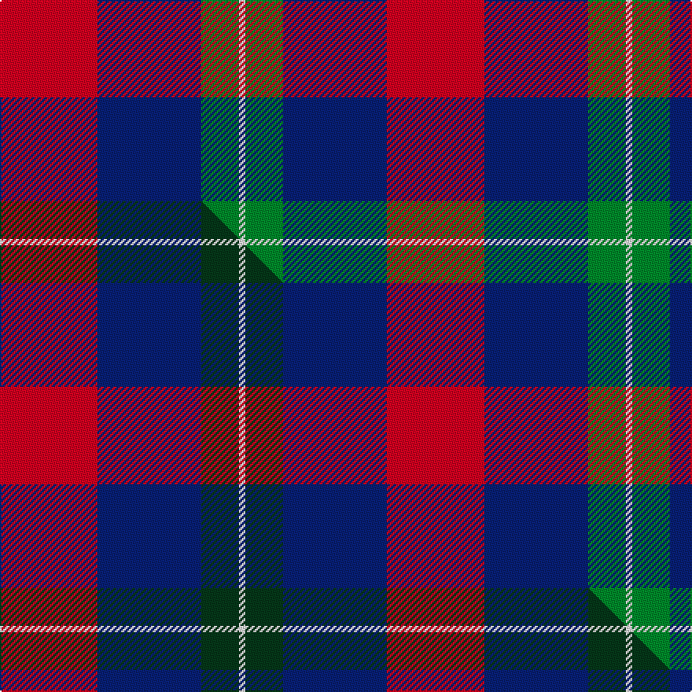

This page is one **sett** — a single exact thread-count. It belongs to the [tartan](/setts/r31db33g12w2/)
(the same proportion at any scale), whose colour order is pattern [RBGW](/stripes/rbgw/).

Part of the [Manor of Wrentnall](/tartans/manor-of-wrentnall/) tartan — the named design grouping this sett with its other cloths.

Sourced from tartans-authority.  It is a [4 stripe tartan](/stripes/stripes4/).

Original link http://www.tartansauthority.com/tartan-ferret/display/10353/

## Register references

External register numbers recorded for this tartan.

- Scottish Register of Tartans: [10353](https://www.tartanregister.gov.uk/tartanDetails?ref=10353)
- Scottish Tartans Authority (ITI): 10353

## Thread count
R/62 DB66 G24 W/4

One full sett is **246 threads**.

## Palette
<table><thead><tr><th>Colour</th><th>Shade</th><th>OKLCh</th></tr></thead><tbody><tr><td>DB</td><td><code style="background-color:#082077;">#082077</code> <small style="color:#888">#082077</small></td><td><small style="color:#888">oklch(30.0% 0.149 265.1)</small></td></tr><tr><td>G</td><td><code style="background-color:#008B2A;">#008B2A</code> <small style="color:#888">#008B2A</small></td><td><small style="color:#888">oklch(55.4% 0.170 145.9)</small></td></tr><tr><td>R</td><td><code style="background-color:#D60020;">#D60020</code> <small style="color:#888">#D60020</small></td><td><small style="color:#888">oklch(55.2% 0.224 25.5)</small></td></tr><tr><td>W</td><td><code style="background-color:#F7F7F7;">#F7F7F7</code> <small style="color:#888">#F7F7F7</small></td><td><small style="color:#888">oklch(97.6% 0.000 89.9)</small></td></tr></tbody></table>

# Sample pattern

## Compared to the master

This cloth is one sett of its design; the master sett (the exemplar the design is anchored on) is below for comparison.

Its **ΔTartan distance** from the master is **0.47** — the same measure the nearest-tartans table ranks by (0 is identical; a re-scale of the same cloth is near 0, a recolour or a different proportion further).

<figure class="master-compare" style="margin:0">

this sett
master sett ★

<figcaption style="color:#888;font-size:smaller">One weave of this sett against the <a href="/setts/r31db33dg12w2/">master sett ★</a>, split on the diagonal: a shared proportion runs seamlessly across it with only the shades shifting; a different proportion breaks on it.</figcaption>
</figure>

## Nearest tartan variants

The nearest existing variants by ΔTartan distance, with this cloth at the top so the swatches line up against it.

ΔTartan

Threads

Variant

Sett

—

246

<a href="/variants/s4/r31db33g12w2~x2/">Manor of Wrentnall (Personal)</a>

<a href="/ttd/edit/#slug=r31db33dg12w2~x2&amp;base=r31db33g12w2~x2" title="compare in the TTD">0.00</a>

246

<a href="/variants/s4/r31db33dg12w2~x2/">Manor of Wrentnall (Personal)</a>

<a href="/ttd/edit/#slug=dy3dg8db12r24w3~x2&amp;base=r31db33g12w2~x2" title="compare in the TTD">1.23</a>

188

<a href="/variants/s5/dy3dg8db12r24w3~x2/">McGill University</a>

<a href="/ttd/edit/#slug=db10g10r5w1~x2&amp;base=r31db33g12w2~x2" title="compare in the TTD">1.43</a>

82

<a href="/variants/s4/db10g10r5w1~x2/">Thorntons Law (Corporate)</a>

<a href="/ttd/edit/#slug=r8b1g4b1db4~x2&amp;base=r31db33g12w2~x2" title="compare in the TTD">1.52</a>

48

<a href="/variants/s5/r8b1g4b1db4~x2/">Moray of Abercairney</a>

<a href="/ttd/edit/#slug=w3db23r44db26g4y2~x2&amp;base=r31db33g12w2~x2" title="compare in the TTD">1.71</a>

398

<a href="/variants/s6/w3db23r44db26g4y2~x2/">Tartan Lassie (Fashion)</a>

<a href="/ttd/edit/#slug=db30w4y1w4r30~x4&amp;base=r31db33g12w2~x2" title="compare in the TTD">1.81</a>

312

<a href="/variants/s5/db30w4y1w4r30~x4/">Philippine Heritage</a>

<a href="/ttd/edit/#slug=db30w4ly1w4r30~x4&amp;base=r31db33g12w2~x2" title="compare in the TTD">1.81</a>

312

<a href="/variants/s5/db30w4ly1w4r30~x4/">Philippine Heritage (Corporate)</a>

<a href="/ttd/edit/#slug=r9db1g2db5w1~x12&amp;base=r31db33g12w2~x2" title="compare in the TTD">1.82</a>

312

<a href="/variants/s5/r9db1g2db5w1~x12/">McIntosh, Georgina (Personal)</a>

<a href="/ttd/edit/#slug=r15g7db7r1~x4&amp;base=r31db33g12w2~x2" title="compare in the TTD">1.99</a>

176

<a href="/variants/s4/r15g7db7r1~x4/">Hugh Fraser of Boblainy</a>

<a href="/ttd/edit/#slug=db15r2ri15t6lb1~x2~ri2109032-t2205244&amp;base=r31db33g12w2~x2" title="compare in the TTD">2.02</a>

124

<a href="/variants/s5/db15r2ri15t6lb1~x2~ri2109032-t2205244/">O2 (Corporate)</a>

## Neighbour map

Every grey dot is one of 13620 variants placed by the first two principal components of the ΔTartan feature space (42% of its variance). Red is this tartan; blue dots are its nearest — click one to open its page.

<svg viewBox="0 0 640 380" role="img" style="max-width:100%;height:auto;border:1px solid #e0e0e0;border-radius:4px;display:block" xmlns="http://www.w3.org/2000/svg"><image href="/nn/cloud.v1.png" width="640" height="380"/><a href="/variants/s4/r31db33dg12w2~x2/"><circle cx="266.0" cy="224.2" r="4" fill="#3465a4"><title>Manor of Wrentnall (Personal)</title></circle></a><a href="/variants/s5/dy3dg8db12r24w3~x2/"><circle cx="227.7" cy="212.4" r="4" fill="#3465a4"><title>McGill University</title></circle></a><a href="/variants/s4/db10g10r5w1~x2/"><circle cx="204.3" cy="256.7" r="4" fill="#3465a4"><title>Thorntons Law (Corporate)</title></circle></a><a href="/variants/s5/r8b1g4b1db4~x2/"><circle cx="236.4" cy="240.3" r="4" fill="#3465a4"><title>Moray of Abercairney</title></circle></a><a href="/variants/s6/w3db23r44db26g4y2~x2/"><circle cx="298.2" cy="158.0" r="4" fill="#3465a4"><title>Tartan Lassie (Fashion)</title></circle></a><a href="/variants/s5/db30w4y1w4r30~x4/"><circle cx="294.4" cy="160.0" r="4" fill="#3465a4"><title>Philippine Heritage</title></circle></a><a href="/variants/s5/db30w4ly1w4r30~x4/"><circle cx="293.4" cy="159.8" r="4" fill="#3465a4"><title>Philippine Heritage (Corporate)</title></circle></a><a href="/variants/s5/r9db1g2db5w1~x12/"><circle cx="273.6" cy="213.3" r="4" fill="#3465a4"><title>McIntosh, Georgina (Personal)</title></circle></a><a href="/variants/s4/r15g7db7r1~x4/"><circle cx="321.6" cy="235.4" r="4" fill="#3465a4"><title>Hugh Fraser of Boblainy</title></circle></a><a href="/variants/s5/db15r2ri15t6lb1~x2~ri2109032-t2205244/"><circle cx="234.1" cy="196.0" r="4" fill="#3465a4"><title>O2 (Corporate)</title></circle></a><circle cx="257.6" cy="223.0" r="5" fill="#c00000"/><text x="320" y="376" text-anchor="middle" font-size="11" fill="#999">ground</text><text x="11" y="190" text-anchor="middle" font-size="11" fill="#999" transform="rotate(-90 11 190)">complexity</text></svg>

ID: /variants/s4/r31db33g12w2~x2/
