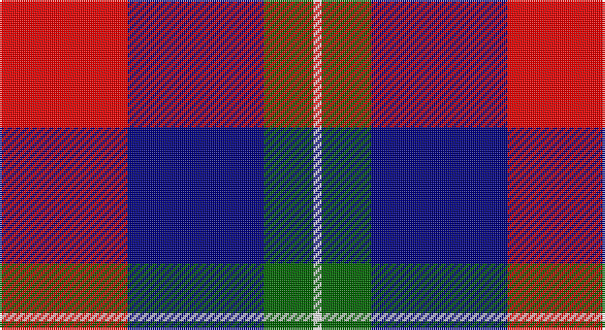

This page is one **sett** — a single exact thread-count. It belongs to the [tartan](/setts/r31db33g12w2/)
(the same proportion at any scale), whose colour order is pattern [RBGW](/stripes/rbgw/).

Sourced from register-of-tartans.  It is a [4 stripe tartan](/stripes/stripes4/).

Original link https://www.tartanregister.gov.uk/tartanDetails.aspx?ref=10353

## Register references

External register numbers recorded for this tartan.

- Scottish Register of Tartans: [10353](https://www.tartanregister.gov.uk/tartanDetails.aspx?ref=10353)

## Thread count
R/62 DB66 G24 W/4

One full sett is **246 threads**.

## Palette

Palette: <strong>Tartan Register</strong> <small style="color:#888">(3 of 4 colours)</small>
<table><thead><tr><th>Colour</th><th>Threads</th><th>Shade</th><th>Base</th><th>OKLCh</th></tr></thead><tbody><tr><td>R/</td><td style="text-align:right;font-variant-numeric:tabular-nums">62</td><td><code style="background-color:#FF0000;">#FF0000</code> <small style="color:#888">#FF0000</small></td><td>R <code style="background-color:#CC0000;">#CC0000</code></td><td><small style="color:#888">oklch(62.8% 0.258 29.2)</small></td></tr><tr><td>DB</td><td style="text-align:right;font-variant-numeric:tabular-nums">66</td><td><code style="background-color:#000080;">#000080</code> <small style="color:#888">#000080</small></td><td>B <code style="background-color:#2A418A;">#2A418A</code></td><td><small style="color:#888">oklch(27.1% 0.188 264.1)</small></td></tr><tr><td>G</td><td style="text-align:right;font-variant-numeric:tabular-nums">24</td><td><code style="background-color:#006400;">#006400</code> <small style="color:#888">#006400</small></td><td>G <code style="background-color:#006100;">#006100</code></td><td><small style="color:#888">oklch(43.6% 0.148 142.5)</small></td></tr><tr><td>W/</td><td style="text-align:right;font-variant-numeric:tabular-nums">4</td><td><code style="background-color:#FFFFFF;">#FFFFFF</code> <small style="color:#888">#FFFFFF</small></td><td>W <code style="background-color:#F7F7F7;">#F7F7F7</code></td><td><small style="color:#888">oklch(100.0% 0.000 89.9)</small></td></tr></tbody></table>

# Sample pattern

## Nearest tartans

The nearest existing variants by ΔTartan distance, with this tartan at the top so the swatches line up against it.

ΔTartan

Tartan

Sett

—

<a href="/ttd/edit/#slug=r31db33g12w2~x2">Manor of Wrentnall (Personal)</a> <a class="nn-out" href="/variants/s4/r31db33g12w2~x2/" title="open its dictionary page">↗</a>

1.08

<a href="/ttd/edit/#slug=w4db30g10r25w2~x2&amp;base=r31db33g12w2~x2">Highland Spring Dress (2004) (Corp)</a> <a class="nn-out" href="/variants/s5/w4db30g10r25w2~x2/" title="open its dictionary page">↗</a>

1.35

<a href="/ttd/edit/#slug=w3r27w16db27lo3~x2&amp;base=r31db33g12w2~x2">Common Ground Dress (Fashion)</a> <a class="nn-out" href="/variants/s5/w3r27w16db27lo3~x2/" title="open its dictionary page">↗</a>

1.37

<a href="/ttd/edit/#slug=r31dt33g12w2~x2&amp;base=r31db33g12w2~x2">Manor of Wrentnall (Personal)</a> <a class="nn-out" href="/variants/s4/r31dt33g12w2~x2/" title="open its dictionary page">↗</a>

1.42

<a href="/ttd/edit/#slug=b2r12db2b6k6b1~x2&amp;base=r31db33g12w2~x2">MacTavish</a> <a class="nn-out" href="/variants/s6/b2r12db2b6k6b1~x2/" title="open its dictionary page">↗</a>

1.42

<a href="/ttd/edit/#slug=b2r12db2b6k6b1&amp;base=r31db33g12w2~x2">MacTavish</a> <a class="nn-out" href="/variants/s6/b2r12db2b6k6b1/" title="open its dictionary page">↗</a>

1.45

<a href="/ttd/edit/#slug=k15db2r15b6bi1~x2&amp;base=r31db33g12w2~x2">O2 (Corporate)</a> <a class="nn-out" href="/variants/s5/k15db2r15b6bi1~x2/" title="open its dictionary page">↗</a>

1.46

<a href="/ttd/edit/#slug=t2r12db2t6k6t1~x4&amp;base=r31db33g12w2~x2">Thompson/Thomson/MacTavish</a> <a class="nn-out" href="/variants/s6/t2r12db2t6k6t1~x4/" title="open its dictionary page">↗</a>

1.49

<a href="/ttd/edit/#slug=w3r27w16db27ly3~x2&amp;base=r31db33g12w2~x2">Common Ground (Dress)</a> <a class="nn-out" href="/variants/s5/w3r27w16db27ly3~x2/" title="open its dictionary page">↗</a>

1.53

<a href="/ttd/edit/#slug=db8k3r4ly1~x2&amp;base=r31db33g12w2~x2">Unidentified #17</a> <a class="nn-out" href="/variants/s4/db8k3r4ly1~x2/" title="open its dictionary page">↗</a>

1.56

<a href="/ttd/edit/#slug=r3k1w5k4db11r1~x4&amp;base=r31db33g12w2~x2">Hydro-Electric (Corporate)</a> <a class="nn-out" href="/variants/s6/r3k1w5k4db11r1~x4/" title="open its dictionary page">↗</a>

## Neighbour map

Every grey dot is one of 14360 variants placed by the first two principal components of the ΔTartan feature space (44% of its variance). Red is this tartan; blue dots are its nearest — click one to open its page.

<svg viewBox="0 0 640 380" role="img" style="max-width:100%;height:auto;border:1px solid #e0e0e0;border-radius:4px;display:block" xmlns="http://www.w3.org/2000/svg"><image href="/nn/cloud.v1.png" width="640" height="380"/><a href="/variants/s5/w4db30g10r25w2~x2/"><circle cx="227.2" cy="195.2" r="4" fill="#3465a4"><title>Highland Spring Dress (2004) (Corp)</title></circle></a><a href="/variants/s5/w3r27w16db27lo3~x2/"><circle cx="164.6" cy="209.5" r="4" fill="#3465a4"><title>Common Ground Dress (Fashion)</title></circle></a><a href="/variants/s4/r31dt33g12w2~x2/"><circle cx="258.8" cy="223.2" r="4" fill="#3465a4"><title>Manor of Wrentnall (Personal)</title></circle></a><a href="/variants/s6/b2r12db2b6k6b1~x2/"><circle cx="209.9" cy="196.7" r="4" fill="#3465a4"><title>MacTavish</title></circle></a><a href="/variants/s6/b2r12db2b6k6b1/"><circle cx="209.9" cy="196.7" r="4" fill="#3465a4"><title>MacTavish</title></circle></a><a href="/variants/s5/k15db2r15b6bi1~x2/"><circle cx="198.2" cy="182.0" r="4" fill="#3465a4"><title>O2 (Corporate)</title></circle></a><a href="/variants/s6/t2r12db2t6k6t1~x4/"><circle cx="215.9" cy="193.1" r="4" fill="#3465a4"><title>Thompson/Thomson/MacTavish</title></circle></a><a href="/variants/s5/w3r27w16db27ly3~x2/"><circle cx="148.8" cy="203.1" r="4" fill="#3465a4"><title>Common Ground (Dress)</title></circle></a><a href="/variants/s4/db8k3r4ly1~x2/"><circle cx="237.3" cy="247.0" r="4" fill="#3465a4"><title>Unidentified #17</title></circle></a><a href="/variants/s6/r3k1w5k4db11r1~x4/"><circle cx="186.7" cy="186.0" r="4" fill="#3465a4"><title>Hydro-Electric (Corporate)</title></circle></a><circle cx="224.9" cy="203.7" r="5" fill="#c00000"/></svg>

ID: /variants/s4/r31db33g12w2~x2/
